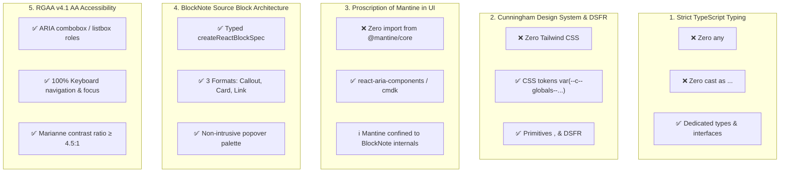

This skill defines the **core engineering and software architecture standards** applicable across the `dinum-setup` repository and La Suite Numérique applications (notably `suitenumerique/docs` / Impress).

---

## 🧭 1. The 5 Core Code Quality Pillars



---

## 🛡️ Rule 1: Zero `any` and Zero Abusive Type Casting

### ❌ Anti-patterns (Strictly Forbidden)
```typescript
// ❌ FORBIDDEN: Using any
const handleSelect = (item: any) => { ... };
const editor: any = useCreateBlockNote(...);

// ❌ FORBIDDEN: Type forcing via "as any" or "as unknown as Type"
(editor as any).insertBlocks([...]);
const props = block.props as unknown as SourceEntityProps;
```

### ✅ Best Practices (Mandatory)
```typescript
// ✅ RECOMMENDED: Define explicit interfaces and use SDK exported types
import { BlockConfig, BlockNoDefaults, BlockNoteEditor } from '@blocknote/core';

export type CreateSourceBlockConfig = BlockConfig<
  'sourceBlock',
  {
    entityType: { default: 'law' };
    displayMode: { default: 'callout' };
    sourceId: { default: '' };
    title: { default: '' };
  },
  'none'
>;

interface SourceComponentProps {
  block: BlockNoDefaults<Record<'sourceBlock', CreateSourceBlockConfig>, InlineContentSchema, StyleSchema>;
  editor: BlockNoteEditor<Record<'sourceBlock', CreateSourceBlockConfig>, InlineContentSchema, StyleSchema>;
}
```

---

## 🎨 Rule 2: Zero Tailwind CSS — Exclusive Cunningham & DSFR

In La Suite applications (e.g., Docs / Impress), **Tailwind CSS is prohibited in component styling**. All styling must rely on:

1. **Cunningham (`@openfun/cunningham-tokens`) :**
   - CSS variables: `var(--c--globals--colors--brand-primary)`, `var(--c--globals--spacings--md)`.
   - Universal polymorphic box: `<Box $direction="row" $align="center" $gap="sm">`.
   - Atomic components: `<Card>`, `<Text>`, `<Title>`, `<BoxButton>`.
2. **French State Design System (DSFR) :**
   - Official CSS classes: `fr-callout`, `fr-card`, `fr-badge`, `fr-btn`.
   - Official React components: `@codegouvfr/react-dsfr`.

### ❌ Anti-patterns (Forbidden)
```tsx
// ❌ FORBIDDEN: Arbitrary Tailwind utility classes
<div className="flex flex-row items-center gap-4 bg-blue-600 text-white p-4 rounded-lg shadow-md">
```

### ✅ Best Practices (Required)
```tsx
// ✅ RECOMMENDED: Cunningham Box and Tokens
import { Box } from '@openfun/cunningham-react';

<Box
  $direction="row"
  $align="center"
  $gap="sm"
  style={{
    backgroundColor: 'var(--c--contextuals--background--surface)',
    border: '1px solid var(--c--contextuals--border--primary)',
    borderRadius: 'var(--c--globals--radii--base)',
  }}
>
```

---

## 🛑 Rule 3: Zero `@mantine/core` in User-Facing UI

BlockNote uses Mantine internally under `@mantine/core`. However, **custom UI components, popovers, and slash menus must never import or render `@mantine/core` components directly**.

- Use **`cmdk`** or **`react-aria-components`** for search palettes and dropdowns.
- Use **`@floating-ui/react`** for custom popover positioning.
- Ensure full keyboard accessibility (`aria-expanded`, `aria-activedescendant`, `ArrowDown`, `ArrowUp`, `Enter`, `Escape`).

---

## 📋 Rule 4: Verification & Enforcement

Before submitting code, ensure:
1. `npx tsc --noEmit` returns **0 errors**.
2. Zero occurrences of `any`, `as any`, or `as unknown as` in the modified files.
3. Zero Tailwind class injections in Cunningham/DSFR-only packages.
