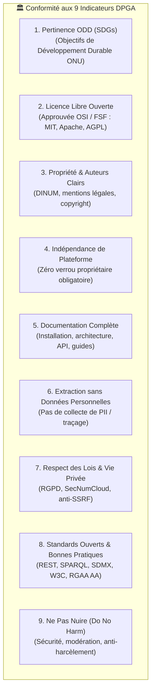

Ce skill définit la procédure standardisée d'audit et d'évaluation pour les logiciels open source, les packages souverains, les jeux de données et les modules d'IA au regard des **9 indicateurs du standard des Biens Publics Numériques (DPGA)** et de l'éligibilité au Registre mondial des DPGs.

---

## 1. Quand l'utiliser

- Audit d'un dépôt, d'un package ou d'une application pour évaluer sa conformité aux critères **Digital Public Good (DPG)**.
- Préparation ou revue d'un dossier de labellisation pour le **Registre officiel de la DPGA** (ex: `suitenumerique/docs`, `meet`, extensions Slasher).
- Vérification de l'alignement avec la feuille de route du Gouvernement français au sein de la **Digital Public Goods Alliance**.
- Contrôle des licences libres (OSI/FSF), de l'indépendance de plateforme, de la vie privée (RGPD/anti-PII) et de l'accessibilité.
- _Ne pas utiliser pour :_ une simple revue de code technique sans dimension de gouvernance ouverte (utiliser [Skill Revue de Code](code-review.md)).

---

## 2. Les 9 Indicateurs Fondamentaux du Standard DPG



---

## 3. Procédure d'Évaluation Pas à Pas

### Indicateur 1 : Pertinence vis-à-vis des Objectifs de Développement Durable (ODD / SDGs)
- [ ] Identifier explicitement les ODD de l'ONU auxquels contribue la solution :
  - **ODD 9 :** Industrie, innovation et infrastructure (infrastructure publique numérique ouverte).
  - **ODD 16 :** Paix, justice et institutions efficaces (transparence publique, institutions ouvertes).
  - **ODD 17 :** Partenariats pour la réalisation des objectifs (communs numériques partagés entre États).

### Indicateur 2 : Licence Libre Reconnue
- [ ] Le code source doit être sous licence libre approuvée par l'**OSI** ou la **FSF** (`MIT`, `Apache-2.0`, `AGPL-3.0`, `EUPL-1.2`).
- [ ] Présence d'un fichier `LICENSE` ou `LICENSE.md` valide à la racine et dans chaque sous-package.
- [ ] Déclaration uniforme de la licence dans `package.json` et `pyproject.toml`.

### Indicateur 3 : Propriété Intellectuelle & Gouvernance Claire
- [ ] Les mainteneurs et auteurs sont documentés (DINUM / État français, TypeCellOS, communauté open source).
- [ ] Processus de contribution clair avec signature DCO (`git commit -s`, `CONTRIBUTING.md`).

### Indicateur 4 : Indépendance Technologique (Zéro Verrou Propriétaire)
- [ ] La solution peut s'exécuter sur des piles 100% libres sans dépendance obligatoire à un service cloud propriétaire payant.
- [ ] Utilisation de conteneurs standards (`Docker`, `Podman`, `OCI`) et bases de données libres (`PostgreSQL`, `Redis`).
- [ ] Fonctionnement hors-ligne garanti grâce aux mocks certifiés sans dépendre d'une API d'IA fermée.

### Indicateur 5 : Documentation Technique Exhaustive
- [ ] Guides d'installation, de build et de test pas-à-pas (`README.md`, `Makefile`).
- [ ] Schémas d'architecture et flux de données documentés (`ARCHITECTURE.md`, portail Zudoku).
- [ ] Contrats d'interfaces et spécifications d'APIs publiques (`OpenAPI 3.0`, types TypeScript).

### Indicateur 6 : Non-Extraction de Données Personnelles (Non-PII)
- [ ] Aucune collecte non sollicitée de données personnelles d'identification (PII).
- [ ] Télémétrie optionnelle avec anonymisation des adresses IP et consentement explicite.

### Indicateur 7 : Respect de la Vie Privée & des Réglementations (RGPD)
- [ ] Conformité stricte au **RGPD** et aux doctrines souveraines (SecNumCloud, Cloud au Centre).
- [ ] Sécurité défensive : filtrage anti-SSRF obligatoire (`is_safe_external_url`) sur tout appel réseau sortant.
- [ ] Zéro secret, token ou clé privée en clair dans le code.

### Indicateur 8 : Adhésion aux Standards Ouverts & Accessibilité
- [ ] Protocoles ouverts : `REST`, `JSON:API`, `OpenAPI 3.0`, `SPARQL`, `SDMX`, `DCAT-AP`, `OGC API`.
- [ ] Accessibilité numérique : **RGAA v4.1 (Niveau AA) / WCAG 2.1 AA** (100% clavier, contrastes $\ge 4.5:1$).
- [ ] Système de Design : Respect des composants officiels DSFR (`@codegouvfr/react-dsfr`) et tokens Cunningham.

### Indicateur 9 : Principe « Ne Pas Nuire » (Do No Harm) & Sécurité
- [ ] **9A. Sécurité :** Circuit breakers (timeout 3.5s), cache déterministe SHA-256, gestion de quotas.
- [ ] **9B. Contenus Illégaux :** Mécanismes empêchant l'injection de code malveillant ou l'altération de données.
- [ ] **9C. Sécurité des Collaborateurs :** Code de conduite actif (`CODE_OF_CONDUCT.md`).

---

## 4. Livrable & Rapport d'Audit

Lors de la réalisation d'une revue DPG, produire un compte-rendu d'évaluation structuré :

```markdown
# 🏆 Revue de Conformité aux Biens Publics Numériques (DPG)

**Cible Auditée :** [Nom du composant/package]  
**Date :** [Date]  
**Statut Global :** [Conforme / Non Conforme / Actions Requises]

| # | Indicateur DPG | Statut | Preuve / Éléments de Conformité |
|---|---|:---:|---|
| 1 | **Pertinence ODD** | ✅ | Répond aux ODD 9 et 16 (Communs numériques & institutions ouvertes) |
| 2 | **Licence Ouverte** | ✅ | Licence MIT approuvée OSI sur tous les packages |
| 3 | **Propriété Claire** | ✅ | Porté par la DINUM / La Suite Numérique avec DCO Signoff |
| 4 | **Indépendance Plateforme** | ✅ | 100% auto-hébergeable (Docker, Vite, Django, PostgreSQL) |
| 5 | **Documentation** | ✅ | Portail Zudoku SSR (270 routes), READMEs, specs OpenAPI 3.0 |
| 6 | **Extraction Non-PII** | ✅ | Zéro collecte de données personnelles |
| 7 | **Respect Lois & RGPD** | ✅ | Conforme RGPD, filtrage anti-SSRF obligatoire |
| 8 | **Standards Ouverts** | ✅ | Accessibilité RGAA AA, W3C ARIA, REST, SDMX, CKAN, SPARQL |
| 9 | **Ne Pas Nuire** | ✅ | Circuit breaker 3.5s, limiteurs de quotas, Code de Conduite |
```

---

## 5. Sources & Références

- **Site Officiel DPGA :** [https://digitalpublicgoods.net/](https://digitalpublicgoods.net/)
- **Spécification du Standard DPG :** [https://digitalpublicgoods.net/standard/](https://digitalpublicgoods.net/standard/)
- **Outil d'Éligibilité DPG :** [https://digitalpublicgoods.net/eligibility/](https://digitalpublicgoods.net/eligibility/)
- **Feuille de Route Gouvernement Français :** [https://digitalpublicgoods.net/roadmap?organizationtype=government](https://digitalpublicgoods.net/roadmap?organizationtype=government)
- **Registre DPGA (La Suite Docs) :** [https://digitalpublicgoods.net/r/docs-collaborative-text-editing](https://digitalpublicgoods.net/r/docs-collaborative-text-editing)
