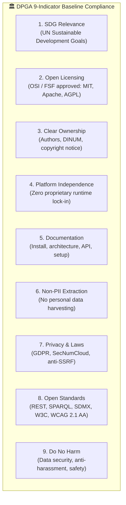

This skill defines the standardized review procedure to evaluate open-source software, sovereign packages, datasets, or AI components against the **9 indicators of the Digital Public Goods Standard (DPGA)** and ensure full eligibility for the global DPG Registry.

---

## 1. When to Use

- Auditing a repository, sub-package, or application for **Digital Public Good (DPG)** compliance.
- Preparing or reviewing a nomination for the official **DPGA Registry** (e.g. `suitenumerique/docs`, `meet`, Slasher extensions).
- Checking alignment with the French Government's membership roadmap in the **Digital Public Goods Alliance**.
- Evaluating open-source licensing, platform independence, data privacy (RGPD/anti-PII), and accessibility standards.
- _Do not use for:_ pure technical code reviews without open-governance scope (use [Code Review Skill](code-review.md)).

---

## 2. The 9 Core Indicators of the DPG Standard



---

## 3. Step-by-Step Review Procedure

### Indicator 1 : Relevance to Sustainable Development Goals (SDGs)
- [ ] Explicitly identify which UN SDG(s) the solution advances:
  - **SDG 9 :** Industry, Innovation, and Infrastructure (open digital public infrastructure).
  - **SDG 16 :** Peace, Justice, and Strong Institutions (transparent public sector data, open governance).
  - **SDG 17 :** Partnerships for the Goals (open-source digital commons across nations).

### Indicator 2 : Open Source Licensing
- [ ] Must be licensed under an **OSI-approved** or **FSF-approved** open source license (e.g., `MIT`, `Apache-2.0`, `AGPL-3.0`, `EUPL-1.2`).
- [ ] Root `LICENSE` or `LICENSE.md` file present and valid in every package.
- [ ] `package.json` / `pyproject.toml` declare matching `"license": "MIT"`.

### Indicator 3 : Clear Ownership & Intellectual Property
- [ ] Ownership and maintainers clearly documented (e.g., DINUM / French State, TypeCellOS, open-source contributors).
- [ ] Authors, copyright notices, and contribution guidelines (`CONTRIBUTING.md`, `DCO / Signoff`) documented.

### Indicator 4 : Platform Independence & Non-Proprietary Dependencies
- [ ] Solution can run on free and open-source stacks without mandatory proprietary third-party cloud services.
- [ ] Uses open container runtimes (`Docker`, `Podman`, `OCI`) and open databases (`PostgreSQL`, `Redis`).
- [ ] Zero mandatory hard dependency on proprietary AI APIs (offline certified mocks or open-weights fallbacks like Albert).

### Indicator 5 : Comprehensive Documentation
- [ ] Clear setup guides: build, test, and run instructions (`README.md`, `Makefile`).
- [ ] Architecture diagrams and data flows documented (`ARCHITECTURE.md`, Zudoku portal).
- [ ] API reference and integration contracts published (`OpenAPI 3.0`, TypeScript SDK contracts).

### Indicator 6 : Non-PII Data Extraction & Telemetry
- [ ] Zero telemetry or tracking of Personally Identifiable Information (PII) by default.
- [ ] If analytics exist, provide explicit opt-in/opt-out consent mechanisms (e.g., self-hosted PostHog with IP masking).

### Indicator 7 : Privacy & Compliance with Applicable Laws
- [ ] Full compliance with **GDPR / RGPD** and French/European privacy regulations.
- [ ] Defensive security: mandatory anti-SSRF validation (`is_safe_external_url`) on all outbound requests.
- [ ] Zero plaintext secrets, private keys, or API tokens committed.

### Indicator 8 : Adherence to Open Standards & Best Practices
- [ ] Interoperability protocols: `REST`, `JSON:API`, `OpenAPI 3.0`, `SPARQL`, `SDMX`, `DCAT-AP`, `OGC`.
- [ ] Accessibility: **RGAA v4.1 (Level AA) / WCAG 2.1 AA** compliant, 100% keyboard navigable.
- [ ] Design System: Official DSFR (`@codegouvfr/react-dsfr`) and Cunningham design tokens.

### Indicator 9 : "Do No Harm" & Defensive Security
- [ ] **9A. Security :** Circuit breakers (3.5s timeout fallback), deterministic Redis cache, safe dependency graph.
- [ ] **9B. Illegal Content :** Mechanism to prevent malicious injection or data tampering.
- [ ] **9C. Safety & Inclusivity :** `CODE_OF_CONDUCT.md` enforcing safe, harassment-free collaboration.

---

## 4. Deliverables & Audit Report

When performing a DPG review on a project or feature, generate an audit report containing:

```markdown
# 🏆 Digital Public Goods (DPG) Compliance Review

**Evaluated Target :** [Target name/package]  
**Date :** [Date]  
**Status :** [Compliant / Non-Compliant / Pending Action]

| # | DPG Indicator | Compliance Status | Proof / Implementation Evidence |
|---|---|:---:|---|
| 1 | **SDG Relevance** | ✅ | Advances SDG 9 & 16 (Digital commons & open institutions) |
| 2 | **Open Licensing** | ✅ | OSI-approved MIT License in root and sub-packages |
| 3 | **Clear Ownership** | ✅ | DINUM / La Suite Numérique maintainers and DCO sign-offs |
| 4 | **Platform Independence** | ✅ | 100% self-hostable via Docker, Vite, Django, and PostgreSQL |
| 5 | **Documentation** | ✅ | Zudoku SSR portal (270 routes), READMEs, OpenAPI 3.0 specs |
| 6 | **Non-PII Extraction** | ✅ | Zero telemetry data harvesting, private IP masking |
| 7 | **Privacy & Laws** | ✅ | GDPR compliant, strict anti-SSRF filtering on remote APIs |
| 8 | **Open Standards** | ✅ | RGAA AA accessibility, W3C ARIA, REST, SDMX, CKAN, SPARQL |
| 9 | **Do No Harm** | ✅ | Circuit breaker 3.5s, rate limiters, Code of Conduct |
```

---

## 5. Sources & References

- **Official DPGA Website :** [https://digitalpublicgoods.net/](https://digitalpublicgoods.net/)
- **DPG Standard Specification :** [https://digitalpublicgoods.net/standard/](https://digitalpublicgoods.net/standard/)
- **DPG Eligibility Assessment Tool :** [https://digitalpublicgoods.net/eligibility/](https://digitalpublicgoods.net/eligibility/)
- **DPGA Members Roadmap (Government of France) :** [https://digitalpublicgoods.net/roadmap?organizationtype=government](https://digitalpublicgoods.net/roadmap?organizationtype=government)
- **DPGA Registry (La Suite Docs) :** [https://digitalpublicgoods.net/r/docs-collaborative-text-editing](https://digitalpublicgoods.net/r/docs-collaborative-text-editing)
