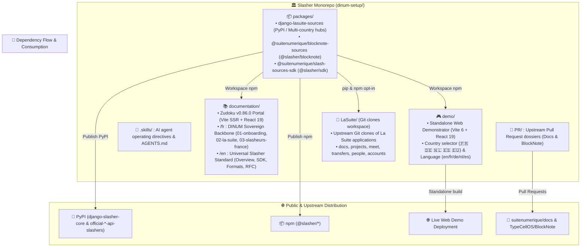

# 🏗️ Global Repository Architecture (`ARCHITECTURE.md`)

> **Official Project:** **Slasher** — Orchestration, Universal BlockNote Standard & Multi-Country Sovereign Slashers  
> **Author:** GitHub Copilot (Gemini 3.7 Flash) — Direction Interministérielle du Numérique (DINUM)  
> **Reference Date:** September 18, 2026  
> **Status:** 4-Pillar Monorepo Architecture Specification & Modular Decoupling

---

## 🏛️ 1. Overview & The 4 Core Pillars

The `dinum-setup` repository is architected into **4 autonomous, isolated pillars**, complemented by root orchestration folders (`PR/` and `.skills/`):



---

## 🌳 2. Repository File Tree (`Tree`)

```
dinum-setup/
│
├── 🐙 PR/                             # Official Pull Request Dossiers (Root)
│   ├── README.md                      # 3 PRs Dashboard & Status
│   ├── 01-docs-serveur-config.md      # PR 1: Remote Servers & VMs (suitenumerique/docs)
│   ├── 02-docs-packages-souverains.md # PR 2: Opt-in Sovereign Packages (suitenumerique/docs)
│   ├── 03-blocknote-slasher-rfc.md    # PR 3: Upstream Slasher RFC (TypeCellOS/BlockNote)
│   ├── 04-guide-d-arbitrage.md        # Decision Guide: In-Tree vs Decoupled Packages
│   └── 05-commandes-gh-cli.md         # gh pr create execution scripts
│
├── 🤖 .skills/                        # AI Agent Directives (Root)
│   ├── README.md                      # Skills catalog hub (FR & EN)
│   ├── code-standards.md              # Strict TypeScript & Cunningham standards
│   ├── dsfr.md                        # Official DSFR & tokens
│   ├── rgaa-review.md                 # RGAA v4.1 AA accessibility checklist
│   ├── lasuite-dev.md                 # Local dev & orchestration
│   ├── docs-mdx.md                    # MDX authoring & Zudoku
│   ├── code-review.md                 # Code review checklist
│   ├── architecture-review.md         # Software architecture audit
│   ├── design-change.md               # Feature design & ADR format
│   └── en/                            # English translations of all skills
│
├── 📚 documentation/                  # 1. Zudoku Documentation Portal (Autonomous)
│   ├── docs/                          # MDX Technical Guides & Specs
│   │   ├── en/                        # 🇬🇧 Universal Slasher Standard
│   │   │   ├── index.mdx              # Overview & Live Playground
│   │   │   ├── 00-overview/           # Standard & 3-Tier Architecture
│   │   │   ├── 01-blocknote-extension/# CustomBlock, 3 Formats, WAI-ARIA, Exporters
│   │   │   ├── 02-provider-sdk/       # defineSourceProvider, DTOs, 15-min Tutorial
│   │   │   ├── 03-backend-proxy/      # DRF Proxy, SHA-256 Cache, Anti-SSRF
│   │   │   ├── 04-presets/            # DE, NL, ES, EU Presets
│   │   │   └── 05-rfc-upstream/       # Formal RFC Specification
│   │   │
│   │   └── fr/                        # 🇫🇷 DINUM Sovereign Foundation (Exempt from translation)
│   │       ├── 01-onboarding/         # Onboarding, 42 Context, Roadmap & Support
│   │       ├── 02-la-suite/           # La Suite Hub (apps, architecture, DSFR, resources)
│   │       └── 03-slasheurs-france/   # France Slashers (10 certified connectors)
│   ├── public/                        # Static assets (lasuite.svg, gouv.svg, favicons)
│   ├── scripts/
│   │   └── generate-docs-navigation.mjs # Dynamic generator for zudoku.navigation.tsx
│   ├── src/
│   │   ├── components/                # Portal UI components
│   │   │   ├── Cards.tsx              # Feature & track cards
│   │   │   ├── DSFRPreviews.tsx       # Visual DSFR component samples
│   │   │   ├── Kanban.tsx             # Interactive agile tracking component
│   │   │   ├── LawSlashPreview.tsx    # Interactive /loi demonstrator
│   │   │   ├── Mermaid.tsx            # SVG diagram renderer with fullscreen zoom
│   │   │   ├── slash-preview/         # Embedded BlockNote.js playground
│   │   │   └── index.ts               # Component barrel export
│   │   └── vite-env.d.ts              # Vite/Zudoku type declarations
│   ├── package.json                   # Portal dependency configuration
│   ├── tsconfig.json                  # Strict TypeScript typing
│   ├── vite.config.ts                 # Vite SSR bundler configuration
│   ├── zudoku.config.tsx              # Brand metadata & Zudoku config
│   ├── zudoku.navigation.tsx          # Bilingual navigation & redirects
│   └── zudoku.theme.css               # Marianne & DSFR stylesheet tokens
│
├── 📦 packages/                       # 2. Decoupled Sovereign Packages (Distributable)
│   │
│   ├── django-lasuite-sources/        # Python Django Package (PyPI Distribution)
│   │   ├── lasuite_sources/           # Core proxy & country connector hubs
│   │   │   ├── __init__.py            # Entry point & registry
│   │   │   ├── apps.py                # Django AppConfig with autodiscovery
│   │   │   ├── base.py                # BaseSourceProvider abstract class
│   │   │   ├── registry.py            # Thread-safe connector registry
│   │   │   ├── tasks.py               # Celery task for legal abrogation watch
│   │   │   ├── types.py               # DTO dataclasses & TypedDicts
│   │   │   ├── urls.py                # DRF routing (/search/, /suggest/, /detail/)
│   │   │   ├── views.py               # DRF REST views
│   │   │   └── providers/             # Symmetric country hubs
│   │   │       ├── france/            # 12 French sovereign connectors (Loi, RNE, BAN...)
│   │   │       ├── germany/           # German connectors (Gesetze, Handelsregister)
│   │   │       ├── netherlands/       # Dutch connectors (Wettenbank, KVK, BAG)
│   │   │       ├── spain/             # Spanish connectors (BOE, Registro Mercantil)
│   │   │       └── europe/            # European connectors (EUR-Lex, TED)
│   │   ├── demo/                      # Standalone Django test server (runserver 8000)
│   │   ├── docs/                      # OpenAPI 3.0 specification (openapi.yaml)
│   │   ├── tests/                     # Pytest suite (SSRF, Circuit Breaker, DRF)
│   │   ├── pyproject.toml             # Hatchling build configuration & metadata
│   │   └── pytest.ini                 # pytest-django execution settings
│   │
│   ├── blocknote-sources/             # BlockNote CustomBlock UI Extension (npm distribution)
│   │   ├── src/                       # React components
│   │   │   ├── SourceBlock.tsx        # BlockNote 0.54+ createReactBlockSpec() factory
│   │   │   ├── components/            # Floating Popover palette (cmdk + ARIA)
│   │   │   ├── exporters/             # Vector exporters (PDF, DOCX, ODT)
│   │   │   ├── formats/               # 3 DSFR display modes (Callout, Card, Link)
│   │   │   ├── hooks/                 # useSourceSearch hook with debounce & abort
│   │   │   ├── i18n/                  # Multi-locale dictionaries (en, fr, de, nl, es)
│   │   │   ├── mockData/              # Verified sample datasets (FR, DE, NL, ES, EU)
│   │   │   └── index.ts               # Package main entry point
│   │   ├── .storybook/                # Standalone Storybook configuration (Port 6006)
│   │   ├── docs/                      # Technical format specification (formats.md)
│   │   ├── tests/                     # Vitest unit & accessibility tests
│   │   ├── package.json               # ESM/CJS/DTS exports & peerDependencies
│   │   ├── tsconfig.json              # Strict typing (Zero any, Zero cast)
│   │   └── tsup.config.ts             # Multi-format TypeScript bundler
│   │
│   └── slash-sources-sdk/             # Lightweight Universal TypeScript SDK (< 5 kB)
│       ├── src/
│       │   ├── defineSourceProvider.ts# Declarative immutable helper Object.freeze()
│       │   ├── types.ts               # Strict English DTOs (ExternalSourceEntity)
│       │   └── index.ts               # Universal barrel export
│       ├── tests/                     # Vitest schema validation unit tests
│       ├── package.json               # npm package configuration
│       └── tsconfig.json              # Strict TypeScript typing
│
├── 🎮 demo/                           # 3. Standalone Web Demonstrator (Vite 6 + React 19)
│   ├── src/
│   │   ├── App.tsx                    # Full interactive UI with country & language selectors
│   │   ├── main.tsx                   # React 19 mount point
│   │   └── demo.css                   # Custom styling
│   ├── index.html                     # HTML5 entry page
│   ├── package.json                   # Vite dependencies & local workspace links
│   ├── tsconfig.json                  # Strict TypeScript configuration
│   ├── vercel.json                    # Vercel SPA deployment config
│   └── vite.config.ts                 # Vite bundler configuration (Port 5173)
│
└── 🐙 LaSuite/                        # 4. Git Clones Workspace (La Suite Applications)
    ├── .gitkeep                       # Git directory placeholder
    ├── docs/                          # Clone of suitenumerique/docs (Impress Next.js & Django)
    ├── projects/                      # Clone of suitenumerique/projects (Sails.js / React)
    ├── meet/                          # Clone of suitenumerique/meet (LiveKit / Jitsi)
    ├── transfers/                     # Clone of suitenumerique/transfers (FastAPI / S3)
    ├── people/                        # Clone of suitenumerique/people (Django / TS Client)
    └── accounts/                      # Clone of suitenumerique/accounts (Keycloak / SSO)
```

---

## 🧭 3. Responsibilities & Data Flows Across Pillars

| Pillar | Directory | Core Role & Function | Technology Stack | Entry Points & Commands |
| :--- | :--- | :--- | :--- | :--- |
| **1. Documentation** | `documentation/` | Reference portal, onboarding, API specifications, and PR dossiers. | Zudoku 0.86, Vite SSR, React 19, MDX | `npm run docs:dev` (Port 3000)<br/>`npm run docs:build` |
| **2. Packages** | `packages/` | Reusable sovereign connectors, BlockNote CustomBlock, and universal SDK. | Django 5, DRF, BlockNote 0.54, TypeScript | `npm run packages:build`<br/>`npm run packages:test` |
| **3. Demonstrator** | `demo/` | Isolated web app to test BlockNote editor and slash commands live. | Vite, React 19, `@suitenumerique/*` | `npm run demo:dev` (Port 5173)<br/>`npm run demo:build` |
| **4. La Suite (Clones)**| `LaSuite/` | Workspace to compile, modify, and contribute to upstream state applications. | Docker Compose, Django, Next.js, Sails | `make clone`<br/>`make dev`<br/>`make status` |

---

## 🛠️ 4. Root Command Matrix (Makefile & npm)

### 📦 Monorepo npm Scripts (`package.json`)
```json
{
  "workspaces": [
    "packages/*",
    "documentation",
    "demo"
  ],
  "scripts": {
    "dev": "npm run docs:dev",
    "build": "npm run packages:build && npm --prefix documentation run build",
    "docs:dev": "npm --prefix documentation run dev",
    "docs:build": "npm run packages:build && npm --prefix documentation run build",
    "docs:preview": "npm --prefix documentation run preview",
    "docs:search": "npm --prefix documentation run search",
    "demo:dev": "npm --prefix demo run dev",
    "demo:build": "npm run packages:build && npm --prefix demo run build",
    "demo:preview": "npm --prefix demo run preview",
    "packages:build": "npm --prefix packages/slash-sources-sdk run build && npm --prefix packages/blocknote-sources run build",
    "packages:test": "npm --prefix packages/slash-sources-sdk test && npm --prefix packages/blocknote-sources test"
  }
}
```

### ⚙️ Key `Makefile` Targets
* `make clone`: Clones official upstream repositories into `./LaSuite/`.
* `make dev`: Starts Docker services for cloned applications in `LaSuite/`.
* `make docs-dev`: Launches Zudoku documentation server on `http://localhost:3000`.
* `make docs-build`: Compiles packages and generates static SSR pre-rendered bundle in `documentation/dist/`.
* `make demo-dev`: Launches standalone web demonstrator on `http://localhost:5173`.
* `make packages-test`: Executes unit and RGAA compliance test suites.
* `make packages-build`: Builds `.mjs`, `.js` bundles and `.d.ts` declaration files.
