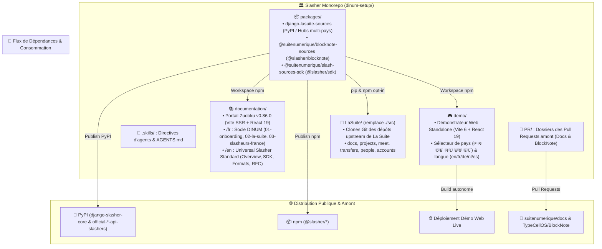

# 🏗️ Architecture Globale du Dépôt (`ARCHITECTURE.md`)

> **Projet Officiel :** **Slasher** — Orchestration, Standard Universel BlockNote & Slasheurs Souverains Multi-Pays  
> **Auteur :** GitHub Copilot (Gemini 3.7 Flash) — Direction Interministérielle du Numérique (DINUM)  
> **Date de Référence :** 18 Septembre 2026  
> **Statut :** Spécification d'Architecture Monorepo en 4 Piliers & Découplage Modulaire

---

## 🏛️ 1. Vue d'Ensemble & Les 4 Piliers Racine

Le dépôt `dinum-setup` est architecturé en **4 piliers autonomes et étanches**, complétés par les dossiers d'orchestration racine (`PR/` et `.skills/`) :



---

## 🌳 2. Arborescence Détaillée du Dépôt (`Tree`)

```
dinum-setup/
│
├── 🐙 PR/                             # Dossier Officiel des Pull Requests (Racine)
│   ├── README.md                      # Tableau de bord des 3 PRs
│   ├── 01-docs-serveur-config.md      # PR 1 : Serveurs Distants & VMs (suitenumerique/docs)
│   ├── 02-docs-packages-souverains.md # PR 2 : Packages Souverains Opt-in (suitenumerique/docs)
│   ├── 03-blocknote-slasher-rfc.md    # PR 3 : RFC Amont Slasher (TypeCellOS/BlockNote)
│   ├── 04-guide-d-arbitrage.md        # Guide décisionnel In-Tree vs Packages
│   └── 05-commandes-gh-cli.md         # Scripts d'exécution gh pr create
│
├── 🤖 .skills/                        # Directives d'Agents IA (Racine)
│   ├── README.md                      # Hub d'orientation des skills
│   ├── code-standards.md              # Normes TypeScript strict & Cunningham
│   ├── dsfr.md                        # DSFR officiel & tokens
│   ├── rgaa-review.md                 # Accessibilité RGAA v4.1 AA
│   ├── lasuite-dev.md                 # Dev local & orchestration
│   ├── docs-mdx.md                    # Rédaction MDX & Zudoku
│   ├── code-review.md                 # Checklist revue de code
│   ├── architecture-review.md         # Audit d'architecture logicielle
│   └── design-change.md               # Évolution & format ADR
│
├── 📚 documentation/                   # 1. Portail Documentaire Zudoku (Autonome)
│   ├── docs/                          # Guides et spécifications techniques MDX
│   │   ├── en/                        # 🇬🇧 Standard Universel Slasher
│   │   │   ├── index.mdx              # Overview & Live Playground
│   │   │   ├── 00-overview/           # Standard & 3-Tier Architecture
│   │   │   ├── 01-blocknote-extension/# CustomBlock, 3 Formats, WAI-ARIA, Exports
│   │   │   ├── 02-provider-sdk/       # defineSourceProvider, DTOs, Tutorial 15 min
│   │   │   ├── 03-backend-proxy/      # Proxy DRF, Cache SHA-256, Anti-SSRF
│   │   │   ├── 04-presets/            # Presets DE, NL, ES, EU
│   │   │   └── 05-rfc-upstream/       # Spécification formelle de la RFC
│   │   │
│   │   └── fr/                        # 🇫🇷 Socle Souverain DINUM
│   │       ├── 01-onboarding/         # 🚀 1. Onboarding, Contexte 42, Planning & Support
│   │       ├── 02-la-suite/           # 🏛️ 2. Hub La Suite (01-apps, 02-archi, 03-dsfr, 04-ressources)
│   │       └── 03-slasheurs-france/   # ⚡ 3. Slasheurs France (10 connecteurs certifiés)
│   ├── public/                        # Actifs statiques (logos lasuite.svg, gouv.svg, favicons)
│   ├── scripts/
│   │   └── generate-docs-navigation.mjs # Générateur dynamique de zudoku.navigation.tsx
│   ├── src/
│   │   ├── components/                # Composants d'interface du portail documentaire
│   │   │   ├── Cards.tsx              # Cartes de fonctionnalités et tracks hackathon
│   │   │   ├── DSFRPreviews.tsx       # Échantillons visuels de composants officiels DSFR
│   │   │   ├── Kanban.tsx             # Composant tableau de suivi agile interactif
│   │   │   ├── LawSlashPreview.tsx    # Démonstrateur interactif de la commande /loi
│   │   │   ├── Mermaid.tsx            # Afficheur de diagrammes SVG avec zoom plein écran
│   │   │   ├── slash-preview/         # Playground BlockNote.js embarqué
│   │   │   └── index.ts               # Baril d'exportation des composants
│   │   └── vite-env.d.ts              # Déclarations de types Vite/Zudoku
│   ├── package.json                   # Configuration des dépendances du portail
│   ├── tsconfig.json                  # Typage TypeScript strict et alias vers packages/
│   ├── vite.config.ts                 # Configuration du bundler Vite SSR
│   ├── zudoku.config.tsx              # Configuration de marque et métadonnées Zudoku
│   ├── zudoku.navigation.tsx          # Table de navigation bilingue et redirections
│   └── zudoku.theme.css               # Feuilles de style et tokens Marianne / DSFR
│
├── 📦 packages/                        # 2. Packages Souverains Découplés (Distribuables)
│   │
│   ├── django-lasuite-sources/        # Package Python Django (Distribution PyPI)
│   │   ├── lasuite_sources/           # Cœur proxy & hubs de connecteurs par pays
│   │   │   ├── __init__.py            # Point d'entrée et registry
│   │   │   ├── apps.py                # AppConfig Django avec autodiscovery
│   │   │   ├── base.py                # Classe abstraite BaseSourceProvider
│   │   │   ├── registry.py            # Registre thread-safe des connecteurs
│   │   │   ├── tasks.py               # Tâche Celery de veille d'abrogation juridique
│   │   │   ├── types.py               # Dataclasses & TypedDicts DTO
│   │   │   ├── urls.py                # Routage DRF (/search/, /suggest/, /detail/)
│   │   │   ├── views.py               # Vues REST Django REST Framework
│   │   │   └── providers/             # Hubs nationaux symétriques
│   │   │       ├── france/            # 12 connecteurs souverains français (Loi, RNE, BAN...)
│   │   │       ├── germany/           # Connecteurs allemands (Gesetze, Handelsregister)
│   │   │       ├── netherlands/       # Connecteurs néerlandais (Wettenbank, KVK, BAG)
│   │   │       ├── spain/             # Connecteurs espagnols (BOE, Registro Mercantil)
│   │   │       └── europe/            # Connecteurs européens (EUR-Lex, TED)
│   │   ├── demo/                      # Mini-application Django de test autonome (runserver 8000)
│   │   ├── docs/                      # Spécification OpenAPI 3.0 (openapi.yaml)
│   │   ├── tests/                     # Tests Pytest (SSRF, Circuit Breaker, DRF)
│   │   ├── pyproject.toml             # Configuration build Hatchling & métadonnées
│   │   └── pytest.ini                 # Configuration d'exécution pytest-django
│   │
│   ├── blocknote-sources/             # Extension BlockNote CustomBlock UI (Distribution npm)
│   │   ├── src/                       # Composants React de l'extension
│   │   │   ├── SourceBlock.tsx        # Factory createReactBlockSpec() BlockNote 0.54+
│   │   │   ├── components/            # Palette flottante Popover (cmdk + ARIA)
│   │   │   ├── exporters/             # Mappeurs vectoriels (PDF, DOCX, ODT)
│   │   │   ├── formats/               # Les 3 modes DSFR (Callout, Carte, Lien)
│   │   │   ├── hooks/                 # Hook useSourceSearch avec debounce & abort
│   │   │   ├── i18n/                  # Dictionnaires multi-locales (en, fr, de, nl, es)
│   │   │   ├── mockData/              # Datasets vérifiés (France, Allemagne, Pays-Bas, Espagne, EU)
│   │   │   └── index.ts               # Point d'entrée principal de la librairie
│   │   ├── .storybook/                # Configuration Storybook autonome (Port 6006)
│   │   ├── docs/                      # Documentation technique des formats (formats.md)
│   │   ├── tests/                     # Tests unitaires Vitest et accessibilité Playwright/Axe
│   │   ├── package.json               # Exports ESM/CJS/DTS et peerDependencies
│   │   ├── tsconfig.json              # Typage strict (Zéro any, Zéro cast)
│   │   └── tsup.config.ts             # Bundler TypeScript multi-formats
│   │
│   └── slash-sources-sdk/             # SDK TypeScript Universel Léger (< 5 kB)
│       ├── src/
│       │   ├── defineSourceProvider.ts# Helper déclaratif immuable
│       │   ├── types.ts               # DTOs stricts en anglais (ExternalSourceEntity)
│       │   └── index.ts               # Baril d'exportation des types
│       ├── tests/                     # Tests unitaires Vitest de validation de schéma
│       ├── package.json               # Configuration du package npm
│       └── tsconfig.json              # Typage strict
│
├── 🎮 demo/                            # 3. Démonstrateur Web Standalone (Vite 6 + React 19)
│   ├── src/
│   │   ├── App.tsx                    # Interface avec sélecteur de pays (🇫🇷 🇩🇪 🇳🇱 🇪🇸 🇪🇺) et langue
│   │   ├── main.tsx                   # Point de montage React 19
│   │   └── demo.css                   # Styles personnalisés
│   ├── index.html                     # Point d'entrée HTML5
│   ├── package.json                   # Dépendances Vite et workspaces locaux
│   ├── tsconfig.json                  # Typage TypeScript strict
│   ├── vercel.json                    # Configuration de déploiement SPA Vercel
│   └── vite.config.ts                 # Configuration Vite (Port 5173)
│
└── 🐙 LaSuite/                         # 4. Espace Clones Git (Applications de La Suite)
    ├── .gitkeep                       # Préserve le dossier dans Git
    ├── docs/                          # Clone de suitenumerique/docs (Impress Next.js & Django)
    ├── projects/                      # Clone de suitenumerique/projects
    ├── meet/                          # Clone de suitenumerique/meet
    ├── transfers/                     # Clone de suitenumerique/transfers
    ├── people/                        # Clone de suitenumerique/people
    └── accounts/                      # Clone de suitenumerique/accounts

│   └── slash-sources-sdk/             # SDK TypeScript Universel < 5 kB (Distribution npm)
│       ├── src/                       # Cœur du SDK Zero-Dependency
│       │   ├── defineSourceProvider.ts# Helper déclaratif immuable Object.freeze()
│       │   ├── types.ts               # Interfaces DTO (SourceEntityProps, SourceSuggestResult)
│       │   └── index.ts               # Baril d'exportation universel
│       ├── demo/                      # Bac à sable HTML/TS sans framework UI
│       ├── templates/                 # Modèle prêt à l'emploi (custom-provider.ts)
│       ├── tests/                     # Tests unitaires Vitest de validation de schéma
│       └── package.json               # Configuration du package npm
│
├── 🎮 demo/                            # 3. Démonstrateur Web Standalone (Éditeur Live)
│   ├── src/
│   │   ├── App.tsx                    # Interface utilisateur complète de démonstration
│   │   ├── main.tsx                   # Point d'entrée React 19
│   │   └── demo-editor.css            # Styles DSFR et layout de démonstration
│   ├── public/                        # Actifs statiques du démonstrateur
│   ├── index.html                     # Page HTML d'accueil du site de démonstration
│   ├── package.json                   # Dépendances branchées sur les packages locaux
│   ├── tsconfig.json                  # Typage TypeScript
│   └── vite.config.ts                 # Configuration du serveur de démo locale (Port 5173)
│
├── 🐙 LaSuite/                         # 4. Clones Applicatifs (Remplace l'ancien ./src)
│   ├── docs/                          # Clone upstream suitenumerique/docs (Impress Next.js / Django)
│   ├── projects/                      # Clone upstream suitenumerique/projects (Sails.js / React)
│   ├── meet/                          # Clone upstream suitenumerique/meet (LiveKit / Jitsi)
│   ├── transfers/                     # Clone upstream suitenumerique/transfers (FastAPI / S3)
│   ├── people/                        # Clone upstream suitenumerique/people (Django / TS Client)
│   └── accounts/                      # Clone upstream suitenumerique/accounts (Keycloak / Profils)
│
├── .github/workflows/                 # Pipelines CI/CD GitHub Actions
│   ├── ci-packages.yml                # Tests automatisés Python & TypeScript sur PR
│   └── publish-packages.yml           # Publication PyPI et npm automatique sur tag v*
│
├── Makefile                           # Orchestrateur universel des commandes développeur
├── package.json                       # Gestionnaire de Workspaces npm racine
├── vercel.json                        # Configuration du déploiement Vercel pour documentation/
├── tsconfig.json                      # Typage racine
├── AGENTS.md                          # Directives générales et table de routage des compétences
├── AUDIT_DOCS.md                      # Audit d'intégrité et inventaire des 152 fichiers MDX
├── ITERATE_REPOSITORY.md              # Plan de migration et suivi de refonte d'architecture
├── TODO_NEXT_STEP.md                  # Feuille de route exécutive pour la soumission des PRs
└── TODO_PLAN_ACTION_PACKAGE.md        # Plan d'industrialisation des 3 packages souverains
```

---

## 🧭 3. Responsabilités & Flux Entre les 4 Piliers

| Pilier | Répertoire | Rôle & Fonction Principale | Technologies | Points d'Entrée & Commandes |
| :--- | :--- | :--- | :--- | :--- |
| **1. Documentation** | `documentation/` | Portail de référence, onboarding, spécifications d'APIs et dossiers de PRs. | Zudoku 0.86, Vite SSR, React 19, MDX | `npm run docs:dev` (Port 3000)<br/>`npm run docs:build` |
| **2. Packages** | `packages/` | Connecteurs souverains réutilisables, CustomBlock BlockNote et SDK universel. | Django 5, DRF, BlockNote 0.54, TypeScript | `npm run packages:build`<br/>`npm run packages:test` |
| **3. Démonstrateur** | `demo/` | Application web isolée pour tester l'éditeur BlockNote et les 12 commandes slash en direct. | Vite, React 19, `@suitenumerique/*` | `npm run demo:dev` (Port 5173)<br/>`npm run demo:build` |
| **4. La Suite (Clones)**| `LaSuite/` | Espace de travail pour compiler, modifier et contribuer aux applications upstream de l'État. | Docker Compose, Django, Next.js, Sails | `make clone`<br/>`make dev`<br/>`make status` |

---

## 🛠️ 4. Matrice des Commandes Racine (Makefile & npm)

### 📦 Scripts npm du Monorepo (`package.json`)
```json
{
  "workspaces": [
    "packages/*",
    "documentation",
    "demo"
  ],
  "scripts": {
    "dev": "npm run docs:dev",
    "build": "npm run packages:build && npm --prefix documentation run build",
    "docs:dev": "npm --prefix documentation run dev",
    "docs:build": "npm run packages:build && npm --prefix documentation run build",
    "docs:preview": "npm --prefix documentation run preview",
    "docs:search": "npm --prefix documentation run search",
    "demo:dev": "npm --prefix demo run dev",
    "demo:build": "npm run packages:build && npm --prefix demo run build",
    "demo:preview": "npm --prefix demo run preview",
    "packages:build": "npm --prefix packages/slash-sources-sdk run build && npm --prefix packages/blocknote-sources run build",
    "packages:test": "npm --prefix packages/slash-sources-sdk test && npm --prefix packages/blocknote-sources test"
  }
}
```

### ⚙️ Commandes Clés du `Makefile`
* `make clone` : Clone les dépôts officiels dans `./LaSuite/` (au lieu de `./src/`).
* `make dev` : Démarre les services Docker des applications clonées dans `LaSuite/`.
* `make docs-dev` : Lance le serveur de documentation Zudoku sur `http://localhost:3000`.
* `make docs-build` : Compile les packages et génère le pré-rendu statique SSR dans `documentation/dist/`.
* `make demo-dev` : Lance le démonstrateur web autonome sur `http://localhost:5173`.
* `make packages-test` : Exécute les 15 tests unitaires et de conformité RGAA.
* `make packages-build` : Compile les bundles `.mjs`, `.js` et les fichiers de déclarations `.d.ts`.
