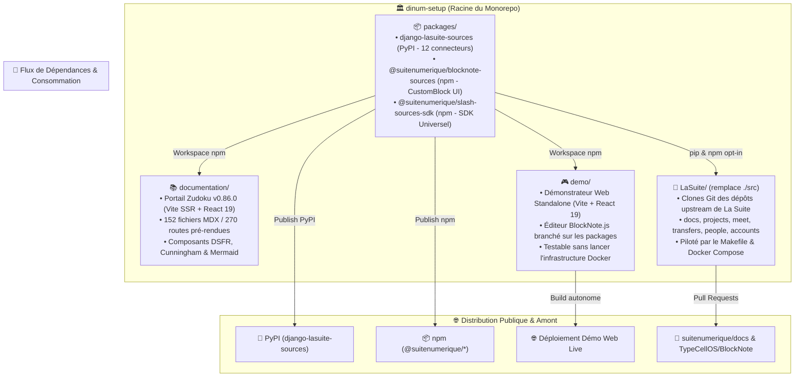

# 🏗️ Architecture Globale du Dépôt (`ARCHITECTURE.md`)

> **Projet :** `dinum-setup` — Orchestration, Portail Documentaire & Packages Souverains La Suite Numérique  
> **Auteur :** GitHub Copilot (Gemini 3.7 Flash) — Direction Interministérielle du Numérique (DINUM)  
> **Date de Référence :** 17 Septembre 2026  
> **Statut :** Spécification d'Architecture Monorepo & Découplage Modulaire

---

## 🏛️ 1. Vue d'Ensemble & Les 4 Piliers Racine

Le dépôt `dinum-setup` est architecturé en **4 piliers autonomes et étanches**, garantissant une séparation stricte des responsabilités entre l'outillage de développement, les packages distribuables, le démonstrateur autonome et les clones applicatifs :



---

## 🌳 2. Arborescence Détaillée du Dépôt (`Tree`)

```
dinum-setup/
│
├── 📚 documentation/                   # 1. Portail Documentaire Zudoku (Autonome)
│   ├── docs/                          # Les 152 guides et spécifications techniques MDX
│   │   ├── 00-accueil/                # Vision hackathon 42 Oléron, Figma & Planning
│   │   ├── 01-onboarding/             # Prise en main poste hôte, VS Code, SSH, serveurs distants
│   │   ├── 02-architecture/           # OIDC ProConnect, SOPS, CRDT/Yjs, S3, PRA, K8s
│   │   ├── 03-projets/                # Fiches des 8 applications de La Suite numérique
│   │   ├── 04-design-system/          # Fondations DSFR, Marianne, Cunningham Tokens, Accessibilité
│   │   ├── 05-ressources/             # Salons Matrix/Tchap, templates de code, roadmaps
│   │   ├── 07-skills/                 # Directives d'ingénierie, Zero-any, Code Review, ADRs
│   │   ├── 08-slash/                  # Socle souverain, 12 connecteurs en 3 pôles (70 fichiers), RXP
│   │   └── 09-PR/                     # Hub des dossiers de PRs officielles (Docs & BlockNote)
│   ├── public/                        # Actifs statiques (logos lasuite.svg, gouv.svg, favicons)
│   ├── scripts/
│   │   └── generate-docs-navigation.mjs # Générateur dynamique de zudoku.navigation.tsx
│   ├── src/
│   │   ├── components/                # Composants d'interface du portail documentaire
│   │   │   ├── Cards.tsx              # Cartes de fonctionnalités et tracks hackathon
│   │   │   ├── DSFRPreviews.tsx       # Échantillons visuels de composants officiels DSFR
│   │   │   ├── Kanban.tsx             # Composant tableau de suivi agile interactif
│   │   │   ├── LawSlashPreview.tsx    # Démonstrateur interactif de la commande /loi
│   │   │   ├── Mermaid.tsx            # Afficheur de diagrammes SVG avec zoom plein écran
│   │   │   ├── slash-preview/         # Playground BlockNote.js embarqué
│   │   │   └── index.ts               # Baril d'exportation des composants
│   │   └── vite-env.d.ts              # Déclarations de types Vite/Zudoku
│   ├── package.json                   # Configuration des dépendances du portail
│   ├── tsconfig.json                  # Typage TypeScript strict et alias vers packages/
│   ├── vite.config.ts                 # Configuration du bundler Vite SSR
│   ├── zudoku.config.tsx              # Configuration de marque et métadonnées Zudoku
│   ├── zudoku.navigation.tsx          # Table de navigation et 45 redirections de routes
│   └── zudoku.theme.css               # Feuilles de style et tokens Marianne / DSFR
│
├── 📦 packages/                        # 2. Packages Souverains Découplés (Distribuables)
│   │
│   ├── django-lasuite-sources/        # Package Python Django (Distribution PyPI)
│   │   ├── lasuite_sources/           # 21 modules Python (Architecture Provider)
│   │   │   ├── __init__.py            # Point d'entrée et singleton registry
│   │   │   ├── apps.py                # AppConfig Django avec autodiscovery
│   │   │   ├── base.py                # Classe abstraite BaseSourceProvider
│   │   │   ├── registry.py            # Registre thread-safe des connecteurs
│   │   │   ├── tasks.py               # Tâche Celery de veille d'abrogation juridique
│   │   │   ├── types.py               # Dataclasses & TypedDicts DTO
│   │   │   ├── urls.py                # Routage DRF (/search/, /suggest/, /detail/)
│   │   │   ├── views.py               # Vues REST Django REST Framework
│   │   │   └── providers/             # Les 12 connecteurs souverains isolés
│   │   │       ├── law.py             # /loi (Légifrance / PISTE)
│   │   │       ├── parliament.py      # /assemblee (Assemblée Nationale / Tricoteuse)
│   │   │       ├── company.py         # /entreprise (Annuaire Entreprises / RNE)
│   │   │       ├── address.py         # /adresse (BAN IGN / Addok)
│   │   │       ├── albert.py          # /albert (Albert IA Souveraine RAG)
│   │   │       ├── procurement.py     # /marche (BOAMP / DAE)
│   │   │       ├── grant.py           # /subvention (Aides-Territoires / Fonds Vert)
│   │   │       ├── insee.py           # /stats (INSEE Données Locales)
│   │   │       ├── agent.py           # /agent (Annuaire du Service Public)
│   │   │       ├── cadastre.py        # /cadastre (Géoplateforme Cadastre DGFiP)
│   │   │       ├── demarche.py        # /demarche (Démarches-Simplifiées.fr)
│   │   │       └── opendata.py        # /opendata (data.gouv.fr)
│   │   ├── demo/                      # Mini-application Django de test autonome (runserver 8000)
│   │   ├── docs/                      # Spécification OpenAPI 3.0 (openapi.yaml)
│   │   ├── tests/                     # Tests Pytest (SSRF, Circuit Breaker, DRF)
│   │   ├── pyproject.toml             # Configuration build Hatchling & métadonnées
│   │   └── pytest.ini                 # Configuration d'exécution pytest-django
│   │
│   ├── blocknote-sources/             # Extension BlockNote CustomBlock UI (Distribution npm)
│   │   ├── src/                       # Composants React de l'extension
│   │   │   ├── SourceBlock.tsx        # Factory createReactBlockSpec() BlockNote 0.54+
│   │   │   ├── components/            # Palette flottante Popover (cmdk + ARIA)
│   │   │   ├── exporters/             # Mappeurs vectoriels (PDF, DOCX, ODT)
│   │   │   ├── formats/               # Les 3 modes DSFR (Callout Marianne, Carte, Lien)
│   │   │   ├── hooks/                 # Hook useSourceSearch avec debounce & abort
│   │   │   └── index.ts               # Point d'entrée principal de la librairie
│   │   ├── .storybook/                # Configuration Storybook autonome (Port 6006)
│   │   ├── docs/                      # Documentation technique des formats (formats.md)
│   │   ├── tests/                     # Tests unitaires Vitest et accessibilité Playwright/Axe
│   │   ├── package.json               # Exports ESM/CJS/DTS et peerDependencies
│   │   ├── tsconfig.json              # Typage strict (Zéro any, Zéro cast)
│   │   └── tsup.config.ts             # Bundler TypeScript multi-formats
│   │
│   └── slash-sources-sdk/             # SDK TypeScript Universel < 5 kB (Distribution npm)
│       ├── src/                       # Cœur du SDK Zero-Dependency
│       │   ├── defineSourceProvider.ts# Helper déclaratif immuable Object.freeze()
│       │   ├── types.ts               # Interfaces DTO (SourceEntityProps, SourceSuggestResult)
│       │   └── index.ts               # Baril d'exportation universel
│       ├── demo/                      # Bac à sable HTML/TS sans framework UI
│       ├── templates/                 # Modèle prêt à l'emploi (custom-provider.ts)
│       ├── tests/                     # Tests unitaires Vitest de validation de schéma
│       └── package.json               # Configuration du package npm
│
├── 🎮 demo/                            # 3. Démonstrateur Web Standalone (Éditeur Live)
│   ├── src/
│   │   ├── App.tsx                    # Interface utilisateur complète de démonstration
│   │   ├── main.tsx                   # Point d'entrée React 19
│   │   └── demo-editor.css            # Styles DSFR et layout de démonstration
│   ├── public/                        # Actifs statiques du démonstrateur
│   ├── index.html                     # Page HTML d'accueil du site de démonstration
│   ├── package.json                   # Dépendances branchées sur les packages locaux
│   ├── tsconfig.json                  # Typage TypeScript
│   └── vite.config.ts                 # Configuration du serveur de démo locale (Port 5173)
│
├── 🐙 LaSuite/                         # 4. Clones Applicatifs (Remplace l'ancien ./src)
│   ├── docs/                          # Clone upstream suitenumerique/docs (Impress Next.js / Django)
│   ├── projects/                      # Clone upstream suitenumerique/projects (Sails.js / React)
│   ├── meet/                          # Clone upstream suitenumerique/meet (LiveKit / Jitsi)
│   ├── transfers/                     # Clone upstream suitenumerique/transfers (FastAPI / S3)
│   ├── people/                        # Clone upstream suitenumerique/people (Django / TS Client)
│   └── accounts/                      # Clone upstream suitenumerique/accounts (Keycloak / Profils)
│
├── .github/workflows/                 # Pipelines CI/CD GitHub Actions
│   ├── ci-packages.yml                # Tests automatisés Python & TypeScript sur PR
│   └── publish-packages.yml           # Publication PyPI et npm automatique sur tag v*
│
├── Makefile                           # Orchestrateur universel des commandes développeur
├── package.json                       # Gestionnaire de Workspaces npm racine
├── vercel.json                        # Configuration du déploiement Vercel pour documentation/
├── tsconfig.json                      # Typage racine
├── AGENTS.md                          # Directives générales et table de routage des compétences
├── AUDIT_DOCS.md                      # Audit d'intégrité et inventaire des 152 fichiers MDX
├── ITERATE_REPOSITORY.md              # Plan de migration et suivi de refonte d'architecture
├── TODO_NEXT_STEP.md                  # Feuille de route exécutive pour la soumission des PRs
└── TODO_PLAN_ACTION_PACKAGE.md        # Plan d'industrialisation des 3 packages souverains
```

---

## 🧭 3. Responsabilités & Flux Entre les 4 Piliers

| Pilier | Répertoire | Rôle & Fonction Principale | Technologies | Points d'Entrée & Commandes |
| :--- | :--- | :--- | :--- | :--- |
| **1. Documentation** | `documentation/` | Portail de référence, onboarding, spécifications d'APIs et dossiers de PRs. | Zudoku 0.86, Vite SSR, React 19, MDX | `npm run docs:dev` (Port 3000)<br/>`npm run docs:build` |
| **2. Packages** | `packages/` | Connecteurs souverains réutilisables, CustomBlock BlockNote et SDK universel. | Django 5, DRF, BlockNote 0.54, TypeScript | `npm run packages:build`<br/>`npm run packages:test` |
| **3. Démonstrateur** | `demo/` | Application web isolée pour tester l'éditeur BlockNote et les 12 commandes slash en direct. | Vite, React 19, `@suitenumerique/*` | `npm run demo:dev` (Port 5173)<br/>`npm run demo:build` |
| **4. La Suite (Clones)**| `LaSuite/` | Espace de travail pour compiler, modifier et contribuer aux applications upstream de l'État. | Docker Compose, Django, Next.js, Sails | `make clone`<br/>`make dev`<br/>`make status` |

---

## 🛠️ 4. Matrice des Commandes Racine (Makefile & npm)

### 📦 Scripts npm du Monorepo (`package.json`)
```json
{
  "workspaces": [
    "packages/*",
    "documentation",
    "demo"
  ],
  "scripts": {
    "dev": "npm run docs:dev",
    "build": "npm run packages:build && npm --prefix documentation run build",
    "docs:dev": "npm --prefix documentation run dev",
    "docs:build": "npm run packages:build && npm --prefix documentation run build",
    "docs:preview": "npm --prefix documentation run preview",
    "docs:search": "npm --prefix documentation run search",
    "demo:dev": "npm --prefix demo run dev",
    "demo:build": "npm run packages:build && npm --prefix demo run build",
    "demo:preview": "npm --prefix demo run preview",
    "packages:build": "npm --prefix packages/slash-sources-sdk run build && npm --prefix packages/blocknote-sources run build",
    "packages:test": "npm --prefix packages/slash-sources-sdk test && npm --prefix packages/blocknote-sources test"
  }
}
```

### ⚙️ Commandes Clés du `Makefile`
* `make clone` : Clone les dépôts officiels dans `./LaSuite/` (au lieu de `./src/`).
* `make dev` : Démarre les services Docker des applications clonées dans `LaSuite/`.
* `make docs-dev` : Lance le serveur de documentation Zudoku sur `http://localhost:3000`.
* `make docs-build` : Compile les packages et génère le pré-rendu statique SSR dans `documentation/dist/`.
* `make demo-dev` : Lance le démonstrateur web autonome sur `http://localhost:5173`.
* `make packages-test` : Exécute les 15 tests unitaires et de conformité RGAA.
* `make packages-build` : Compile les bundles `.mjs`, `.js` et les fichiers de déclarations `.d.ts`.
