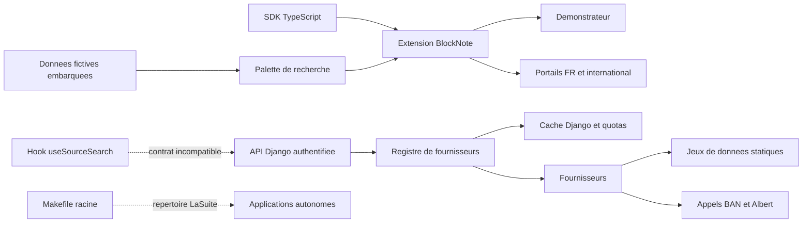

# Audit technique de dinum-setup

Date : 18 septembre 2026. Révision examinée : `f447bf3ce7dcc76fac975ffd3b8f270a24594c30`.

## Conclusion

Le dépôt dispose d'une séparation utile entre SDK, extension BlockNote, backend Django, démonstrateur et documentation. Toutefois, il n'est pas prêt pour une livraison reproductible ou une utilisation connectée en production : le lockfile empêche une installation propre, plusieurs mécanismes de protection ne fonctionnent pas sur les chemins réellement utilisés et la recherche de l'éditeur reste alimentée par des données fictives.

**18 constats : 1 bloquant de livraison (P0), 10 majeurs (P1), 7 améliorations nécessaires (P2).** La classification P0 concerne ici l'installation et la CI ; aucune compromission de production n'a été démontrée.

Les **46 tests Python** et **15 tests TypeScript** exécutés passent, avec les réserves d'environnement précisées ci-dessous. Ce résultat ne valide pas les garanties annoncées : des reproductions supplémentaires confirment notamment un blocage de découverte des plugins, une incompatibilité du contrat API, un contournement des quotas et une mauvaise gestion des réponses HTTP 429.

## Périmètre et méthode

L'inventaire initial couvre **502 fichiers suivis** dans le dépôt principal, dont 183 dans `packages/`, 176 dans `documentation/`, 54 dans `documentation-international/` et 21 dans `demo/`. Les deux portails contiennent respectivement 148 et 27 fichiers MDX.

| Zone | Examen réalisé | Limites |
| --- | --- | --- |
| Racine, `Makefile`, `.github/`, `tooling/` | Commandes, dépendances, règles de qualité, CI et publication | Pas de bootstrap, de modification de services, de publication ou de déploiement |
| `packages/django-lasuite-sources/` | Registre, vues, quotas, tâches, ingestion, connecteurs, tests et configuration | Appels externes simulés pour les reproductions ; pas de Redis ni de charge distribuée réelle |
| SDK et extension BlockNote | Contrats, recherche, formats, exports, typage et tests | Compilation complète bloquée par l'environnement npm et le lockfile |
| `demo/` | Intégration BlockNote, sélection des pays et dépendances | Pas de validation dans un navigateur |
| Deux portails documentaires | Structure, manifestes, composants partagés, navigation et cohérence des garanties documentées | Pas de relecture éditoriale exhaustive des 175 pages ; build SSR non atteint |
| `PR/`, guides et règles locales | Cohérence de la préparation des contributions et liens locaux ciblés | Statut des PR distantes non vérifié |
| Copies applicatives `src/` | Inventaire Git des six dépôts et lecture ciblée d'orchestration | Le dossier a disparu pendant l'audit, sans action de l'auditeur ; pas d'audit complet de leur code métier |

À l'inventaire initial, les copies `src/` avaient toutes un état Git propre :

| Copie | Révision | Fichiers suivis |
| --- | --- | ---: |
| `src/accounts` | `850736b` | 308 |
| `src/docs` | `2986cc61` | 1 560 |
| `src/meet` | `3fa05ea7` | 1 177 |
| `src/people` | `5eafad1d` | 770 |
| `src/projects` | `7858be2a` | 977 |
| `src/transfers` | `1286dfa` | 217 |

Ces 5 009 fichiers ne sont donc **pas couverts par une revue exhaustive**. Les dépendances installées, caches, artefacts générés et historique Git complet sont également exclus d'une revue ligne par ligne.

Référentiel : `AGENTS.md`, `GUIDELINES.md`, procédures locales d'architecture, revue, DINUM React/Python, accessibilité, quotas, orchestration et distribution. Les constats distinguent reproduction exécutée, lecture statique et risque conditionnel. Les journaux et le script de reproduction sont conservés localement sous `.sessions/`, répertoire ignoré par Git.

## Architecture observée



Le cache est celui configuré par l'application hôte : la démo et les tests utilisent `LocMemCache`. La présence du mot Redis dans les commentaires ne garantit pas un cache partagé en déploiement. Les points de rupture concrets sont détaillés ci-dessous.

## Constats prioritaires

### AUD-001 | P0 | Installation npm reproductible impossible

- **Emplacement :** `package.json:5`, `package-lock.json:1`, `.github/workflows/deploy-vercel.yml:23`.
- **Constat :** le workspace `documentation-international` figure dans le manifeste mais manque dans le lockfile, y compris dans sa liste de workspaces racine.
- **Preuve exécutée :** `npm ci --dry-run --ignore-scripts` termine avec le code 1 : `Missing: @dinum/documentation-international@1.0.0 from lock file`.
- **Impact :** la CI Vercel, qui exécute `npm ci`, échouera sur cette révision avant les tests. Les workflows utilisant `npm ci || npm install` contournent cette erreur en recalculant les dépendances.
- **Correction :** régénérer et versionner le lockfile avec tous les workspaces ; supprimer le repli automatique vers `npm install`. Critère d'acceptation : installation propre puis contrôles complets avec le lockfile conservé à l'identique.

### AUD-002 | P1 | Interblocage lors de la découverte d'un plugin

- **Emplacement :** `packages/django-lasuite-sources/lasuite_sources/registry.py:35`, `:50`, `:66`, `:85`.
- **Constat :** `discover_entry_points()` détient un `threading.Lock` puis appelle `register()`, qui reprend le même verrou non réentrant.
- **Preuve exécutée :** injection d'un entry point valide retournant `LawSourceProvider` ; le thread reste bloqué après 0,5 seconde. L'auto-acquisition du verrou explique le blocage sans borne.
- **Impact :** dès qu'une extension est effectivement installée, le premier accès au registre peut suspendre un worker ; les autres accès attendant ce verrou sont également affectés.
- **Correction :** charger les plugins hors de la section verrouillée puis les enregistrer, ou employer un verrou réentrant avec une portée maîtrisée. Ajouter un test de découverte d'un vrai fournisseur via entry point avec échéance de terminaison.

### AUD-003 | P1 | Le hook React rejette les résultats de l'API Django

- **Emplacement :** `packages/django-lasuite-sources/lasuite_sources/types.py:40`, `views.py:43`, `packages/blocknote-sources/src/hooks/useSourceSearch.ts:88`.
- **Constat :** le backend expose `source_id`, `entity_type`, `display_mode`, `verified_at` ; le hook exige notamment `sourceId` avant d'accepter une ligne.
- **Preuve exécutée :** une requête Django authentifiée à la recherche de lois retourne HTTP 200 et deux résultats. L'application du garde effectivement utilisé par le frontend en accepte zéro.
- **Impact :** un consommateur du hook obtient une liste vide malgré une réponse valide ; aucune erreur ni donnée de secours n'est affichée puisque la réponse HTTP est un succès.
- **Correction :** définir un DTO canonique et une conversion explicite à la frontière API, puis tester une réponse réelle de la vue dans le parcours de recherche frontend.

### AUD-004 | P1 | La palette du package n'utilise pas les connecteurs

- **Emplacement :** `packages/blocknote-sources/src/components/SourceSearchPopover.tsx:8`, `:111`, `packages/blocknote-sources/src/SourceBlock.tsx:116`.
- **Constat statique :** la palette filtre exclusivement `MOCK_SOURCES` et `ALL_INTERNATIONAL_MOCK_SOURCES`. Son API ne reçoit ni fournisseur ni client de recherche ; le hook réseau exporté n'y est pas utilisé.
- **Impact :** configurer le backend ou déclarer un fournisseur avec le SDK ne suffit pas à alimenter la recherche du bloc distribué. Le fonctionnement fictif convient à un démonstrateur, mais ne réalise pas l'intégration connectée annoncée.
- **Correction :** injecter une interface de recherche dans le bloc et la palette ; réserver les fixtures à un mode démo explicite. Vérifier qu'une réponse serveur absente des fixtures est affichée et insérable.

### AUD-005 | P1 | Des fixtures sont présentées comme des données vérifiées

- **Emplacement :** `packages/django-lasuite-sources/lasuite_sources/providers/france/law.py:84`, `:104`, `providers/france/address.py:101`, `:110`, `providers/france/albert.py:95`.
- **Constat :** `LawSourceProvider.search()` ne contient aucun appel PISTE et renvoie toujours des fixtures, même lorsque le mode mock est désactivé et des identifiants fournis. En l'absence de correspondance, les premières fixtures sont renvoyées. Plusieurs autres fournisseurs suivent le même modèle. Les résultats portent des mentions de certification et des dates de vérification constantes ; même la branche réseau BAN fixe sa date en dur.
- **Preuve exécutée :** avec `PISTE_MOCK_ENABLED=false` et des identifiants factices non vides, une recherche sans correspondance retourne trois articles fictifs. Aucun identifiant réel ni appel externe n'a été utilisé.
- **Impact :** un intégrateur ne peut pas distinguer résultat réel, démonstration et panne. La tâche de vérification des lois repose elle-même sur ce fournisseur statique.
- **Correction :** expliciter la provenance des données, désactiver les fixtures hors démo, retourner un résultat vide pour une recherche vide de correspondances et un état indisponible pour un connecteur non implémenté. Ne renseigner une date de vérification qu'après une vérification effective.

### AUD-006 | P1 | Quotas non appliqués et compteurs non atomiques

- **Emplacement :** `packages/django-lasuite-sources/lasuite_sources/registry.py:130`, `:172`, `quota.py:104`, `:171`.
- **Constat :** un refus de `check_user_rate_limit()` provoque seulement un avertissement ; une absence de cache déclenche quand même l'appel fournisseur. Les compteurs sont incrémentés par une lecture puis une écriture distinctes.
- **Preuves exécutées :** avec une limite de 1 requête/minute, trois recherches distinctes du même utilisateur déclenchent trois appels fournisseur. Huit incréments concurrents, synchronisés après lecture dans un cache local, produisent un compteur final de 1.
- **Impact :** les limites annoncées ne bornent pas la consommation et la concurrence sous-estime les quotas. Le test concurrent illustre la perte d'incréments ; aucun banc de charge Redis n'a été réalisé.
- **Correction :** arrêter le chemin réseau dès le refus et exposer une réponse explicite ou un résultat de cache identifié ; utiliser une opération atomique adaptée au backend et réserver le budget avant l'appel. Tester le comportement public du registre sous concurrence.

### AUD-007 | P1 | Les erreurs HTTP réelles ne déclenchent pas le circuit breaker

- **Emplacement :** `packages/django-lasuite-sources/lasuite_sources/providers/france/address.py:79`, `:107`, `providers/france/albert.py:87`, `registry.py:153`.
- **Constat :** les fournisseurs transforment les erreurs HTTP, timeouts ou réponses inutilisables en fixtures. Le registre voit un retour normal, enregistre un succès et efface le compteur d'erreurs. Il ne reçoit pas `Retry-After`.
- **Preuve exécutée :** trois réponses BAN simulées avec HTTP 429 et `Retry-After: 120` déclenchent trois appels ; l'état final reste `healthy`, `is_live=true`, sans circuit ouvert.
- **Impact :** poursuite des appels à un service qui demande d'attendre, masquage des incidents et mise en cache de données fictives pendant la panne.
- **Correction :** propager des erreurs métier structurées contenant statut et délai de reprise ; appliquer la politique de secours au niveau du registre. Tester des réponses HTTP 429, 500 et des timeouts sur les fournisseurs réels, pas seulement un appel direct au gestionnaire de quotas.

### AUD-008 | P1 | La protection anti-SSRF annoncée n'est pas exécutée

- **Emplacement :** `packages/django-lasuite-sources/tests/test_security_ssrf.py:19`, `lasuite_sources/providers/france/albert.py:59`, `:81`, `documentation-international/docs/03-backend-proxy/defensive-security-ssrf.mdx:9`.
- **Constat :** `is_safe_external_url()` est définie et appelée uniquement dans les tests. Le code de production effectue directement ses requêtes ; Albert accepte une URL configurée et les redirections HTTP ne sont pas explicitement contrôlées.
- **Preuve exécutée sans réseau :** un fournisseur Albert configuré sur `http://127.0.0.1:8000` transmet bien `http://127.0.0.1:8000/search` à `requests.post`, intercepté par un mock.
- **Portée :** défaut de défense confirmé. L'exploitation depuis une requête utilisateur arbitraire n'est pas démontrée : l'URL Albert provient de la configuration serveur et l'URL BAN est constante. La fonction de test ne résout d'ailleurs pas les noms DNS.
- **Correction :** centraliser les appels HTTP, contrôler protocoles, destinations résolues et redirections, avec une politique explicite pour les éventuels services internes autorisés. Tester le transport effectivement utilisé. Le timeout Albert de 4 secondes doit aussi être aligné sur la limite locale annoncée de 3,5 secondes.

### AUD-009 | P1 | Dépendances signalées vulnérables dans le lockfile

- **Emplacement :** `package-lock.json`, `packages/slash-sources-sdk/package.json:49`.
- **Preuve exécutée :** `npm audit --package-lock-only --json` retourne **13 entrées vulnérables : 1 critique, 5 élevées, 7 modérées**. Ces entrées incluent les remontées transitives ; ce ne sont pas nécessairement 13 failles indépendantes.
- **Exemples :** Vitest `2.1.9` est verrouillé ; Vite `5.4.21` est présent sous Vitest et vite-node. D'autres alertes concernent notamment `lodash-es`, `toml`, `hono` et les dépendances de Zudoku.
- **Portée vérifiée :** l'[avis Vitest GHSA-5xrq-8626-4rwp](https://github.com/advisories/GHSA-5xrq-8626-4rwp) concerne notamment l'exposition de son API/UI au réseau et certains usages sous Windows. L'[avis Vite GHSA-4w7w-66w2-5vf9](https://github.com/advisories/GHSA-4w7w-66w2-5vf9) concerne le serveur de développement. Une exploitation du site statique publié n'est pas démontrée.
- **Correction :** examiner les chemins réellement utilisés, mettre à jour les dépendances compatibles, puis régénérer le lockfile et rejouer les contrôles. Ne pas appliquer automatiquement `npm audit fix --force` : certaines suggestions du rapport impliquent des changements majeurs ou des versions antérieures de dépendances directes.

### AUD-010 | P1 | Dépendances des exports absentes du contrat de distribution

- **Emplacement :** `packages/blocknote-sources/src/exporters/sourceBlockDocx.tsx:1`, `sourceBlockPDF.tsx:1`, `exporters/index.ts:1`, `tsup.config.ts:13`, `packages/blocknote-sources/package.json:57`, `src/types.ts:9`.
- **Constat statique :** `docx` et `@react-pdf/renderer` sont importés et externalisés, mais ne figurent ni dans les dépendances ni dans les peer dependencies du package. Le SDK, dont les types sont réexportés, n'est pas déclaré non plus. Des déclarations ambiantes remplacent les types réels des bibliothèques d'export.
- **Impact :** un consommateur isolé n'a pas la garantie de pouvoir importer `@suitenumerique/blocknote-sources/exporters` ou résoudre ses types. L'entrée commune exporte les trois formats, ce qui couple aussi l'import ODT aux bibliothèques des autres formats selon le consommateur.
- **Preuve complémentaire :** les tests d'export remplacent les bibliothèques par des mocks et vérifient principalement qu'un objet existe ; ils ne chargent pas une archive npm dans un projet vierge.
- **Correction :** déclarer les dépendances requises et, si nécessaire, des peer dependencies optionnelles avec des points d'entrée séparés ; supprimer les faux contrats ambiants au profit des types réels. Tester l'installation du tarball et la génération de fichiers ouvrables. Cette installation isolée n'a pas été exécutée durant l'audit.

### AUD-011 | P1 | Accessibilité incomplète de la recherche et des modales

- **Emplacement :** `packages/blocknote-sources/src/components/SourceSearchPopover.tsx:160`, `:203`, `:387`, `documentation/src/components/Mermaid.tsx:112`, `:228` ; composant Mermaid également copié dans le portail international.
- **Constat statique :** la sélection au clavier change `selectedIndex` mais le focus reste dans le champ, sans `aria-activedescendant` ni identifiant d'option permettant de relier le résultat actif. La modale Mermaid possède `aria-modal=true` sans nom accessible lié au titre ni transfert/restauration explicite du focus.
- **Impact :** la sélection visuelle n'est pas correctement reliée au focus accessible et la navigation dans la modale n'est pas suffisamment gérée.
- **Correction :** employer les primitives accessibles prévues par le dépôt, relier l'option active au champ, gérer l'entrée et la sortie du focus ainsi que la fermeture clavier. Tester avec clavier et lecteur d'écran.
- **Limite :** aucune certification RGAA, mesure globale de contrastes ou validation en navigateur n'a été réalisée ; l'E2E est bloqué. Les anciens pourcentages de conformité documentés ne constituent pas une preuve pour cette révision.

## Autres corrections nécessaires

### AUD-012 | P2 | Des résultats obsolètes peuvent réapparaître après effacement

- **Emplacement :** `packages/blocknote-sources/src/hooks/useSourceSearch.ts:55`, `:149`, `:161`, `:171`.
- **Constat statique :** la branche de requête vide retourne avant l'annulation de la requête précédente. Le nettoyage de l'effet annule uniquement le timer ; il n'annule pas la requête au démontage. Le `finally` d'une ancienne requête peut remettre `isLoading=false` pendant la suivante.
- **Scénario :** lancer une recherche lente puis effacer le champ avec `setQuery('')` ; la réponse précédente peut repeupler les résultats. Scénario non exécuté dans un navigateur.
- **Correction :** annuler les requêtes lors de l'effacement et du démontage, et protéger toutes les mises à jour par l'identifiant de la recherche active. Ajouter un test avec réponses différées et réponses arrivant dans le désordre.

### AUD-013 | P2 | Paramètres API non bornés et contrat OpenAPI divergent

- **Emplacement :** `packages/django-lasuite-sources/lasuite_sources/views.py:20`, `:57`, `docs/openapi.yaml:51`, `:103`.
- **Constat statique :** les vues acceptent des limites négatives ou arbitrairement grandes après un simple `int()`, alors que le schéma annonce des maxima de 50 et 20. Un type inconnu produit une recherche vide HTTP 200 ; la longueur de la requête n'est pas bornée.
- **Impact :** paramètres imprévisibles transmis aux connecteurs, fragmentation du cache par `limit` et absence de validation conforme au contrat publié.
- **Correction :** valider avec des serializers DRF, appliquer des bornes explicites et documenter les erreurs 400. Tester limites négatives, dépassements, type inconnu et requête excessivement longue.

### AUD-014 | P2 | Le pays sélectionné n'est pas propagé à la recherche du bloc

- **Emplacement :** `demo/src/App.tsx:210`, `packages/blocknote-sources/src/SourceBlock.tsx:116`, `src/components/SourceSearchPopover.tsx:89`, `:335`.
- **Constat statique :** le choix du pays change les données de la démo mais `SourceBlock` ne transmet pas `initialCountry` à la palette, qui revient donc à la France. Le Canada figure dans les types et les jeux de données mais pas dans les boutons de pays de cette palette.
- **Impact :** après sélection d'un autre pays, une nouvelle recherche peut présenter les sources françaises. Le changement de pays remplace en outre tout le document par des exemples via `replaceBlocks(editor.document, ...)`, sans conserver les modifications saisies dans le démonstrateur.
- **Correction :** propager le pays et le fournisseur à travers le schéma/contexte du bloc, inclure tous les pays supportés et dissocier le filtre de recherche du chargement d'un document d'exemple. Vérifier la conservation des saisies lors d'un simple changement de filtre.

### AUD-015 | P2 | Les contrôles qualité ne couvrent pas les garanties affichées

- **Emplacement :** `packages/blocknote-sources/tests/unit/accessibility.test.ts:26`, `tests/unit/useSourceSearch.test.ts:4`, `tests/e2e/axe-audit.spec.ts:4`, `.github/workflows/ci-packages.yml:4`, `publish-packages.yml:8`, `package.json:14`, `Makefile:335`.
- **Constats :** le test unitaire de contraste compare une couleur constante à elle-même ; les tests nommés `useSourceSearch` n'importent pas le hook ; le fichier `axe-audit.spec.ts` ne lance pas Axe. Plusieurs assertions E2E sont conditionnelles à la visibilité et peuvent être sautées précisément lorsque le composant manque.
- **CI :** le workflow packages est filtré sur `packages/**` et ne réagit pas à une modification isolée du lockfile racine. Il ne lance pas les linters ni l'E2E. Le workflow de publication construit et publie sans dépendance explicite à un job de validation. `npm run check` omet Python ; `make check` omet les linters et répète les tests Python.
- **Preuve locale :** malgré les suites vertes, les reproductions AUD-002, 003, 006 et 007 exposent des bugs. Ruff retourne également 35 diagnostics et son contrôle de formatage demande de reformater 62 fichiers.
- **Correction :** constituer une commande de référence commune à la CI et à la publication ; remplacer les assertions tautologiques par des tests de comportement, un vrai parcours API/éditeur, des tests des fournisseurs HTTP et une analyse Axe effective. Conserver une validation manuelle d'accessibilité.

### AUD-016 | P2 | Prérequis et commande d'installation incohérents

- **Emplacement :** `Makefile:76`, `package.json:42`, `.github/workflows/ci-packages.yml:46`.
- **Constat statique :** `make install` appelle `./install.sh`, fichier absent du dépôt. Le projet annonce Node `>=22.0.0` alors que Zudoku `0.86.0`, verrouillé, exige `>=22.22.0`. La CI packages teste aussi Node 20 en installant les workspaces documentaires.
- **Preuve exécutée :** l'essai `npm ci --dry-run --ignore-scripts` affiche `EBADENGINE` sur Node `22.20.0`, pourtant accepté par le manifeste racine. Ces avertissements sont distincts de l'erreur de lockfile AUD-001.
- **Correction :** fournir le script annoncé ou corriger la cible d'installation ; aligner le prérequis documenté, les moteurs npm et la matrice CI. Distinguer le support Node des bibliothèques de celui de l'outillage du monorepo si nécessaire.

### AUD-017 | P2 | Écarts aux règles de design system du dépôt

- **Emplacement :** `documentation/src/components/Mermaid.tsx:229`, `documentation-international/src/components/Mermaid.tsx:229`, `packages/blocknote-sources/src/components/SourceSearchPopover.tsx:344`, `demo/src/App.tsx:2`.
- **Constat statique :** des composants propres au projet utilisent des classes utilitaires Tailwind, de nombreuses couleurs codées en dur et des contrôles personnalisés malgré les règles d'exclusivité DSFR/Cunningham. La démo rend l'éditeur via `@blocknote/mantine` ; le manifeste documentaire déclare aussi directement `@mantine/core`.
- **Portée :** l'écart Tailwind dans les composants est visible dans le code. La présence exacte de Mantine dans les bundles finaux n'a pas été mesurée puisque les builds sont bloqués. La procédure `code-standards` tolère les usages internes BlockNote, tandis que la règle racine est plus stricte : ce point doit être clarifié explicitement.
- **Correction :** remplacer les styles et contrôles personnalisés par les primitives et tokens requis, et documenter précisément toute exception acceptée pour l'éditeur. Ce constat ne constitue pas à lui seul une preuve de faille de sécurité.

### AUD-018 | P2 | Artefacts suivis et documentation de validation périmée

- **Emplacement :** `.gitignore:37`, `packages/django-lasuite-sources/**/__pycache__/`, `packages/blocknote-sources/test-results/.last-run.json`, `PR/README.md:78`, `AUDIT_DOCUMENTATION.md:73`, `LINT_TODO.md:126`.
- **Preuve :** `git ls-files '*.pyc' '*test-results*'` retourne 23 fichiers `.pyc` et un résultat local Playwright déjà versionnés ; les règles d'ignore n'agissent pas rétroactivement. `PR/README.md` référence `./04-guide-d-arbitrage.md`, absent de `PR/`.
- **Constat :** les anciens rapports affirment un build sans erreur, des garanties d'accessibilité ou un quality gate vert sans preuve correspondant à la révision actuelle. Le README indique encore 22 tests Django alors que la suite collectée en compte 46.
- **Correction :** retirer les artefacts générés de l'index dans une modification dédiée, corriger les liens et dater les résultats de validation avec leur révision, environnement et commandes. Séparer clairement spécification souhaitée, implémentation réelle et validation exécutée.

## Vérifications exécutées

Environnement : macOS ARM64, Node `22.20.0`, npm `10.9.3`. Un environnement Python isolé a été créé dans `.sessions/audit-venv` : Python `3.14.3`, Django `6.1.1`, DRF `3.18.1`, pytest `9.1.1`, Ruff `0.16.8`. Ces versions sont celles résolues par les dépendances déclarées, pas la matrice Python 3.12 / Django 4.2 et 5.0 de la CI.

| Contrôle | Résultat observé | Preuve locale |
| --- | --- | --- |
| `npm ci --dry-run --ignore-scripts` | Échec, code 1 : workspace absent du lockfile ; avertissements de moteur Node | `.sessions/audit-npm-ci.log` |
| `npm run packages:test` | 3 tests SDK + 12 tests BlockNote réussis | `.sessions/audit-js-tests.log` |
| `npm run typecheck` | SDK réussi ; BlockNote en échec, code 2, avec modules non résolus et erreurs en cascade ; les workspaces suivants ne sont pas atteints | `.sessions/audit-typecheck.log` |
| `npm run lint` | Bloqué, code 127 : `eslint` introuvable | `.sessions/audit-lint.log` |
| `npm run docs:build` | SDK construit ; arrêt avec code 127 sur `tsup` introuvable, également après rédaction du rapport ; aucun build des portails atteint | `.sessions/audit-docs-build.log`, `.sessions/audit-docs-build-final.log` |
| `npm run demo:build` | Même blocage `tsup`, code 127 | `.sessions/audit-demo-build.log` |
| `npm --prefix packages/blocknote-sources run test:e2e` | Bloqué, code 127 : `playwright` introuvable | `.sessions/audit-e2e.log` |
| `PYTHONPATH=. ../../.sessions/audit-venv/bin/pytest -v` depuis le package Django | 46 tests réussis, code 0 | `.sessions/audit-python-tests.log` |
| `.sessions/audit-venv/bin/ruff check packages/django-lasuite-sources --output-format json` | 35 diagnostics dans 22 fichiers, code 1 | `.sessions/audit-ruff.json` |
| `.sessions/audit-venv/bin/ruff format --check packages/django-lasuite-sources` | 62 fichiers à reformater, 25 déjà conformes, code 1 ; aucune correction appliquée | `.sessions/audit-ruff-format.log` |
| `npm audit --package-lock-only --json` | 13 entrées vulnérables, code 1 | `.sessions/audit-dependencies.json` |
| Reproductions backend avec transport HTTP simulé | Contrat incompatible, verrou bloqué, quotas ignorés, incréments perdus, HTTP 429 masqués, URL privée acceptée, fixtures malgré mode désactivé | `.sessions/audit-probes.log` |
| Recherche de signatures de clés privées et tokens usuels | Aucune correspondance dans le périmètre parcouru ; pas de certification d'absence de secrets | Sortie `rg -l` vide, code 1 |

**Réserve TypeScript :** le `node_modules` initial est incomplet. Le script de tests utilise `npx`, qui a téléchargé et exécuté Vitest `5.0.1`, au lieu de la version `2.1.9` du lockfile. Les 15 succès ne démontrent donc pas la reproductibilité de la configuration verrouillée. Les erreurs de résolution TypeScript ne sont pas toutes classées comme des bugs du code source.

La recherche ciblée de secrets n'a pas porté sur l'historique Git ni sur tous les formats de secrets possibles. Les valeurs manifestement réservées aux tests et à la démo Django ne sont pas qualifiées ici de secrets de production compromis. Aucun secret réel n'a été recopié dans ce rapport.

Les reproductions peuvent être rejouées dans l'environnement local créé pour cet audit :

```sh
PYTHONDONTWRITEBYTECODE=1 PYTHONPATH=packages/django-lasuite-sources \
  .sessions/audit-venv/bin/python .sessions/audit_probes.py
```

Résultats essentiels, incorporés ici pour ne pas dépendre des journaux ignorés par Git :

```text
api_contract: HTTP 200, results=2, accepted_by_frontend_guard=0
user_rate_limit: allowed_per_minute=1, actual_provider_calls=3
circuit_after_http_429: actual_provider_calls=3, status=healthy, is_live=true
ssrf_validation: requested_url=http://127.0.0.1:8000/search (appel intercepte)
mock_disabled: enabled=true, results=3
concurrent_quota: calls=8, stored_count=1
plugin_discovery_deadlock: blocked_after_half_second=true
```

## Plan de correction

| Ordre | Lot limité et réversible | Critère d'acceptation |
| --- | --- | --- |
| 1 | Corriger le lockfile et les prérequis, puis relancer les contrôles sans modifier le comportement applicatif | `npm ci` reproductible ; typage, lint, démo, E2E et deux portails effectivement évalués |
| 2 | Corriger le verrou, le contrat de données et brancher la palette sur un client injecté | Un plugin se charge ; une donnée d'API absente des fixtures peut être recherchée et insérée |
| 3 | Séparer les fixtures des connecteurs réels et corriger quotas, erreurs HTTP et validation réseau | Tests de non-régression des reproductions ci-dessus ; pas de données fictives présentées comme réelles |
| 4 | Corriger le packaging des exports et ajouter un test d'installation isolée | Import du tarball et export PDF/DOCX/ODT avec dépendances déclarées et fichiers lisibles |
| 5 | Corriger les interactions clavier, le pays courant et les composants non conformes | Parcours clavier complet, annonces des résultats, fermeture/restauration du focus et tests Axe exécutés |
| 6 | Unifier la CI, conditionner la publication à ses résultats et actualiser les rapports | Même quality gate local/CI ; preuves datées ; liens et index Git nettoyés |

Les mises à jour de dépendances signalées par AUD-009 sont à intégrer au premier lot selon leur compatibilité, puis à vérifier après stabilisation du lockfile.

## Points positifs et limites finales

- Les vues de recherche, suggestion, détail et statut imposent explicitement `IsAuthenticated`.
- Le registre utilise des clés de cache déterministes et inclut la limite de résultats dans la clé.
- Le SDK possède des contrôles de définition et une configuration TypeScript stricte ; son typage et sa compilation ont été exécutés avec succès.
- L'architecture en packages et les tests existants fournissent une base pour ajouter les non-régressions manquantes.
- Aucun code applicatif ni manifeste n'a été corrigé dans le cadre de cet audit. Le livrable à versionner est ce fichier ; les installations et preuves d'audit sont locales.

Non validés : fonctionnement Docker complet, services OIDC/S3/temps réel, flux des applications amont, contrats des API publiques en ligne, charge Redis, archives publiées, dépendances Python via une base d'avis de sécurité, navigation et contrastes dans un navigateur, SSR et hydratation des deux portails. L'échec de `npm run docs:build` est explicitement conservé : le quality gate obligatoire du dépôt **n'est pas satisfait** sur cet environnement et cette révision.
