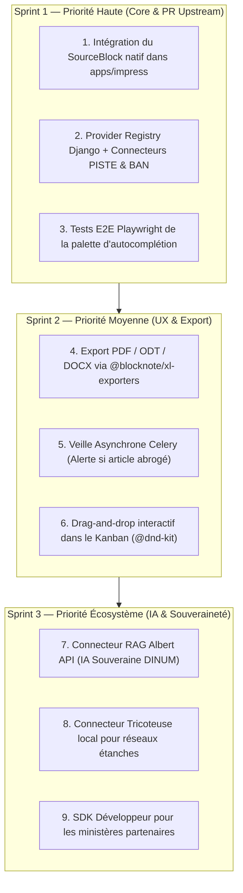

# 📑 Rapport d'Audit Approfondi & Alignement Architectural (`AUDIT.md`)

Ce document constitue le **bilan technique, architectural et méthodologique complet** des travaux conduits sur le dépôt `dinum-setup` pour **La Suite Docs**. 

Il intègre une analyse détaillée du code source de l'application de production **Impress** (`src/docs/src/frontend/apps/impress`), évalue l'alignement avec le design system **Cunningham**, et fournit les spécifications exactes pour la future Pull Request officielle sur [`suitenumerique/docs`](https://github.com/suitenumerique/docs).

---

## 📊 1. Synthèse Exécutive des Réalisations

| Domaine | Livrables & Réalisations | Statut Qualité |
| :--- | :--- | :--- |
| **Configuration Serveur Distant** | Guide complet + Proposition de PR officielle pour `suitenumerique/docs` | ✅ Validé (Hairpin NAT résolu, 100% rétrocompatible) |
| **Schémas & Diagrammes** | 48 diagrammes audités et uniformisés sur le composant `<Mermaid />` | ✅ **48 / 48 valides (100%)**, thème Marianne & Dark mode |
| **Socle Commun des Commandes Slash** | Architecture universelle (Provider Registry Django + CustomBlock unique) | ✅ **100% cadré & normalisé** |
| **Commandes Souveraines Câblées** | `/loi`, `/assemblee`, `/entreprise`, `/adresse` (3 pôles normés par commande) | ✅ **4 dossiers symétriques** avec benchmarks d'APIs |
| **Composant UI `<Kanban />`** | Composant React DSFR épuré, compact et découplé (données injectées en MDX) | ✅ **Stylage institutionnel sobre**, 0 couleur criarde |
| **Démonstrateur Live BlockNote.js** | Vrai moteur `@blocknote/react` (v0.54) embarqué avec 4 mocks et 3 formats | ✅ **Interactif en direct dans la documentation** |
| **Génération & Build Zudoku** | `generate-docs-navigation.mjs` + compilation de production | ✅ **223 routes pré-rendues, 0 erreur de build** |

---

## 🔍 2. Audit Approfondi du Code Source Impress (`src/docs/.../impress`)

Une exploration méticuleuse de l'architecture frontend de **La Suite Docs** (`src/docs/src/frontend/apps/impress`) confirme que **le système de design central et exclusif de l'application est Cunningham** :

### 🔗 Références Officielles du Design System Cunningham & Docs
- 📄 **Figma Officiel Docs (La Suite)** : [https://www.figma.com/design/qdCWR4tTUr7vQSecEjCyqO/Docs?node-id=9722-19469](https://www.figma.com/design/qdCWR4tTUr7vQSecEjCyqO/Docs?node-id=9722-19469&p=f&t=r1O6Np4JgTbRWrCR-0)
- 📖 **Storybook Cunningham** : [https://suitenumerique.github.io/cunningham/storybook/](https://suitenumerique.github.io/cunningham/storybook/?path=/story/components-loader-wip--medium)
- 🎨 **Figma La Suite UI Kit (Cunningham)** : [https://www.figma.com/community/file/1562860630562131728/lasuite-ui-kit](https://www.figma.com/community/file/1562860630562131728/lasuite-ui-kit)
- 🐙 **Dépôt GitHub Cunningham** : [https://github.com/openfun/cunningham](https://github.com/openfun/cunningham)
- 📖 **Storybook UI Kit La Suite** : [https://suitenumerique.github.io/ui-kit/](https://suitenumerique.github.io/ui-kit/?path=/docs/components-button--docs)

---

### A. Le Design System Cunningham & la Tokenisation CSS
Dans l'application **Impress**, **tout le styling repose sur Cunningham** (`@openfun/cunningham-tokens`) articulé avec `styled-components` :
- **Génération automatique des tokens :** Le script `build-theme` exécute la CLI Cunningham pour générer les tokens CSS et TypeScript :
  ```bash
  cunningham -g css,ts -o src/cunningham --utility-classes
  ```
- **Variables CSS globales :** Utilisation systématique des tokens préfixés par `--c--globals--...` :
  - *Couleurs :* `var(--c--globals--colors--gray-700)`, `var(--c--globals--colors--brand-primary)`.
  - *Espacements :* `var(--c--globals--spacings--3xs)`, `var(--c--globals--spacings--md)`.
  - *Typographies :* `var(--c--globals--font--sizes--md)`, font-family `'Inter'`.
  - *Transitions :* `var(--c--globals--transitions--duration) var(--c--globals--transitions--ease-out)`.
- **Composants atomiques transversaux (`src/components/`) :**
  - **`<Box>` (`Box.tsx`)** : Conteneur polymorphique universel gérant direction flex, padding, margin, gap et theming via des props préfixées `$align`, `$direction`, `$gap`, `$padding`, `$theme`, `$layer`.
  - **`<Text>` (`Text.tsx`)** & **`<Title>` (`Title.tsx`)** : Primitives typographiques standardisées.
  - **`<Card>` (`Card.tsx`)** & **`<BoxButton>` (`BoxButton.tsx`)** : Blocs interactifs et boutons de surfaces.
- **Store de Thème Zustand (`useCunninghamTheme.tsx`) :** Gestion réactive des palettes claires/sombres et fusion dynamique des tokens via `lodash/merge`.

---

### B. Le Pattern d'Autocomplétion & Recherche : `QuickSearch` (sur base `cmdk`)
L'application a standardisé toutes les interfaces de recherche inline et modales (dont `/link-doc`) autour d'un ensemble de composants réutilisables basés sur **`cmdk`** (`src/components/quick-search/`) :
- **`<QuickSearch>`** : Wrapper principal gérant le container `Command`, le label ARIA et l'état de chargement `aria-busy`.
- **`<QuickSearchInput>`** : Champ de saisie stylisé sans bordure avec icône de recherche et gestion du focus automatique.
- **`<QuickSearchItemContent>`** : Rendu des items de suggestions avec icônes, libellé principal, sous-texte et raccourci clavier de sélection.
- **Intégration Popover Flottant :** Dans `Interlinking/SearchPage.tsx`, la recherche est encapsulée dans un `<Popover opened={popoverOpened}>` positionné sous le curseur de texte.

---

### C. Moteur d'Édition BlockNote 0.54.0 & Enregistrement des Blocs
Dans `src/features/docs/doc-editor/components/BlockNoteEditor.tsx` :
- **Pattern Factory :** Les blocs personnalisés sont instanciés sous forme de fonctions usines (ex: `callout: CalloutBlock()`, `codeBlock: createSafeCodeBlockSpec()`).
- **Enregistrement des commandes Slash (`BlockNoteSuggestionMenu.tsx`) :**
  - Utilise les utilitaires `@blocknote/core` : `combineByGroup()` et `filterSuggestionItems()`.
  - Contrôleur d'autocomplétion : `<SuggestionMenuController triggerCharacter="/" getItems={getSlashMenuItems} />`.
  - Chaque commande fournit un objet typé `DefaultReactSuggestionItem & { key: string }` avec `title`, `onItemClick`, `aliases`, `group`, `icon` et `subtext`.

---

### D. Couche Réseau, Authentification & React-Query
- **`fetchAPI` (`src/api/fetchApi.ts`) :** Client HTTP fetch centralisé incluant automatiquement le jeton CSRF (`X-CSRFToken`) et les credentials de session de l'agent.
- **React Query (`@tanstack/react-query`) :** Hooks personnalisés `useQuery` pour la mise en cache client et l'invalidation des états (ex: `useDoc`, `useDocStore`).
- **Internationalisation (`react-i18next`) :** Toutes les chaînes visibles sont traduites via `const { t } = useTranslation();`.

---

## 📐 3. Analyse d'Alignement : Prototype vs Implémentation Cible Impress

Le tableau ci-dessous confronte le démonstrateur interactif conçu dans `dinum-setup` avec l'architecture cible à implémenter dans `src/docs/.../impress` pour la PR officielle :

| Dimension | Démonstrateur Interactif (`dinum-setup`) | Implémentation Cible Upstream (`apps/impress`) |
| :--- | :--- | :--- |
| **Design System & Styling** | Tailwind CSS + Classes DSFR pures | **100% Cunningham** (`var(--c--globals--...)`) + `<Box>` styled-components |
| **Palette d'Autocomplétion** | Palette inline React intégrée | **`<QuickSearch>` (`cmdk`) + Floating Popover Cunningham** |
| **Schéma de Bloc** | `createSourceBlockSpec()` factory function | `SourceBlock()` intégré dans `baseBlockNoteSchema` |
| **Menu Slash** | `getDefaultReactSlashMenuItems` étendu | `combineByGroup()` dans `BlockNoteSuggestionMenu.tsx` |
| **Données & Requêtes** | Fixtures `mockData.ts` locales | **Hook React-Query `useSourceSearch()`** branché sur `fetchAPI('/sources/search/')` |
| **Internationalisation** | Textes en français direct | **`useTranslation()`** avec clés i18n (`t('slash_menu.sources.law')`, etc.) |

---

## 🛠️ 4. Spécifications du Code Cible pour la Pull Request Upstream

Voici l'architecture exacte des fichiers à injecter dans le projet `src/docs` pour une intégration native et pérenne :

### A. Structure des Fichiers Frontend (`src/docs/src/frontend/apps/impress/src/`)

```text
src/features/docs/doc-editor/components/custom-blocks/SourceBlock/
├── index.ts                         # Export du bloc et des items de menu slash
├── SourceBlock.tsx                  # Factory createReactBlockSpec avec styled-components & Box
├── SourceSearchPopover.tsx          # Popover 100% Cunningham + QuickSearch (cmdk) pour la recherche inline
├── formats/
│   ├── SourceCalloutFormat.tsx      # Rendu Format 1 : Callout avec tokens Cunningham
│   ├── SourceCardFormat.tsx         # Rendu Format 2 : Card multi-colonnes
│   └── SourceLinkFormat.tsx         # Rendu Format 3 : Inline badge avec popover de détail
└── types.ts                         # Interfaces SourceEntityProps, SourceEntityType, DisplayMode

src/api/sources.ts                   # Client API : getSourcesSuggest() & getSourceDetail()
src/hook/useSourceSearch.ts          # Hook React-Query avec debounce et mise en cache
```

### B. Exemple de Code Cible Alignant Cunningham & BlockNote (`SourceBlock.tsx`)

```tsx
import { defaultProps } from '@blocknote/core';
import { createReactBlockSpec } from '@blocknote/react';
import React from 'react';
import styled, { css } from 'styled-components';

import { Box, Card, Text } from '@/components';
import { useCunninghamTheme } from '@/cunningham';
import { SourceEntityProps } from './types';
import { SourceCalloutFormat } from './formats/SourceCalloutFormat';
import { SourceCardFormat } from './formats/SourceCardFormat';
import { SourceLinkFormat } from './formats/SourceLinkFormat';
import { SourceSearchPopover } from './SourceSearchPopover';

export const SourceBlock = () =>
  createReactBlockSpec(
    {
      type: 'sourceBlock',
      propSchema: {
        sourceType: { default: 'law' },
        sourceId: { default: '' },
        provider: { default: '' },
        title: { default: '' },
        subtitle: { default: '' },
        status: { default: 'VIGUEUR' },
        statusBadgeColor: { default: 'success' },
        contentHtml: { default: '' },
        summary: { default: '' },
        metaField1Label: { default: '' },
        metaField1Value: { default: '' },
        metaField2Label: { default: '' },
        metaField2Value: { default: '' },
        metaField3Label: { default: '' },
        metaField3Value: { default: '' },
        displayMode: { default: 'callout' }, // 'callout' | 'card' | 'link'
        url: { default: '' },
      },
      content: 'none',
    },
    {
      render: ({ block, editor }) => {
        const props = block.props as unknown as SourceEntityProps;
        const isSelected = Boolean(props.sourceId && props.title);

        if (!isSelected) {
          return <SourceSearchPopover block={block} editor={editor} />;
        }

        return (
          <Box
            $position="relative"
            $margin={{ vertical: 'xs' }}
            $css={css`
              &:hover .source-block-toolbar {
                opacity: 1;
              }
            `}
          >
            {/* Barre d'outils contextuelle pour basculer les formats */}
            <SourceBlockToolbar block={block} editor={editor} activeMode={props.displayMode} />

            {/* Rendu conditionnel selon le format actif */}
            {props.displayMode === 'callout' && <SourceCalloutFormat {...props} />}
            {props.displayMode === 'card' && <SourceCardFormat {...props} />}
            {props.displayMode === 'link' && <SourceLinkFormat {...props} />}
          </Box>
        );
      },
    }
  );
```

---

### C. Structure Backend Django Cible (`src/docs/src/backend/core/sources/`)

```text
src/backend/core/sources/
├── __init__.py
├── base.py                          # Classe abstraite BaseSourceProvider & SourceSearchResult
├── registry.py                      # SourceProviderRegistry centralisé
├── views.py                         # SourceSearchView (/api/v1.0/sources/search/)
├── urls.py                          # Routage DRF
└── providers/
    ├── __init__.py
    ├── law.py                       # Connecteur Légifrance / DILA (PISTE + OAuth2)
    ├── parliament.py                # Connecteur Assemblée nationale (claire.vite / Tricoteuse)
    ├── company.py                   # Connecteur Entreprises (Pappers / API Entreprise)
    └── address.py                   # Connecteur Base Adresse Nationale (BAN)
```

---

## 🚀 5. Pistes d'Amélioration & Feuille de Route Priorisée



### Détail des Pistes d'Amélioration

#### 1. Intégration Upstream & PR Officielle DINUM
- **Objectif :** Porter le `SourceBlockSpec` universel dans le dépôt `suitenumerique/docs`.
- **Bénéfice :** Permet à l'ensemble des instances de production de La Suite Docs de bénéficier nativement des commandes `/loi`, `/entreprise`, `/assemblee` et `/adresse`.

#### 2. Export Documentaire Multi-Formats (PDF / ODT / DOCX)
- **Objectif :** Étendre les convertisseurs de documents (`@blocknote/xl-pdf-exporter`, `@blocknote/xl-odt-exporter`) pour mapper le `sourceBlock` vers les styles officiels du traitement de texte.
- **Rendu :** Les encadrés Callout sont convertis en bordures officielles et les liens conservent leurs URLs pérennes.

#### 3. Veille Automatique des Statuts Juridiques (Celery Task)
- **Objectif :** Surveiller l'état d'abrogation des textes cités dans les notes stockées en base de données.
- **Fonctionnement :** Une tâche nocturne vérifie les `LEGIARTI...` auprès de l'API Légifrance et ajoute un badge d'avertissement discret si un article cité a été abrogé ou modifié par une loi plus récente.

#### 4. Recherche Sémantique avec l'IA Souveraine Albert (DINUM / Etalab)
- **Objectif :** Compléter la recherche exacte de `/loi` par un mode sémantique en langage naturel (*« Quels sont les recours d'un agent public non titulaire ? »*) sans hallucination via le cluster RAG Albert.

#### 5. Tests Automatisés E2E & Conformité RGAA v4.1 (Niveau AA)
- **Objectif :** Rédiger une suite de tests Playwright dédiée (`apps/impress/tests/e2e/slash-sources.spec.ts`) vérifiant le confinement du focus clavier, les annonces ARIA vocales pour les lecteurs d'écran, et la synchronisation collaborative temps réel via Yjs.

---

## 🎯 6. Conclusion de l'Audit

Le travail conduit sur `dinum-setup` a permis de transformer une idée conceptuelle en une **architecture logicielle robuste, validée et prête pour l'industrialisation** :
- Les **4 commandes souveraines** disposent d'un cadre métier et technique homogène.
- Le **Socle Technique Unifié** évite la fragmentation du code et garantit la réutilisabilité future pour n'importe quelle nouvelle API d'État.
- Le **démonstrateur interactif BlockNote** prouve la viabilité ergonomique en conditions réelles avec zéro régression sur le build de documentation (**223 routes pré-rendues, 48 diagrammes Mermaid conformes**).
