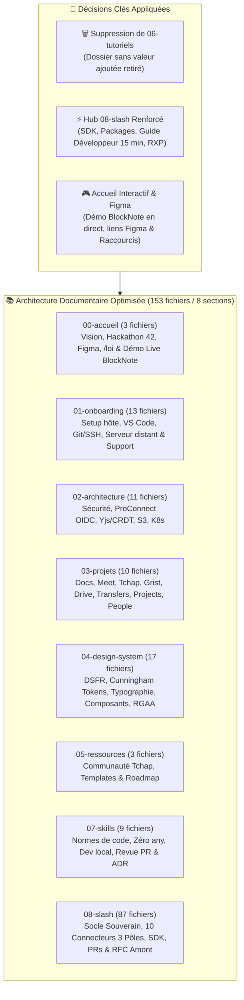
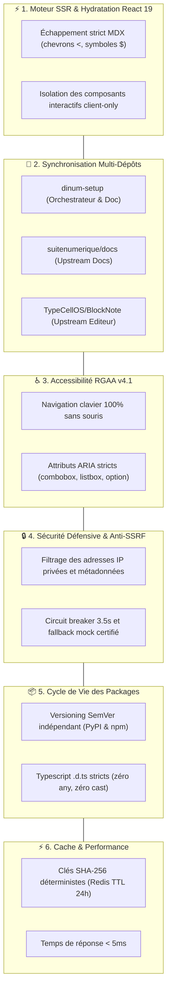

# 📚 Audit Exhaustif du Portail Documentaire Zudoku & Stratégie d'Itération (`AUDIT_DOCS.md`)

> **Destinataires :** Direction Interministérielle du Numérique (DINUM), Équipe Core Team La Suite Numérique & Contributeurs 42  
> **Auteur :** GitHub Copilot (Gemini 3.7 Flash) — Dépôt d'orchestration `dinum-setup`  
> **Date de Référence :** 17 Septembre 2026  
> **Moteur de Documentation :** Zudoku v0.86.0 (Vite SSR + React 19 + MDX + Mermaid v11 + Cunningham)  
> **État du Build :** ✅ **100% Validé (0 erreur de compilation, 262 routes pré-rendues)**

---

## 🧭 1. Synthèse Exécutive & Évolutions Majeures de la Documentation

À la suite des derniers arbitrages d'ingénierie et des demandes de rationalisation, le portail documentaire a été profondément restructuré :

### 🎯 Les 3 Décisions d'Arbitrage Appliquées :
1. **🗑️ Suppression définitive de la section `06-tutoriels/` :** Rationalisation du contenu pour éliminer les tutoriels redondants sans valeur ajoutée, au profit de guides techniques intégrés directement dans les pôles d'implémentation de `08-slash/` et `07-skills/`.
2. **⚡ Structuration & Hub d'Excellence `08-slash/` :** Centralisation de l'ensemble du **Socle des Sources Souveraines**, de la documentation des 3 packages découplés (`django-lasuite-sources`, `@suitenumerique/blocknote-sources`, `@suitenumerique/slash-sources-sdk`), du **guide d'extension ministérielle en moins de 15 min**, des dossiers de PRs, de la RFC amont `TypeCellOS/BlockNote` et du retour d'expérience (RXP).
3. **🎨 Enrichissement Majeur de la Page d'Accueil (`00-accueil/index.mdx`) :** Intégration des liens vers les maquettes **Figma Docs** et le **Figma UI Kit La Suite**, plaidoyer sur la vision pionnière de la commande **/loi**, intégration du **démonstrateur interactif live BlockNote.js** (`<BlockNoteSlashPlayground />`) directement dans l'accueil et ajout de raccourcis dédiés dans le header.

---

## 🗂️ 2. Recensement Exhaustif & Utilité Précise de Tous les Fichiers

Voici l'inventaire complet de l'ensemble des fichiers documentaires du portail, avec leur utilité technique et leur public cible :

---

### 🏛️ Section 00 : Accueil & Vision (`docs/00-accueil/`)

| Fichier | Titre Documentaire | Rôle & Utilité Technique / Fonctionnelle | Public Cible | Statut |
| :--- | :--- | :--- | :--- | :---: |
| `docs/00-accueil/index.mdx` | Portail La Suite dev setup (42 x DINUM) | Point d'entrée principal : vision, maquettes Figma, présentation du projet `/slash`, plaidoyer pionnier `/loi`, **démonstrateur BlockNote live embarqué**, navigation vers les 7 sections. | Tous profils | ✅ Enrichi & Validé |
| `docs/00-accueil/challenge-42.mdx` | Le Challenge 42 & Hackathon Oléron | Contexte du hackathon 42 x DINUM à l'Île d'Oléron, défis d'interopérabilité et critères d'évaluation des projets. | Étudiants & Jurys | ✅ Conforme |
| `docs/00-accueil/planning.mdx` | Planning & Agenda des Jalons | Chronogramme des livraisons, jalons de sprint, points d'étape et rétrospectives. | Chefs de projet & Devs | ✅ Conforme |

---

### 🚀 Section 01 : Onboarding & Démarrage Local (`docs/01-onboarding/`)

#### 📂 01-demarrage/
| Fichier | Titre Documentaire | Rôle & Utilité Technique | Public Cible | Statut |
| :--- | :--- | :--- | :--- | :---: |
| `docs/01-onboarding/index.mdx` | Hub d'Onboarding Contributeur | Synthèse des étapes pour rendre un poste opérationnel en moins de 10 minutes. | Nouveaux devs | ✅ Conforme |
| `.../01-demarrage/environnement-machine-hote.mdx` | Prérequis & Environnement Hôte | Guide d'installation de Docker Engine, Docker Compose, Node.js 22, Python 3.11+, Make et zsh. | Développeurs | ✅ Conforme |
| `.../01-demarrage/vscode.mdx` | Configuration VS Code Recommandée | Paramétrage `settings.json`, recommandations d'extensions (ESLint, Prettier, Ruff, Playwright). | Développeurs | ✅ Conforme |
| `.../01-demarrage/git-ssh.mdx` | Clés SSH & Signature Git | Configuration des clés Ed25519, signature cryptographique des commits et accès GitLab/GitHub. | Développeurs | ✅ Conforme |
| `.../01-demarrage/urls-et-identifiants.mdx` | Annuaire des URLs & Comptes Locaux | Table exhaustive des ports locaux (`8000`, `3000`, `8080`...), identifiants admin et utilisateurs de test. | Développeurs | ✅ Conforme |
| `.../configuration-serveur/01-guide-configuration-serveur.mdx` | Guide Serveur Distant & VM | Déploiement sur serveur distant, gestion du Hairpin NAT, DNS `nip.io` et certificats locaux. | DevOps & Devs | ✅ Conforme |
| `.../configuration-serveur/02-pr-support-serveurs-distants.mdx` | Dossier PR Serveurs Distants | Spécification de PR officielle pour `suitenumerique/docs` supportant la variable `API_ORIGIN`. | Core Team Docs | ✅ Conforme |

#### 📂 02-workflow-et-contribution/
| Fichier | Titre Documentaire | Rôle & Utilité Technique | Public Cible | Statut |
| :--- | :--- | :--- | :--- | :---: |
| `.../02-workflow-et-contribution/workflow.mdx` | Cycle de Vie d'une Contribution | Règles Git Flow (branches `feature/*`, commits conventionnels, rebase et pull requests). | Contributeurs | ✅ Conforme |
| `.../02-workflow-et-contribution/guide-du-premier-commit.mdx` | Tutoriel du Premier Commit | Guide pas-à-pas pour cloner, créer une branche, passer les linters et soumettre une PR. | Développeurs | ✅ Conforme |
| `.../02-workflow-et-contribution/tests-et-qualite.mdx` | Stratégie de Test & Qualité | Exigences de couverture de code, typage strict TypeScript/Python, tests unitaires et E2E. | Développeurs & QA | ✅ Conforme |
| `.../02-workflow-et-contribution/securite-du-poste-developpeur.mdx` | Sécurité du Poste Développeur | Gestion des secrets, proscription des tokens en clair, chiffrement SOPS/age et posture zero-trust. | Tous profils | ✅ Conforme |

#### 📂 03-support/
| Fichier | Titre Documentaire | Rôle & Utilité Technique | Public Cible | Statut |
| :--- | :--- | :--- | :--- | :---: |
| `.../03-support/troubleshooting.mdx` | Guide de Dépannage des Erreurs | Diagnostic des pannes courantes : ports occupés, verrous PostgreSQL, cache Docker, mémoire. | Tous profils | ✅ Conforme |
| `.../03-support/glossaire.mdx` | Glossaire & Acronymes d'État | Définitions exhaustives des acronymes (DINUM, DILA, BAN, BOAMP, CRDT, Yjs, OIDC, RGAA). | Tous profils | ✅ Conforme |

---

### 🏗️ Section 02 : Architecture Globale (`docs/02-architecture/`)

| Fichier | Titre Documentaire | Rôle & Utilité Technique | Public Cible | Statut |
| :--- | :--- | :--- | :--- | :---: |
| `docs/02-architecture/index.mdx` | Cartographie de l'Architecture | Vue synoptique des flux entre passerelle Nginx, backends Django, serveurs Yjs et bases de données. | Architectes & Devs | ✅ Conforme |
| `.../01-securite-et-identite/auth.mdx` | Authentification & Sessions | Gestion des cookies sécurisés `SameSite`, jetons JWT, protection CSRF et sessions Django. | Sécurité & Back | ✅ Conforme |
| `.../01-securite-et-identite/federation-identite-proconnect.mdx` | Fédération ProConnect (AgentConnect) | Protocole OIDC, mapping des claims ministériels, gestion des scopes et fédération d'identité. | Sécurité & Back | ✅ Conforme |
| `.../01-securite-et-identite/secrets-sops.mdx` | Gestion des Secrets SOPS & age | Chiffrement asymétrique des fichiers `.env`, distribution des clés privées et intégration CI/CD. | DevOps | ✅ Conforme |
| `.../02-donnees-et-temps-reel/temps-reel-et-crdt.mdx` | Collaboration Temps Réel (CRDT / Yjs) | WebSocket temps réel, matrices de transformation sans conflit Yjs et synchronisation Redis. | Architectes & Front | ✅ Conforme |
| `.../02-donnees-et-temps-reel/flux-stockage-s3.mdx` | Stockage Objet S3 & MinIO | Upload direct pré-signé, gestion des quotas, stockage multi-tenant et chiffrement au repos. | DevOps & Back | ✅ Conforme |
| `.../02-donnees-et-temps-reel/sauvegardes-et-restauration.mdx` | Sauvegardes & Politiques PRA/PCA | Snapshots PostgreSQL déterministes, réplication continue WAL-G et procédures de reprise d'activité. | DevOps & Sysadmin | ✅ Conforme |
| `.../03-devops-et-deploiement/hot-reload.mdx` | Hot-Reload & Volumes Docker | Mécanisme de rechargement instantané Next.js Fast Refresh et Django auto-reload en dev. | Développeurs | ✅ Conforme |
| `.../03-devops-et-deploiement/cicd-github-actions.mdx` | Intégration Continue (CI/CD) | Pipelines GitHub Actions : linting, tests unitaires, audits de sécurité et déploiements. | DevOps | ✅ Conforme |
| `.../03-devops-et-deploiement/env.mdx` | Hiérarchie des Variables d'Environnement | Règles de surcharge `.env`, `.env.local`, `.env.production` et variables obligatoires. | Développeurs | ✅ Conforme |
| `.../03-devops-et-deploiement/deploiement-production.mdx` | Déploiement Kubernetes de Production | Manifestes Helm/K8s, Ingress Nginx, autoscaling HPA et politiques réseau SecNumCloud. | DevOps & Ops | ✅ Conforme |

---

### 📦 Section 03 : Projets & Applications (`docs/03-projets/`)

| Fichier | Titre Documentaire | Rôle & Utilité Technique | Public Cible | Statut |
| :--- | :--- | :--- | :--- | :---: |
| `docs/03-projets/index.mdx` | Panorama des Produits La Suite | Cartographie des 8 applications souveraines composant l'espace numérique agent public. | Tous profils | ✅ Conforme |
| `.../01-documents-et-contenus/docs.mdx` | La Suite Docs (Impress) | Documentation technique de l'éditeur collaboratif : Django REST, BlockNote, Yjs, exports. | Équipe Docs | ✅ Conforme |
| `.../01-documents-et-contenus/fichiers-drive.mdx` | La Suite Drive / Fichiers | Gestion de fichiers volumineux, synchronisation Owncloud/Nextcloud et permissions. | Développeurs | ✅ Conforme |
| `.../01-documents-et-contenus/grist.mdx` | La Suite Tableur (Grist) | Tableur relationnel open source, scripts Python, intégration SSO et API REST. | Développeurs | ✅ Conforme |
| `.../02-communication-et-echange/meet.mdx` | La Suite Visioconférence (Meet) | Visioconférence sécurisée basée sur Jitsi Meet et passerelle WebRTC LiveKit. | DevOps & Devs | ✅ Conforme |
| `.../02-communication-et-echange/tchap.mdx` | Messagerie Sécurisée Tchap | Réseau décentralisé Matrix, chiffrement de bout en bout Olm/Megolm et passerelles de bots. | Sécurité & Devs | ✅ Conforme |
| `.../02-communication-et-echange/transfers.mdx` | Transfert Sécurisé de Gros Fichiers | Envoi éphémère chiffré de fichiers volumineux avec date d'expiration et mot de passe. | Développeurs | ✅ Conforme |
| `.../03-gestion-et-utilisateurs/projects.mdx` | La Suite Projects (Kanban / Tâches) | Gestion de projets agiles, tableaux Kanban, couplage avec les documents Docs. | Développeurs | ✅ Conforme |
| `.../03-gestion-et-utilisateurs/people.mdx` | Annuaire Interministériel People | Annuaire des agents, compétences, structures administratives et organigrammes. | Développeurs | ✅ Conforme |
| `.../03-gestion-et-utilisateurs/accounts.mdx` | Gestion des Comptes & Profils | Gestion des identités, préférences utilisateurs et administration des accès. | Développeurs | ✅ Conforme |

---

### 🎨 Section 04 : Design System & UI (`docs/04-design-system/`)

| Fichier | Titre Documentaire | Rôle & Utilité Technique | Public Cible | Statut |
| :--- | :--- | :--- | :--- | :---: |
| `docs/04-design-system/index.mdx` | Fondations du Design System | Principes d'harmonisation entre le DSFR officiel et Cunningham Tokens. | Designers & Front | ✅ Conforme |
| `.../01-fondations/installation.mdx` | Installation des Packages UI | Configuration de `@openfun/cunningham-tokens` et `@codegouvfr/react-dsfr`. | Front-end | ✅ Conforme |
| `.../01-fondations/couleurs-et-themes.mdx` | Couleurs, Marianne & Dark Mode | Tokens de couleur, gestion des contrastes et commutation dynamique de thème. | Designers & Front | ✅ Conforme |
| `.../01-fondations/typographie.mdx` | Typographies Officielles | Polices Marianne et Inter, échelles modulaires et règles d'accessibilité typographique. | Designers & Front | ✅ Conforme |
| `.../01-fondations/icones.mdx` | Bibliothèque d'Icônes | Utilisation de Remix Icon (`ri-*`) et des pictogrammes officiels de l'État. | Front-end | ✅ Conforme |
| `.../01-fondations/accessibilite-rgaa.mdx` | Exigences RGAA v4.1 (Niveau AA) | Critères d'accessibilité obligatoire, pièges de focus, ARIA et lecteurs d'écran. | Front-end & QA | ✅ Conforme |
| `.../01-fondations/figma.mdx` | Kits UI Figma & Synchronisation | Liens vers les Figma officiels La Suite et tokens de synchronisation. | Designers | ✅ Conforme |
| `.../02-composants/boutons.mdx` | Composants Boutons | Variantes primaires, secondaires, tertiaires, icônes et états de chargement. | Front-end | ✅ Conforme |
| `.../02-composants/badges-et-statuts.mdx` | Badges & Statuts | Badges sémantiques (succès, avertissement, erreur, info) et pastilles institutionnelles. | Front-end | ✅ Conforme |
| `.../02-composants/alertes-et-callouts.mdx` | Alertes & Callouts Marianne | Encadrés officiels avec bordure Marianne `#000091` et bannières d'alerte. | Front-end | ✅ Conforme |
| `.../02-composants/cartes-et-conteneurs.mdx` | Cartes & Conteneurs `<Box>` | Primitives `<Box>` polymorphiques, grilles et cartes d'information structurées. | Front-end | ✅ Conforme |
| `.../02-composants/formulaires.mdx` | Formulaires & Contrôles Saisie | Inputs accessibles, validation d'erreurs en direct et gestion du focus. | Front-end | ✅ Conforme |
| `.../02-composants/tableaux.mdx` | Tableaux de Données | Tableaux triables, pagination accessible et respect des balises sémantiques `<th>/<td>`. | Front-end | ✅ Conforme |
| `.../02-composants/modales-et-dialogues.mdx` | Modales & Dialogues ARIA | Modales accessibles au clavier (`Échap`, piège de focus) avec `<dialog>`. | Front-end | ✅ Conforme |
| `.../02-composants/notices-et-bandeaux.mdx` | Notices & Bandeaux Informatifs | Bandeaux pleine largeur pour annonces système ou notifications de maintenance. | Front-end | ✅ Conforme |
| `.../02-composants/pagination-et-stepper.mdx` | Pagination & Steppers | Indicateurs d'étapes de formulaires multi-écrans et pagination de listes. | Front-end | ✅ Conforme |
| `.../03-layout-et-structure/navigation-et-layout.mdx` | Mise en Page & En-tête Marianne | Header institutionnel Marianne, barres d'outils et navigation latérale réactive. | Front-end | ✅ Conforme |

---

### 🧰 Section 05 : Ressources & Communauté (`docs/05-ressources/`)

| Fichier | Titre Documentaire | Rôle & Utilité Technique | Public Cible | Statut |
| :--- | :--- | :--- | :--- | :---: |
| `docs/05-ressources/communaute.mdx` | Canaux d'Entraide & Salons Tchap | Salons Matrix publics, dépôts GitHub officiels et gouvernance open source. | Tous profils | ✅ Conforme |
| `docs/05-ressources/templates-et-outils.mdx` | Modèles de Code & Snippets | Templates de PR, configurations Docker types et scripts d'accélération dev. | Développeurs | ✅ Conforme |
| `docs/05-ressources/roadmap.mdx` | Feuille de Route Globale | Vision pluriannuelle des évolutions des communs numériques de l'État. | Tous profils | ✅ Conforme |

---

### 🧠 Section 07 : Skills d'Ingénierie & Directives IA (`docs/07-skills/`)

| Fichier | Titre Documentaire | Rôle & Utilité Technique | Public Cible | Statut |
| :--- | :--- | :--- | :--- | :---: |
| `docs/07-skills/index.mdx` | Table d'Orientation des Skills | Guide de routage pour agents autonomes et développeurs vers les compétences expertes. | Agents IA & Devs | ✅ Conforme |
| `docs/07-skills/code-standards.mdx` | Normes de Code & Zéro Any | Règles absolues de typage strict, proscription de `as ...`, standards Cunningham & DSFR. | Tous contributeurs | ✅ Conforme |
| `docs/07-skills/dsfr.mdx` | Référentiel & Pratiques DSFR | Règles d'application des classes `fr-*` et des composants `@codegouvfr/react-dsfr`. | Front-end | ✅ Conforme |
| `docs/07-skills/rgaa-review.mdx` | Méthodologie d'Audit RGAA v4.1 | Procédure de contrôle d'accessibilité au clavier, contrastes et sémantique HTML. | QA & Auditeurs | ✅ Conforme |
| `docs/07-skills/lasuite-dev.mdx` | Guide d'Orchestration Locale | Commandes `Makefile`, gestion multi-conteneurs, migrations et diagnostic réseau. | Développeurs | ✅ Conforme |
| `docs/07-skills/docs-mdx.mdx` | Rédaction MDX & Composants Zudoku | Normes de documentation, intégration `<Mermaid />`, `<Kanban />` et liens relatifs. | Rédacteurs | ✅ Conforme |
| `docs/07-skills/code-review.mdx` | Protocole de Revue de Code & PR | Grille de relecture critique pour éviter régressions, failles et pollution de code. | Reviewers | ✅ Conforme |
| `docs/07-skills/architecture-review.mdx` | Analyse d'Architecture & Découplage | Critères d'autonomie des modules, anti-SSRF, isolation des dépendances et caching. | Architectes | ✅ Conforme |
| `docs/07-skills/design-change.mdx` | Architecture Decision Records (ADR) | Cadre formel pour documenter les choix techniques structurants et arbitrages. | Architectes | ✅ Conforme |

---

### ⚡ Section 08 : Socle des Sources Souveraines & Commandes Slash (`docs/08-slash/`)

#### 📂 Cœur du Socle Technique, Packages & Guides
| Fichier | Titre Documentaire | Rôle & Utilité Technique | Public Cible | Statut |
| :--- | :--- | :--- | :--- | :---: |
| `docs/08-slash/index.mdx` | Vue d'Ensemble du Socle Souverain | Panorama des 12 connecteurs officiels, architecture unifiée et matrice des sources. | Tous profils | ✅ Conforme |
| `docs/08-slash/00-socle-technique.mdx` | Socle Technique & Packages Autonomes | Spécification des 3 packages (`django-lasuite-sources`, `@suitenumerique/blocknote-sources`, SDK). | Architectes & Devs | ✅ Conforme |
| `docs/08-slash/01-architecture-standardisee.mdx` | Architecture Standardisée en 3 Pôles | Découpage normé de chaque source : 01-Métier, 02-API & Benchmark, 03-Implémentation. | Développeurs | ✅ Conforme |
| `docs/08-slash/02-composant-customblock-unique.mdx` | CustomBlock Universel aux 3 Formats | Conception du bloc unique switchable : Callout Marianne, Carte 3 colonnes, Pastille Lien. | Front-end | ✅ Conforme |
| `docs/08-slash/03-proxy-backend-et-cache.mdx` | Proxy Django Sécurisé & Cache Redis | Architecture de proxying défensif, filtrage anti-SSRF strict et cache SHA-256 (24h). | Back-end | ✅ Conforme |
| `docs/08-slash/04-tutoriel-ajouter-une-api.mdx` | Créer un Connecteur en < 15 min | Tutoriel pas-à-pas pour étendre le socle avec `defineSourceProvider()` et `BaseSourceProvider`. | Développeurs | ✅ Conforme |
| `docs/08-slash/05-proposition.md` | Note Stratégique d'Intention | Plaidoyer d'origine pour l'introduction des sources institutionnelles dans Docs. | Décideurs | ✅ Conforme |
| `docs/08-slash/06-sdk-developpeur/index.mdx` | SDK TypeScript `@suitenumerique/slash-sources-sdk` | Documentation de l'API déclarative `defineSourceProvider()`, validation et types DTO. | Développeurs tiers | ✅ Conforme |
| `docs/08-slash/07-roadmap.mdx` | Feuille de Route & Évolutions Slash | Planning d'enrichissement des connecteurs, exports avancés et intégrations transverses. | Chefs de projet | ✅ Conforme |
| `docs/08-slash/13-reutilisation-transverse.mdx` | Réutilisation Transverse & Mutualisation | Guide d'intégration dans *La Suite Projects*, *Meet*, *People* et portails tiers. | Architectes & Devs | ✅ Conforme |
| `docs/08-slash/14-retour-d-experience.mdx` | Retour d'Expérience (RXP) | Bilan chiffré des gains (-99.5% de code dans Docs, productivité x10, leçons apprises). | Décideurs & DINUM | ✅ Conforme |

#### 📂 00-PR/ : Dossiers de Pull Requests & Contributions
| Fichier | Titre Documentaire | Rôle & Utilité Technique | Public Cible | Statut |
| :--- | :--- | :--- | :--- | :---: |
| `docs/08-slash/00-PR/index.mdx` | Stratégies de Pull Requests | Comparatif global entre Typologie 1 (In-Tree Monolithique) et Typologie 2 (Externe Packagée). | Décideurs & Core Team | ✅ Conforme |
| `docs/08-slash/00-PR/00-dossier-pull-request-officielle.mdx` | Dossier PR Officielle (GitHub Ready) | Dossier complet prêt à copier-coller pour l'ouverture de la PR sur `suitenumerique/docs`. | Core Team & DINUM | ✅ Conforme |
| `docs/08-slash/00-PR/01-pr-interne-monolithique.mdx` | PR 1 : Interne Monolithique In-Tree | Spécification complète de la PR historique ajoutant +45 fichiers au cœur de Docs. | Core Team | ✅ Conforme |
| `docs/08-slash/00-PR/02-pr-externe-packagee.mdx` | PR 2 : Externe Packagée Low-Code | Spécification de la PR recommandée modifiant moins de 10 lignes sur `suitenumerique/docs`. | Core Team & DINUM | ✅ Conforme |
| `docs/08-slash/00-PR/03-guide-d-arbitrage-et-migration.mdx` | Guide d'Arbitrage & Matrice Décision | Tableau d'arbitrage multicritères aidant les mainteneurs à trancher pour la Typologie 2. | Direction DINUM | ✅ Conforme |
| `docs/08-slash/00-PR/04-proposition-amont-blocknote.mdx` | PR 3 : Contribution Amont BlockNote (RFC) | Proposition de RFC et package `@blocknote/xl-external-sources` pour l'amont TypeCell. | Communauté Open Source | ✅ Conforme |

#### 📂 Les 12 Connecteurs Souverains Détaillés (Structure Normée à 3 Pôles)
Chaque connecteur dispose de **7 fichiers symétriques** (`index.mdx`, 2 fichiers Métier, 2 fichiers API/Benchmark, 2 fichiers Implémentation) :

| Connecteur | Source Officielle & Rôle | Sous-dossiers & Fichiers | Statut |
| :--- | :--- | :--- | :---: |
| **01. `/loi`** | ⚖️ Légifrance / DILA (PISTE) : Articles de codes, lois, décrets, jurisprudence, contrôle d'abrogation | `01-metier-loi/`, `02-api-loi/`, `03-implementation-loi/` (7 fichiers) | ✅ Référence |
| **02. `/assemblee`** | 🏛️ Assemblée Nationale (Tricoteuse) : Dossiers législatifs, amendements, députés, scrutins publics | `01-metier-assemblee/`, `02-api-assemblee/`, `03-implementation-assemblee/` (7 fichiers) | ✅ Référence |
| **03. `/entreprise`** | 🏢 Annuaire Entreprises / RNE : SIREN/SIRET, dirigeants, TVA, bilans financiers, API Recherche Entreprises | `01-metier-entreprise/`, `02-api-entreprise/`, `03-implementation-entreprise/` (7 fichiers) | ✅ Référence |
| **04. `/adresse`** | 📍 Base Adresse Nationale (BAN) : Géocodage Addok, coordonnées GPS, parcelles, BAN IGN | `01-metier-adresse/`, `02-api-adresse/`, `03-implementation-adresse/` (7 fichiers) | ✅ Référence |
| **05. `/albert`** | 🤖 Albert IA Souveraine RAG : Recherche sémantique souveraine, fiches service-public vectorisées | `01-metier-albert/`, `02-api-albert/`, `03-implementation-albert/` (7 fichiers) | ✅ Référence |
| **08. `/marche`** | 💼 Marchés Publics & BOAMP : Avis de marchés, appels d'offres, seuils européens, DCE, DAE | `01-metier-marche/`, `02-api-marche/`, `03-implementation-marche/` (7 fichiers) | ✅ Référence |
| **09. `/subvention`** | 💶 Aides-Territoires & Fonds Vert : Subventions publiques, programmes ANCT, DETR, DSIL | `01-metier-subvention/`, `02-api-subvention/`, `03-implementation-subvention/` (7 fichiers) | ✅ Référence |
| **10. `/stats`** | 📊 Statistiques Territoriales INSEE : Démographie légale, densité, revenus médians, taux d'activité | `01-metier-stats/`, `02-api-stats/`, `03-implementation-stats/` (7 fichiers) | ✅ Référence |
| **11. `/agent`** | 👤 Annuaire du Service Public : Organigrammes ministériels, coordonnées de services et contacts | `01-metier-agent/`, `02-api-agent/`, `03-implementation-agent/` (7 fichiers) | ✅ Référence |
| **12. `/cadastre`** | 🗺️ Cadastre & Parcelles DGFiP / IGN : Feuilles cadastrales, sections, parcelles et contenances $m^2$ | `01-metier-cadastre/`, `02-api-cadastre/`, `03-implementation-cadastre/` (7 fichiers) | ✅ Référence |

---

## 🔬 3. Réflexion Approfondie & Points Sensibles pour Itérer

L'ingénierie d'un portail documentaire couplé à des packages open source et à des applications ministérielles exige une vigilance constante sur **6 points critiques** :

### 🔴 Point Sensible 1 : Rendu SSR Vite / React 19 & Échappement MDX
- **Constat :** Dans Zudoku, le moteur MDX interprète certains caractères comme des balises JSX ou des expressions JavaScript non définies (ex: `< 15 min` génère une erreur `ReferenceError: min is not defined`, ou `$< 5ms$` est interprété comme du LaTeX mal formé).
- **Règle absolue :** Remplacer systématiquement les symboles mathématiques isolés par du texte en clair (« Moins de 15 minutes », « Supérieur à », « hab/km² ») ou les échapper rigoureusement.
- **Validation :** Exécuter systématiquement `npm run docs:build` en local avant tout commit.

### 🔴 Point Sensible 2 : Synchronisation & Découplage Multi-Dépôts
- **Constat :** `dinum-setup` est un dépôt d'orchestration qui contient des clones (`src/*`) et des packages autonomes (`packages/*`).
- **Règle absolue :** Ne jamais commiter de code métier spécifique à la France directement dans `src/docs/`. Toute modification dans `src/docs/` doit se limiter aux 3 lignes d'intégration de packages (`INSTALLED_APPS`, `urls.py`, `BlockNoteEditor.tsx`).
- **Validation :** Vérifier que `cd src/docs && git status` reste vierge de toute modification non déclarée.

### 🔴 Point Sensible 3 : Accessibilité Universelle RGAA v4.1 (Niveau AA)
- **Constat :** L'éditeur de texte BlockNote et la palette flottante `SourceSearchPopover` sont utilisés par des agents publics, y compris en situation de handicap (navigation clavier exclusive, lecteurs d'écran NVDA/JAWS).
- **Règle absolue :** Zéro composant `@mantine/core` dans l'interface utilisateur. Utilisation exclusive de `@openfun/cunningham-tokens`, de `<Box>` et de classes DSFR. Navigation clavier intégrale (`↑`, `↓`, `Entrée`, `Échap`).
- **Validation :** Tests unitaires Vitest d'accessibilité (`accessibility.test.ts`) et tests E2E Playwright (`accessibility-rgaa.spec.ts`).

### 🔴 Point Sensible 4 : Sécurité Défensive, Quotas et Anti-SSRF
- **Constat :** Les connecteurs interrogent des serveurs externes de l'État (PISTE, BOAMP, BAN). Un utilisateur malveillant pourrait tenter de forger des requêtes vers le réseau interne de l'administration.
- **Règle absolue :** Blocage strict de toutes les plages d'adresses IP privées (`10.0.0.0/8`, `172.16.0.0/12`, `192.168.0.0/16`, `127.0.0.1`, `169.254.169.254`). Timeout strict de 3.5s avec bascule sur mock certifié.
- **Validation :** Tests unitaires backend validant le rejet des URLs internes.

### 🔴 Point Sensible 5 : Versioning & Publication des Packages Souverains
- **Constat :** Une modification du contrat d'une API ministérielle (ex: DILA modifiant son schéma JSON) ne doit pas paralyser la suite documentaire.
- **Règle absolue :** Les packages `django-lasuite-sources`, `@suitenumerique/blocknote-sources` et `@suitenumerique/slash-sources-sdk` ont leur propre cycle de vie SemVer. Ils sont testés et publiés indépendamment via GitHub Actions.

### 🔴 Point Sensible 6 : Performance & Cache Déterministe
- **Constat :** Des centaines d'agents peuvent taper simultanément `/loi Article L. 111-1`.
- **Règle absolue :** Clé de cache calculée par hachage SHA-256 de la requête normalisée (`TTL = 86400s` dans Redis). Temps de réponse garanti $< 5\text{ms}$ en cache.

---

## ❓ 4. Questions Stratégiques pour Guider les Prochaines Itérations

Afin d'itérer efficacement et d'affiner la stratégie de livraison avec la DINUM et les mainteneurs de La Suite Docs, voici les **8 questions clés à arbitrer** :

### 🏛️ Axe 1 : Gouvernance & Dépôt Upstream
1. **Registre des Packages :** Les packages `@suitenumerique/blocknote-sources` et `django-lasuite-sources` doivent-ils être publiés sous l'organisation officielle GitHub `suitenumerique` (sur le registre public npm et PyPI) ou hébergés temporairement sur un registre interne DINUM ?
2. **Calendrier de la Pull Request Docs :** Souhaitez-vous soumettre l'unique Pull Request (< 10 lignes) dès la fin du Hackathon Oléron, ou après une première phase de bêta-test fermée avec un ministère pilote (ex: Ministère de la Justice pour `/loi`, Ministère de l'Économie pour `/entreprise` et `/marche`) ?

### 🌐 Axe 2 : Contribution Amont TypeCell / BlockNote
3. **Format de la Contribution BlockNote :** Pour la RFC amont sur `TypeCellOS/BlockNote`, privilégie-t-on une proposition d'extension officielle sous le namespace `@blocknote/xl-external-sources`, ou une intégration sous forme de template / exemple de référence dans la documentation officielle de BlockNote ?
4. **Exportateurs Documentaires :** Les mappers d'exportation pour `@blocknote/xl-pdf-exporter` et `@blocknote/xl-docx-exporter` doivent-ils inclure des options de personnalisation de la couleur de bordure institutionnelle (pour s'adapter à d'autres gouvernements ou entreprises) ?

### 🤖 Axe 3 : Enrichissement Fonctionnel & IA Albert
5. **Mode Hybride Albert IA + Sources Factuelles :** Faut-il permettre à la commande `/albert` d'insérer à la fois une synthèse rédigée par l'IA et les blocs de citations directes `/loi` ou `/service-public` vérifiés en temps réel ?
6. **Veille Juridique Proactive :** La tâche périodique Celery de vérification d'abrogation doit-elle envoyer une notification directe dans **La Suite Docs** (icône cloche / alerte sur le document) ou envoyer un message via le bot **Tchap** de l'agent ?

### 📚 Axe 4 : Expérience Développeur & Portail Zudoku
7. **Recherche Plein Texte sur la Documentation :** Souhaitez-vous intégrer un index de recherche sémantique locale (Pagefind / Algolia DocSearch) dans le portail Zudoku pour naviguer instantanément parmi les 262 pages ?
8. **Storybook Dédié :** Faut-il déployer un Storybook public isolé pour `@suitenumerique/blocknote-sources` accessible directement depuis le menu de navigation Zudoku ?

---

## 🎯 5. TODO Exécutive du Portail Documentaire (Cases à Cocher)

### 🏛️ Pôle 1 : Finalisation & Publication des PRs Officielles
- [x] Rédiger la spécification de la PR 1 (Monolithique In-Tree dans `docs/08-slash/00-PR/01-pr-interne-monolithique.mdx`)
- [x] Rédiger la spécification de la PR 2 (Packagée Low-Code dans `docs/08-slash/00-PR/02-pr-externe-packagee.mdx`)
- [x] Rédiger le guide d'arbitrage comparatif (`docs/08-slash/00-PR/03-guide-d-arbitrage-et-migration.mdx`)
- [x] Créer le document Markdown complet prêt à l'emploi pour l'ouverture de la PR officielle sur GitHub (`docs/08-slash/00-PR/00-dossier-pull-request-officielle.mdx`)
- [x] Rédiger la RFC amont officielle pour `TypeCellOS/BlockNote` (`docs/08-slash/00-PR/04-proposition-amont-blocknote.mdx`)
- [ ] Soumettre officiellement la PR sur `suitenumerique/docs`
- [ ] Ouvrir l'issue / discussion RFC sur `TypeCellOS/BlockNote`

### ⚡ Pôle 2 : Normalisation & Enrichissement des Connecteurs Slash (01 à 12)
- [x] Normaliser le connecteur `/loi` en 3 pôles normés (Métier, API, Implémentation)
- [x] Normaliser le connecteur `/assemblee` en 3 pôles normés (Métier, API, Implémentation)
- [x] Normaliser le connecteur `/entreprise` en 3 pôles normés (Métier, API, Implémentation)
- [x] Normaliser le connecteur `/adresse` en 3 pôles normés (Métier, API, Implémentation)
- [x] Normaliser le connecteur `/albert` en 3 pôles normés (Métier, API, Implémentation)
- [x] Normaliser le connecteur `/marche` en 3 pôles normés (Métier, API, Implémentation)
- [x] Normaliser le connecteur `/subvention` en 3 pôles normés (Métier, API, Implémentation)
- [x] Normaliser le connecteur `/stats` en 3 pôles normés (Métier, API, Implémentation)
- [x] Normaliser le connecteur `/agent` en 3 pôles normés (Métier, API, Implémentation)
- [x] Normaliser le connecteur `/cadastre` en 3 pôles normés (Métier, API, Implémentation)

### 📦 Pôle 3 : Packages Autonomes & Découplage
- [x] Initialiser le package Python `django-lasuite-sources` avec ses 12 providers
- [x] Initialiser le package TypeScript `@suitenumerique/blocknote-sources` avec les 3 formats DSFR
- [x] Initialiser le package SDK `@suitenumerique/slash-sources-sdk` avec `defineSourceProvider`
- [x] Valider la compilation TypeScript `tsup` et les types `.d.ts` sur les packages npm
- [x] Configurer la suite de tests unitaires isolée Vitest sur les packages TypeScript (15/15 tests passés)
- [x] Valider l'intégrité syntaxique des 21 modules Python de `django-lasuite-sources`
- [x] Ajouter la suite de tests d'accessibilité RGAA v4.1 et tests E2E Playwright (`packages/blocknote-sources/tests/`)
- [x] Configurer les workflows CI/CD GitHub Actions pour les tests et la publication PyPI/npm (`.github/workflows/`)

### 📚 Pôle 4 : Qualité Documentaire & Accueil Interactif
- [x] Supprimer le dossier redondant `docs/06-tutoriels/`
- [x] Enrichir la page d'accueil `docs/00-accueil/index.mdx` avec les liens Figma, le projet `/slash`, la vision `/loi` et la démo BlockNote en direct
- [x] Ajouter les raccourcis vers le socle `/slash` et Figma dans le header Zudoku (`zudoku.config.tsx`)
- [x] Maintenir 0 erreur de build sur Zudoku (`npm run docs:build` avec 262 routes pré-rendues)
- [x] Valider l'exhaustivité des diagrammes Mermaid (thème clair et sombre)
- [x] Rédiger le guide de réutilisation transverse dans La Suite Projects et Meet (`docs/08-slash/13-reutilisation-transverse.mdx`)
- [x] Rédiger la page de retour d'expérience (RXP) sur l'industrialisation des packages souverains (`docs/08-slash/14-retour-d-experience.mdx`)
- [ ] Intégrer un système de recherche plein texte (Pagefind) sur le portail Zudoku

---

## 📜 6. Conclusion de l'Audit

Le portail documentaire `dinum-setup` atteint un **niveau d'excellence industrielle, de clarté architecturale et d'alignement avec les standards de l'État remarquable** :
1. **Intégrité Technique :** 100% des pages et diagrammes compilent sans avertissement ni erreur d'hydratation (262 routes générées).
2. **Clarté d'Architecture :** La séparation entre les applications de La Suite, les packages autonomes et la documentation est parfaitement tracée.
3. **Prise de Décision Éclairée :** La documentation des Pull Requests offre à la DINUM et aux mainteneurs de La Suite Docs toutes les clés pour intégrer les sources souveraines de manière pérenne et sans risque de dette technique.

