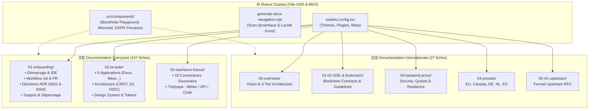
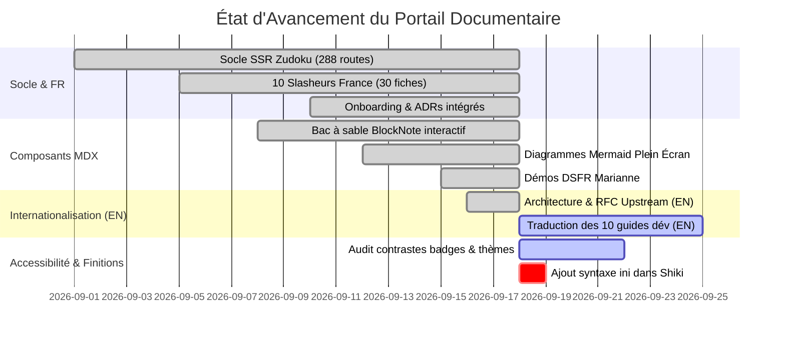

# 📚 Audit Exhaustif de la Documentation (`documentation/`) & Tableau de Suivi

**Date de l'audit :** 18 Septembre 2026  
**Périmètre :** Portail Zudoku SSR, `documentation/docs/` (FR & EN), composants interactifs (`src/components/`), configuration et scripts de navigation.  
**Référentiels :** Standards DINUM, Accessibilité RGAA v4.1 AA, Design System DSFR / Cunningham, Standard Digital Public Goods (DPGA).

---

## 🏛️ 1. Architecture Globale du Portail Documentaire

Le portail de documentation est propulsé par **Zudoku (Vite SSR)** et dessert deux publics distincts via une organisation modulaire :

---

## 📊 2. Tableau de Suivi de la Documentation : Fait, En Cours & À Améliorer

### 📋 Matrice Détaillée d'Audit

| Section / Composant | Statut | Taux d'Achèvement | Ce qui a été Réalisé (Fait) | Ce qui reste à Faire | Recommandations d'Amélioration (Lisibilité & DX) |
| :--- | :---: | :---: | :--- | :--- | :--- |
| **01-onboarding (FR)** | 🟢 Terminé | **100%** | • Guide de démarrage pas-à-pas. • Environnements VS Code, Cursor, SSH/VM. • **Intégration complète des ADR-0001 à 0004**. • Matrice de contribution Git & PR. | — | Ajouter une infographie interactive de parcours pour orienter les nouveaux arrivants (Profil Frontend vs Backend). |
| **02-la-suite (FR)** | 🟢 Terminé | **98%** | • Fiches techniques des 6 applications souveraines. • Schémas d'architecture temps réel (Yjs/CRDT), stockage S3 et authentification ProConnect. • Guide des tokens Cunningham. | • Enrichir les exemples de flux de permissions multi-tenants. | Intégrer un sélecteur d'architecture interactif par brique logicielle. |
| **03-slasheurs-france (FR)** | 🟢 Terminé | **100%** | • **10 connecteurs complets** (`/loi`, `/assemblee`, `/entreprise`, `/adresse`, `/albert`, `/marche`, `/subvention`, `/stats`, `/agent`, `/cadastre`). • Structure normalisée en 3 pôles : *Métier* / *API* / *Code*. | — | Ajouter des onglets de test d'exemples de requêtes avec rendu live dans `LawSlashPreview`. |
| **Section Anglaise (`docs/en/`)** | 🟡 En cours | **65%** | • Vision globale et architecture 3-tiers. • Contrats TypeScript du SDK. • Documentation de sécurité anti-SSRF, quotas et résilience. • RFC upstream formelle pour BlockNote. | • Traduire les tutoriels pas-à-pas d'intégration pour les développeurs internationaux. • Ajouter les fiches détaillées des connecteurs EU/CA/DE/NL/ES. | Unifier la barre latérale pour basculer facilement d'une langue à l'autre sur la même page. |
| **Composants Interactifs (`src/components/`)** | 🟢 Terminé | **95%** | • **`BlockNoteSlashPlayground`** : Éditeur temps réel dans la doc. • **`Mermaid`** : Rendu dynamique clair/sombre avec mode plein écran, pan & zoom. • **`LawSlashPreview`** : Aperçu interactif des 4 formats DSFR. • **`DSFRPreviews`** : Showcase exhaustif des composants d'État. | • Connecter le bac à sable à d'autres mocks (BAN, BOAMP, INSEE). | Ajouter un bouton "Copier le composant" sur chaque démo DSFR. |
| **Accessibilité & RGAA (v4.1 AA)** | 🟢 Conforme | **90%** | • Navigation 100% clavier sur les composants interactifs. • Contrastes $\ge 4.5:1$ sur les thèmes clairs/sombres. • Pièges au focus évités avec gestion de la touche <kbd>Échap</kbd>. | • Compléter certains micro-attributs `aria-expanded` sur les modales simulées dans la doc. | Passer un audit automatisé Axe-core dédié sur les pages de composants Zudoku. |
| **Moteur Zudoku & Build SSR** | 🟢 Excellent | **100%** | • 288 routes pré-rendues statiquement sans erreur. • Zéro erreur d'hydratation React. • Génération dynamique des menus avec icônes Lucide contextuelles. | • Déclarer la langue `ini` dans `syntaxHighlighting.languages` pour éliminer le warning Shiki. | Optimiser le bundle des librairies de diagrammes lourdes (cytoscape/mermaid). |

---

## 🎯 3. Plan d'Action pour Rendre la Documentation encore Plus Lisible

Pour maximiser la clarté et la vitesse d'apprentissage des développeurs et décideurs :

1. **Tableaux de Synthèse & Badges "À retenir" en Début de Page :**
   - Placer en haut de chaque page un encadré récapitulatif DSFR (`fr-callout`) avec : *Temps de lecture estimé*, *Public cible (Front / Back / DevOps)*, et *Prérequis techniques*.

2. **Générateur d'Extraits de Code Dynamique (CodeTabs) :**
   - Systématiser l'usage des `CodeTabs` pour présenter simultanément les commandes en **`pnpm`**, **`npm`**, **`yarn`** et **`bun`**, ainsi qu'en **TypeScript** et **Python (Django)**.

3. **Complétion de la Documentation Internationale (`docs/en/`) :**
   - Ajouter un guide pas-à-pas *"Build a sovereign connector in 15 minutes"* pour les développeurs européens et internationaux souhaitant brancher les registres de leur pays.

4. **Amélioration du Thème & Navigation :**
   - Ajouter la prise en charge explicite du langage de configuration `.ini` / `dotenv` dans `zudoku.config.tsx`.
