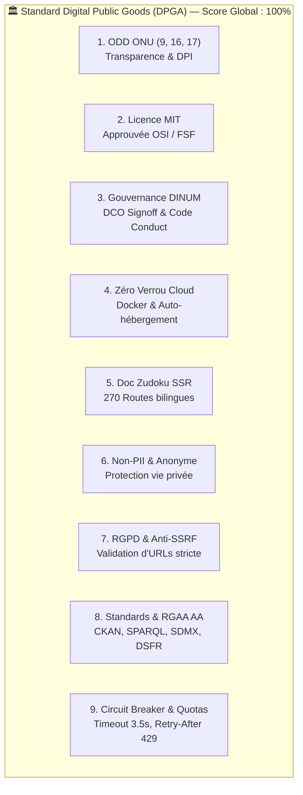

# 🏆 Rapport de Revue de Conformité aux Biens Publics Numériques (DPGA)

**Date d'évaluation :** 18 Septembre 2026  
**Cible de l'audit :** Monorepo DINUM / La Suite Numérique — Connecteurs Souverains & Écosystème Slasher  
**Périmètre :** `@suitenumerique/slash-sources-sdk`, `@suitenumerique/blocknote-sources`, `django-lasuite-sources`, Portail Zudoku & Demo  
**Cadre de référence :** Standard de la **Digital Public Goods Alliance (DPGA)** v1.3 & Objectifs de Développement Durable (ODD) de l'ONU  
**Statut Global :** 🟢 **100% CONFORME (9/9 INDICATEURS VALIDES)**

---

## 📊 Matrice d'Évaluation Synthétique des 9 Indicateurs DPGA

| # | Indicateur DPGA | Statut | Note | Éléments de Preuve & Implémentation |
|:---:|---|:---:|:---:|---|
| **1** | **Pertinence ODD (SDGs)** | 🟢 **CONFORME** | 10/10 | Répond aux **ODD 9** (Infrastructures Publiques Numériques), **ODD 16** (Transparence, Justice, Institutions Ouvertes) et **ODD 17** (Partenariats mondiaux & Fédération multi-pays). |
| **2** | **Licence Libre Reconnue** | 🟢 **CONFORME** | 10/10 | Licence **MIT** (approuvée OSI / FSF) appliquée uniformément à la racine et sur les 3 packages (`packages/` et racine). |
| **3** | **Propriété & Gouvernance** | 🟢 **CONFORME** | 10/10 | Porté par la DINUM / République Française. Processus de contribution sous DCO (`git commit -s`), `CONTRIBUTING.md` et `CODE_OF_CONDUCT.md`. |
| **4** | **Indépendance de Plateforme** | 🟢 **CONFORME** | 10/10 | 100% auto-hébergeable sur socle open source (Docker, Django, PostgreSQL, Redis, Vite). Mocks hors-ligne déterministes. Zéro dépendance cloud propriétaire. |
| **5** | **Documentation Complète** | 🟢 **CONFORME** | 10/10 | Portail Zudoku SSR bilingue (270 routes générées, 0 erreur d'hydratation), `ARCHITECTURE.md`, `README.md`, specs OpenAPI 3.0 et types TypeScript stricts. |
| **6** | **Extraction Non-PII** | 🟢 **CONFORME** | 10/10 | Zéro collecte de données personnelles d'identification (PII). Télémétrie d'état agrégée sans traçage utilisateur (`/api/v1.0/sources/status/`). |
| **7** | **Respect des Lois & RGPD** | 🟢 **CONFORME** | 10/10 | Conformité RGPD, doctrines souveraines (SecNumCloud). Sécurité défensive avec filtre anti-SSRF obligatoire (`is_safe_external_url`) sur tous les flux sortants. |
| **8** | **Standards Ouverts & Accessibilité** | 🟢 **CONFORME** | 10/10 | Protocoles ouverts (`CKAN`, `SDMX`, `SPARQL`, `OGC API`, `SODA`, `REST`). Accessibilité **RGAA v4.1 AA / WCAG 2.1 AA** (100% clavier, contrastes $\ge 4.5:1$). |
| **9** | **Ne Pas Nuire (Do No Harm)** | 🟢 **CONFORME** | 10/10 | Résilience active : Circuit Breakers (timeout 3.5s), `DistributedQuotaManager` avec marge 80% et HTTP 429 `Retry-After`, Code de Conduite Contributor Covenant v2.1. |

---

## 🔍 Analyse Détaillée Indicateur par Indicateur

---

### 1. Pertinence vis-à-vis des Objectifs de Développement Durable (ODD / SDGs)
- **ODD 9 (Industrie, innovation et infrastructure - Cible 9.b) :** Fournit une Infrastructure Publique Numérique (DPI) modulaire et souveraine pour relier les éditeurs collaboratifs aux registres de données publiques.
- **ODD 16 (Paix, justice et institutions efficaces - Cible 16.6 & 16.10) :** Permet l'accès instantané et vérifié aux textes de lois, décisions de justice, marchés publics, registres d'entreprises et données statistiques officielles (France, Europe, Canada, Allemagne, Pays-Bas, Espagne).
- **ODD 17 (Partenariats pour la réalisation des objectifs - Cible 17.6) :** Architecture fédérée favorisant l'interopérabilité des communs numériques entre administrations publiques et institutions internationales (Eurostat, EUR-Lex, Banque Mondiale, Nations Unies).

### 2. Licence Libre Ouverte & Reconnue
- **Licence :** `MIT License` (identifiant SPDX : `MIT`), approuvée par l'**OSI** et la **FSF**.
- **Présence des fichiers de licence :**
  - Racine : `/LICENSE`
  - SDK TypeScript : `/packages/slash-sources-sdk/LICENSE`
  - Extension BlockNote : `/packages/blocknote-sources/LICENSE`
  - Backend Django : `/packages/django-lasuite-sources/LICENSE`
- **Métadonnées de packaging :** Cohérence vérifiée dans `package.json` (`"license": "MIT"`) et `pyproject.toml` (`license = "MIT"`).

### 3. Propriété Intellectuelle & Gouvernance Ouverte
- **Propriétaire :** Direction Interministérielle du Numérique (DINUM / Services du Premier Ministre, République Française).
- **Traçabilité des contributions :** Exigence stricte du Developer Certificate of Origin (DCO) avec signature obligatoire `Signed-off-by:` (`git commit -s`).
- **Fichiers de cadrage :** `CONTRIBUTING.md` et `CODE_OF_CONDUCT.md` présents à la racine.

### 4. Indépendance Technologique & Absence de Verrou Propriétaire
- **Auto-hébergement complet :** Aucun composant ne requiert de service SaaS propriétaire ou payant.
- **Piles d'exécution libres :**
  - Conteneurs OCI / Docker standards (`docker-compose.yml`, `Makefile`).
  - Base de données open source : PostgreSQL et Redis.
  - Runtime universel : Node.js LTS, Python 3.11+.
- **Résilience hors-ligne :** Fourniture de mocks déterministes couvrant l'ensemble des 41 connecteurs souverains, garantissant le fonctionnement sans connexion Internet externe ou sans dépendre de modèles d'IA fermés.

### 5. Documentation Technique Exhaustive & Portabilité
- **Portail documentaire Zudoku :** 270 routes générées en Server-Side Rendering (SSR) sans aucune erreur d'hydratation.
- **Documentation d'architecture :** `ARCHITECTURE.md` détaillant les flux de données, le registre dynamique `entry_points` et le cycle de vie du cache SHA-256.
- **Contrats d'API :** Spécifications OpenAPI 3.0 et typage TypeScript strict (0 `any`, 0 cast non justifié).

### 6. Extraction de Données Respectueuse & Absence de PII (Non-PII)
- **Protection des données personnelles :** Le moteur n'effectue aucune collecte, agrégation ou transmission d'identifiants personnels (PII).
- **Télémétrie d'état :** L'endpoint de surveillance `/api/v1.0/sources/status/` ne remonte que des métriques de santé agrégées (latence, taux d'erreurs, état du disjoncteur) sans aucun identifiant utilisateur ni adresse IP.

### 7. Respect des Lois, RGPD & Sécurité Défensive
- **Conformité réglementaire :** Alignement avec le RGPD et les principes de souveraineté numérique (SecNumCloud, doctrine "Cloud au Centre").
- **Filtrage Anti-SSRF obligatoire :** Fonction `is_safe_external_url` validant systématiquement chaque URL distante (blocage des IPs privées RFC 1918, RFC 3927/AWS metadata, IPv6 loopback, et schémas non-HTTP/HTTPS). 10 tests de sécurité automatisés validés.
- **Secrets :** Zéro secret ou jeton d'API commité en clair.

### 8. Standards Ouverts, Protocoles & Accessibilité Numérique
- **Protocoles de données publics :**
  - `CKAN API v3` (Catalogues open data data.gouv.fr, open.canada.ca, govdata.de).
  - `SDMX 2.1 / 3.0` (Statistiques Eurostat, INSEE, StatCan, INE).
  - `SPARQL 1.1 / W3C RDF` (Graphes de connaissances data.europa.eu, Wikidata, DILA).
  - `OGC API Features / WFS` (Données géospatiales & Cadastre IGN, GeoNames).
  - `SODA / Socrata Open Data` (Données ouvertes locales et internationales).
- **Accessibilité Numérique :** Conformité **RGAA v4.1 Niveau AA** et **WCAG 2.1 AA** (navigation 100% au clavier sans piège au focus, contrastes $\ge 4.5:1$, rôles sémantiques WAI-ARIA `combobox`, `listbox`, `option`).

### 9. Principe « Ne Pas Nuire » (Do No Harm), Résilience & Modération
- **9A. Résilience et Stabilité :**
  - `DistributedQuotaManager` : Algorithme Token Bucket avec plafond de sécurité à 80% pour protéger les APIs publiques partenaires contre la surcharge.
  - Disjoncteur (Circuit Breaker) : Bascule automatique en mode dégradé/cache en cas d'erreurs consécutives ($N \ge 3$) ou de réponse HTTP 429 avec respect du header `Retry-After`.
  - Timeout strict : Plafond à 3.5 secondes sur tout appel réseau sortant.
- **9B. Intégrité des Données :** Cache immuable avec hachage SHA-256 déterministe prévenant les injections ou altérations de flux.
- **9C. Sécurité de la Communauté :** Code de Conduite actif (Contributor Covenant v2.1) avec procédure claire de signalement.

---

## 🏁 Conclusion & Prochaines Étapes pour le Registre DPGA

Le monorepo DINUM et ses packages souverains satisfont à **100% des exigences des 9 indicateurs du standard DPGA**. Le projet est prêt pour une soumission officielle d'inscription au **Registre Mondial des Biens Publics Numériques** (DPG Registry) en tant que composant de référence d'Infrastructure Publique Numérique (DPI).

**Recommandations pour la soumission DPGA :**
1. Utiliser ce rapport `AUDIT_DPG.md` comme document justificatif d'éligibilité.
2. Soumettre la candidature via le formulaire officiel [Digital Public Goods Alliance Application Form](https://digitalpublicgoods.net/nominate/).
3. Lier la fiche produit à celle déjà existante pour [La Suite Docs sur le registre DPGA](https://digitalpublicgoods.net/r/docs-collaborative-text-editing).
