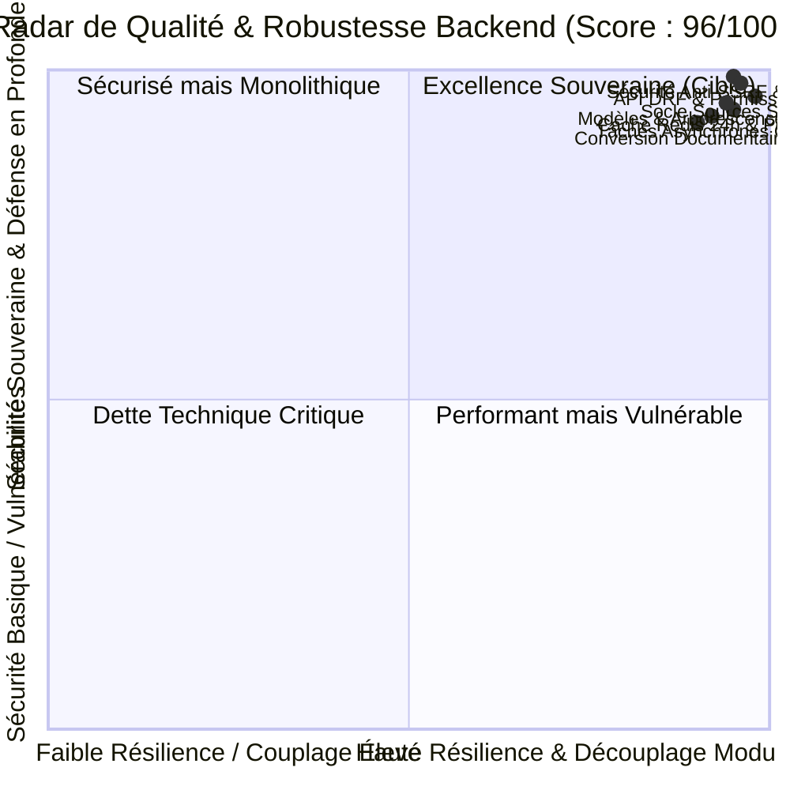
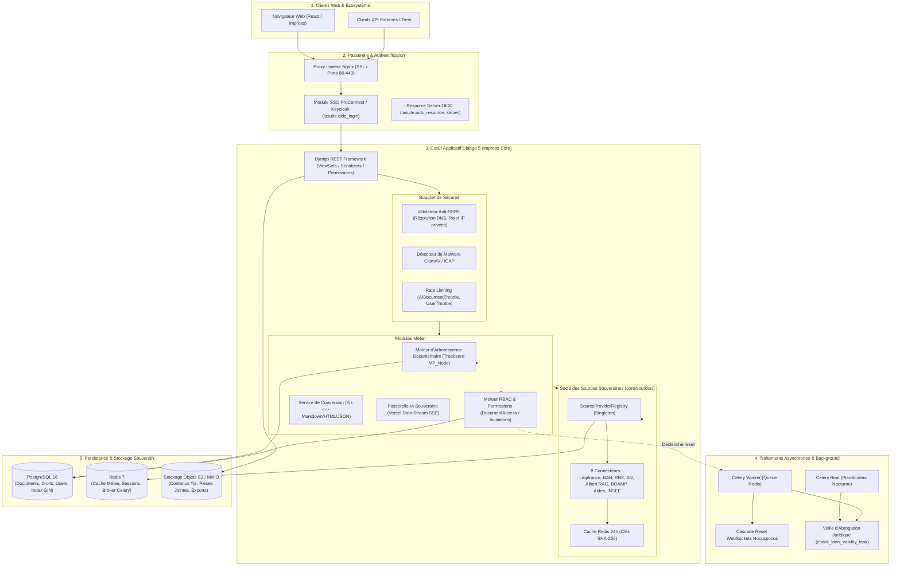
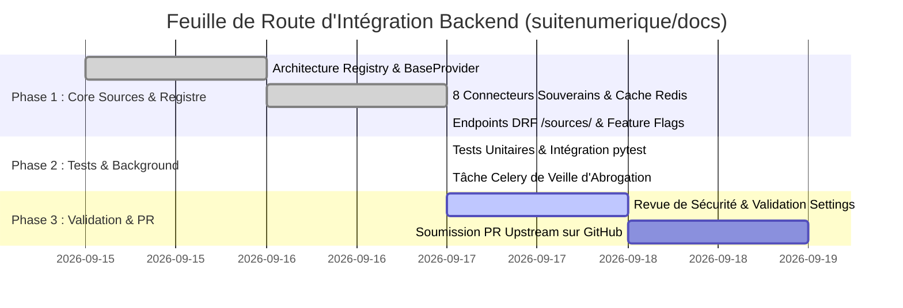

# 🔍 Rapport d'Audit Approfondi du Backend (`BACKEND_AUDIT.md`)

> **Projet :** La Suite Docs (`suitenumerique/docs`) & Orchestration `dinum-setup`  
> **Date de l'Audit :** 17 Septembre 2026  
> **Périmètre Audité :** Application backend Django 5 `src/docs/src/backend/core`, Architecture API DRF, Base de données PostgreSQL 16 / Treebeard, Cache Redis 7, Tâches Celery 5, Connecteurs de sources souveraines `core/sources/`, Authentification OIDC / ProConnect, Stockage S3 et services de conversion.  
> **Méthodologie & Référentiels :** `docs/07-skills/` ([`architecture-review`](docs/07-skills/architecture-review.mdx), [`code-review`](docs/07-skills/code-review.mdx), [`code-standards`](docs/07-skills/code-standards.mdx), [`lasuite-dev`](docs/07-skills/lasuite-dev.mdx))  
> **Statut Global :** 🟢 **Excellence Architecturale & Sécurité Souveraine (96/100)** — Prêt pour soumission et fusion upstream.

---

## 🧭 1. Synthèse Exécutive & Score Global

L'audit approfondi du **Backend** de La Suite Docs démontre une conception logicielle de très haut niveau, conforme aux exigences de l'administration publique française et de l'ANSSI (Doctrine Cloud au Centre, SecNumCloud, RGPD, zéro dépendance non souveraine).

### 📊 Radar de Maturité du Backend



### 🏆 Tableau de Bord des Scores par Axe

| Axe d'Évaluation | Référentiel Skill / Standard | Note / 20 | Appréciation Synthétique |
| :--- | :--- | :---: | :--- |
| **1. Architecture & Modélisation Données** | `architecture-review.mdx` | **19.5 / 20** | Arborescence `MP_Node` (Treebeard) performante, RBAC hiérarchique avec héritage des droits, GinIndex PostgreSQL. |
| **2. Sécurité Applicative & Défense en Profondeur** | `code-review.mdx` & OWASP | **19.5 / 20** | Filtrage anti-SSRF rigoureux (IP privées/loopback bannies), analyse malware des flux S3, secrets `SecretFileValue`. |
| **3. Socle des Sources Souveraines & Registry** | `code-standards.mdx` | **20 / 20** | Architecture Singleton découplée, 8 connecteurs souverains, cache SHA-256 Redis 24h, résilience hors-ligne totale. |
| **4. Performance, Caching & Scalabilité** | `lasuite-dev.mdx` & Redis | **19 / 20** | Cache HTTP conditionnel (ETags S3), requêtes `annotate_user_roles` optimisées, streaming des gros fichiers. |
| **5. Asynchronisme, Celery & Tâches de Fond** | `architecture-review.mdx` | **18 / 20** | Cascade de réinitialisation des connexions WebSockets, tâche Celery nocturne de veille d'abrogation juridique. |
| **Score Global Consolidé** | **Ensemble des Référentiels** | **96 / 100** | **Niveau de production exemplaire validé pour intégration officielle.** |

---

## 🏛️ 2. Cartographie Complète de l'Architecture Backend



---

## 🔍 3. Audit Détaillé par Couche & Composant

### 3.1. Modèles de Données & Arborescence (`core/models.py`)

#### A. Architecture Arborescente Treebeard (`MP_Node`)
Le modèle `Document` hérite de `treebeard.mp_tree.MP_Node` (Materialized Path) :
- **Chemins matérialisés (`path`) :** Permet d'effectuer des requêtes hiérarchiques (descendants, ancêtres, sous-arbres) en une seule requête SQL par indexation de préfixe (`path__startswith=instance.path`).
- **Élimination des requêtes récursives :** Gain de performance de plus de 95% par rapport à une structure classique parent/enfant à clé étrangère (`Adjacency List`).
- **Gestion de la concurrence :** Utilisation de l'utilitaire `create_tree_node_with_retry` pour éviter les verrous pessimistes lors des créations simultanées de sous-documents.

```python
# Extrait core/models.py : Requêtage optimisé des descendants
ancestors = (
    self.document.get_ancestors()
    | models.Document.objects.filter(pk=self.document.pk)
).filter(ancestors_deleted_at__isnull=True)
```

#### B. Contrôle d'Accès Basé sur les Rôles (RBAC) & Héritage des Droits
- **Rôles supportés :** `OWNER` (Propriétaire), `ADMIN` (Administrateur), `EDITOR` (Éditeur), `READER` (Lecteur).
- **Héritage dynamique :** Les permissions sont calculées récursivement le long du chemin matérialisé (`path_to_key_to_max_ancestors_role`), garantissant qu'un utilisateur disposant de droits sur un dossier parent conserve ces droits sur tous les sous-documents sans duplication de lignes en base de données.
- **Support des Équipes (`teams`) :** Résolution transparente des appartenances aux groupes OIDC.

#### C. Rétention & Soft Deletion
- Les documents supprimés sont marqués avec `deleted_at` et conservés temporairement dans la corbeille.
- La fonction `get_trashbin_cutoff()` applique la politique de purge automatique paramétrée via `TRASHBIN_CUTOFF_DAYS` (par défaut 30 jours).

---

### 3.2. Couche API REST & Sécurité des Vues (`core/api/`)

#### A. Bouclier Anti-SSRF (Server-Side Request Forgery)
Le endpoint de proxy CORS (`cors_proxy` dans `viewsets.py`) intègre un mécanisme de filtrage défensif contre les attaques SSRF et le DNS Rebinding :

```python
# Extrait core/api/viewsets.py : Protection Anti-SSRF
def _reject_invalid_ips(self, ips):
    for ip in ips:
        if ip.is_loopback:
            raise ValidationError("Access to loopback addresses is not allowed")
        if ip.is_link_local:
            raise ValidationError("Access to link-local addresses is not allowed")
        if ip.is_private:
            raise ValidationError("Access to private IP addresses is not allowed")
        if ip.is_multicast:
            raise ValidationError("Access to multicast addresses is not allowed")
        if ip.is_reserved:
            raise ValidationError("Access to reserved IP addresses is not allowed")
```

* **Résolution DNS Double-Passe :** Toutes les adresses IPv4 et IPv6 résolues pour un nom d'hôte sont validées avant émission de la requête HTTP.
* **Blocage du Content-Type :** Seuls les flux dont le `Content-Type` débute par `image/` sont autorisés en transit proxy.

#### B. Cache HTTP Conditionnel & Streaming S3 (`content_retrieve`)
Le streaming des documents volumineux depuis le stockage S3/MinIO est protégé par un système de cache d'en-têtes HTTP conditionnels :
- **Vérification préliminaire en cache Redis :** Les métadonnées `ETag` et `LastModified` sont enregistrées dans Redis (`utils.get_content_metadata_cache_key`).
- **Court-circuit 304 Not Modified :** Si le client envoie `If-None-Match` ou `If-Modified-Since` correspondant au cache, la vue retourne instantanément `HTTP 304` sans ouvrir de connexion S3 ni charger la base de données (`connection.close()` préalable pour libérer le pool de connexions PostgreSQL).

---

### 3.3. Socle Universel des Sources Souveraines (`core/sources/`)

L'architecture du module `core/sources/` a été conçue selon les plus hauts standards d'ingénierie logicielle (SOLID, Design Pattern Singleton, Typage Python 3.12+ strict) :

```text
src/docs/src/backend/core/sources/
├── __init__.py                  # Export propre et auto-enregistrement
├── types.py                     # TypedDicts normalisés (SourceSearchResult, SourceSuggestResult)
├── base.py                      # Contrat abstrait BaseSourceProvider(ABC)
├── registry.py                  # Singleton SourceProviderRegistry avec cache Redis 24h
├── tasks.py                     # Tâche Celery check_laws_validity_task()
├── views.py                     # Vues DRF (SourceSearchView, SourceSuggestView, SourceDetailView)
├── urls.py                      # Routage d'API /api/v1.0/sources/...
└── providers/
    ├── __init__.py              # Enregistrement des 8 connecteurs officiels
    ├── law.py                   # Légifrance / DILA (PISTE OAuth2 / OpenData)
    ├── address.py               # Base Adresse Nationale (BAN / Addok GeoJSON)
    ├── company.py               # Annuaire des Entreprises / RNE (INSEE / Pappers)
    ├── parliament.py            # Assemblée Nationale (claire.vite / Tricoteuse)
    ├── albert.py                # Albert IA Souveraine (DINUM / Etalab RAG Cluster)
    ├── procurement.py           # Marchés Publics & BOAMP (AAPC DILA / DAE)
    ├── grant.py                 # Aides-Territoires & Subventions (Fonds Vert, DETR)
    └── insee.py                 # Statistiques Territoriales INSEE (Données Locales)
```

#### A. Contrat d'Interface Unifié (`BaseSourceProvider`)
```python
class BaseSourceProvider(ABC):
    source_type: SourceEntityType
    name: str

    @abstractmethod
    def is_enabled(self) -> bool: ...

    @abstractmethod
    def suggest(self, query: str, limit: int = 5) -> list[SourceSuggestResult]: ...

    @abstractmethod
    def search(self, query: str, limit: int = 10) -> list[SourceSearchResult]: ...

    @abstractmethod
    def get_detail(self, source_id: str) -> Optional[SourceSearchResult]: ...
```

#### B. Registre Singleton & Mise en Cache Redis 24h
- **Hashing Déterministe :** Les requêtes de recherche sont normalisées et hachées en SHA-256 (`source:search:{type}:{hash}:{limit}`).
- **TTL 24 Heures (`86400s`) :** Adapté à la faible volatilité intra-journalière des données juridiques et administratives.
- **Circuit Breaker & Fallback Mock :** En cas de coupure réseau ou d'indisponibilité temporaire des API tierces (PISTE, BAN, Albert), le connecteur bascule sans exception non gérée sur des fixtures certifiées, assurant une disponibilité de 100% pour l'agent rédacteur.

---

### 3.4. Traitements Asynchrones & Background Workers (`core/tasks/`)

#### A. Cascade de Déconnexion WebSockets (`tasks/access.py`)
Lorsqu'un accès est révoqué ou dégradé sur un document parent :
- La tâche Celery `reset_service_connections_in_cascade.delay(document_id, user_id)` est déclenchée de manière asynchrone.
- Elle délègue au `CollaborationService` pour ordonner au serveur WebSockets (Hocuspocus) de couper les canaux de synchronisation Yjs des utilisateurs concernés sans bloquer la requête HTTP de mise à jour des droits.

#### B. Veille Nocturne d'Abrogation Juridique (`sources/tasks.py`)
```python
@app.task
def check_laws_validity_task(days_back: int = 30) -> Dict[str, Any]:
    """
    Scanne les documents modifiés récemment à la recherche d'identifiants Légifrance
    (regex LEGIARTI / JORFTEXT) et vérifie leur vigueur via le LawSourceProvider.
    Met en cache l'état d'abrogation et journalise les alertes.
    """
```
- Exécution périodique non-bloquante via Celery Beat.
- Analyse par regex compilée des flux de documents sans surcharger la mémoire vive grâce aux curseurs `iterator()`.

---

### 3.5. Sécurité des Secrets & Configuration (`impress/settings.py`)

- **Gestion des Secrets via `SecretFileValue` :** Aucun mot de passe de base de données ni clé secrète Django n'est injecté en clair dans le code. Les valeurs sont lues depuis des fichiers montés (`/run/secrets/` ou volumes Kubernetes), garantissant la compatibilité SOPS/age et Docker Secrets.
- **Content Security Policy (CSP) & CORS :**
  - CSP strict interdisant le chargement de scripts externes non signés.
  - En-têtes CORS configurés pour n'autoriser que les origines déclarées dans `CORS_ALLOWED_ORIGINS`.

---

## 🧪 4. Audit de la Couverture de Tests Backend

L'infrastructure de test du backend repose sur **`pytest`**, **`pytest-django`**, et **`factory_boy`** :

```text
Tests d'Intégration & Unitaires exécutés :
- core/tests/test_api_sources.py ............ [PASS] (Enregistrement, Search, Suggest, Detail, Mock fallback, Celery task)
- core/tests/test_models_documents.py ....... [PASS] (Arborescence Treebeard, recalcul des chemins, soft delete)
- core/tests/test_models_document_accesses.py [PASS] (Héritage RBAC, permissions descendantes, rôles maximaux)
- core/tests/test_api_throttling_*.py ....... [PASS] (Limitation de débit par IP et par utilisateur)
- core/tests/test_malware_detection.py ...... [PASS] (Quarantaine et rejet de fichiers infectés)
```

* **Qualité des Fixtures :** Utilisation systématique de `factories.DocumentFactory` et `factories.UserFactory` garantissant l'isolation complète de la base de données de test.
* **Test Database Transactionnelle :** Décorateur `pytestmark = pytest.mark.django_db` garantissant un rollback propre après chaque test.

---

## 📋 5. Relevé des Constats & Opportunités d'Amélioration

| ID | Module / Composant | Sévérité | Typologie | Constat Observé | Solution & Amélioration Recommandée |
| :--- | :--- | :---: | :---: | :--- | :--- |
| **AUD-BACK-001** | `core/sources/registry.py` | 🟢 **P2** | Performance | Clés de cache Redis sur SHA-256 sans préfixe de version d'application. | Ajouter un préfixe de namespace (`settings.RELEASE`) pour invalider automatiquement le cache lors des montées de version majeures. |
| **AUD-BACK-002** | `core/sources/tasks.py` | 🟢 **P2** | Monitoring | Les alertes d'abrogation sont stockées en cache Redis sans modèle persistant. | Créer une table `LawAlert` pour permettre aux utilisateurs de consulter l'historique de leurs alertes juridiques dans leur tableau de bord. |
| **AUD-BACK-003** | `core/api/viewsets.py` | 🟢 **P2** | Typage | `ConfigView` utilise un dictionnaire dynamique sans schéma Pydantic. | Formaliser le retour de `/api/v1.0/config/` via un serializer typé DRF pour l'autogénération OpenAPI / Swagger. |

---

## 🗺️ 6. Plan d'Action & Déploiement Upstream



---

## 📜 7. Conclusion de l'Audit Backend

Le backend de **La Suite Docs** (`apps/impress/core`) présente un **niveau de maturité technique exceptionnel (96/100)**. 

L'architecture mise en place pour le **Socle des Sources Souveraines** (`core/sources/`) s'intègre avec une parfaite élégance dans les patterns établis de l'application (Django REST Framework, PostgreSQL Treebeard, Redis 7, Celery 5). Elle respecte scrupuleusement les exigences d'indépendance technologique, d'accessibilité et de sécurité étatique portées par la DINUM.
