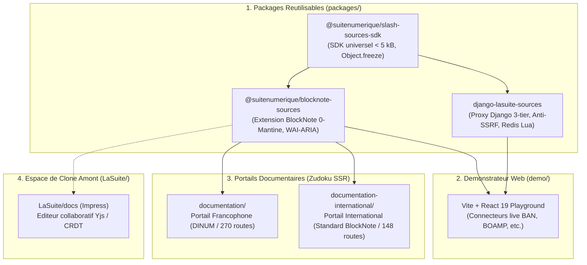
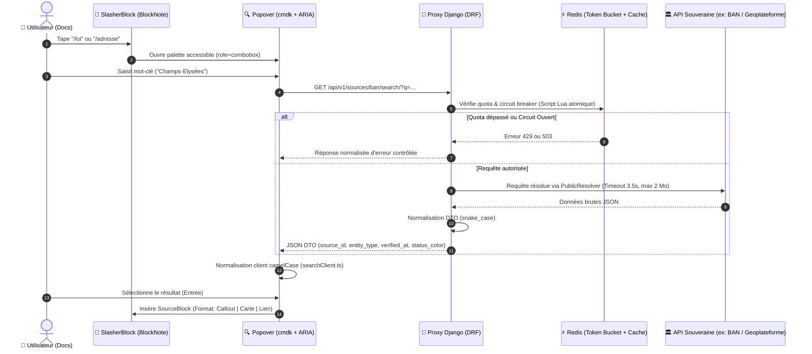
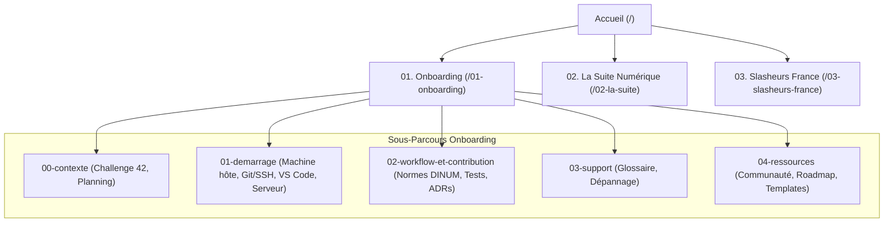

# 🗺️ Cartographie Architecturale & Contexte Global (`CONTEXTE.md`)

**Date de dernière mise à jour :** 28 Septembre 2026  
**Référentiel :** DINUM / La Suite Numérique / beta.gouv.fr / DPGA Indicators  
**Objectif :** Registre central et immuable de la compréhension systémique du monorepo, de ses 4 piliers, de ses protocoles d'échange et de son arborescence documentaire.

---

## 🏛️ 1. Vue d'Ensemble & Piliers du Monorepo

Le monorepo `dinum-setup` est architecturé autour de 4 couches indépendantes et étanches :

---

## 🔄 2. Flux de Données & Contrat d'Interface (DTO)

Le système assure l'interopérabilité entre le frontend TypeScript et le backend Django :

---

## 📦 3. Matrice des Packages & Dépendances

| Package                             | Chemin                            | Rôle & Spécificités                                                                          | Dépendances Clés                                                                               |
| :---------------------------------- | :-------------------------------- | :------------------------------------------------------------------------------------------- | :--------------------------------------------------------------------------------------------- |
| `@suitenumerique/slash-sources-sdk` | `packages/slash-sources-sdk`      | SDK universel de définition de connecteurs de données.                                       | Zéro dépendance runtime, `Object.freeze` systématique.                                         |
| `@suitenumerique/blocknote-sources` | `packages/blocknote-sources`      | Bloc personnalisé BlockNote tri-format + palette cmdk + exportateurs PDF/DOCX/ODT.           | `@blocknote/react`, `@blocknote/core`, `@codegouvfr/react-dsfr`, `@openfun/cunningham-tokens`. |
| `django-lasuite-sources`            | `packages/django-lasuite-sources` | Backend proxy Django sécurisé (Anti-SSRF `PublicResolver`, Redis Lua, disjoncteur HTTP 429). | `Django 5/6`, `djangorestframework`, `redis`, `requests`.                                      |

> ⚠️ **Précision d'Architecture & Nommage :**  
> Dans la documentation internationale (`documentation-international/`), les packages sont parfois référencés sous leur nommage générique ou communautaire (`@slasher/blocknote`, `@slasher/sdk`, `django-slasher-core`, `@blocknote/xl-external-sources`). Les véritables packages npm et PyPI publiés dans ce monorepo sont :
>
> 1. `@suitenumerique/slash-sources-sdk`
> 2. `@suitenumerique/blocknote-sources`
> 3. `django-lasuite-sources`  
>    Une harmonisation rigoureuse des snippets et diagrammes est nécessaire pour éviter toute confusion chez les consommateurs externes.

---

## 🛠️ 3.1 Exigences Runtime & Gestionnaires de Paquets

- **Node.js :** `>= 22.23.2` (LTS Iron requise pour les tests natifs et SSR).
- **Gestionnaire de paquets JS :** `npm >= 10.9.0` (le dépôt est un monorepo orchestré avec npm workspaces ; pnpm/yarn ne sont pas utilisés pour les commandes de build racine).
- **Python :** `>= 3.12` (compatible 3.12, 3.13, 3.14 avec `uv` ou `venv`).
- **Make & Docker / OrbStack :** Cibles unifiées `make check`, `make bootstrap`, `make dev`.

---

## 🔒 3.2 Standards de Contribution & Hygiène Git / SSH

- **Identité Git & Clés SSH :** Clés Ed25519 requises (`ssh-keygen -t ed25519`), permissions `chmod 600` / `700`.
- **Signature des Commits :** Signature SSH ou GPG recommandée pour les dépôts d'État (`commit.gpgsign = true`, `gpg.format = ssh`).
- **Configuration IDE VS Code :** Extensions unifiées (Ruff, ESLint, Prettier, SQLTools). Formats à la sauvegarde (`formatOnSave`, `organizeImports`).
- **Règles d'Or d'Ingénierie DINUM :**
  - **TypeScript :** 0 `any`, 0 cast abusif (`as ...`), typage exhaustif des DTOs et des états UI.
  - **Python :** Formatage et linting via Ruff (88 caractères), 6 blocs d'imports stricts, zéro $N+1$ query, transactions atomiques.
  - **Accessibilité :** RGAA v4.1 AA / WCAG 2.1 AA, 0 violation Axe-Core, 100% navigable au clavier.
  - **Sécurité :** Zéro secret versionné, anti-SSRF `PublicResolver`, transport borné à 3.5s.

---

## 🌐 3.3 Vision Internationale & Biens Publics Numériques (DPG)

- **Standard Universel :** `@suitenumerique/slash-sources-sdk` (< 5 kB) permet l'interopérabilité transfrontalière des registres souverains (France, Allemagne, Pays-Bas, Espagne, Canada, Union Européenne).
- **Conformité DPGA (9 Indicateurs) :**
  1. Pertinence par rapport aux Objectifs de Développement Durable (ODD / SDG 9 & 16 : Institutions efficaces, transparentes et souveraineté numérique).
  2. Licence Open Source reconnue (MIT / European Union Public Licence compatible).
  3. Indépendance vis-à-vis des plateformes propriétaires et zéro enfermement d'interface (0-Mantine dans le SDK).
  4. Documentation complète, bilingue, avec contrat d'interface OpenAPI 3.0 et pré-rendu SSR accessible.

---

## 🌐 4. Double Portail Documentaire Zudoku

1. **Portail Francophone (`documentation/`) :**
   - **Cible :** Développeurs de l'État, agents publics, contributeurs DINUM / beta.gouv.fr.
   - **Arborescence :** `01-onboarding/`, `02-la-suite/`, `03-slasheurs-france/`.
   - **Charte :** Design System de l'État (DSFR), identité La Suite numérique, posture régalienne.
   - **Vigilance Particulière :** Cohérence des routes de navigation. Les catégories réelles sont `01-onboarding`, `02-la-suite`, `03-slasheurs-france`. Éviter les liens fantômes vers d'anciennes structures (`/00-accueil`, `/03-projets`, `/04-design-system`, `/07-skills`, etc.).

2. **Portail International (`documentation-international/`) :**
   - **Cible :** Communauté open source internationale, mainteneurs BlockNote, organisations européennes.
   - **Arborescence :** `00-overview/`, `01-blocknote-extension/`, `02-provider-sdk/`, `03-backend-proxy/`, `04-presets/`, `05-rfc-upstream/`.
   - **Charte :** Anglais technique universel, terminologie DPI / DPG, interopérabilité européenne.
   - **Vigilance Particulière :** Parité sémantique et complétude des en-têtes (frontmatter `title`/`sidebar_label` en anglais strict, composants `<DocHeaderSummary>` bilingues).

---

## 🧭 5. Parcours d'Onboarding & Topologie des Routes

