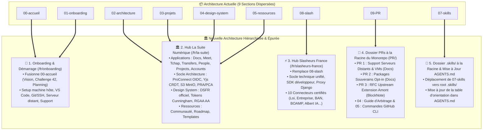

@c# 🏛️ Plan d'Itération & Audit d'Architecture Documentaire (`DOC_ITERATION_ARCHI.md`)

> **Projet :** **Slasher** (`@blocknote/xl-external-sources` & Presets Souverains DINUM)  
> **Destinataires :** Direction Interministérielle du Numérique (DINUM), TypeCellOS/BlockNote, Développeurs & Rédacteurs Techniques  
> **Date de Référence :** 17 Septembre 2026  
> **Statut :** 📋 **Proposition d'Architecture Cible, Audit Exhaustif des 152 Fichiers & Plan d'Action par Checkboxes**

---

## 🧭 1. Synthèse des Arbitrages Demandés

L'architecture documentaire actuelle (issue de l'orchestration locale DINUM) comprend 9 sections linéaires.  
Pour clarifier les responsabilités, éliminer la dispersion et préparer l'internationalisation bilingue intégrale, les 5 arbitrages suivants sont proposés :



---

## 📊 2. Audit Exhaustif des 152 Fichiers Existants

Voici l'inventaire complet des 152 fichiers documentaires analysés avec leur destination dans la nouvelle architecture :

### 📂 Section 00 : Accueil $\rightarrow$ Fusionnée dans `fr/01-onboarding/` (3 fichiers)
| Fichier Actuel | Rôle & Contenu | Destination Cible Proposée |
| :--- | :--- | :--- |
| `fr/00-accueil/index.mdx` | Landing page générale, vision DINUM/42, live playground | $\rightarrow$ `fr/01-onboarding/index.mdx` *(Accueil & Onboarding unifiés)* |
| `fr/00-accueil/challenge-42.mdx` | Contexte du hackathon 42 Oléron et critères | $\rightarrow$ `fr/01-onboarding/00-contexte/challenge-42.mdx` |
| `fr/00-accueil/planning.mdx` | Planning et agenda des jalons | $\rightarrow$ `fr/01-onboarding/00-contexte/planning.mdx` |

---

### 🚀 Section 01 : Onboarding & Démarrage (13 fichiers)
| Fichier Actuel | Rôle & Contenu | Destination Cible Proposée |
| :--- | :--- | :--- |
| `fr/01-onboarding/index.mdx` | Index Onboarding | $\rightarrow$ `fr/01-onboarding/index.mdx` |
| `.../01-demarrage/environnement-machine-hote.mdx` | Setup Docker, Node 22, Python 3.11 | $\rightarrow$ `fr/01-onboarding/01-demarrage/environnement-machine-hote.mdx` |
| `.../01-demarrage/vscode.mdx` | Config VS Code et extensions | $\rightarrow$ `fr/01-onboarding/01-demarrage/vscode.mdx` |
| `.../01-demarrage/git-ssh.mdx` | Clés SSH et signature Git | $\rightarrow$ `fr/01-onboarding/01-demarrage/git-ssh.mdx` |
| `.../01-demarrage/urls-et-identifiants.mdx` | Ports locaux et comptes de test | $\rightarrow$ `fr/01-onboarding/01-demarrage/urls-et-identifiants.mdx` |
| `.../configuration-serveur/01-guide-configuration-serveur.mdx` | Guide Serveur Distant & VM | $\rightarrow$ `fr/01-onboarding/01-demarrage/configuration-serveur/01-guide-configuration-serveur.mdx` |
| `.../configuration-serveur/02-pr-support-serveurs-distants.mdx` | PR Serveurs Distants | $\rightarrow$ `PR/01-docs-serveur-config.mdx` |
| `.../02-workflow-et-contribution/workflow.mdx` | Git Flow et conventions | $\rightarrow$ `fr/01-onboarding/02-workflow-et-contribution/workflow.mdx` |
| `.../02-workflow-et-contribution/guide-du-premier-commit.mdx` | Premier commit pas-à-pas | $\rightarrow$ `fr/01-onboarding/02-workflow-et-contribution/guide-du-premier-commit.mdx` |
| `.../02-workflow-et-contribution/tests-et-qualite.mdx` | Stratégie de tests et linters | $\rightarrow$ `fr/01-onboarding/02-workflow-et-contribution/tests-et-qualite.mdx` |
| `.../02-workflow-et-contribution/securite-du-poste-developpeur.mdx` | Sécurité et hygiène des secrets | $\rightarrow$ `fr/01-onboarding/02-workflow-et-contribution/securite-du-poste-developpeur.mdx` |
| `.../03-support/troubleshooting.mdx` | Diagnostic et FAQ | $\rightarrow$ `fr/01-onboarding/03-support/troubleshooting.mdx` |
| `.../03-support/glossaire.mdx` | Glossaire des termes et acronymes | $\rightarrow$ `fr/01-onboarding/03-support/glossaire.mdx` |

---

### 🏛️ Sections 02, 03, 04, 05 $\rightarrow$ Regroupées dans le Grand Hub `fr/la-suite/` (41 fichiers)

#### A. Applications & Projets (`fr/la-suite/01-applications/` — 10 fichiers)
- `docs.mdx`, `fichiers-drive.mdx`, `grist.mdx`
- `meet.mdx`, `tchap.mdx`, `transfers.mdx`
- `projects.mdx`, `people.mdx`, `accounts.mdx`
- `index.mdx`

#### B. Architecture Globale (`fr/la-suite/02-architecture/` — 11 fichiers)
- Sécurité & Identité : `auth.mdx`, `federation-identite-proconnect.mdx`, `secrets-sops.mdx`
- Données & Temps Réel : `temps-reel-et-crdt.mdx`, `flux-stockage-s3.mdx`, `sauvegardes-et-restauration.mdx`
- DevOps : `cicd-github-actions.mdx`, `deploiement-production.mdx`, `env.mdx`, `hot-reload.mdx`
- `index.mdx`

#### C. Design System & Accessibilité (`fr/la-suite/03-design-system/` — 17 fichiers)
- Fondations : `installation.mdx`, `figma.mdx`, `couleurs-et-themes.mdx`, `typographie.mdx`, `icones.mdx`, `accessibilite-rgaa.mdx`
- Composants : `boutons.mdx`, `badges-et-statuts.mdx`, `alertes-et-callouts.mdx`, `modales-et-dialogues.mdx`, `tableaux.mdx`, `pagination-et-stepper.mdx`, `notices-et-bandeaux.mdx`, `formulaires.mdx`, `cartes-et-conteneurs.mdx`
- Layout : `navigation-et-layout.mdx`
- `index.mdx`

#### D. Ressources & Communauté (`fr/la-suite/04-ressources/` — 3 fichiers)
- `communaute.mdx`, `roadmap.mdx`, `templates-et-outils.mdx`

---

### 🤖 Section 07 : Skills $\rightarrow$ Déplacée dans `.skills/` racine (9 fichiers)
| Fichier Actuel | Rôle & Usage Agent | Destination Racine |
| :--- | :--- | :--- |
| `fr/07-skills/code-standards.mdx` | Normes TypeScript, zéro any, Cunningham | $\rightarrow$ `.skills/code-standards.md` |
| `fr/07-skills/dsfr.mdx` | Règles et composants DSFR | $\rightarrow$ `.skills/dsfr.md` |
| `fr/07-skills/rgaa-review.mdx` | Audit accessibilité RGAA AA | $\rightarrow$ `.skills/rgaa-review.md` |
| `fr/07-skills/lasuite-dev.mdx` | Orchestration locale Makefile & Docker | $\rightarrow$ `.skills/lasuite-dev.md` |
| `fr/07-skills/docs-mdx.mdx` | Rédaction Zudoku MDX | $\rightarrow$ `.skills/docs-mdx.md` |
| `fr/07-skills/code-review.mdx` | Procédure de revue de code | $\rightarrow$ `.skills/code-review.md` |
| `fr/07-skills/architecture-review.mdx` | Audit d'architecture logicielle | $\rightarrow$ `.skills/architecture-review.md` |
| `fr/07-skills/design-change.mdx` | Gestion d'évolution et ADR | $\rightarrow$ `.skills/design-change.md` |
| `fr/07-skills/index.mdx` | Hub d'orientation des skills | $\rightarrow$ `.skills/README.md` |

---

### ⚡ Section 08 : Slasheurs $\rightarrow$ Renommée `fr/slasheurs-france/` (80 fichiers)
*Renommage de `08-slash/` en `slasheurs-france/` (ou `official-french-api-slashers`) comprenant :*
- Les 11 guides généraux (Socle technique, architecture standardisée, CustomBlock, proxy Django, SDK développeur, tutoriel 15 min, mutualisation transverse, RXP).
- Les 10 répertoires de connecteurs certifiés (Loi Légifrance, Assemblée Nationale, Entreprises RNE, BAN Adresses, Albert IA RAG, Marchés Publics BOAMP, Subventions Aides-Territoires, INSEE Statistiques, Annuaire Agents, Cadastre DGFiP).

---

### 🐙 Section 09 : PRs $\rightarrow$ Déplacée dans `PR/` racine (6 fichiers)
| Fichier Actuel | Rôle du Dossier de PR | Destination Racine |
| :--- | :--- | :--- |
| `fr/09-PR/01-docs-serveur-config.mdx` | PR 1 : Support serveurs distants & VMs | $\rightarrow$ `PR/01-docs-serveur-config.md` |
| `fr/09-PR/02-docs-packages-souverains.mdx` | PR 2 : Packages souverains opt-in | $\rightarrow$ `PR/02-docs-packages-souverains.md` |
| `fr/09-PR/03-blocknote-external-sources.mdx` | PR 3 : RFC amont TypeCellOS/BlockNote | $\rightarrow$ `PR/03-blocknote-slasher-rfc.md` |
| `fr/09-PR/04-guide-d-arbitrage-et-migration.mdx` | Guide d'arbitrage In-Tree vs Package | $\rightarrow$ `PR/04-guide-d-arbitrage.md` |
| `fr/09-PR/05-commande-PR.mdx` | Commandes GitHub CLI prêtes à l'emploi | $\rightarrow$ `PR/05-commandes-gh-cli.md` |
| `fr/09-PR/index.mdx` | Tableau de bord des contributions | $\rightarrow$ `PR/README.md` |

---

## 🏛️ 3. Arborescence Cible Finale

```
dinum-setup/
├── PR/                                        # 🐙 DOSSIER DES PULL REQUESTS OFFICIELLES (Racine)
│   ├── README.md                              # Tableau de bord des 3 PRs
│   ├── 01-docs-serveur-config.md              # PR 1 : Serveurs Distants & VMs (suitenumerique/docs)
│   ├── 02-docs-packages-souverains.md         # PR 2 : Packages Souverains Opt-in (suitenumerique/docs)
│   ├── 03-blocknote-slasher-rfc.md            # PR 3 : RFC Amont Slasher (TypeCellOS/BlockNote)
│   ├── 04-guide-d-arbitrage.md                # Guide décisionnel architecture
│   └── 05-commandes-gh-cli.md                 # Scripts bash d'exécution gh pr create
│
├── .skills/                                   # 🤖 SKILLS DES AGENTS IA (Racine)
│   ├── README.md                              # Orientation des agents
│   ├── code-standards.md                      # TypeScript strict & Cunningham
│   ├── dsfr.md                                # DSFR officiel & tokens
│   ├── rgaa-review.md                         # Accessibilité RGAA v4.1 AA
│   ├── lasuite-dev.md                         # Dev local & orchestration
│   ├── docs-mdx.md                            # Rédaction MDX & Zudoku
│   ├── code-review.md                         # Checklist revue de code
│   ├── architecture-review.md                 # Audit d'architecture
│   └── design-change.md                       # Évolution & ADR
│
├── AGENTS.md                                  # 🧭 Instructions Générales des Agents (Pointant vers .skills/)
│
└── documentation/docs/
    ├── en/                                    # 🇬🇧 ESPACE ANGLAIS (Universal Slasher Standard)
    │   ├── index.mdx                          # Overview & Live Playground
    │   ├── 00-overview/                       # Universal remote data standard & 3-tier pattern
    │   ├── 01-blocknote-extension/            # CustomBlock, 3 formats, WAI-ARIA, exports
    │   ├── 02-provider-sdk/                   # defineSlasher, DTOs, 15-min tutorial
    │   ├── 03-backend-proxy/                  # Generic DRF proxy, SHA-256 cache, anti-SSRF
    │   ├── 04-presets/                        # Presets DE, NL, ES, EU
    │   └── 05-rfc-upstream/                   # Upstream RFC documentation
    │
    └── fr/                                    # 🇫🇷 ESPACE FRANÇAIS (Socle Souverain DINUM)
        ├── 01-onboarding/                     # 🚀 1. Démarrage, Contexte (ex 00-accueil) & Support
        │   ├── index.mdx                      # Accueil & hub onboarding
        │   ├── 00-contexte/                   # Challenge 42 & Planning jalons
        │   ├── 01-demarrage/                  # Machine hôte, VS Code, Git SSH, URLs, Serveur VM
        │   ├── 02-workflow-et-contribution/   # Git flow, tests, sécurité du poste
        │   └── 03-support/                    # Glossaire d'État, Troubleshooting
        │
        ├── 02-la-suite/                       # 🏛️ 2. Le Grand Hub La Suite Numérique
        │   ├── index.mdx                      # Vue d'ensemble de l'écosystème La Suite
        │   ├── 01-applications/               # Docs, Meet, Tchap, Transfers, People, Projects, Accounts
        │   ├── 02-architecture/               # ProConnect, CRDT Yjs, S3 MinIO, PRA/PCA, DevOps
        │   ├── 03-design-system/              # DSFR officiel, Tokens Cunningham, RGAA AA
        │   └── 04-ressources/                 # Communauté Tchap, Matrix, Templates
        │
        └── 03-slasheurs-france/               # ⚡ 3. Socle des Slasheurs Souverains (ex 08-slash)
            ├── index.mdx                      # Le standard Slasheur de l'État
            ├── 00-socle-technique.mdx         # Architecture 3 tiers
            ├── 01-architecture-standardisee.mdx
            ├── 02-composant-customblock.mdx   # SlasherBlock unique
            ├── 03-proxy-backend-et-cache.mdx  # Django & Redis SHA-256
            ├── 04-tutoriel-creer-slasheur.mdx # Guide développeur 15 min
            ├── 01-loi/                        # Slasheur Légifrance
            ├── 02-assemblee/                  # Slasheur Assemblée Nationale
            ├── 03-entreprise/                 # Slasheur Annuaire RNE
            ├── 04-adresse/                    # Slasheur Base Adresse Nationale (BAN)
            ├── 05-albert/                     # Slasheur Albert IA RAG
            ├── 08-marche/                     # Slasheur Marchés Publics (BOAMP)
            ├── 09-subvention/                 # Slasheur Aides-Territoires
            ├── 10-stats/                      # Slasheur INSEE Données Locales
            ├── 11-agent/                      # Slasheur Annuaire Service Public
            └── 12-cadastre/                   # Slasheur Cadastre DGFiP
```

---

## 📋 4. Plan d'Exécution par Checkboxes

---

### 🐙 PHASE 1 : Déplacement des PRs & des Skills à la Racine

- [ ] **Tâche 1.1 : Création du dossier `PR/` à la racine**
  - Déplacer et renommer les fichiers de `documentation/docs/fr/09-PR/` vers `PR/`.
- [ ] **Tâche 1.2 : Création du dossier `.skills/` à la racine**
  - Déplacer les fichiers de `documentation/docs/fr/07-skills/` vers `.skills/`.
- [ ] **Tâche 1.3 : Mise à jour de `AGENTS.md`**
  - Réorienter la table de routage des skills vers `.skills/<nom>.md`.

---

### 🏛️ PHASE 2 : Restructuration du Dossier `documentation/docs/fr/`

- [ ] **Tâche 2.1 : Fusion de `00-accueil` dans `01-onboarding`**
  - Déplacer `fr/00-accueil/challenge-42.mdx` et `planning.mdx` vers `fr/01-onboarding/00-contexte/`.
- [ ] **Tâche 2.2 : Création du grand hub `fr/02-la-suite/`**
  - Déplacer `fr/03-projets/` $\rightarrow$ `fr/02-la-suite/01-applications/`
  - Déplacer `fr/02-architecture/` $\rightarrow$ `fr/02-la-suite/02-architecture/`
  - Déplacer `fr/04-design-system/` $\rightarrow$ `fr/02-la-suite/03-design-system/`
  - Déplacer `fr/05-ressources/` $\rightarrow$ `fr/02-la-suite/04-ressources/`
- [ ] **Tâche 2.3 : Renommage de `08-slash` $\rightarrow$ `fr/03-slasheurs-france/`**

---

### 🧭 PHASE 3 : Mise à Niveau du Générateur de Navigation & Build Zudoku

- [ ] **Tâche 3.1 : Adaptation de `generate-docs-navigation.mjs`**
  - Configurer les nouveaux libellés et icônes pour les 3 grands pôles (`01-onboarding`, `02-la-suite`, `03-slasheurs-france`).
  - Mettre en place la table de redirection complète pour les anciens chemins.
- [ ] **Tâche 3.2 : Mise à jour de `zudoku.config.tsx`**
  - Adapter les liens du header : `🇫🇷 Français`, `🇬🇧 English`, `🏛️ La Suite`, `⚡ Slasheurs`, `🐙 PRs`.
- [ ] **Tâche 3.3 : Validation du Build Zudoku SSR**
  - Exécuter `npm run docs:build` (objectif : 0 erreur, 270+ routes générées).

---

### 🌐 PHASE 4 : Traduction Progressive Fichier par Fichier vers `docs/en/`

Une fois l'arborescence française assainie et stabilisée en 3 pôles :
- [ ] Traduire les guides du SDK (`docs/en/02-provider-sdk/`).
- [ ] Traduire les spécifications du CustomBlock (`docs/en/01-blocknote-extension/`).
- [ ] Traduire les presets internationaux (`docs/en/04-presets/`).
- [ ] Traduire la RFC upstream (`docs/en/05-rfc-upstream/`).
