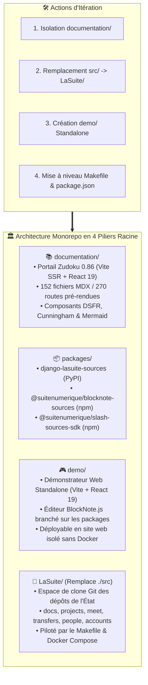
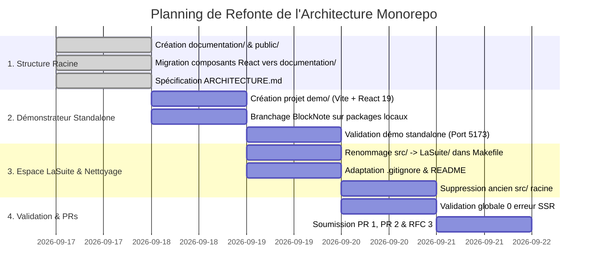

# 🔄 Plan d'Itération d'Architecture du Dépôt (`ITERATE_REPOSITORY.md`)

> **Destinataires :** Direction Interministérielle du Numérique (DINUM), Équipe Core Team & Développeurs  
> **Auteur :** GitHub Copilot (Gemini 3.7 Flash) — Dépôt d'orchestration `dinum-setup`  
> **Date de Référence :** 17 Septembre 2026  
> **Objectif :** Guider pas-à-pas la restructuration modulaire du dépôt en 4 piliers étanches (`documentation/`, `packages/`, `demo/`, `LaSuite/`), la mise à jour des points d'entrée (`Makefile`, `package.json`) et le remplacement du dossier `src/`.

---

## 🧭 1. Vision & Objectifs de l'Itération d'Architecture

Historiquement, le dépôt d'orchestration mélangeait le code de documentation, les composants UI internes et les clones applicatifs dans un répertoire générique `src/`.  
L'itération d'architecture vise à établir une **structure de monorepo moderne, lisible et hautement modulaire** organisée autour de 4 piliers exclusifs à la racine :



---

## 📋 2. Plan d'Action d'Itération & Checkboxes Explicites

---

### 📚 PILIER 1 : Isolation Complète du Portail Documentaire (`documentation/`)

Ce pilier isole l'application de documentation Zudoku (Vite SSR, React 19, MDX, Cunningham & DSFR) dans son propre workspace indépendant.

#### A. 🗂️ Structure des Fichiers & Composants
- [x] **Dossier de documentation racine `documentation/docs/` :**
  - [x] `documentation/docs/00-accueil/` (3 fichiers : `index.mdx`, `challenge-42.mdx`, `planning.mdx`)
  - [x] `documentation/docs/01-onboarding/` (13 fichiers : `index.mdx`, `01-demarrage/`, `02-workflow-et-contribution/`, `03-support/`)
  - [x] `documentation/docs/02-architecture/` (11 fichiers : `index.mdx`, `01-securite-et-identite/`, `02-donnees-et-temps-reel/`, `03-devops-et-deploiement/`)
  - [x] `documentation/docs/03-projets/` (10 fichiers : `index.mdx`, `01-documents-et-contenus/`, `02-communication-et-echange/`, `03-gestion-et-utilisateurs/`)
  - [x] `documentation/docs/04-design-system/` (17 fichiers : `index.mdx`, `01-fondations/`, `02-composants/`, `03-layout-et-structure/`)
  - [x] `documentation/docs/05-ressources/` (3 fichiers : `communaute.mdx`, `roadmap.mdx`, `templates-et-outils.mdx`)
  - [x] `documentation/docs/07-skills/` (9 fichiers : `index.mdx`, `code-standards.mdx`, `dsfr.mdx`, `rgaa-review.mdx`, `lasuite-dev.mdx`, `docs-mdx.mdx`, `code-review.mdx`, `architecture-review.mdx`, `design-change.mdx`)
  - [x] `documentation/docs/08-slash/` (81 fichiers : 11 guides socle/RXP + 70 fichiers pour les 10 connecteurs souverains)
  - [x] `documentation/docs/09-PR/` (5 fichiers : `index.mdx`, `01-docs-serveur-config.mdx`, `02-docs-packages-souverains.mdx`, `03-blocknote-external-sources.mdx`, `04-guide-d-arbitrage-et-migration.mdx`)
- [x] **Composants d'interface React sous `documentation/src/components/` :**
  - [x] `documentation/src/components/Cards.tsx` (Composants `<FeatureCard>`, `<FeatureGrid>`, `<TrackCard>`, `<TutorialCard>`, `<ScheduleItem>`, `<ScheduleDay>`)
  - [x] `documentation/src/components/DSFRPreviews.tsx` (Aperçus visuels `<ColorPalettePreview>`, `<TypographySpecimen>`, `<IconsCatalog>`, `<ButtonPreview>`, `<BadgePreview>`, `<AlertPreview>`, `<ModalPreview>`, `<NoticePreview>`, `<TablePreview>`, `<FormPreview>`, `<CardContainerPreview>`, `<PaginationStepperPreview>`, `<HeaderBreadcrumbPreview>`)
  - [x] `documentation/src/components/Kanban.tsx` (Tableau Kanban agile `<Kanban>`)
  - [x] `documentation/src/components/LawSlashPreview.tsx` (Démonstrateur des 4 états de la commande `/loi` `<LawSlashPreview>`)
  - [x] `documentation/src/components/Mermaid.tsx` (Rendu SVG Mermaid v11 avec zoom interactif et modale plein écran `<Mermaid>`)
  - [x] `documentation/src/components/slash-preview/` (Playground live `<BlockNoteSlashPlayground>`, `SourceBlockSpec.tsx`, `mockData.ts`, `types.ts`)
  - [x] `documentation/src/components/index.ts` (Baril d'export global)
  - [x] `documentation/src/vite-env.d.ts` (Types globaux Vite et Zudoku Client)
- [x] **Actifs graphiques sous `documentation/public/` :**
  - [x] `documentation/public/lasuite.svg` (Logo officiel La Suite thème clair)
  - [x] `documentation/public/lasuite-dark.svg` (Logo officiel La Suite thème sombre)
  - [x] `documentation/public/gouv.svg` (Bloc marque Marianne République Française)
  - [x] `documentation/public/favicon.ico`, `documentation/public/favicon-dark.ico`, `documentation/public/favicon.svg`
- [x] **Fichiers de configuration autonome :**
  - [x] `documentation/package.json` (Workspace npm `@dinum/documentation` avec Zudoku `^0.86.0`, React 19, DSFR, BlockNote)
  - [x] `documentation/tsconfig.json` (Typage strict avec alias `"@suitenumerique/*": ["../packages/*"]`)
  - [x] `documentation/vite.config.ts` (Configuration Vite SSR avec alias de résolution vers `../packages/*`)
  - [x] `documentation/zudoku.config.tsx` (Configuration de marque, logos, header et enregistrement des composants MDX)
  - [x] `documentation/zudoku.navigation.tsx` (Arbre de navigation officiel à 9 catégories et 45 règles de redirection)
  - [x] `documentation/zudoku.theme.css` (Variables CSS Marianne `#000091`, dark mode et composants DSFR scoped)
  - [x] `documentation/scripts/generate-docs-navigation.mjs` (Script de génération automatique de la navigation)

#### B. 🧪 Commandes de Validation Pilier 1
- [x] **Génération du menu de navigation :**
  ```bash
  npm --prefix documentation run docs:nav
  # Doit afficher : ✓ Successfully updated documentation/zudoku.navigation.tsx
  ```
- [ ] **Lancement en mode développement local :**
  ```bash
  npm --prefix documentation run dev
  # Vérifier l'accès sur http://localhost:3000 avec rechargement à chaud
  ```
- [ ] **Compilation et pré-rendu statique SSR :**
  ```bash
  npm --prefix documentation run build
  # Critère d'acceptation : 270 routes générées avec 0 erreur dans documentation/dist/
  ```
- [ ] **Indexation de recherche plein texte (Pagefind) :**
  ```bash
  npm --prefix documentation run search
  # Doit générer l'index statique dans documentation/dist/pagefind/
  ```

---

### 📦 PILIER 2 : Les Packages Souverains Découplés (`packages/`)

Ce pilier regroupe les 3 bibliothèques open source distribuables sur PyPI et npm, indépendantes de toute stack applicative spécifique.

#### A. 🐍 Package 1 : `django-lasuite-sources` (Backend Django / PyPI)
- [x] **Code source Python sous `packages/django-lasuite-sources/lasuite_sources/` :**
  - [x] `__init__.py`, `apps.py`, `base.py`, `registry.py`, `tasks.py`, `types.py`, `urls.py`, `views.py`.
  - [x] Les 12 connecteurs dans `providers/` (`law.py`, `parliament.py`, `company.py`, `address.py`, `albert.py`, `procurement.py`, `grant.py`, `insee.py`, `agent.py`, `cadastre.py`, `demarche.py`, `opendata.py`).
- [x] **Mini-application de démonstration autonome (`demo/`) :**
  - [x] `packages/django-lasuite-sources/demo/manage.py`
  - [x] `packages/django-lasuite-sources/demo/settings.py` (SQLite in-memory + LocMemCache)
  - [x] `packages/django-lasuite-sources/demo/urls.py`
  - [x] `packages/django-lasuite-sources/demo/README.md`
- [x] **Documentation & Tests :**
  - [x] `packages/django-lasuite-sources/docs/openapi.yaml` (Spécification OpenAPI 3.0 des endpoints REST)
  - [x] `packages/django-lasuite-sources/tests/test_security_ssrf.py` (Filtrage défensif anti-SSRF)
  - [x] `packages/django-lasuite-sources/tests/test_circuit_breaker.py` (Résilience et bascule mock)
  - [x] `packages/django-lasuite-sources/tests/test_api_sources.py` (Vues DRF et cache)
- [x] **Commandes de validation :**
  ```bash
  # 1. Compilation syntaxique Python
  python3 -m py_compile packages/django-lasuite-sources/lasuite_sources/**/*.py
  # 2. Exécution de la suite pytest isolée
  pytest packages/django-lasuite-sources/tests/ -v
  # 3. Lancement de la mini-application Django autonome
  cd packages/django-lasuite-sources/demo && python manage.py runserver 8000
  ```

#### B. 📦 Package 2 : `@suitenumerique/blocknote-sources` (Frontend UI / npm)
- [x] **Code source TypeScript sous `packages/blocknote-sources/src/` :**
  - [x] `SourceBlock.tsx` (Factory `createReactBlockSpec()` BlockNote 0.54+)
  - [x] `components/SourceSearchPopover.tsx` (Palette de recherche accessible RGAA AA)
  - [x] `formats/SourceCalloutFormat.tsx`, `formats/SourceCardFormat.tsx`, `formats/SourceLinkFormat.tsx`
  - [x] `exporters/sourceBlockPDF.tsx`, `exporters/sourceBlockDocx.tsx`, `exporters/sourceBlockODT.tsx`
  - [x] `hooks/useSourceSearch.ts` (Hook de recherche avec debounce et abort controller)
- [x] **Storybook & Documentation :**
  - [x] `packages/blocknote-sources/.storybook/main.ts` et `preview.ts`
  - [x] `packages/blocknote-sources/src/stories/` (4 stories : Callout, Carte, Lien, Popover)
  - [x] `packages/blocknote-sources/docs/formats.md` (Spécification des formats DSFR et `borderColor`)
- [x] **Tests unitaires et d'accessibilité :**
  - [x] `packages/blocknote-sources/tests/unit/accessibility.test.ts` (Contraste $\ge 4.5:1$, rôles ARIA)
  - [x] `packages/blocknote-sources/tests/unit/exporters.test.ts` (Mappeurs PDF, Word, ODT)
  - [x] `packages/blocknote-sources/tests/e2e/axe-audit.spec.ts` (Audit automatisé `@axe-core/playwright`)
- [x] **Commandes de validation :**
  ```bash
  # 1. Exécution des tests unitaires Vitest
  npm --prefix packages/blocknote-sources test
  # 2. Compilation TypeScript avec tsup
  npm --prefix packages/blocknote-sources run build
  # 3. Lancement de Storybook en local
  cd packages/blocknote-sources && npx storybook dev -p 6006
  ```

#### C. 🛠️ Package 3 : `@suitenumerique/slash-sources-sdk` (SDK Développeur / npm)
- [x] **Code source sous `packages/slash-sources-sdk/src/` :**
  - [x] `defineSourceProvider.ts` (Helper déclaratif immuable `Object.freeze()`)
  - [x] `types.ts` (Interfaces DTO `SourceEntityProps`, `SourceSuggestResult`, `SourceProviderDefinition`)
  - [x] `index.ts` (Baril d'export)
- [x] **Bacs à sable & Modèles :**
  - [x] `packages/slash-sources-sdk/templates/custom-provider.ts` (Template ministériel < 15 min)
  - [x] `packages/slash-sources-sdk/demo/index.html` et `playground.ts` (Démo HTML/TS autonome)
  - [x] `packages/slash-sources-sdk/tests/defineSourceProvider.test.ts` (Tests de validation de schéma)
- [x] **Commandes de validation :**
  ```bash
  # 1. Tests unitaires Vitest
  npm --prefix packages/slash-sources-sdk test
  # 2. Build et génération des types .d.ts
  npm --prefix packages/slash-sources-sdk run build
  ```

---

### 🎮 PILIER 3 : Création du Démonstrateur Web Standalone (`demo/`)

Ce pilier fournit une application web légère et autonome (Vite + React 19) permettant de faire une démonstration interactive de BlockNote et des 12 connecteurs souverains sur un site dédié, sans dépendre de l'infrastructure Docker de La Suite.

#### A. 🗂️ Fichiers à Créer sous `demo/`
- [ ] **Configuration du projet (`demo/package.json`) :**
  - *Fichier :* `demo/package.json`
  - *Contenu exact :*
    ```json
    {
      "name": "@dinum/demo-sources",
      "version": "1.0.0",
      "private": true,
      "type": "module",
      "scripts": {
        "dev": "vite --host 0.0.0.0 --port 5173",
        "build": "tsc && vite build",
        "preview": "vite preview --port 5173"
      },
      "dependencies": {
        "@blocknote/core": "^0.54.2",
        "@blocknote/mantine": "^0.54.2",
        "@blocknote/react": "^0.54.2",
        "@codegouvfr/react-dsfr": "^1.35.0",
        "@suitenumerique/blocknote-sources": "*",
        "@suitenumerique/slash-sources-sdk": "*",
        "react": "^19.2.7",
        "react-dom": "^19.2.7"
      },
      "devDependencies": {
        "@types/react": "^19.3.0",
        "@types/react-dom": "^19.3.0",
        "@vitejs/plugin-react": "^4.3.4",
        "typescript": "^5.9.2",
        "vite": "^6.2.0"
      }
    }
    ```
- [ ] **Configuration TypeScript (`demo/tsconfig.json`) :**
  - *Fichier :* `demo/tsconfig.json`
  - *Contenu exact :*
    ```json
    {
      "compilerOptions": {
        "target": "ES2022",
        "lib": ["ESNext", "DOM", "DOM.Iterable"],
        "module": "ESNext",
        "moduleResolution": "Bundler",
        "jsx": "react-jsx",
        "strict": true,
        "skipLibCheck": true,
        "noEmit": true,
        "paths": {
          "@suitenumerique/blocknote-sources": ["../packages/blocknote-sources/src/index.ts"],
          "@suitenumerique/blocknote-sources/*": ["../packages/blocknote-sources/src/*"],
          "@suitenumerique/slash-sources-sdk": ["../packages/slash-sources-sdk/src/index.ts"],
          "@suitenumerique/slash-sources-sdk/*": ["../packages/slash-sources-sdk/src/*"]
        }
      },
      "include": ["src", "vite.config.ts"]
    }
    ```
- [ ] **Configuration du Bundler (`demo/vite.config.ts`) :**
  - *Fichier :* `demo/vite.config.ts`
  - *Contenu exact :*
    ```typescript
    import path from "node:path";
    import { fileURLToPath } from "node:url";
    import react from "@vitejs/plugin-react";
    import { defineConfig } from "vite";

    const __filename = fileURLToPath(import.meta.url);
    const __dirname = path.dirname(__filename);

    export default defineConfig({
      plugins: [react()],
      resolve: {
        alias: {
          "@suitenumerique/blocknote-sources/exporters": path.resolve(
            __dirname,
            "../packages/blocknote-sources/src/exporters/index.ts",
          ),
          "@suitenumerique/blocknote-sources": path.resolve(
            __dirname,
            "../packages/blocknote-sources/src/index.ts",
          ),
          "@suitenumerique/slash-sources-sdk": path.resolve(
            __dirname,
            "../packages/slash-sources-sdk/src/index.ts",
          ),
        },
      },
      server: {
        port: 5173,
        host: "0.0.0.0",
      },
    });
    ```
- [ ] **Page HTML Principale (`demo/index.html`) :**
  - *Fichier :* `demo/index.html`
  - *Contenu exact :*
    ```html
    <!DOCTYPE html>
    <html lang="fr">
      <head>
        <meta charset="UTF-8" />
        <link rel="icon" type="image/svg+xml" href="/favicon.svg" />
        <meta name="viewport" content="width=device-width, initial-scale=1.0" />
        <title>Démonstrateur Sources Souveraines — BlockNote x DINUM</title>
        <link
          rel="stylesheet"
          href="https://cdn.jsdelivr.net/npm/@gouvfr/dsfr@1.12.1/dist/dsfr.min.css"
        />
      </head>
      <body>
        <div id="root"></div>
        <script type="module" src="/src/main.tsx"></script>
      </body>
    </html>
    ```
- [ ] **Point d'Entrée React (`demo/src/main.tsx`) :**
  - *Fichier :* `demo/src/main.tsx`
  - *Contenu exact :*
    ```tsx
    import React from "react";
    import ReactDOM from "react-dom/client";
    import { App } from "./App";
    import "./demo.css";

    ReactDOM.createRoot(document.getElementById("root")!).render(
      <React.StrictMode>
        <App />
      </React.StrictMode>,
    );
    ```
- [ ] **Composant d'Application Principal (`demo/src/App.tsx`) :**
  - *Fichier :* `demo/src/App.tsx`
  - *Fonctionnalités :* En-tête officiel DSFR Marianne `#000091`, barre d'insertion rapide des 12 commandes slash (`/loi`, `/entreprise`, `/assemblee`, etc.), sélecteur de thème clair/sombre, éditeur BlockNote complet avec les 3 formats d'affichage DSFR permutables, et panneau de documentation latérale.
- [ ] **Feuille de Style (`demo/src/demo.css`) :**
  - *Fichier :* `demo/src/demo.css`
  - *Styles :* Typographie Marianne, réactivité mobile, conteneur d'édition centré avec ombre douce.

#### B. 🧪 Commandes de Validation Pilier 3
```bash
# 1. Lancement du serveur de développement démo
npm --prefix demo run dev
# Vérifier l'accès sur http://localhost:5173 avec interaction fluide sur les 12 commandes

# 2. Compilation de production du démonstrateur standalone
npm --prefix demo run build
# Doit générer le bundle optimisé dans demo/dist/
```

---

### 🐙 PILIER 4 : Migration de `./src` vers `./LaSuite` & Nettoyage Racine

Ce pilier renomme l'espace de clone Git des 6 applications de La Suite Numérique de `src/` vers `LaSuite/` afin d'éliminer toute ambiguïté avec les sources de documentation ou des packages.

#### A. 🛠️ Actions de Migration & Fichiers Modifiés
- [ ] **Mise à jour du `Makefile` racine :**
  - *Action :* Remplacer `SRC_DIR ?= $(ROOT_DIR)/src` par `SRC_DIR ?= $(ROOT_DIR)/LaSuite`.
  - *Vérification :* Adapter les cibles `make clone`, `make pull`, `make dev`, `make stop`, `make logs-docs`, `make logs-projects`.
- [ ] **Mise à jour du fichier `.gitignore` racine :**
  - *Action :* Remplacer les règles obsolètes `src/docs/`, `src/projects/` par les règles `LaSuite/docs/`, `LaSuite/projects/`, etc.
- [ ] **Mise à jour de `install.sh` :**
  - *Action :* S'assurer que le script clone bien les dépôts dans `./LaSuite/`.
- [ ] **Mise à jour du fichier `README.md` racine :**
  - *Action :* Remplacer toute mention de `dans src/` par `dans LaSuite/`.
- [ ] **Mise à jour de `AGENTS.md` :**
  - *Action :* Mettre à jour la couche 3 : `3. Dépôts Clones (LaSuite/*)`.
- [ ] **Création du dossier cible `LaSuite/` :**
  - *Commande :* `mkdir -p LaSuite && touch LaSuite/.gitkeep`
- [ ] **Nettoyage et suppression de l'ancien dossier `src/` racine :**
  - *Commande :* Supprimer les anciens fichiers résiduels de `src/` désormais tous localisés sous `documentation/src/`.

---

## 🔍 3. Matrice Exhaustive des Fichiers à Mettre à Jour (`src/` $\rightarrow$ `LaSuite/`)

Voici l'inventaire précis de toutes les occurrences dans le dépôt à synchroniser :

| # | Fichier Local | Ligne / Contexte | Ancien Contenu | Nouveau Contenu Cible |
| :-: | :--- | :--- | :--- | :--- |
| **1** | `Makefile` | Ligne 4 | `SRC_DIR ?= $(ROOT_DIR)/src` | `SRC_DIR ?= $(ROOT_DIR)/LaSuite` |
| **2** | `Makefile` | Ligne 38 | `make clone - Clone les depots dans ./src` | `make clone - Clone les depots dans ./LaSuite` |
| **3** | `Makefile` | Ligne 40 | `SRC_DIR=/opt/lasuite/src make dev` | `SRC_DIR=/opt/lasuite/LaSuite make dev` |
| **4** | `.gitignore` | Lignes 15-25 | `src/docs/`, `src/projects/`, `src/meet/`... | `LaSuite/docs/`, `LaSuite/projects/`, `LaSuite/meet/`... |
| **5** | `README.md` | Ligne 5 | `Le Makefile clone les projets dans src/` | `Le Makefile clone les projets dans LaSuite/` |
| **6** | `AGENTS.md` | Ligne 15 | `3. Dépôts Clones (src/*)` | `3. Dépôts Clones (LaSuite/*)` |
| **7** | `documentation/docs/01-onboarding/01-demarrage/environnement-machine-hote.mdx` | Arborescence | `├── src/ # Clones des applications` | `├── LaSuite/ # Clones des applications` |
| **8** | `documentation/docs/01-onboarding/02-workflow-et-contribution/workflow.mdx` | Ligne 14 | `Par défaut, les projets sont clonés dans ./src/ :` | `Par défaut, les projets sont clonés dans ./LaSuite/ :` |
| **9** | `documentation/docs/01-onboarding/01-demarrage/configuration-serveur/01-guide-configuration-serveur.mdx` | Tableau des fichiers | `src/docs/src/frontend/...` | `LaSuite/docs/src/frontend/...` |
| **10** | `documentation/docs/02-architecture/03-devops-et-deploiement/hot-reload.mdx` | Ligne 16 | `./src/<projet>/...` | `./LaSuite/<projet>/...` |
| **11** | `documentation/docs/03-projets/index.mdx` | Tableau | `make -C src/docs run` | `make -C LaSuite/docs run` |
| **12** | `documentation/docs/07-skills/lasuite-dev.mdx` | Ligne 40 | `# Cloner l'ensemble des dépôts dans ./src/` | `# Cloner l'ensemble des dépôts dans ./LaSuite/` |

---

## ⚙️ 4. Configuration Unifiée des Points d'Entrée

### 📦 4.1. `package.json` Racine
```json
{
  "name": "dinum-setup",
  "private": true,
  "type": "module",
  "workspaces": [
    "packages/*",
    "documentation",
    "demo"
  ],
  "scripts": {
    "dev": "npm run docs:dev",
    "build": "npm run packages:build && npm --prefix documentation run build",
    "docs:nav": "npm --prefix documentation run docs:nav",
    "docs:dev": "npm --prefix documentation run dev",
    "docs:build": "npm run packages:build && npm --prefix documentation run build",
    "docs:preview": "npm --prefix documentation run preview",
    "docs:search": "npm --prefix documentation run search",
    "demo:dev": "npm --prefix demo run dev",
    "demo:build": "npm run packages:build && npm --prefix demo run build",
    "demo:preview": "npm --prefix demo run preview",
    "packages:build": "npm --prefix packages/slash-sources-sdk run build && npm --prefix packages/blocknote-sources run build",
    "packages:test": "npm --prefix packages/slash-sources-sdk test && npm --prefix packages/blocknote-sources test"
  },
  "dependencies": {
    "@suitenumerique/blocknote-sources": "*",
    "@suitenumerique/slash-sources-sdk": "*"
  },
  "devDependencies": {
    "typescript": "^5.9.2"
  }
}
```

---

### ⚙️ 4.2. `Makefile` Racine
```makefile
SHELL := /usr/bin/env bash

ROOT_DIR := $(CURDIR)
SRC_DIR ?= $(ROOT_DIR)/LaSuite

REPOS ?= docs projects meet transfers people accounts

DOCKER_COMPOSE ?= $(shell if docker compose version >/dev/null 2>&1; then echo "docker compose"; elif command -v docker-compose >/dev/null 2>&1; then echo "docker-compose"; fi)

export docs_URL ?= https://github.com/suitenumerique/docs.git
export projects_URL ?= https://github.com/suitenumerique/projects.git
export meet_URL ?= https://github.com/suitenumerique/meet.git
export transfers_URL ?= https://github.com/suitenumerique/transfers.git
export people_URL ?= https://github.com/suitenumerique/people.git
export accounts_URL ?= https://github.com/suitenumerique/accounts.git

.DEFAULT_GOAL := help

.PHONY: help
help:
	@printf "DINUM / La Suite dev setup (Monorepo 4 Piliers)\n\n"
	@printf "Commandes Documentation & Demo:\n"
	@printf "  make docs-dev           Lance le portail documentaire Zudoku (http://localhost:3000)\n"
	@printf "  make docs-build         Compile la documentation Zudoku (SSR 270 routes)\n"
	@printf "  make demo-dev           Lance le demonstrateur web standalone (http://localhost:5173)\n"
	@printf "  make demo-build         Compile le demonstrateur web standalone\n"
	@printf "  make packages-build     Compile les packages TypeScript (@suitenumerique/*)\n"
	@printf "  make packages-test      Execute les 15 tests unitaires et RGAA\n\n"
	@printf "Commandes Clones LaSuite:\n"
	@printf "  make clone              Clone les depots dans ./LaSuite\n"
	@printf "  make pull               Met a jour les depots dans ./LaSuite\n"
	@printf "  make env                Prepare les fichiers .env locaux\n"
	@printf "  make bootstrap          Prepare les conteneurs Docker de La Suite\n"
	@printf "  make dev                Lance les stacks Docker de La Suite en dev\n"
	@printf "  make stop               Stoppe les stacks Docker\n"
	@printf "  make status             Affiche les conteneurs actifs\n"

.PHONY: clone
clone:
	@mkdir -p "$(SRC_DIR)"
	@for repo in $(REPOS); do \
		url_var="$${repo}_URL"; \
		url="$${!url_var}"; \
		if [ -d "$(SRC_DIR)/$$repo/.git" ]; then \
			echo "$$repo deja clone."; \
		else \
			echo "Clone $$repo dans $(SRC_DIR)..."; \
			git clone "$$url" "$(SRC_DIR)/$$repo"; \
		fi; \
	done

.PHONY: docs-dev
docs-dev:
	@npm run docs:dev

.PHONY: docs-build
docs-build:
	@npm run docs:build

.PHONY: demo-dev
demo-dev:
	@npm run demo:dev

.PHONY: demo-build
demo-build:
	@npm run demo:build

.PHONY: packages-build
packages-build:
	@npm run packages:build

.PHONY: packages-test
packages-test:
	@npm run packages:test
```

---

## 🎯 5. Calendrier & Jalons d'Exécution



---

## 📜 6. Conclusion & Valeur Ajoutée de l'Architecture en 4 Piliers

Cette nouvelle architecture apporte :
1. **Une clarté visuelle immédiate :** Tout développeur ouvrant le dépôt identifie en un coup d'œil où se trouvent la documentation (`documentation/`), les packages réutilisables (`packages/`), la démonstration web (`demo/`) et les applications de l'État (`LaSuite/`).
2. **Une étanchéité technique totale :** Le portail documentaire et le démonstrateur web peuvent tourner, se tester et se déployer indépendamment, sans jamais dépendre du démarrage lourd des 8 conteneurs Docker de La Suite.
3. **Un pipeline de publication sans friction :** La gestion native des workspaces npm et de PyPI garantit des builds propres sur Vercel et GitHub Actions.
