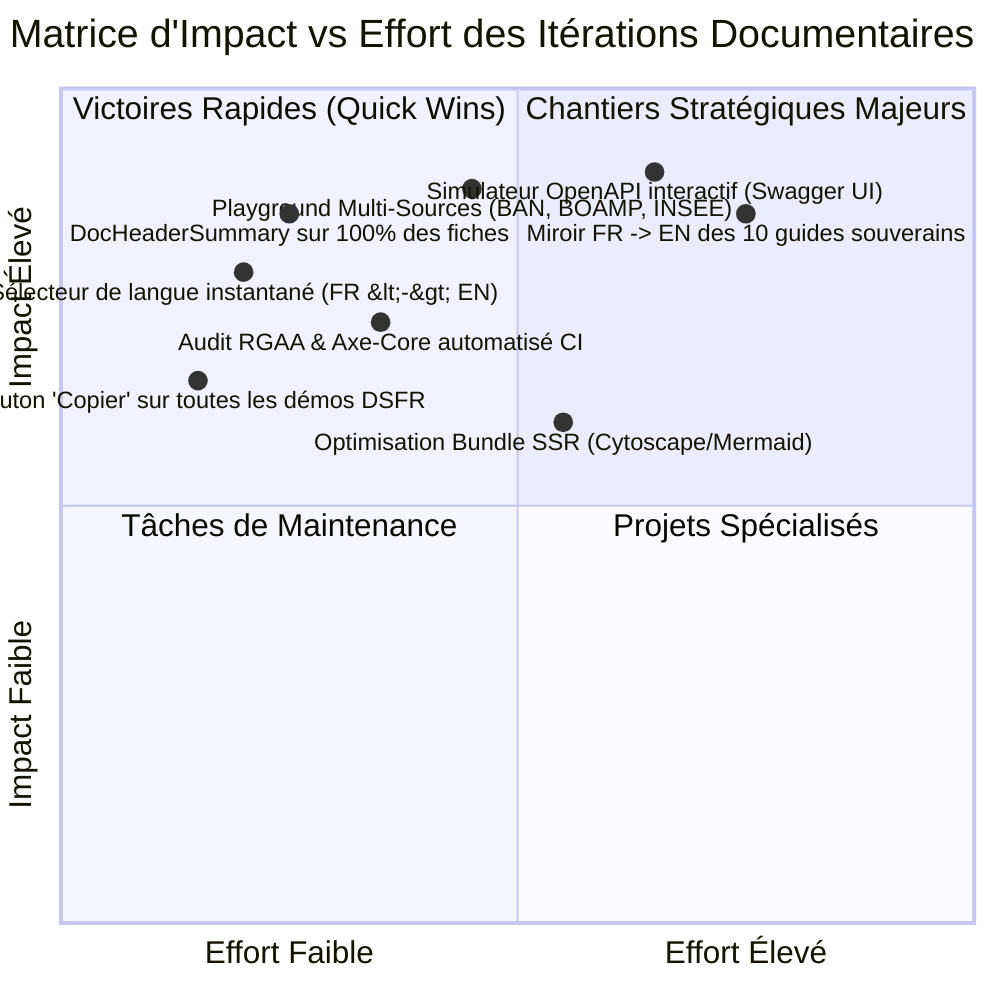
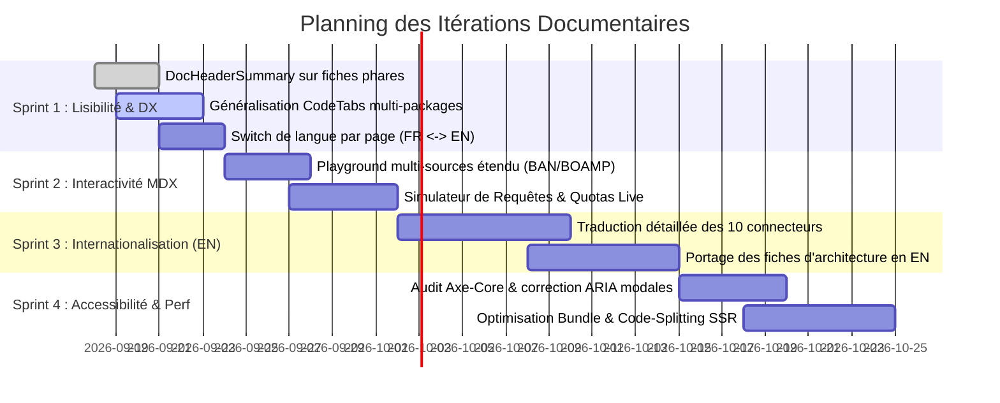

# 🚀 Feuille de Route d'Itérations & Amélioration Continue de la Documentation (`ITERATION.md`)

**Date :** 18 Septembre 2026  
**Périmètre :** Portail Zudoku SSR, Composants interactifs MDX, Documentation Bilingue FR / EN, Expérience Développeur (DX), Accessibilité RGAA v4.1 AA.  
**Objectif :** Transformer le portail documentaire en une référence internationale d'Infrastructure Publique Numérique (DPI / DPG) alliant clarté pédagogique, interactivité et rigueur architecturale.

---

## 🧭 1. Vision Stratégique & Matrice d'Impact / Effort



---

## 🎯 2. Les 4 Sprints d'Itérations



---

## 📋 3. Détail des Itérations par Axe

### ⚡ Axe 1 : Lisibilité Immédiate & Clarté Pédagogique (Quick Wins)

| Réf. | Itération Proposée | Description & Bénéfice Développeur | Priorité |
| :--- | :--- | :--- | :---: |
| **IT-01** | **Généralisation de `<DocHeaderSummary>`** | Déployer le composant d'en-tête sur les 30 fiches métiers des connecteurs (`/loi`, `/entreprise`, etc.) avec temps de lecture, niveau et prérequis. | 🔴 Haute |
| **IT-02** | **Systématisation des `<PackageInstallTabs>` & `<PythonInstallTabs>`** | Remplacer les blocs de code shell statiques par des onglets interactifs pour les 4 gestionnaires JS (`pnpm`, `npm`, `yarn`, `bun`) et 4 Python (`uv`, `pip`, `poetry`, `pipenv`). | 🔴 Haute |
| **IT-03** | **Bouton « Copier le code » sur les démos DSFR** | Ajouter dans `DSFRPreviews.tsx` un bouton permettant de copier en un clic le snippet JSX officiel d'un bouton, d'une modale ou d'un badge. | 🟡 Moyenne |
| **IT-04** | **Basculement de Langue Contextuel** | Dans le bandeau ou l'en-tête de page, permettre de basculer directement de la version française à son équivalent anglais (`/fr/03-slasheurs-france/01-loi` $\leftrightarrow$ `/en/04-presets/european-union`). | 🔴 Haute |

---

### 🎮 Axe 2 : Interactivité & Immersion Développeur (Interactive MDX)

| Réf. | Itération Proposée | Description & Bénéfice Développeur | Priorité |
| :--- | :--- | :--- | :---: |
| **IT-05** | **Bac à Sable Multi-Sources (`BlockNoteSlashPlayground`)** | Étendre le playground interactif pour simuler l'insertion de parcelles cadastrales, de marchés publics BOAMP et d'adresses BAN avec bascule des 3 formats (Callout, Carte, Lien). | 🔴 Haute |
| **IT-06** | **Simulateur d'APIs & Testeur de Quotas** | Créer un composant interactif permettant de tester en direct le comportement du disjoncteur (Circuit Breaker) et l'algorithme Token Bucket en injectant des codes d'erreur simulés (HTTP 429, 503). | 🟡 Moyenne |
| **IT-07** | **Explorateur Graphique des 41 Connecteurs** | Créer une carte interactive filtrable par pays (🇫🇷, 🇪🇺, 🇨🇦, 🇩🇪, 🇳🇱, 🇪🇸, 🌍) et par type d'entité (`law`, `company`, `stats`, `procurement`). | 🟡 Moyenne |

---

### 🌍 Axe 3 : Internationalisation Complète (`docs/en/`)

| Réf. | Itération Proposée | Description & Bénéfice Développeur | Priorité |
| :--- | :--- | :--- | :---: |
| **IT-08** | **Miroir Pédagogique FR $\rightarrow$ EN pour les 10 Connecteurs** | Compléter `docs/en/04-presets/` pour offrir le même niveau de détail (Pôle Métier / API / Code) pour les connecteurs européens et canadiens (EUR-Lex, Justice Laws Canada, Destatis, etc.). | 🔴 Haute |
| **IT-09** | **Spécification OpenAPI 3.0 Intégrée (Zudoku API Plugin)** | Connecter la spécification OpenAPI générée du backend Django directement dans Zudoku pour générer un explorateur d'API interactif type Swagger / Redoc. | 🟡 Moyenne |
| **IT-10** | **Glossaire Terminologique Bilingue** | Créer une table de correspondance terminologique (`CRDT`, `Yjs`, `Anti-SSRF`, `Token Bucket`, `Hairpin NAT`, `DPGA Indicators`). | 🟢 Basse |

---

### ♿ Axe 4 : Accessibilité (RGAA v4.1 AA) & Performance SSR

| Réf. | Itération Proposée | Description & Bénéfice Développeur | Priorité |
| :--- | :--- | :--- | :---: |
| **IT-11** | **Audit Axe-Core Automatisé dans la CI** | Ajouter un script de test automatisé Playwright + `@axe-core/playwright` vérifiant 0 violation d'accessibilité sur les 288 pages pré-rendues. | 🔴 Haute |
| **IT-12** | **Renforcement des Micro-Attributs ARIA** | Vérifier et compléter systématiquement les attributs `aria-controls`, `aria-expanded` et `aria-haspopup` sur tous les accordéons et popovers de la documentation. | 🟡 Moyenne |
| **IT-13** | **Optimisation du Code-Splitting des Diagrammes Lourds** | Isoler le chargement de Cytoscape et Mermaid via du dynamic import (`React.lazy`) pour alléger le bundle initial du serveur SSR. | 🟡 Moyenne |

---

## 🛠️ 4. Exemples Concrets d'Implémentation Prêts à l'Emploi

### Exemple d'En-tête Synthétique à Déployer sur `/loi` :

```mdx
<DocHeaderSummary
  readingTime="4 min"
  level="Intermédiaire"
  roles={["Juriste", "Frontend React", "Backend Django"]}
  prerequisites={["API Légifrance / PISTE", "OAuth2 Client Credentials"]}
  status="Production Ready"
  statusColor="success"
  takeaway="Recherche plein texte instantanée dans les codes et lois françaises avec extraction d'articles in extenso et cache SHA-256 (24h)."
/>
```

### Exemple de Comparateur d'API Réactif :

```mdx
<DualLanguageTabs
  tsTitle="SDK Client (TypeScript)"
  pyTitle="Connecteur Django (Python)"
  tsCode={`export const lawProvider = defineSourceProvider({
  type: "law",
  slashCommand: "loi",
  search: async (q) => fetch(\`/api/v1.0/sources/search/?type=law&q=\${q}\`).then(r => r.json()),
});`}
  pyCode={`class LawSourceProvider(BaseSourceProvider):
    source_type = "law"
    API_URL = "https://api.piste.gouv.fr/dila/legifrance/v1"
    def search(self, query: str, limit: int = 5) -> list[SourceSearchResult]:
        return self._fetch_piste_api(query, limit)`}
/>
```

---

## 🏁 5. Indicateurs Clés de Succès (KPIs)

- **Couverture Bilingue :** Parité 100% entre `docs/fr/` et `docs/en/`.
- **Score d'Accessibilité :** 0 erreur bloquante au validateur Axe-Core (Conformité RGAA v4.1 AA).
- **Temps de Chargement :** Prémontage SSR $< 25\text{s}$ pour 300+ routes et FCP $< 0.8\text{s}$ sur navigateur.
- **Engagement Développeur :** Possibilité de tester un connecteur dans le bac à sable sans installer d'environnement local.
