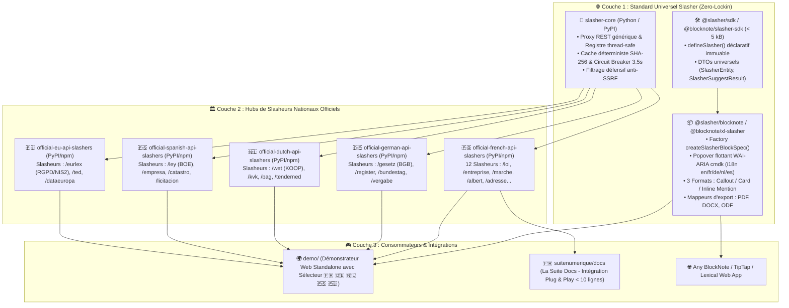

# 🚀 Plan d'Itération Stratégique & Naming : Écosystème Slasher (`ITERATION_SLASHER.md`)

> **Projet :** **Slasher** — Le standard universel de connecteurs `/slash` distants pour BlockNote et éditeurs riches  
> **Destinataires :** Direction Interministérielle du Numérique (DINUM), TypeCellOS/BlockNote, Développeurs & Architectes Internationaux  
> **Date de Référence :** 17 Septembre 2026  
> **Statut :** 📋 **Proposition de Plan d'Itération & Matrice d'Architecture Multi-Pays**

---

## 🧭 1. Vision d'Ingénierie & Repositionnement : « Slasher » & « Slasheurs »

### 💡 1.1. Du terme générique *Sources* vers la marque d'action *Slasheurs*
Le terme *« Sources »* était trop passif et portait à confusion avec le code source d'un logiciel.  
Le concept de **Slasheur** (ou *Slasher*) désigne activement le connecteur intelligent qui écoute une commande slash (`/loi`, `/gesetz`, `/wet`, `/ley`), interroge une API distante sécurisée et injecte une entité certifiée dans l'éditeur.

### 🏛️ 1.2. Architecture Modulaire en 3 Couches : Cœur Universel + Hubs Nationaux

---

## 📋 2. Découpage du Plan d'Itération par Phase

---

### 🏷️ PHASE 1 : Refonte du Naming & Renommage des Packages

**Objectif :** Établir une nomenclature claire, prédictible et extensible par pays pour les packages Python (PyPI) et TypeScript (npm).

#### A. Packages TypeScript (npm Workspaces)
| Ancien Nom | Nouveau Nom Cible (Standard) | Alias Souverain / Upstream | Rôle |
| :--- | :--- | :--- | :--- |
| `slash-sources-sdk` | `@slasher/sdk` | `@blocknote/slasher-sdk` | SDK TypeScript universel déclaratif (< 5 kB) |
| `blocknote-sources` | `@slasher/blocknote` | `@blocknote/xl-slasher` | Extension BlockNote.js (3 formats, popover, exports) |
| *(intégré aux mocks)* | `@slasher/presets-international` | `@suitenumerique/slasher-france` | Presets multi-pays (FR, DE, NL, ES, EU) |

#### B. Packages Python Backend (PyPI)
| Ancien Dossier / Nom | Nouveau Nom Cible | Rôle |
| :--- | :--- | :--- |
| `django-lasuite-sources` (cœur) | `django-slasher-core` *(ou `slasher-core`)* | Middleware DRF générique, anti-SSRF, cache Redis SHA-256 |
| `lasuite_sources/providers/*` | `official-french-api-slashers` | 12 connecteurs souverains français (DILA, RNE, BAN, BOAMP...) |
| *(nouveau module)* | `official-german-api-slashers` | Connecteurs officiels allemands (Gesetze im Internet, Handelsregister) |
| *(nouveau module)* | `official-dutch-api-slashers` | Connecteurs officiels néerlandais (Wettenbank, KVK, BAG, TenderNed) |
| *(nouveau module)* | `official-spanish-api-slashers` | Connecteurs officiels espagnols (BOE, Registro Mercantil, Catastro) |
| *(nouveau module)* | `official-eu-api-slashers` | Connecteurs officiels européens (EUR-Lex, TED eProcurement) |

- [ ] **Tâche 1.1 : Renommer les dossiers et schémas `package.json` / `pyproject.toml`**
- [ ] **Tâche 1.2 : Adapter les alias de résolution TypeScript dans `tsconfig.json` et `vite.config.ts`**
- [ ] **Tâche 1.3 : Créer les classes et modules de slasheurs pour l'Espagne (`official-spanish-api-slashers`)**

---

### 🌐 PHASE 2 : Ajout du Preset Espagnol 🇪🇸 & Enrichissement Multi-Pays

**Objectif :** Doter le projet Slasher d'un 5ᵉ preset souverain complet pour l'Espagne (BOE, Registro Mercantil, Catastro, BDNS, Contratación del Estado).

- [ ] **Tâche 2.1 : Dataset Mock Espagnol (`packages/blocknote-sources/src/mockData/spain.ts`)**
  - `/ley` : *Ley Orgánica 3/2018 de Protección de Datos Personales (LOPDGDD)* (Bordure `#AA151B`, badge `En vigor`).
  - `/empresa` : *Telefónica S.A.* (CIF A-28015865, Registro Mercantil de Madrid).
  - `/licitacion` : *Plataforma de Contratación del Sector Público* (Avis n°ES-2026-8812).
  - `/catastro` : Référence cadastrale officielle Sede del Catastro.
- [ ] **Tâche 2.2 : Moteur i18n Espagnol (`src/i18n/locales.ts`)**
  - Ajout du dictionnaire complet `es` pour les textes du popover, des formats et des statuts.
- [ ] **Tâche 2.3 : Intégration du drapeau 🇪🇸 dans le Démonstrateur Web (`demo/src/App.tsx`)**

---

### 🐍 PHASE 3 : Modularisation des Providers Django par Pays

**Objectif :** Séparer le moteur Django (`slasher-core`) des connecteurs nationaux (`official-*-api-slashers`).

- [ ] **Tâche 3.1 : Structuration de `slasher_core`**
  - `base.py` : `BaseSlasherProvider`
  - `registry.py` : `SlasherRegistry` thread-safe
  - `views.py` : Endpoints `/slashers/suggest/`, `/slashers/search/`, `/slashers/<country>/<type>/<id>/`
- [ ] **Tâche 3.2 : Organisation des packages de slasheurs nationaux**
  - `providers/france/` $\rightarrow$ 12 slasheurs français.
  - `providers/germany/` $\rightarrow$ Slasheurs allemands.
  - `providers/netherlands/` $\rightarrow$ Slasheurs néerlandais.
  - `providers/spain/` $\rightarrow$ Slasheurs espagnols.
  - `providers/europe/` $\rightarrow$ Slasheurs européens.

---

### 📚 PHASE 4 : Alignement de la Documentation Zudoku Bilingue

**Objectif :** Remplacer le terme `sources` par `slasheurs` dans la documentation Zudoku et finaliser la transition bilingue (/en et /fr).

- [ ] **Tâche 4.1 : Renommer la section documentaire `08-slash` $\rightarrow$ `08-slasheurs`**
- [ ] **Tâche 4.2 : Mettre à jour les guides et diagrammes avec le vocabulaire Slasher**
- [ ] **Tâche 4.3 : Adapter le script de génération de navigation `generate-docs-navigation.mjs`**

---

## 🎯 3. Tableau de Correspondance Terminologique (Glossaire Slasher)

| Ancien Terme | Nouveau Terme Officiel | English Standard | Nederlands | Español |
| :--- | :--- | :--- | :--- | :--- |
| **Source connectée** | **Slasheur** | **Slasher** | **Slasher / Koppeling** | **Slasher / Conector** |
| **SourceBlock** | **SlasherBlock** | **SlasherBlock** | **SlasherBlok** | **Bloque Slasher** |
| **SourceSearchPopover** | **SlasherSearchPopover** | **SlasherSearchPopover** | **SlasherZoekvenster** | **Buscador Slasher** |
| **SourceEntity** | **SlasherEntity** | **SlasherEntity** | **SlasherEntiteit** | **Entidad Slasher** |
| **SourceProvider** | **SlasherProvider** | **SlasherProvider** | **SlasherProvider** | **Proveedor Slasher** |
| **Sources Souveraines** | **Slasheurs Souverains** | **Sovereign Slashers** | **Overheidsslashers** | **Slashers Soberanos** |

---

## 🚀 4. Recommandation d'Exécution

Souhaitez-vous que nous commencions par :
1. **Étape 1 :** Créer le dataset et le dictionnaire **Espagnol 🇪🇸** dans le frontend et la démo ?
2. **Étape 2 :** Renommer et réorganiser les packages TypeScript et Django vers la nomenclature `slasher` / `official-*-api-slashers` ?
3. **Étape 3 :** Mettre à jour l'arborescence documentaire Zudoku ?
