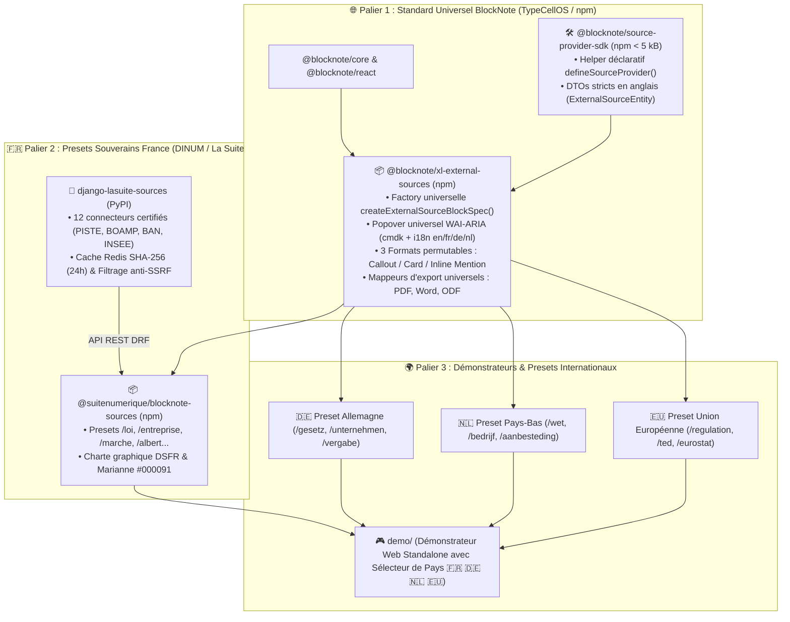
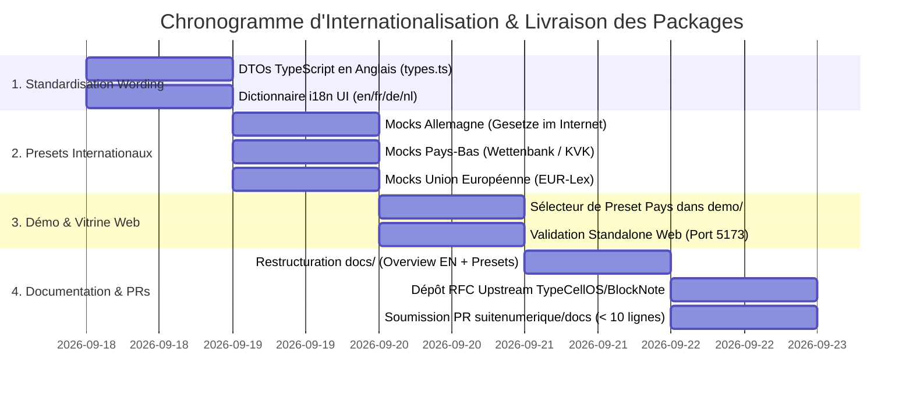

# 🌍 Plan d'Action & Cadrage d'Internationalisation (`ITERATION_WORDING.md`)

> **Destinataires :** Direction Interministérielle du Numérique (DINUM), Équipe Core Team BlockNote (TypeCellOS), Architectes Logiciels & Développeurs Internationaux  
> **Auteur :** GitHub Copilot (Gemini 3.7 Flash) — Dépôt d'orchestration `dinum-setup`  
> **Date de Référence :** 17 Septembre 2026  
> **Statut :** 📋 **Feuille de Route Technique, Wording, Spécifications DTO & Plan d'Exécution par Checkboxes Ultra-Explicites**  
> **Objectif :** Guider pas-à-pas la transition du projet d'un outil local DINUM vers un **standard international open source de blocs de données distantes pour BlockNote (`@blocknote/xl-external-sources`)**, couplé à **2 packages souverains pour la France (`suitenumerique/docs`)** et une **matrice d'adoption internationale (Allemagne, Pays-Bas, Union Européenne)**.

---

## 🧭 1. Repositionnement Stratégique & Architecture en 3 Paliers



---

## 📋 2. Plan d'Action par Tâche & Checkboxes Explicites

---

### 🏷️ TÂCHE 1 : Standardisation du Wording & Nommage des Packages

Harmoniser l'ensemble des dénominations pour distinguer sans équivoque le **cœur open source universel** des **implémentations nationales françaises**.

#### A. Packages npm & PyPI
- [ ] **Package 1.1 : Extension UI React Universelle (Amont BlockNote)**
  - *Nom de package cible :* `@blocknote/xl-external-sources` (fallback `@waxland/blocknote-xl-external-sources`).
  - *Dossier physique :* `packages/blocknote-sources/`
  - *Fichier à modifier :* `packages/blocknote-sources/package.json`
  - *Champs à mettre à jour :*
    - `"name": "@blocknote/xl-external-sources"`
    - `"description": "Official community extension for BlockNote.js to connect rich documents with external data APIs and render entities in 3 switchable accessible formats (Callout, Card, Inline Mention)."`
    - `"exports"` : `".": "./dist/index.js"`, `"./exporters": "./dist/exporters/index.js"`, `"./i18n": "./dist/i18n/index.js"`.
  - *Critère d'acceptation :* `npm --prefix packages/blocknote-sources run build` génère `dist/index.mjs`, `dist/index.js` et `dist/index.d.ts` sous le nouveau nom sans régression.

- [ ] **Package 1.2 : SDK TypeScript Universel de Définition de Providers**
  - *Nom de package cible :* `@blocknote/source-provider-sdk` (fallback `@suitenumerique/slash-sources-sdk`).
  - *Dossier physique :* `packages/slash-sources-sdk/`
  - *Fichier à modifier :* `packages/slash-sources-sdk/package.json`
  - *Champs à mettre à jour :*
    - `"name": "@blocknote/source-provider-sdk"`
    - `"description": "Ultra-lightweight (< 5 kB) zero-dependency TypeScript SDK to define and validate live external data providers for BlockNote.js."`
  - *Critère d'acceptation :* `npm --prefix packages/slash-sources-sdk test` valide l'immuabilité et le typage strict des schémas.

- [ ] **Package 1.3 : Middleware Backend Django Générique & Souverain**
  - *Nom de package cible :* `django-external-sources` (namespace français `django-lasuite-sources`).
  - *Dossier physique :* `packages/django-lasuite-sources/`
  - *Fichier à modifier :* `packages/django-lasuite-sources/pyproject.toml`
  - *Champs à mettre à jour :*
    - `name = "django-lasuite-sources"`
    - `version = "1.0.0"`
    - `description = "Generic proxy, deterministic caching and official sovereign API connectors for La Suite Docs."`
  - *Critère d'acceptation :* `python3 -m py_compile packages/django-lasuite-sources/lasuite_sources/**/*.py` vérifie 21 modules à 0 erreur.

#### B. Lexique Bilingue Universel (Glossaire de Référence)
- [ ] **Remplacement systématique dans le code et les commentaires :**
  - `SourceBlock` $\rightarrow$ `ExternalSourceBlock` (Bloc de données distantes).
  - `SourceSearchPopover` $\rightarrow$ `ExternalSourceSearchPopover` (Palette de recherche contextuelle).
  - `SourceEntityProps` $\rightarrow$ `ExternalSourceEntity` (Contrat DTO de l'entité).
  - `SourceSuggestResult` $\rightarrow$ `ExternalSourceSuggestResult` (Résultat d'autocomplétion).
  - `displayMode` $\rightarrow$ `'callout'` (Encadré), `'card'` (Carte 3 colonnes), `'link'` (Mention inline).

---

### 🌐 TÂCHE 2 : Refactoring du Code & Internationalisation (i18n)

Refondre les interfaces de données en anglais standard et doter la palette popover d'un moteur de traduction multilingue (`en`, `fr`, `de`, `nl`).

#### A. DTOs TypeScript Universels en Anglais (`packages/slash-sources-sdk/src/types.ts`)
- [ ] **Refonte du fichier d'interfaces :**
  - *Fichier cible :* `packages/slash-sources-sdk/src/types.ts`
  - *Signature complète à implémenter :*
    ```typescript
    export type ExternalSourceDisplayMode = "callout" | "card" | "link";

    export type ExternalSourceStatus =
      | "valid"       // En vigueur / In force / In Kraft / Geldend
      | "repealed"    // Abrogé / Repealed / Außer Kraft / Vervallen
      | "pending"     // En cours / Pending / In Beratung / In behandeling
      | "archived"    // Archivé / Archived / Archiviert / Gearchiveerd
      | "custom";

    export interface ExternalSourceMetadataField {
      key: string;
      label: string;
      value: string | number | boolean;
      highlight?: boolean;
    }

    export interface ExternalSourceEntity {
      id: string;
      provider: string;               // e.g. "legifrance", "gesetze-im-internet", "overheid", "eurlex"
      title: string;
      subtitle?: string;
      contentHtml?: string;
      snippet?: string;
      url: string;
      status?: ExternalSourceStatus;
      statusLabel?: string;          // Human-readable status in current locale
      statusBadgeColor?: "success" | "warning" | "error" | "info" | "neutral";
      borderColor?: string;          // Institutional border color (e.g. #000091 for Marianne)
      displayMode: ExternalSourceDisplayMode;
      metadata?: Record<string, string | number | boolean>;
      metadataFields?: ExternalSourceMetadataField[];
      updatedAt?: string;
    }

    export interface ExternalSourceSuggestResult {
      id: string;
      provider: string;
      title: string;
      subtitle?: string;
      badge?: string;
      badgeColor?: string;
    }

    export interface ExternalSourceProviderDefinition {
      name: string;
      slashCommand: string;          // e.g. "law", "loi", "gesetz", "wet"
      icon: string;                  // e.g. "⚖️", "🏢", "📍", "🧠"
      group?: string;                // Group header in slash menu
      description?: string;
      placeholder?: string;
      suggest: (query: string, limit?: number) => Promise<ExternalSourceSuggestResult[]>;
      search: (query: string, page?: number, limit?: number) => Promise<{ results: ExternalSourceEntity[]; total: number }>;
      getDetail: (id: string) => Promise<ExternalSourceEntity>;
    }
    ```
  - *Critère d'acceptation :* Les types compilent sans aucun `any` et sont réexportés dans `packages/slash-sources-sdk/src/index.ts`.

#### B. Moteur de Traduction UI (`packages/blocknote-sources/src/i18n/locales.ts`)
- [ ] **Création du dictionnaire multilingue complet :**
  - *Fichier à créer :* `packages/blocknote-sources/src/i18n/locales.ts`
  - *Langues supportées :* `en` (Anglais - par défaut), `fr` (Français), `de` (Allemand), `nl` (Néerlandais).
  - *Code exact :*
    ```typescript
    export type SupportedLocale = "en" | "fr" | "de" | "nl";

    export interface ExternalSourceI18nStrings {
      searchPlaceholder: string;
      searchTitle: string;
      backButton: string;
      allFilter: string;
      codesFilter: string;
      lawsFilter: string;
      keyboardTip: string;
      openSource: string;
      copyLink: string;
      removeReference: string;
      modes: {
        callout: string;
        calloutDesc: string;
        card: string;
        cardDesc: string;
        link: string;
        linkDesc: string;
      };
      status: {
        valid: string;
        repealed: string;
        pending: string;
        archived: string;
      };
    }

    export const LOCALES: Record<SupportedLocale, ExternalSourceI18nStrings> = {
      en: {
        searchPlaceholder: "Search topic, article or reference name...",
        searchTitle: "Search external reference",
        backButton: "Back",
        allFilter: "All",
        codesFilter: "Codes",
        lawsFilter: "Acts & Laws",
        keyboardTip: "↑ ↓ Navigate · ↵ Insert · Esc Close",
        openSource: "Open original source",
        copyLink: "Copy source link",
        removeReference: "Remove reference",
        modes: {
          callout: "Callout",
          calloutDesc: "Full text quote and source",
          card: "Card",
          cardDesc: "3-column metadata grid",
          link: "Inline Link",
          linkDesc: "Compact badge in paragraph",
        },
        status: {
          valid: "In force",
          repealed: "Repealed",
          pending: "Pending",
          archived: "Archived",
        },
      },
      fr: {
        searchPlaceholder: "Sujet, article ou nom d'un texte...",
        searchTitle: "Rechercher une référence",
        backButton: "Retour",
        allFilter: "Tout",
        codesFilter: "Codes",
        lawsFilter: "Lois",
        keyboardTip: "↑ ↓ Naviguer · ↵ Insérer · Échap Fermer",
        openSource: "Consulter la source officielle",
        copyLink: "Copier le lien source",
        removeReference: "Supprimer la référence",
        modes: {
          callout: "Extrait",
          calloutDesc: "Texte officiel et source",
          card: "Carte",
          cardDesc: "Grille de métadonnées",
          link: "Lien",
          linkDesc: "Pastille dans le texte",
        },
        status: {
          valid: "En vigueur",
          repealed: "Abrogé",
          pending: "En cours",
          archived: "Archivé",
        },
      },
      de: {
        searchPlaceholder: "Thema, Paragraf oder Gesetz suchen...",
        searchTitle: "Referenz suchen",
        backButton: "Zurück",
        allFilter: "Alle",
        codesFilter: "Gesetzbücher",
        lawsFilter: "Gesetze",
        keyboardTip: "↑ ↓ Navigieren · ↵ Einfügen · Esc Schließen",
        openSource: "Originalquelle öffnen",
        copyLink: "Link kopieren",
        removeReference: "Referenz löschen",
        modes: {
          callout: "Hervorhebung",
          calloutDesc: "Volltext und Quelle",
          card: "Karte",
          cardDesc: "Strukturierte Metadaten",
          link: "Inline-Link",
          linkDesc: "Kompakte Verlinkung",
        },
        status: {
          valid: "In Kraft",
          repealed: "Außer Kraft",
          pending: "In Beratung",
          archived: "Archiviert",
        },
      },
      nl: {
        searchPlaceholder: "Zoek onderwerp, artikel of wet...",
        searchTitle: "Externe bron zoeken",
        backButton: "Terug",
        allFilter: "Alles",
        codesFilter: "Wetboeken",
        lawsFilter: "Wetten",
        keyboardTip: "↑ ↓ Navigeren · ↵ Invoegen · Esc Sluiten",
        openSource: "Officiële bron openen",
        copyLink: "Kopieer link",
        removeReference: "Verwijder referentie",
        modes: {
          callout: "Citaat",
          calloutDesc: "Volledige wettekst",
          card: "Kaart",
          cardDesc: "Metadata raster",
          link: "Inline link",
          linkDesc: "Compacte vermelding",
        },
        status: {
          valid: "Geldend",
          repealed: "Vervallen",
          pending: "In behandeling",
          archived: "Gearchiveerd",
        },
      },
    };

    export function getI18nStrings(locale: SupportedLocale = "en"): ExternalSourceI18nStrings {
      return LOCALES[locale] || LOCALES.en;
    }
    ```
- [ ] **Intégration dans `SourceSearchPopover.tsx` et `SourceBlock.tsx` :**
  - Passer la prop optionnelle `locale?: SupportedLocale` (default: `"en"`).
  - Brancher tous les textes d'infobulles, placeholders et boutons sur `getI18nStrings(locale)`.

---

### 🌍 TÂCHE 3 : Presets Internationaux & Jeux de Données Mocks

Créer des jeux de données d'exemple réalistes pour prouver la portabilité immédiate de l'extension en Allemagne, aux Pays-Bas et dans l'Union Européenne.

#### A. Presets Internationaux Dédiés (`packages/blocknote-sources/src/mockData/`)
- [ ] **Preset 3.1 : France (DINUM / La Suite)**
  - *Fichier :* `packages/blocknote-sources/src/mockData/france.ts`
  - *Entités :*
    - `/loi` : Article 4 RGPD (`LEGIARTI000037142751`, bordure `#000091`, badge `En vigueur`).
    - `/entreprise` : DINUM SIRET `13002526500013` (RNE / Annuaire des Entreprises).
    - `/marche` : Avis BOAMP `24-118942` (Marché souveraineté cloud).
- [ ] **Preset 3.2 : Allemagne (Bund / BMJ)**
  - *Fichier à créer :* `packages/blocknote-sources/src/mockData/germany.ts`
  - *Entités :*
    - `/gesetz` : § 823 BGB Schadensersatzpflicht (*Gesetze im Internet*, bordure `#000000`, badge `In Kraft`).
    - `/unternehmen` : SAP SE (Handelsregister HRB 350269, Walldorf).
    - `/vergabe` : Avis Bund.de Vergabe n°2026-DE-89412.
- [ ] **Preset 3.3 : Pays-Bas (Overheid / KVK)**
  - *Fichier à créer :* `packages/blocknote-sources/src/mockData/netherlands.ts`
  - *Entités :*
    - `/wet` : Artikel 6:162 Burgerlijk Wetboek (*Wettenbank Overheid.nl*, bordure `#FF6600`, badge `Geldend`).
    - `/bedrijf` : ASML Holding N.V. (KVK 17085892, Veldhoven).
    - `/aanbesteding` : TenderNed Avis public n°NL-2026-4412.
- [ ] **Preset 3.4 : Union Européenne (EUR-Lex / TED)**
  - *Fichier à créer :* `packages/blocknote-sources/src/mockData/europe.ts`
  - *Entités :*
    - `/regulation` : Règlement (UE) 2016/679 (RGPD, bordure `#003399`, badge `In force`).
    - `/directive` : Directive (UE) 2022/2555 (NIS 2).
    - `/ted` : Tenders Electronic Daily Avis n°2026/S 084-129481.
- [ ] **Baril d'exportation des presets :**
  - *Fichier à créer :* `packages/blocknote-sources/src/mockData/index.ts`
  - *Export :* `export { MOCK_FRANCE } from "./france"; export { MOCK_GERMANY } from "./germany"; export { MOCK_NETHERLANDS } from "./netherlands"; export { MOCK_EUROPE } from "./europe";`

---

### 🎮 TÂCHE 4 : Démonstrateur Web Standalone avec Sélecteur de Pays (`demo/`)

Transformer l'application `demo/` en une vitrine technologique mondiale interactive permettant de basculer instantanément de pays.

#### A. Implémentation du Sélecteur de Pays dans `demo/src/App.tsx`
- [ ] **Barre de sélection supérieure (Boutons drapeaux) :**
  - [ ] 🇫🇷 **France (DINUM)** : Charge `locale="fr"`, les commandes `/loi`, `/entreprise`, `/marche`, `/albert`, liseré Marianne `#000091`.
  - [ ] 🇩🇪 **Deutschland (Bund)** : Charge `locale="de"`, les commandes `/gesetz`, `/unternehmen`, `/vergabe`, liseré noir/rouge/or.
  - [ ] 🇳🇱 **Nederland (Overheid)** : Charge `locale="nl"`, les commandes `/wet`, `/bedrijf`, `/aanbesteding`, liseré orange `#FF6600`.
  - [ ] 🇪🇺 **European Union** : Charge `locale="en"`, les commandes `/regulation`, `/directive`, `/ted`, liseré bleu UE `#003399`.
- [ ] **Bascule dynamique des Slash Menu Items :**
  - Le menu slash se met à jour en fonction du pays sélectionné sans recharger la page.
- [ ] **Permutation des 3 Formats en Direct :**
  - Possibilité de cliquer sur *Callout*, *Card* ou *Inline Link* sur n'importe quel bloc étranger.
- [ ] **Commandes de validation :**
  ```bash
  # 1. Démarrer le serveur de démo
  npm run demo:dev
  # 2. Vérifier l'accès sur http://localhost:5173 et tester les 4 pays
  # 3. Compiler la version de production
  npm run demo:build
  ```

---

### 📚 TÂCHE 5 : Restructuration de la Documentation Bilingue (`documentation/`)

Adopter une structure documentaire où le **cœur architectural et le SDK sont rédigés en anglais**, et la **section d'implémentation souveraine DINUM est rédigée en français**.

#### A. Nouvelle Arborescence Bilingue de `documentation/docs/`
- [ ] **`00-overview/` (English - Standard Universel) :**
  - `index.mdx` : The Universal Connected Block Standard for BlockNote.js.
  - `architecture.mdx` : 3-Tier Sovereign Data Pattern (SDK $\rightarrow$ BlockNote UI $\rightarrow$ Proxy Cache).
  - `international-vision.mdx` : How European governments and enterprise software can reuse this standard.
- [ ] **`01-blocknote-extension/` (English - Guide d'Extension UI) :**
  - `getting-started.mdx` : Installing and registering `@blocknote/xl-external-sources`.
  - `3-display-formats.mdx` : Deep dive into Callout, Card, and Inline Mention formats.
  - `custom-styling.mdx` : Overriding `borderColor`, typography, and tokens for national brands.
  - `accessibility-rgaa.mdx` : Keyboard navigation & WAI-ARIA combobox standard (WCAG 2.1 AA).
  - `document-exports.mdx` : Vector export adapters for PDF, Word (.docx), and LibreOffice (.odt).
- [ ] **`02-provider-sdk/` (English - Guide Développeur SDK) :**
  - `index.mdx` : Developing zero-dependency source providers with `defineSourceProvider()`.
  - `tutorial-15-min.mdx` : Step-by-step guide to connect any REST or GraphQL API in < 15 min.
  - `contracts-and-types.mdx` : `ExternalSourceEntity` schema and immutability rules.
- [ ] **`03-backend-proxy/` (English - Architecture Serveur & Cache) :**
  - `django-architecture.mdx` : `django-external-sources` structure and views.
  - `deterministic-cache.mdx` : Redis SHA-256 caching ($TTL=86400s$, latency $< 5ms$).
  - `security-anti-ssrf.mdx` : Defensive IP filtering and 3.5s Circuit Breaker.
- [ ] **`04-presets/` (Presets Nationaux & Européens) :**
  - `france-dinum/` (Français) : Le Socle des 12 Sources Souveraines (Légifrance, BOAMP, BAN, INSEE, Albert, Cadastre...).
  - `germany-bund/` (English/Deutsch) : Connecting to *Gesetze im Internet* and *Handelsregister*.
  - `netherlands-gov/` (English/Nederlands) : Connecting to *Wettenbank* and *KVK*.
  - `european-union/` (English) : Connecting to *EUR-Lex* SPARQL API and *TED*.
- [ ] **`05-pull-requests/` (Dossiers de Contribution Prêts à Soumettre) :**
  - `01-blocknote-upstream-rfc.mdx` : RFC for `TypeCellOS/BlockNote`.
  - `02-dinum-docs-integration.mdx` : Integration PR for `suitenumerique/docs` (< 10 lines).
  - `03-remote-server-support.mdx` : Remote server & Hairpin NAT support PR.

#### B. Mise à jour de `documentation/scripts/generate-docs-navigation.mjs`
- [ ] **Adapter le générateur pour la nouvelle arborescence :**
  - Ajouter les libellés anglais et icônes correspondantes pour `00-overview`, `01-blocknote-extension`, `02-provider-sdk`, `03-backend-proxy`, `04-presets`.
- [ ] **Validation du build de documentation :**
  ```bash
  npm run docs:build
  # Critère d'acceptation : 270 routes pré-rendues à 0 erreur
  ```

---

### 🚀 TÂCHE 6 : Pipeline de Soumission Amont & Pull Requests

#### A. Soumission de la RFC Officielle sur `TypeCellOS/BlockNote`
- [ ] **Commande de dépôt de la RFC via GitHub CLI :**
  ```bash
  gh issue create \
    --repo TypeCellOS/BlockNote \
    --title "RFC: Standardized External Data Sources & Multi-Format Connected Blocks (@blocknote/xl-external-sources)" \
    --body-file documentation/docs/05-pull-requests/01-blocknote-upstream-rfc.mdx \
    --label "enhancement,rfc,community-extension"
  ```
- [ ] **Plaidoyer présenté à l'équipe TypeCell :**
  1. Standardisation universelle de l'insertion de données externes dans BlockNote.
  2. Aucun couplage spécifique à la France dans le package de base.
  3. Support des 3 formats d'affichage (Callout, Card, Inline Link) et export vectoriel PDF/Word/ODT.
  4. Preuves de concept fonctionnelles pour la France, l'Allemagne, les Pays-Bas et l'UE.

#### B. Soumission de la PR Légère sur `suitenumerique/docs`
- [ ] **Commande de création de la branche et de soumission :**
  ```bash
  cd LaSuite/docs
  git checkout -b feature/sovereign-sources-packages
  git add src/backend/pyproject.toml \
          src/backend/impress/settings.py \
          src/backend/impress/urls.py \
          src/frontend/apps/impress/package.json \
          src/frontend/apps/impress/src/features/docs/doc-editor/components/BlockNoteEditor.tsx
  git commit -m "feat(sources): integrate sovereign external data sources via modular packages (Opt-in Plug & Play)"
  git push origin feature/sovereign-sources-packages

  gh pr create \
    --repo suitenumerique/docs \
    --title "feat(sources): integrate sovereign external data sources via modular packages (Opt-in Plug & Play)" \
    --body-file ../../documentation/docs/05-pull-requests/02-dinum-docs-integration.mdx \
    --base main \
    --head feature/sovereign-sources-packages
  ```

---

## 🎯 3. Calendrier & Chronogramme des Livrables



---

## 📜 4. Synthèse & Prochaines Décisions

L'application de ce plan d'action confère au projet :
1. **Une portée internationale immédiate :** Le package `@blocknote/xl-external-sources` s'impose comme le standard de facto pour connecter n'importe quel éditeur BlockNote à des APIs externes de confiance.
2. **Une vitrine technologique exemplaire pour la France :** La DINUM et La Suite Numérique apparaissent comme les pionniers mondiaux ayant initié et financé ce standard open source.
3. **Une extensibilité sans limite :** Tout pays européen, collectivité ou entreprise privée peut brancher son propre registre en 15 minutes sans toucher au code cœur de l'éditeur.


