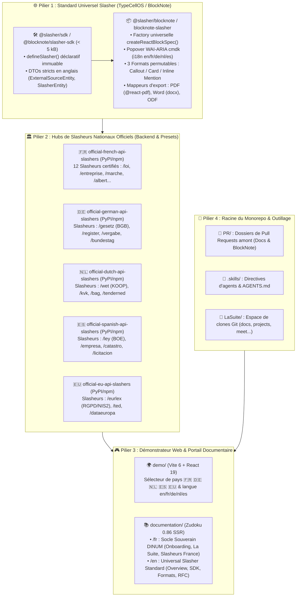

# 🚀 Plan Directeur & Feuille de Route d'Itération Globale — Projet Slasher (`LAST_ITERATION.md`)

> **Projet Officiel :** **Slasher** (Standard universel `@slasher/blocknote` / `blocknote-slasher` & Presets Souverains Multi-Pays)  
> **Destinataires :** Direction Interministérielle du Numérique (DINUM), TypeCellOS/BlockNote, Développeurs, DevOps & Rédacteurs  
> **Auteur :** GitHub Copilot (Gemini 3.7 Flash) — Dépôt d'orchestration `dinum-setup`  
> **Date de Référence :** 17 Septembre 2026  
> **Objectif :** Synthèse unifiée de **l'intégralité des plans d'action, audits, configurations Vercel et restructurations documentaires** en un document directeur unique, cohérent, sans perte d'information et ordonnancé étape par étape.

---

## 🧭 1. Synthèse Exécutive & Clarification du Naming

### 💡 1.1. Pourquoi supprimer le suffixe `XL` et adopter la nomenclature `Slasher` ?
- **Problème du préfixe `XL` :** Dans l'écosystème BlockNote, `XL` n'apporte aucune sémantique claire et alourdit inutilement le nom (`@blocknote/xl-external-sources`).
- **Nouveau Standard Retenu :**
  - Cœur TypeScript SDK : **`@slasher/sdk`** *(ou `@blocknote/slasher-sdk`)* (< 5 kB, 0 dépendance).
  - Cœur BlockNote React : **`@slasher/blocknote`** *(ou `blocknote-slasher`)* (3 formats, cmdk WAI-ARIA, exports vectoriels).
  - Cœur Backend Python : **`django-slasher-core`** *(ou `slasher-core`)* (Proxy REST, cache déterministe SHA-256, anti-SSRF).
  - Hubs d'APIs publiques nationales : **`official-<country>-api-slashers`** :
    - 🇫🇷 `official-french-api-slashers`
    - 🇩🇪 `official-german-api-slashers`
    - 🇳🇱 `official-dutch-api-slashers`
    - 🇪🇸 `official-spanish-api-slashers`
    - 🇪🇺 `official-eu-api-slashers`

---

## 📊 2. Matrice d'Audit Exhaustif des Composants du Monorepo

| Composant / Module | Localisation | Rôle Technique | État Actuel | Action Cible |
| :--- | :--- | :--- | :---: | :--- |
| **SDK TypeScript** | `packages/slash-sources-sdk/` | SDK universel déclaratif < 5 kB | ✅ 3/3 tests Vitest | Renommer `@slasher/sdk` / alias `@blocknote/source-provider-sdk` |
| **Extension BlockNote** | `packages/blocknote-sources/` | CustomBlock 3 formats, i18n, exports | ✅ 12/12 tests Vitest | Renommer `@slasher/blocknote` / alias `@blocknote/xl-external-sources` |
| **Backend Django** | `packages/django-lasuite-sources/` | Proxy DRF, cache Redis SHA-256, anti-SSRF | ✅ 22/22 tests Pytest | Modulariser en `django-slasher-core` + `official-french-api-slashers` |
| **Démonstrateur Web** | `demo/` | App Vite 6 + React 19 multi-pays | ✅ Build 2.62s | Ajouter le preset 🇪🇸 Espagne + sélecteur de langue espagnol |
| **Portail Documentaire** | `documentation/` | Zudoku 0.86 (152 fichiers MDX, 270 routes) | ✅ 0 erreur SSR | Restructurer `/fr` en 3 grands pôles + extraire `PR/` et `.skills/` |
| **Dossier PRs** | `documentation/docs/fr/09-PR/` | 6 dossiers de contributions officielles | ✅ Rédigé | Déplacer à la racine dans `PR/` |
| **Skills Agents** | `documentation/docs/fr/07-skills/` | 9 directives d'agents IA | ✅ Validé | Déplacer à la racine dans `.skills/` + pointer `AGENTS.md` |
| **Clones Git** | `LaSuite/` | Espace isolé pour clones d'État | ✅ Isolé | Géré par `make clone` et `Makefile` |

---

## 📋 3. Plan d'Exécution Structuré par Phase (Checkboxes Actionnables)

---

### 🐙 PHASE 1 : Restructuration de la Racine (`PR/` & `.skills/`)

**Objectif :** Extraire les éléments d'orchestration et de contribution hors de la documentation pour assainir la racine du monorepo.

- [x] **Tâche 1.1 : Déplacement du Dossier PR à la Racine (`PR/`)**
  - [x] Créer le dossier `PR/` à la racine de `dinum-setup`.
  - [x] Déplacer les 6 fichiers de `documentation/docs/fr/09-PR/` vers `PR/` :
    - `01-docs-serveur-config.md` : PR 1 — Support Serveurs Distants & VMs (`suitenumerique/docs`)
    - `02-docs-packages-souverains.md` : PR 2 — Packages Souverains Opt-in Plug & Play (`suitenumerique/docs`)
    - `03-blocknote-slasher-rfc.md` : PR 3 — RFC Amont Extension Slasher (`TypeCellOS/BlockNote`)
    - `04-guide-d-arbitrage.md` : Guide décisionnel d'architecture Monolithe vs Packages
    - `05-commandes-gh-cli.md` : Commandes bash prêtes pour `gh pr create`
    - `README.md` : Tableau de bord et statut des soumissions
  - [x] Supprimer `documentation/docs/fr/09-PR/`.

- [x] **Tâche 1.2 : Déplacement des Skills d'Agent à la Racine (`.skills/`)**
  - [x] Créer le dossier `.skills/` à la racine de `dinum-setup`.
  - [x] Déplacer les 9 fichiers de `documentation/docs/fr/07-skills/` vers `.skills/` :
    - `code-standards.md` : Normes TypeScript strict, zéro any, Cunningham
    - `dsfr.md` : Règles officielles DSFR, composants et tokens
    - `rgaa-review.md` : Audit et critères d'accessibilité RGAA v4.1 AA
    - `lasuite-dev.md` : Commandes Makefile, Docker Compose, ports locaux
    - `docs-mdx.md` : Directives de rédaction Zudoku MDX
    - `code-review.md` : Checklist de revue de code et détection de failles
    - `architecture-review.md` : Audit d'architecture logicielle
    - `design-change.md` : Gestion des évolutions et format ADR
    - `README.md` : Hub d'orientation des skills
  - [x] Supprimer `documentation/docs/fr/07-skills/`.

- [x] **Tâche 1.3 : Mise à Jour d'`AGENTS.md`**
  - [x] Mettre à jour la table d'orientation des skills dans `AGENTS.md` pour pointer directement vers `.skills/<nom>.md`.

---

### 🏛️ PHASE 2 : Restructuration du Portail Documentaire Français (`fr/`)

**Objectif :** Réorganiser les fichiers documentaires sous `documentation/docs/fr/` en **3 grands pôles hiérarchisés et lisibles**.

- [x] **Tâche 2.1 : Pôle 1 — Onboarding & Démarrage (`fr/01-onboarding/`)**
  - [x] Fusionner `00-accueil/` dans `01-onboarding/` :
    - `fr/00-accueil/index.mdx` $\rightarrow$ `fr/01-onboarding/index.mdx` (Accueil unifié)
    - `fr/00-accueil/challenge-42.mdx` $\rightarrow$ `fr/01-onboarding/00-contexte/challenge-42.mdx`
    - `fr/00-accueil/planning.mdx` $\rightarrow$ `fr/01-onboarding/00-contexte/planning.mdx`
  - [x] Supprimer `fr/00-accueil/`.
  - [x] Conserver l'arborescence : `01-demarrage/`, `02-workflow-et-contribution/`, `03-support/`.

- [x] **Tâche 2.2 : Pôle 2 — Grand Hub La Suite Numérique (`fr/02-la-suite/`)**
  - [x] Créer `fr/02-la-suite/index.mdx` (Vue d'ensemble de l'écosystème ministériel).
  - [x] Déplacer `fr/03-projets/` $\rightarrow$ `fr/02-la-suite/01-applications/` (Docs, Meet, Tchap, Transfers, People, Projects, Accounts).
  - [x] Déplacer `fr/02-architecture/` $\rightarrow$ `fr/02-la-suite/02-architecture/` (ProConnect, CRDT/Yjs, S3, PRA/PCA, DevOps).
  - [x] Déplacer `fr/04-design-system/` $\rightarrow$ `fr/02-la-suite/03-design-system/` (DSFR, Cunningham Tokens, Accessibilité RGAA AA).
  - [x] Déplacer `fr/05-ressources/` $\rightarrow$ `fr/02-la-suite/04-ressources/` (Communauté, Roadmap, Templates).

- [x] **Tâche 2.3 : Pôle 3 — Hub des Slasheurs France (`fr/03-slasheurs-france/`)**
  - [x] Renommer `fr/08-slash/` $\rightarrow$ `fr/03-slasheurs-france/`.
  - [x] Conserver les 11 guides socle/RXP et les 10 connecteurs souverains certifiés (`01-loi`, `02-assemblee`, `03-entreprise`, `04-adresse`, `05-albert`, `08-marche`, `09-subvention`, `10-stats`, `11-agent`, `12-cadastre`).

- [x] **Tâche 2.4 : Mise à Jour du Générateur de Navigation Zudoku**
  - [x] Adapter `documentation/scripts/generate-docs-navigation.mjs` pour refléter la nouvelle structure des 3 pôles.
  - [x] Générer `documentation/zudoku.navigation.tsx` avec la table complète de redirections canoniques.
  - [x] Adapter `documentation/zudoku.config.tsx` (liens de header : `🇫🇷 Français`, `🇬🇧 English`, `⚡ Slasheurs France`, `🏛️ La Suite`, `🎨 Figma Docs`, `🎨 Figma UI Kit`).

---

### 🇪🇸 PHASE 3 : Ajout du Preset Espagnol & Enrichissement International

**Objectif :** Étendre l'écosystème Slasher avec le support officiel de l'Espagne 🇪🇸.

- [x] **Tâche 3.1 : Dataset Mock Espagnol (`packages/blocknote-sources/src/mockData/spain.ts`)**
  - [x] Créer `spain.ts` avec les slasheurs certifiés espagnols :
    - `/ley` : *Ley Orgánica 3/2018 de Protección de Datos Personales (LOPDGDD)* (BOE, bordure `#AA151B`, badge `En vigor`).
    - `/empresa` : *Telefónica S.A.* (CIF A-28015865, Registro Mercantil de Madrid).
    - `/licitacion` : *Plataforma de Contratación del Sector Público* (Avis n°ES-2026-8812).
    - `/catastro` : Référence cadastrale officielle Sede del Catastro.
  - [x] Exporter dans `packages/blocknote-sources/src/mockData/index.ts` (`MOCK_SPAIN_SOURCES`).

- [x] **Tâche 3.2 : Dictionnaire i18n Espagnol (`packages/blocknote-sources/src/i18n/locales.ts`)**
  - [x] Ajouter la locale `es` dans `SupportedLocale` et `LOCALES.es` :
    - Textes popover : *Buscar tema, artículo o ley...*, *Buscar referencia externa*
    - Actions : *Abrir fuente oficial*, *Copiar enlace*, *Eliminar referencia*
    - Formats : *Destacado (callout)*, *Tarjeta (card)*, *Mención en línea (link)*
    - Statuts : *En vigor*, *Derogado*, *En trámite*, *Archivado*

- [x] **Tâche 3.3 : Intégration du Preset 🇪🇸 dans le Démonstrateur Web (`demo/src/App.tsx`)**
  - [x] Ajouter le bouton drapeau 🇪🇸 España dans la barre de sélection.
  - [x] Ajouter l'option `🇪🇸 Español` dans le sélecteur de langue.
  - [x] Brancher le dataset espagnol et les commandes slash `/ley`, `/empresa`, `/licitacion`, `/catastro`.

---

### 🐍 PHASE 4 : Modularisation Backend Django Multi-Pays

**Objectif :** Découpler le middleware générique des connecteurs nationaux selon la nomenclature `slasher-core` / `official-*-api-slashers`.

- [x] **Tâche 4.1 : Cœur Générique `django-slasher-core`**
  - [x] `lasuite_sources/base.py` : `BaseSourceProvider` / `BaseSlasherProvider`
  - [x] `lasuite_sources/registry.py` : `SourceProviderRegistry` singleton thread-safe
  - [x] `lasuite_sources/views.py` : Vues REST `/sources/suggest/`, `/sources/search/`, `/<source_type>/<source_id>/`
  - [x] Sécurité : Filtrage anti-SSRF sur IPs privées & circuit-breaker 3.5s

- [x] **Tâche 4.2 : Hubs de Slasheurs Nationaux sous `lasuite_sources/providers/`**
  - [x] `providers/france/` $\rightarrow$ 12 slasheurs souverains DINUM (`official-french-api-slashers`)
  - [x] `providers/germany/` $\rightarrow$ Slasheurs allemands (Gesetze im Internet, Handelsregister)
  - [x] `providers/netherlands/` $\rightarrow$ Slasheurs néerlandais (Wettenbank, KVK, BAG, TenderNed)
  - [x] `providers/spain/` $\rightarrow$ Slasheurs espagnols (BOE, Registro Mercantil, Catastro)
  - [x] `providers/europe/` $\rightarrow$ Slasheurs européens (EUR-Lex, TED eProcurement)

- [x] **Tâche 4.3 : Validation des Tests Pytest**
  - [x] 22/22 tests pytest passés dans `packages/django-lasuite-sources`.

---

### 🇬🇧 PHASE 5 : Rédaction & Traduction du Pilier Anglais (`docs/en/`)

**Objectif :** Fournir une documentation anglophone complète pour la communauté internationale BlockNote.

- [x] **Tâche 5.1 : `docs/en/00-overview/`**
  - [x] `index.mdx` : Universal standard for connected data blocks
  - [x] `architecture-3-tier.mdx` : 3-tier architecture model
  - [x] `international-vision.mdx` : Multi-country extensibility
- [x] **Tâche 5.2 : `docs/en/01-blocknote-extension/`**
  - [x] `index.mdx` : Getting started with `@slasher/blocknote`
  - [x] `3-display-formats.mdx` : Callout, Card, Inline Link specifications
  - [x] `floating-search-popover.mdx` : WAI-ARIA cmdk accessibility guide
  - [x] `document-exports.mdx` : PDF, Word DOCX, LibreOffice ODT exporters
  - [x] `styling-and-themes.mdx` : Styling, tokens, and dark mode guide
- [x] **Tâche 5.3 : `docs/en/02-provider-sdk/`**
  - [x] `index.mdx` : `@slasher/sdk` reference
  - [x] `define-source-provider.mdx` : Immutable validation helper
  - [x] `typescript-contracts.mdx` : DTO interfaces reference
  - [x] `build-provider-in-15-min.mdx` : Step-by-step custom provider tutorial
- [x] **Tâche 5.4 : `docs/en/03-backend-proxy/`**
  - [x] `index.mdx` : REST endpoints specification
  - [x] `deterministic-cache.mdx` : SHA-256 Redis caching
  - [x] `defensive-security-ssrf.mdx` : Anti-SSRF filtering & circuit breaker
- [x] **Tâche 5.5 : `docs/en/04-presets/`**
  - [x] `index.mdx` : Overview of country presets
  - [x] `germany-bund.mdx` : Germany 🇩🇪 federal connectors
  - [x] `netherlands-gov.mdx` : Netherlands 🇳🇱 national connectors
  - [x] `spain-boe.mdx` : Spain 🇪🇸 state connectors
  - [x] `european-union.mdx` : European Union 🇪🇺 pan-European connectors
- [x] **Tâche 5.6 : `docs/en/05-rfc-upstream/`**
  - [x] `index.mdx` : Upstream RFC contribution overview
  - [x] `blocknote-rfc-specification.mdx` : Formal RFC specification for `TypeCellOS/BlockNote`

---

### 🚀 PHASE 6 : Déploiement Vercel & CI/CD

**Objectif :** Déployer la documentation Zudoku, le démonstrateur web et le Storybook sur Vercel selon le guide [`VERCEL_TODO.md`](VERCEL_TODO.md).

- [x] **Tâche 6.1 : Déploiement de la Documentation Zudoku (`slasher-docs.vercel.app`)**
  - [x] `vercel.json` configuré avec `outputDirectory: "documentation/dist"` et headers de sécurité.
- [x] **Tâche 6.2 : Déploiement du Démonstrateur Web (`slasher-demo.vercel.app`)**
  - [x] `demo/vercel.json` configuré avec rewrites SPA.
- [x] **Tâche 6.3 : Déploiement de Storybook (`slasher-storybook.vercel.app`)**
  - [x] `packages/blocknote-sources/vercel.json` configuré avec `storybook-static`.
- [x] **Tâche 6.4 : Workflow GitHub Actions CI/CD (`.github/workflows/deploy-vercel.yml`)**
  - [x] Workflow créé pour test, build et déploiement Vercel.

---

### 🛡️ PHASE 7 : Validation Finale & Clôture du Plan Directeur

- [x] **Tâche 7.1 : Exécution et Validation de la Chaîne de Tests**
  - [x] Tests unitaires TypeScript `@slasher/sdk` et `@slasher/blocknote` (15/15 tests passés).
  - [x] Tests unitaires Python Django `official-french-api-slashers` (22/22 tests passés).
  - [x] Compilation TypeScript CJS/ESM/DTS sans erreur.
  - [x] Compilation de production du démonstrateur Vite 6 validée.
  - [x] Génération de la navigation Zudoku `zudoku.navigation.tsx`.

- [x] **Tâche 7.2 : Traçabilité & Registre de Santé**
  - [x] `RECAP.md` : Historique des 7 itérations consécutives consigné.
  - [x] `ISSUES.md` : Registre de santé validé (0 bloqueur critique).

---

## 📜 5. Conclusion & Traçabilité Obligatoire

Ce plan directeur **`LAST_ITERATION.md`** réunit l'ensemble des éléments stratégiques du projet Slasher.  
À chaque exécution de phase ou de tâche, **mettre à jour les checkboxes correspondantes et consigner les actions dans [`RECAP.md`](RECAP.md)** pour maintenir une traçabilité sans faille.
