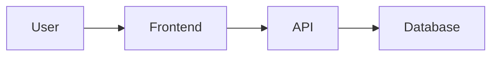

Yes. I dug directly into the current `suitenumerique/docs` repository rather than stopping at the general handbook. There is a useful distinction: **React/TypeScript uses ESLint**, while **Python does not use ESLint**; the equivalent DINUM/La Suite setup in Docs is mainly **Ruff + Pylint + pytest**. The current frontend application runs `tsc --noEmit && eslint .`, while the backend config enables Ruff rules for Django, Bandit/security, import sorting, Pylint-compatible rules, unused `noqa`, print detection, etc. 

### Exact La Suite / DINUM files

These are the sources I would use as the upstream baseline for your projects:

- **React / TypeScript**
  - [Application eslint.config.mjs](https://github.com/suitenumerique/docs/blob/main/src/frontend/apps/impress/eslint.config.mjs?utm_source=chatgpt.com) — the app-level config; it uses the `docs/next` preset. 
  - [eslint-plugin-docs/base.js](https://github.com/suitenumerique/docs/blob/main/src/frontend/packages/eslint-plugin-docs/base.js?utm_source=chatgpt.com) — this is one of the most important files: React, React Hooks, JSX a11y, Next, TanStack Query, Prettier, imports, etc.
  - [eslint-plugin-docs/typescript.js](https://github.com/suitenumerique/docs/blob/main/src/frontend/packages/eslint-plugin-docs/typescript.js?utm_source=chatgpt.com) — strict TypeScript rules.
  - [eslint-plugin-docs/test.js](https://github.com/suitenumerique/docs/blob/main/src/frontend/packages/eslint-plugin-docs/test.js?utm_source=chatgpt.com) — testing rules.
  - [eslint-plugin-docs/playwright.js](https://github.com/suitenumerique/docs/blob/main/src/frontend/packages/eslint-plugin-docs/playwright.js?utm_source=chatgpt.com) — E2E rules.
  - [eslint-plugin-docs/index.js](https://github.com/suitenumerique/docs/blob/main/src/frontend/packages/eslint-plugin-docs/index.js?utm_source=chatgpt.com) — composes `base`, `next`, `test`, and `playwright`.
  - [eslint-plugin-docs/package.json](https://github.com/suitenumerique/docs/blob/main/src/frontend/packages/eslint-plugin-docs/package.json?utm_source=chatgpt.com) — exact ESLint plugin dependencies.
  - [Frontend Prettier configuration](https://github.com/suitenumerique/docs/blob/main/src/frontend/.prettierrc.js?utm_source=chatgpt.com).
  - [React app package.json](https://github.com/suitenumerique/docs/blob/main/src/frontend/apps/impress/package.json?utm_source=chatgpt.com) — source for the `lint`, `stylelint`, `prettier`, `test`, and build scripts. The current app combines TypeScript compilation and ESLint in its lint command. 
- **Python**
  - [Backend pyproject.toml](https://github.com/suitenumerique/docs/blob/main/src/backend/pyproject.toml?utm_source=chatgpt.com) — **the main Python quality configuration**. It currently configures Ruff at 88 chars and enables `B`, `BLE`, `C4`, `DJ`, `I`, `PLC`, `PLE`, `PLR`, `PLW`, `RUF100`, `RUF200`, `S`, `SLF`, and `T20`. 
  - [Backend .pylintrc](https://github.com/suitenumerique/docs/blob/main/src/backend/.pylintrc?utm_source=chatgpt.com) — additional Pylint configuration.
  - [Backend directory](https://github.com/suitenumerique/docs/tree/main/src/backend?utm_source=chatgpt.com) — useful for understanding how the Django backend is actually structured.
- **Architecture**
  - [Official Docs architecture.md](https://github.com/suitenumerique/docs/blob/main/documentation/architecture.md?utm_source=chatgpt.com) — global architecture.
  - [Architecture documentation index](https://github.com/suitenumerique/docs/blob/main/documentation/README.md?utm_source=chatgpt.com) — notably links the architecture overview and ADRs.
  - [Architecture Decision Records](https://github.com/suitenumerique/docs/tree/main/documentation/adr?utm_source=chatgpt.com).
  - [Current React source architecture](https://github.com/suitenumerique/docs/tree/main/src/frontend/apps/impress/src?utm_source=chatgpt.com) — especially interesting for your own conventions.

The frontend organization is worth retaining as an **architectural reference**, not merely linting. The current application separates `api`, `components`, `core`, `features`, `hooks`, `layouts`, `libs`, `services`, `stores`, `tests`, `types`, and `utils`. At system level, Docs documents a Next.js SPA talking to a Django REST backend, with separate collaboration services, PostgreSQL, Celery, S3 storage and OIDC/ProConnect. The repository explicitly describes itself as Django + React/Next.js. 

A detail I particularly like in their ESLint rules: the config goes significantly beyond formatting. It enforces React Hooks dependencies, TanStack Query dependency correctness, JSX accessibility, ordered imports, explicit TypeScript safety, no floating promises, no explicit `any`, no unsafe member access and no non-null assertions. So this is genuinely useful as an agent coding standard rather than simply cosmetic linting.

For your projects, I would **not** make them depend directly on `eslint-plugin-docs`, because in Docs it is a local workspace package. I would vendor/adapt its configuration into each repo, for example under `tooling/dinum/`, and expose it from the project's root ESLint config. This avoids tying all your projects to the internal structure of the Docs monorepo.

Here is the prompt I would now use on each of your repositories. It covers **linting + architecture + documentation + skills + AGENTS.md**, rather than treating them independently.

```md
# Task — Align this project with DINUM / La Suite engineering conventions

I want this project to adopt, where technically relevant, the engineering
conventions currently used by DINUM / La Suite numérique in:

https://github.com/suitenumerique/docs

The goal is NOT merely to copy an ESLint configuration.

The goal is to establish a coherent engineering baseline covering:

1. React / TypeScript linting
2. Python linting
3. formatting
4. type checking
5. automated tests
6. accessibility
7. security-oriented static analysis
8. project architecture
9. architectural documentation
10. Agent Skills
11. AGENTS.md enforcement

Treat architecture as a first-class requirement.

---

# 1. Inspect the existing repository first

Before changing anything, inspect the entire relevant project structure.

Identify:

- frontend framework
- backend framework
- package manager
- Python package manager
- monorepo/workspace structure
- existing ESLint configuration
- existing Prettier configuration
- existing Stylelint configuration
- existing Ruff configuration
- existing Pylint configuration
- existing TypeScript configuration
- existing test frameworks
- existing CI workflows
- existing Makefile / task runner
- existing documentation
- existing AGENT.md / AGENTS.md
- existing Agent Skills
- existing architectural conventions

Do not blindly overwrite existing project-specific configuration.

Use this precedence:

1. explicit user requirements
2. existing scoped AGENTS.md instructions
3. project CI and tool configuration
4. established project architecture
5. DINUM / La Suite conventions
6. generic framework recommendations

If the existing repository already has stricter rules, preserve them unless
they conflict with another explicit requirement.

---

# 2. Official/reference upstream files

Use the following La Suite Docs files as implementation references.

## React / TypeScript

Application ESLint config:

https://github.com/suitenumerique/docs/blob/main/src/frontend/apps/impress/eslint.config.mjs

DINUM / La Suite local ESLint configuration package:

https://github.com/suitenumerique/docs/tree/main/src/frontend/packages/eslint-plugin-docs

Base rules:

https://github.com/suitenumerique/docs/blob/main/src/frontend/packages/eslint-plugin-docs/base.js

TypeScript rules:

https://github.com/suitenumerique/docs/blob/main/src/frontend/packages/eslint-plugin-docs/typescript.js

Test rules:

https://github.com/suitenumerique/docs/blob/main/src/frontend/packages/eslint-plugin-docs/test.js

Playwright rules:

https://github.com/suitenumerique/docs/blob/main/src/frontend/packages/eslint-plugin-docs/playwright.js

Config composition:

https://github.com/suitenumerique/docs/blob/main/src/frontend/packages/eslint-plugin-docs/index.js

Dependencies:

https://github.com/suitenumerique/docs/blob/main/src/frontend/packages/eslint-plugin-docs/package.json

Prettier:

https://github.com/suitenumerique/docs/blob/main/src/frontend/.prettierrc.js

Application scripts/dependencies:

https://github.com/suitenumerique/docs/blob/main/src/frontend/apps/impress/package.json

## Python

Python / Ruff / pytest configuration:

https://github.com/suitenumerique/docs/blob/main/src/backend/pyproject.toml

Pylint configuration:

https://github.com/suitenumerique/docs/blob/main/src/backend/.pylintrc

Backend structure:

https://github.com/suitenumerique/docs/tree/main/src/backend

## Architecture

Architecture overview:

https://github.com/suitenumerique/docs/blob/main/documentation/architecture.md

Architecture documentation index:

https://github.com/suitenumerique/docs/blob/main/documentation/README.md

Architecture Decision Records:

https://github.com/suitenumerique/docs/tree/main/documentation/adr

Frontend application structure:

https://github.com/suitenumerique/docs/tree/main/src/frontend/apps/impress/src

---

# 3. React / TypeScript configuration

If this project contains React / TypeScript code, adapt the La Suite ESLint
configuration to the project.

Do NOT depend directly on the internal `eslint-plugin-docs` workspace package
unless this repository deliberately vendors it.

Prefer one of these approaches:

### Standard project

Create/adapt the root:

`eslint.config.mjs`

and reproduce the relevant La Suite rules directly.

### Large project / monorepo

Create a reusable internal configuration, for example:

tooling/
└── eslint/
    ├── base.mjs
    ├── typescript.mjs
    ├── react.mjs
    ├── test.mjs
    ├── playwright.mjs
    └── index.mjs

The application-level `eslint.config.mjs` should import these shared rules.

Do not unnecessarily reproduce the exact `eslint-plugin-docs` package name.

---

# 4. Rules to preserve from La Suite

Where compatible with the project, preserve the intent of the La Suite rules.

This includes at minimum:

## JavaScript

- recommended ESLint rules
- block-scoped variables
- mandatory curly braces
- no `var`
- no browser `alert`
- duplicate import prevention
- deterministic import ordering
- unused-variable detection
- unused ESLint disable directives reported as errors

## React

- React Hooks rules
- exhaustive effect dependencies
- JSX conventions

## Accessibility

Preserve `eslint-plugin-jsx-a11y` checks, notably:

- alt text
- ARIA properties
- ARIA property types
- unsupported ARIA properties
- required ARIA properties for roles
- ARIA properties supported by roles

Accessibility is a quality requirement, not a cosmetic linting preference.

## TanStack Query

If TanStack Query is present, preserve relevant rules such as:

- exhaustive dependencies
- stable QueryClient
- warnings against problematic rest destructuring

Do not install TanStack-specific linting if the project does not use TanStack
Query.

## TypeScript

Preserve the intent of:

- no explicit `any`
- no floating promises
- no non-null assertions
- no unnecessary type assertions
- no unsafe arguments
- no unsafe member access
- TypeScript-aware unused variables
- typed ESLint parsing / project service where compatible
- deterministic import sorting

Do not weaken TypeScript simply to make lint pass.

Fix the underlying type issue whenever reasonable.

---

# 5. Formatting

Use the existing project's formatter if already configured.

Otherwise use the La Suite configuration as a baseline.

Formatting should be automatically enforceable.

Where appropriate provide:

- `format`
- `format:check`

commands.

Do not mix stylistic ESLint rules and Prettier rules in contradictory ways.

---

# 6. CSS

If the project contains CSS and already uses or would benefit from Stylelint,
inspect La Suite's current approach and configure equivalent checks.

Do not introduce Stylelint in projects where there is no relevant CSS layer
without a reason.

---

# 7. Python configuration

Python does NOT use ESLint.

Use the La Suite Docs Python setup as the reference:

- Ruff
- Pylint where useful
- pytest
- coverage

Prefer putting Ruff configuration in:

`pyproject.toml`

unless this project has an established `ruff.toml`.

The current La Suite Docs Ruff configuration should be used as a baseline,
including relevant rule families:

- B      — flake8-bugbear
- BLE    — blind exceptions
- C4     — comprehension improvements
- DJ     — Django
- I      — import sorting
- PLC    — Pylint conventions
- PLE    — Pylint errors
- PLR    — Pylint refactoring
- PLW    — Pylint warnings
- RUF100 — unused noqa
- RUF200 — pyproject checks
- S      — security / Bandit
- SLF    — private member access
- T20    — print statements

Only activate framework-specific rules such as `DJ` when relevant.

Use repository-specific Ruff configuration as the final authority.

Do not blindly force the La Suite line length if the repository intentionally
uses another formatter convention.

---

# 8. Python import architecture

Follow the same principle visible in the La Suite Ruff configuration:
imports should reflect architectural layers.

Define explicit import groups when useful:

1. future
2. standard library
3. framework
4. third party
5. project/domain packages
6. first party
7. local modules

Adapt names to this project's actual packages.

Do not copy the `impress` package name into an unrelated project.

---

# 9. Architecture is mandatory

Linting alone is insufficient.

Analyse the current application architecture and compare its separation of
concerns with the La Suite Docs architecture.

The current La Suite React application notably separates concepts such as:

src/
├── api/
├── assets/
├── components/
├── core/
├── features/
├── hooks/
├── i18n/
├── layouts/
├── libs/
├── pages/
├── services/
├── stores/
├── tests/
├── types/
└── utils/

This directory tree is an architectural reference, NOT a mandatory template.

Do not reorganize a healthy existing application merely to reproduce these
directory names.

Instead identify the equivalent architectural responsibilities in this
project.

Important principles:

- separate domain/features from generic components
- isolate API access
- isolate external integrations
- isolate global/shared state
- distinguish generic utilities from domain logic
- prevent pages/controllers from accumulating business logic
- keep framework glue separate from domain logic where practical
- avoid circular dependencies
- make ownership of a feature understandable from the filesystem
- keep testing close enough to the behaviour it protects
- avoid a giant undifferentiated `utils/` or `components/` directory
- preserve clear dependency direction

When adding a new feature, place it according to the established architecture
instead of choosing a convenient arbitrary directory.

---

# 10. Backend architecture

Analyse the Python/backend architecture separately.

Identify at minimum:

- API / HTTP boundary
- serializers/schemas
- models
- business/domain logic
- services
- tasks/workers
- persistence
- authentication
- authorization
- external providers
- settings/configuration
- tests

Avoid putting all business logic directly in:

- Django views
- serializers
- models
- FastAPI routes

unless the existing architecture intentionally follows that approach.

Keep domain behaviour testable independently where reasonable.

---

# 11. System architecture documentation

The repository must contain a living architecture document.

Prefer an existing architecture documentation location.

Otherwise create:

`docs/architecture.md`

or, if the repository already uses uppercase root documentation:

`ARCHITECTURE.md`

Do NOT create redundant documentation.

The architecture document should describe:

## Context

What the application does.

## Components

Major runtime components.

Example:



Adapt the graph to the actual project.

## Frontend architecture

Describe:

- routes/pages
- features
- components
- API layer
- state management
- design system
- shared libraries
- testing

## Backend architecture

Describe:

- API
- domain/business logic
- persistence
- background jobs
- integrations
- authentication/authorization

## Data flow

Explain at least the primary request/data flow.

## Dependency boundaries

Explain which layers may depend on which other layers.

## Important conventions

Explain where a developer should put:

- a new page
- a new feature
- a reusable component
- an API client
- business logic
- a global store
- a type
- a utility
- a test
- an integration

## External systems

Document external dependencies/services.

## Security boundaries

Document authentication, authorization and sensitive boundaries.

## Architectural decisions

Reference ADRs when non-trivial decisions exist.

---

# 12. ADRs

If this project does not already have an ADR mechanism, create:

docs/adr/

and document the convention in:

docs/adr/README.md

Use ADRs only for meaningful architectural decisions.

Do not create an ADR for trivial implementation details.

Recommended format:

# ADR-XXXX — Title

## Status

Proposed / Accepted / Deprecated / Superseded

## Context

## Decision

## Consequences

## Alternatives considered

---

# 13. Engineering documentation

Create or update a document dedicated to engineering quality.

Prefer:

`docs/engineering/code-quality.md`

unless an equivalent document already exists.

Document:

- upstream DINUM / La Suite references
- ESLint configuration
- TypeScript checks
- Prettier
- Stylelint if applicable
- Ruff
- Pylint if applicable
- tests
- E2E
- accessibility checks
- security/static analysis
- commands developers must run
- CI behaviour
- exceptions to the DINUM baseline
- why those exceptions exist

Explicitly distinguish:

### DINUM / La Suite upstream reference

from

### Project-specific decision

Never imply that a project-specific convention is an official DINUM-wide
standard.

---

# 14. Document architecture in the Agent Skills

Update the relevant Agent Skills.

At minimum inspect/create:

`.agents/skills/dinum-react/SKILL.md`

and:

`.agents/skills/dinum-python/SKILL.md`

or use the repository's canonical skill path if different.

The React skill must include:

- ESLint expectations
- TypeScript expectations
- accessibility
- testing
- architecture
- directory/boundary conventions
- documentation requirements

The Python skill must include:

- Ruff
- Pylint where relevant
- security rules
- pytest/testing
- backend architecture
- package boundaries
- documentation requirements

Both skills must state:

> Before implementing a feature, inspect the existing architecture and place
> new code according to the project's documented architectural boundaries.

Both must state:

> If implementation materially changes architecture, update the architecture
> documentation in the same change.

Both must contain a Sources section linking the relevant DINUM / La Suite
upstream files.

---

# 15. AGENTS.md

Update the existing AGENT.md / AGENTS.md instructions.

Do not create a competing file if one already exists.

Ensure it says that before frontend work the agent must consult:

`.agents/skills/dinum-react/SKILL.md`

and before Python work:

`.agents/skills/dinum-python/SKILL.md`

For cross-stack work consult both.

Also add this mandatory rule:

> Architecture is part of code quality. Before adding or moving code, inspect
> the documented architecture and existing boundaries. Do not introduce a new
> architectural pattern without documenting the reason.

And:

> Any material architectural change must update the project's architecture
> documentation and, when appropriate, an ADR.

---

# 16. Developer commands

Provide consistent project commands where possible.

For example:

Frontend:

- lint
- typecheck
- format
- format:check
- test
- test:e2e
- build

Python:

- lint
- format
- format-check
- test

Prefer existing Makefile/task-runner conventions instead of adding redundant
commands.

Make it possible to run the complete quality gate with one command if the
project architecture supports it, for example:

make check

or:

npm run check

Do not invent both.

---

# 17. CI

Inspect CI.

Ensure relevant checks run automatically before merge where feasible:

Frontend:

- formatter check
- ESLint
- TypeScript
- tests
- build
- E2E when relevant

Python:

- Ruff
- Pylint if the project uses it
- tests
- coverage where configured

Do not claim a DINUM standard has been adopted if developers can bypass all
checks and CI never runs them.

---

# 18. Migration strategy

Do NOT produce thousands of unrelated formatting/linting changes without
warning.

After installing/configuring the rules:

1. run the checks;
2. classify existing violations;
3. automatically fix safe formatting/import issues;
4. fix relevant issues in files touched by the current work;
5. identify large pre-existing debt separately.

If adopting the complete ruleset would require a huge unrelated refactor,
propose a staged migration.

Do not silently weaken rules merely because existing code violates them.

---

# 19. Final verification

Before finishing:

1. show the files added/modified;
2. show the source URLs used;
3. explain which La Suite rules were copied directly;
4. explain which were adapted;
5. explain which were deliberately omitted and why;
6. run frontend lint;
7. run frontend typecheck;
8. run relevant frontend tests;
9. run Python Ruff;
10. run Python tests;
11. run build where applicable;
12. inspect the final architecture;
13. verify `docs/architecture.md` or equivalent is current;
14. verify engineering quality documentation is current;
15. verify React/Python Skills include architecture + quality rules;
16. verify AGENTS.md loads the relevant skills;
17. report every check that could not be executed.

Never claim a check passed unless it actually ran.

---

# Expected final result

I want this repository to finish with four things aligned:

CODE
  ↓
LINT / TEST / TYPECHECK
  ↓
ARCHITECTURE
  ↓
DOCUMENTATION + AGENT SKILLS

The agent should not consider a feature complete if the code works but:

- breaks architectural boundaries,
- violates quality rules,
- is insufficiently tested,
- or leaves architectural documentation inaccurate.
```

This gives you a much stronger system than simply “use DINUM ESLint”: your agents can inspect a repo and understand that **code quality = static rules + architecture + tests + docs**, and that an architectural change has to propagate into both human documentation and agent instructions.

One nuance: I attempted to persist your preference that **architecture must always be considered and documented in both project docs and skills**, but the memory mechanism became unavailable in this turn after repository inspection, so I won’t claim it was saved account-wide. If you want that preference persisted across future chats, send it once in a fresh conversation and ask me to remember it.