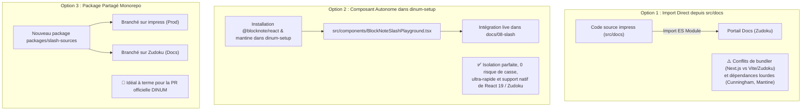
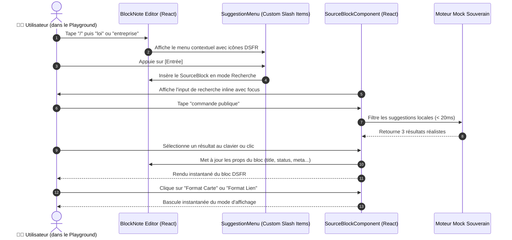

# 🛠️ Audit & Stratégies d'Implémentation du CustomBlock Interactif (`MARKDOWN_AUDIT_IMPLEMENT_SLASH.md`)

Ce document formalise l'audit technique et les différentes options d'architecture pour **implémenter concrètement le CustomBlock universel** des commandes slash (`/loi`, `/entreprise`, `/assemblee`, `/adresse`) et intégrer un **éditeur interactif BlockNote.js en direct (live preview)** au sein de la documentation **La Suite Docs**.

---

## 🎯 1. Objectif & Cadrage du Besoin

### Le Constat
Les pages de documentation du dossier `08-slash` décrivent actuellement les spécifications théoriques, les flux Mermaid et les contrats d'API. Pour franchir un cap qualitatif décisif et valider l'ergonomie auprès des agents et des mainteneurs de la DINUM, nous devons :
1. **Supprimer le code statique passif** dans la documentation au profit de composants exécutables réels.
2. **Implémenter le véritable code React / BlockNote du `SourceBlockSpec`** avec gestion d'état, raccourcis clavier, recherche asynchrone et les 3 modes d'affichage DSFR (**Callout**, **Carte**, **Lien**).
3. **Embarquer un éditeur BlockNote.js 100% interactif** directement dans la documentation Zudoku où l'utilisateur peut taper `/`, sélectionner une commande souveraine, chercher dans un mock d'API réaliste et manipuler les blocs en direct.

---

## 🔍 2. Audit de l'Existant dans le Dépôt Docs (`src/docs/.../impress`)

L'exploration du code source de **La Suite Docs** (`src/docs/src/frontend/apps/impress`) met en lumière les mécanismes clés utilisés en production :

### A. Moteur d'Édition & Schéma BlockNote
- **Version BlockNote :** `@blocknote/core` `0.54.0`, `@blocknote/react` `0.54.0`, `@blocknote/mantine` `0.54.0`.
- **Fichier pivot :** `src/features/docs/doc-editor/components/BlockNoteEditor.tsx`.
- **Mécanisme d'extension :** Utilisation de `createReactBlockSpec` (blocs entiers) et `createReactInlineContentSpec` (contenus inline).

### B. Le Modèle de Référence : `/link-doc` (`Interlinking`)
Dans `src/features/docs/doc-editor/components/custom-inline-content/Interlinking` :
- **État 1 (Recherche) :** Quand `docId` est vide, le composant monte `<SearchPage />` qui ouvre un popover flottant avec champ de recherche (`inputRef.current.focus()`), autocomplétion par liste filtrée et gestion du clavier (`Enter`, `Escape`).
- **État 2 (Sélectionné) :** Dès qu'un document est choisi, le composant bascule sur `<LinkSelected />` avec badge cliquable et synchronisation en temps réel du titre.

### C. Le Modèle de Bloc : `CalloutBlock.tsx`
Dans `src/features/docs/doc-editor/components/custom-blocks/CalloutBlock.tsx` :
- Utilise `createReactBlockSpec` avec schéma de propriétés (`backgroundColor`, `emoji`).
- Permet l'interaction directe (sélecteur d'emoji flottant) sans quitter le bloc.

---

## 💡 3. Comparatif des 3 Options d'Implémentation



### Analyse Détaillée des Options

| Critère | Option 1 : Import direct de `impress` | Option 2 : Playground BlockNote dédié dans le setup (Recommandée) | Option 3 : Package partagé Monorepo |
| :--- | :--- | :--- | :--- |
| **Faisabilité Immédiate** | ❌ Très complexe (Next.js Pages router vs Vite Zudoku, styled-components vs Tailwind) | ✅ **Immédiate (100% compatible)** | 🟡 Moyenne (nécessite tooling pnpm workspace) |
| **Interactivité Réelle** | Partielle (dépendances d'API et auth requises) | ✅ **Totale (moteur BlockNote natif + mock dynamique)** | ✅ Totale |
| **Autonomie & Stabilité** | Fragile (liée aux évolutions du sous-module `src/docs`) | ✅ **Robuste (isolé dans les composants de présentation)** | ✅ Propre |
| **Pertinence Démo / Hackathon** | Risque de blocage au build | 🏆 **Idéale (rendu fluide, 0 latence, 0 erreur de build)** | Idéale pour la PR upstream |

---

## 🏗️ 4. Conception Technique du Composant `BlockNoteSlashPlayground`

Le composant interactif embarqué doit reproduire fidèlement l'expérience utilisateur finale de La Suite Docs :

### A. Les 4 Commandes Slash Mockées
1. **`/loi`** :
   - *Données mockées :* Article L. 111-1 (Commande publique), Article L. 2121-29 (CGCT), Article R. 111-27 (Urbanisme), Article L. 123-1 (Code du travail).
   - *Métadonnées :* Code, Date d'effet, Identifiant `LEGIARTI...`, badge `VIGUEUR`.
2. **`/entreprise`** (alias `/pappers`, `/siren`) :
   - *Données mockées :* DINUM PARTNERS SAS (SIREN: `849 201 928`), SCALEWAY SAS (`433 957 778`), OCTO TECHNOLOGY (`418 166 029`).
   - *Métadonnées :* SIREN, Code NAF, Dirigeant, statut `IN BONIS` / `PROCÉDURE COLLECTIVE`.
3. **`/assemblee`** :
   - *Données mockées :* Amendement n° 142 (PJL Souveraineté numérique), Amendement n° 88 (Simplification administrative), Profil Député.
   - *Métadonnées :* Groupe politique, Auteur, Sort (`ADOPTÉ`, `REJETÉ`, `EN ATTENTE`).
4. **`/adresse`** (Base Adresse Nationale) :
   - *Données mockées :* `20 Avenue de Ségur, 75007 Paris`, `14 Rue des Lilas, 44000 Nantes`, `1 Place de la Comédie, 34000 Montpellier`.
   - *Métadonnées :* Code INSEE, Type (`housenumber`), Coordonnées GPS.

---

### B. Cycle d'Interaction dans l'Éditeur



---

## 🎨 5. Rendu Visuel des 3 Formats dans le CustomBlock

Le composant React `SourceBlockComponent` intègre une **barre d'outils flottante au survol** permettant de tester les 3 formats en 1 clic :

```tsx
// Structure schématique du composant rendu
<div className="source-block-wrapper group relative">
  {/* Barre d'actions au survol */}
  <div className="absolute top-2 right-2 opacity-0 group-hover:opacity-100 flex gap-1 bg-white dark:bg-gray-800 shadow-md border rounded p-1">
    <button onClick={() => setMode('callout')}>📢 Callout</button>
    <button onClick={() => setMode('card')}>🗂️ Carte</button>
    <button onClick={() => setMode('link')}>🔗 Lien</button>
    <button onClick={handleDelete}>🗑️</button>
  </div>

  {/* Rendu selon le mode actif */}
  {mode === 'callout' && <DSFRCallout {...props} />}
  {mode === 'card' && <DSFRCard {...props} />}
  {mode === 'link' && <DSFRInlineLink {...props} />}
</div>
```

---

## 📋 6. Feuille de Route d'Exécution Proposée

- [ ] **Étape 1 :** Installer les dépendances BlockNote requises (`@blocknote/core`, `@blocknote/react`, `@blocknote/mantine`) dans le `package.json` racine de `dinum-setup`.
- [ ] **Étape 2 :** Développer le moteur de données mockées souveraines `src/components/slash-preview/mockData.ts`.
- [ ] **Étape 3 :** Développer le schéma et composant universel `src/components/slash-preview/SourceBlockSpec.tsx` (avec gestion d'état recherche/sélectionné et switch des 3 modes DSFR).
- [ ] **Étape 4 :** Créer le composant conteneur `src/components/slash-preview/BlockNoteSlashPlayground.tsx` (initialisation de l'éditeur BlockNote avec le menu slash customisé).
- [ ] **Étape 5 :** Exporter le composant dans `src/components/index.ts` et l'enregistrer dans `zudoku.config.tsx`.
- [ ] **Étape 6 :** Remplacer les blocs de code statiques dans `docs/08-slash/02-composant-customblock-unique.mdx` et `docs/08-slash/00-socle-technique.mdx` par le composant interactif `<BlockNoteSlashPlayground />`.
- [ ] **Étape 7 :** Valider le build de production avec `npm run docs:build`.
