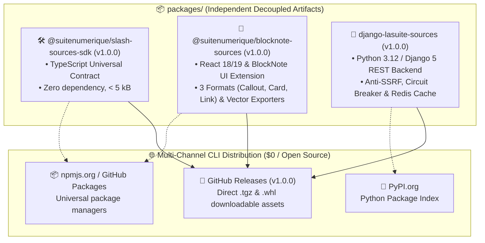
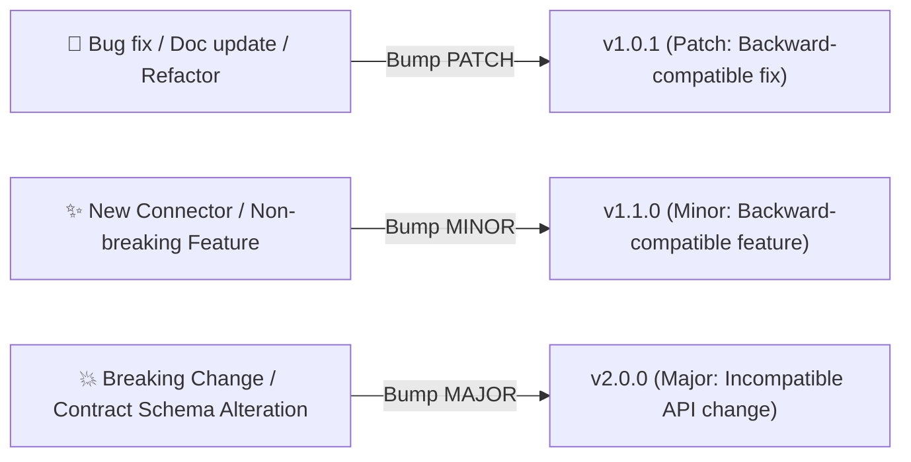

# 📦 Package Architecture & Versioning Strategy (`PACKAGES_VERSIONING.md`)

> **Repository:** `dinum-setup`  
> **Scope:** Decoupled Sovereign Libraries (`packages/slash-sources-sdk`, `packages/blocknote-sources`, `packages/django-lasuite-sources`)  
> **Version Policy:** Semantic Versioning 2.0.0 (`MAJOR.MINOR.PATCH`) & Independent Modular Distribution

---

## 🧭 1. Monorepo Package Matrix

The repository maintains 3 decoupled packages, versioned harmoniously according to **Semantic Versioning (SemVer 2.0.0)**:



| Package Name | Language / Ecosystem | Root Directory | Current Version | Output Artifacts | Primary Distribution |
|---|:---:|---|:---:|---|---|
| **`@suitenumerique/slash-sources-sdk`** | TypeScript / Node.js | `packages/slash-sources-sdk` | `1.0.0` | `dist/index.js`, `dist/index.d.ts`, `.tgz` | GitHub Release & npm |
| **`@suitenumerique/blocknote-sources`** | React / TypeScript | `packages/blocknote-sources` | `1.0.0` | ESM (`.mjs`), CJS (`.js`), DTS (`.d.ts`), `.tgz` | GitHub Release & npm |
| **`django-lasuite-sources`** | Python / Django REST | `packages/django-lasuite-sources` | `1.0.0` | Wheel (`.whl`), Source Archive (`.tar.gz`) | GitHub Release & PyPI |

---

## 🏷️ 2. Semantic Versioning Specification (`MAJOR.MINOR.PATCH`)

All packages strictly follow the `vX.Y.Z` convention:

$$\text{Version} = \mathbf{MAJOR}.\mathbf{MINOR}.\mathbf{PATCH}$$



### 1. `PATCH` (e.g. `v1.0.0` $\to$ `v1.0.1`)
- **Trigger:** Bug fixes, defensive security patches (anti-SSRF updates), accessibility adjustments (RGAA contrast fix), internal refactoring, or documentation updates.
- **Contract Impact:** Zero breaking change. Existing integrations continue to function without code modification.

### 2. `MINOR` (e.g. `v1.0.0` $\to$ `v1.1.0`)
- **Trigger:** Adding a new sovereign API connector (e.g., German Bundestag `/bundestag`, Dutch `/kvk`, Spanish `/ley`), adding a new export adapter, or extending `SourceEntityProps` with optional fields.
- **Contract Impact:** Backward compatible. Existing connectors remain fully functional.

### 3. `MAJOR` (e.g. `v1.0.0` $\to$ `v2.0.0`)
- **Trigger:** Breaking changes in the core DTO interface `SourceEntityProps`, changing `defineSourceProvider()` signature, dropping support for Node.js 20 or Python 3.11, or altering REST API URL schemes (`/api/v1.0/` $\to$ `/api/v2.0/`).
- **Contract Impact:** Requires migration guide and code updates in consumer applications (`LaSuite/docs`).

---

## 🛠️ 3. Version Bump & Manifest Synchronization

When updating package versions, all corresponding metadata files must be incremented simultaneously:

| Package | Files to Update | Version Field |
|---|---|---|
| **`slash-sources-sdk`** | `packages/slash-sources-sdk/package.json` | `"version": "X.Y.Z"` |
| **`blocknote-sources`** | `packages/blocknote-sources/package.json` | `"version": "X.Y.Z"` |
| **`django-lasuite-sources`** | `packages/django-lasuite-sources/pyproject.toml`<br/>`packages/django-lasuite-sources/lasuite_sources/__init__.py` | `version = "X.Y.Z"`<br/>`__version__ = "X.Y.Z"` |

---

## ⚡ 4. Build, Packaging & Release Workflow (100% CLI)

### Step 1: Run Quality & Test Validations
```bash
# 1. TypeScript Packages Unit & RGAA Tests (15/15)
npm run packages:test

# 2. Django Backend Pytest Suite (22/22)
cd packages/django-lasuite-sources && PYTHONPATH=. .venv/bin/pytest && cd ../..
```

### Step 2: Compile & Build Distributable Artifacts
```bash
# 1. Compile TypeScript bundles (ESM + CJS + DTS)
npm run packages:build

# 2. Package npm tarballs (.tgz)
cd packages/slash-sources-sdk && npm pack && cd ../..
cd packages/blocknote-sources && npm pack && cd ../..

# 3. Build Python Wheel (.whl) and Source (.tar.gz)
cd packages/django-lasuite-sources && .venv/bin/python -m build && cd ../..
```

### Step 3: Publish GitHub Release via CLI
```bash
# Create and attach all binary packages in a single command
gh release create vX.Y.Z \
  packages/slash-sources-sdk/suitenumerique-slash-sources-sdk-X.Y.Z.tgz \
  packages/blocknote-sources/suitenumerique-blocknote-sources-X.Y.Z.tgz \
  packages/django-lasuite-sources/dist/django_lasuite_sources-X.Y.Z-py3-none-any.whl \
  packages/django-lasuite-sources/dist/django_lasuite_sources-X.Y.Z.tar.gz \
  --title "vX.Y.Z — Sovereign Slasher Packages Release" \
  --notes "Detailed release notes for vX.Y.Z"
```

---

## 📥 5. Consumer Installation Guide

Downstream consumers can install published versions directly via CLI:

### TypeScript / Frontend (`npm`, `pnpm`, `yarn`):
```bash
# Universal SDK
npm install https://github.com/waxland/dinum-setup/releases/download/v1.0.0/suitenumerique-slash-sources-sdk-1.0.0.tgz

# BlockNote UI Extension
npm install https://github.com/waxland/dinum-setup/releases/download/v1.0.0/suitenumerique-blocknote-sources-1.0.0.tgz
```

### Python / Django (`pip`, `uv`, `poetry`):
```bash
# Pre-compiled Wheel
pip install https://github.com/waxland/dinum-setup/releases/download/v1.0.0/django_lasuite_sources-1.0.0-py3-none-any.whl

# Git direct dependency
pip install "django-lasuite-sources @ git+https://github.com/waxland/dinum-setup.git@v1.0.0#subdirectory=packages/django-lasuite-sources"
```
