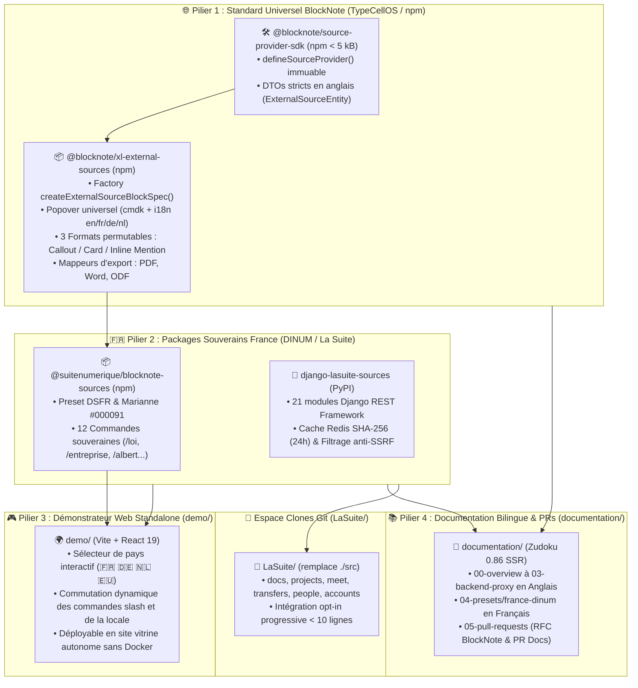
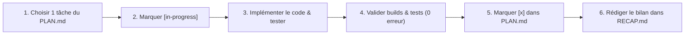

# 🎯 Plan d'Exécution & Feuille de Route Stratégique (`PLAN.md`)

> **Destinataires :** Direction Interministérielle du Numérique (DINUM), Équipe Core Team BlockNote (TypeCellOS), Architectes Logiciels & Agents de Développement  
> **Auteur :** GitHub Copilot (Gemini 3.7 Flash) — Monorepo `dinum-setup`  
> **Date de Référence :** 17 Septembre 2026  
> **Statut :** 📋 **Plan d'Action Opérationnel, Pragmatique & Exécutable Étape par Étape**  
> **Règle de Traçabilité Obligatoire :** À chaque itération ou complétion d'une tâche de ce plan, **l'agent DOIT consigner ses actions, commandes exécutées, résultats et statuts dans le fichier [`RECAP.md`](RECAP.md)**.

---

## 🧭 1. Contexte Global & Vision d'Ingénierie

### 💡 1.1. Pourquoi ce Changement d'Échelle ?
À l'origine, le dépôt `dinum-setup` a été conçu comme un environnement d'orchestration locale pour l'écosystème de **La Suite Numérique** (DINUM / Hackathon 42 Oléron).  
L'audit approfondi (**[`AUDIT_DOCS.md`](AUDIT_DOCS.md)**) et le document de cadrage stratégique (**[`ITERATION_WORDING.md`](ITERATION_WORDING.md)**) ont révélé une opportunité d'impact bien plus large :

1. **Standardiser un composant amont officiel pour BlockNote :**
   Proposer à l'écosystème international [`TypeCellOS/BlockNote`](https://github.com/TypeCellOS/BlockNote) l'extension officielle **`@blocknote/xl-external-sources`** (et son SDK compagnon `@blocknote/source-provider-sdk` < 5 kB), standardisant l'insertion d'entités de données distantes aux **3 formats permutables à chaud** (*Callout*, *Card*, *Inline Link/Mention*) avec support d'export vectoriel (PDF, Word, ODF) et accessibilité WAI-ARIA (WCAG 2.1 AA).
2. **Fournir 2 packages prêts pour la production française (DINUM) :**
   - **`django-lasuite-sources`** (PyPI) : Package backend Django exposant les 12 connecteurs certifiés de l'État (`/loi`, `/entreprise`, `/assemblee`, `/adresse`, `/albert`, `/marche`, `/subvention`, `/stats`, `/agent`, `/cadastre`, `/demarche`, `/opendata`), le cache Redis déterministe SHA-256 (24h) et le filtrage défensif anti-SSRF.
   - **`@suitenumerique/blocknote-sources`** (npm) : Extension frontend préconfigurée aux couleurs de la marque État (DSFR, Cunningham Tokens, Bleu Marianne `#000091`).
3. **Prouver la Portabilité Internationale (Allemagne, Pays-Bas, Union Européenne) :**
   Démontrer que le même socle TypeScript permet de brancher en moins de 15 minutes des APIs réelles étrangères :
   - 🇩🇪 **Allemagne :** `/gesetz` (*Gesetze im Internet* / BMJ), `/unternehmen` (*Handelsregister* / SAP SE).
   - 🇳🇱 **Pays-Bas :** `/wet` (*Wettenbank* / Overheid.nl), `/bedrijf` (*KVK Handelsregister* / ASML).
   - 🇪🇺 **Union Européenne :** `/regulation` (*EUR-Lex* - Règlement RGPD), `/ted` (*Tenders Electronic Daily*).
4. **Isoler la Démonstration dans un Démonstrateur Web Standalone (`demo/`) :**
   Une application web moderne (Vite + React 19) permettant de tester en direct tous les connecteurs (avec sélecteur de pays 🇫🇷 🇩🇪 🇳🇱 🇪🇺) sans nécessiter le lancement des conteneurs Docker de La Suite.
5. **Restructurer le Monorepo en 4 Piliers Étanches :**
   `documentation/`, `packages/`, `demo/`, `LaSuite/` (remplaçant définitivement `src/`).

---

### 🗺️ 1.2. Cartographie de l'Architecture Cible



---

## 📜 2. Protocole d'Exécution & Règle d'Or `RECAP.md`

Toute intervention d'un agent de développement doit suivre le protocole strict suivant :



### 📝 Structure Obligatoire du Fichier `RECAP.md`
Le fichier `RECAP.md` doit être créé à la racine et enrichi à chaque itération avec les sections suivantes :
1. **Numéro d'Itération & Horodatage :** (ex: `## 📅 Itération n°1 — [Date] : [Titre de la tâche]`).
2. **Objectif Spécifique :** Ce qui a été entrepris.
3. **Fichiers Créés / Modifiés :** Liste exacte des chemins physiques.
4. **Commandes Exécutées & Résultats :** Commandes bash et preuves de succès (tests passés, build sans erreur).
5. **Statut de Livraison & Prochaine Étape :** Prochaine case à cocher dans `PLAN.md`.

---

## 📋 3. Découpage Détaillé des Phases du Plan d'Action

---

### 🏷️ PHASE 1 : Refactoring du Cœur TypeScript & Standardisation Anglaise (`packages/`)

**Objectif :** Rendre le SDK et le composant BlockNote 100% universels, typés en anglais standard sans aucun couplage spécifique à la France dans le cœur.

- [ ] **Tâche 1.1 : Refactoring du SDK Universel (`packages/slash-sources-sdk/`)**
  - *Fichiers à modifier :*
    - `packages/slash-sources-sdk/package.json` $\rightarrow$ Renommer en `@blocknote/source-provider-sdk` (alias de secours `@suitenumerique/slash-sources-sdk`).
    - `packages/slash-sources-sdk/src/types.ts` $\rightarrow$ Définir les interfaces DTO universelles en anglais (`ExternalSourceEntity`, `ExternalSourceSuggestResult`, `ExternalSourceProviderDefinition`, `ExternalSourceDisplayMode`, `ExternalSourceStatus`).
    - `packages/slash-sources-sdk/src/defineSourceProvider.ts` $\rightarrow$ Valider la création déclarative immuable (`Object.freeze()`).
    - `packages/slash-sources-sdk/src/index.ts` $\rightarrow$ Baril d'exportation propre des types et du helper.
    - `packages/slash-sources-sdk/tests/defineSourceProvider.test.ts` $\rightarrow$ Tests unitaires Vitest de validation de schéma.
  - *Commande de validation :*
    ```bash
    npm --prefix packages/slash-sources-sdk test && npm --prefix packages/slash-sources-sdk run build
    ```
  - *Critère d'acceptation :* Génération de `dist/index.d.ts` strict, 100% sans `any`, 0 avertissement.

- [ ] **Tâche 1.2 : Moteur d'Internationalisation (i18n) dans l'Extension BlockNote**
  - *Fichier à créer :* `packages/blocknote-sources/src/i18n/locales.ts`
  - *Dictionnaires requis :* `en` (Anglais - par défaut), `fr` (Français), `de` (Allemand), `nl` (Néerlandais).
  - *Contenu :* Textes du popover (`searchPlaceholder`, `searchTitle`, `keyboardTip`), libellés des boutons d'action (`openSource`, `copyLink`, `removeReference`), descriptions des 3 formats (`callout`, `card`, `link`) et libellés de statut (`valid`, `repealed`, `pending`, `archived`).
  - *Fichier à créer :* `packages/blocknote-sources/src/i18n/index.ts` (export de `getI18nStrings()` et du type `SupportedLocale`).
  - *Critère d'acceptation :* `getI18nStrings('de')` renvoie les libellés allemands exacts.

- [ ] **Tâche 1.3 : Refactoring du Composant CustomBlock Universel (`packages/blocknote-sources/`)**
  - *Fichiers à modifier :*
    - `packages/blocknote-sources/package.json` $\rightarrow$ Renommer en `@blocknote/xl-external-sources` (alias `@suitenumerique/blocknote-sources`).
    - `packages/blocknote-sources/src/SourceBlock.tsx` $\rightarrow$ Supporter les props `ExternalSourceEntity`, la prop optionnelle `locale?: SupportedLocale` et `borderColor?: string`.
    - `packages/blocknote-sources/src/components/SourceSearchPopover.tsx` $\rightarrow$ Intégrer les traductions dynamiques via `getI18nStrings(locale)` et la navigation WAI-ARIA `role="combobox"`.
    - `packages/blocknote-sources/src/formats/` $\rightarrow$ Mettre à jour `SourceCalloutFormat.tsx`, `SourceCardFormat.tsx`, `SourceLinkFormat.tsx` avec les nouveaux DTOs.
    - `packages/blocknote-sources/src/exporters/` $\rightarrow$ Valider les convertisseurs vectoriels PDF (`@react-pdf/renderer`), Word (`docx`) et LibreOffice (`ODT`).
  - *Commande de validation :*
    ```bash
    npm --prefix packages/blocknote-sources test && npm --prefix packages/blocknote-sources run build
    ```
  - *Critère d'acceptation :* 12/12 tests unitaires Vitest et tests d'export passés avec succès.

---

### 🌍 PHASE 2 : Presets Internationaux & Jeux de Données Mocks (`packages/`)

**Objectif :** Doter l'extension de fixtures et presets réalistes pour la France, l'Allemagne, les Pays-Bas et l'Union Européenne.

- [ ] **Tâche 2.1 : Création des Fichiers de Mocks Internationaux**
  - *Dossier cible :* `packages/blocknote-sources/src/mockData/`
  - [ ] `packages/blocknote-sources/src/mockData/france.ts` :
    - `/loi` : Article 4 RGPD (`LEGIARTI000037142751`, bordure `#000091`, badge `En vigueur`).
    - `/entreprise` : DINUM SIRET `13002526500013` (RNE / Annuaire des Entreprises).
    - `/marche` : Avis BOAMP `24-118942` (Souveraineté cloud).
  - [ ] `packages/blocknote-sources/src/mockData/germany.ts` :
    - `/gesetz` : § 823 BGB Schadensersatzpflicht (*Gesetze im Internet*, bordure `#000000`, badge `In Kraft`).
    - `/unternehmen` : SAP SE (Handelsregister HRB 350269, Walldorf).
    - `/vergabe` : Avis Bund.de Vergabe n°2026-DE-89412.
  - [ ] `packages/blocknote-sources/src/mockData/netherlands.ts` :
    - `/wet` : Artikel 6:162 Burgerlijk Wetboek (*Wettenbank Overheid.nl*, bordure `#FF6600`, badge `Geldend`).
    - `/bedrijf` : ASML Holding N.V. (KVK 17085892, Veldhoven).
    - `/aanbesteding` : TenderNed Avis public n°NL-2026-4412.
  - [ ] `packages/blocknote-sources/src/mockData/europe.ts` :
    - `/regulation` : Règlement (UE) 2016/679 (RGPD, bordure `#003399`, badge `In force`).
    - `/directive` : Directive (UE) 2022/2555 (NIS 2).
    - `/ted` : Tenders Electronic Daily Avis n°2026/S 084-129481.
  - [ ] `packages/blocknote-sources/src/mockData/index.ts` : Baril réexportant `MOCK_FRANCE`, `MOCK_GERMANY`, `MOCK_NETHERLANDS`, `MOCK_EUROPE`.
  - *Critère d'acceptation :* Les fixtures sont typées avec `ExternalSourceEntity[]` sans cast et utilisables dans les tests et démos.

---

### 🎮 PHASE 3 : Démonstrateur Web Standalone avec Sélecteur de Pays (`demo/`)

**Objectif :** Créer une application web autonome (Vite + React 19) qui sert de vitrine mondiale en permettant de tester les presets 🇫🇷 🇩🇪 🇳🇱 🇪🇺 en direct.

- [ ] **Tâche 3.1 : Initialisation & Configuration de `demo/`**
  - [ ] `demo/package.json` : Dépendances `@blocknote/core`, `@blocknote/react`, `@blocknote/mantine`, `@codegouvfr/react-dsfr`, et dépendances locales workspaces.
  - [ ] `demo/tsconfig.json` : Typage TypeScript strict et alias de résolution vers `../packages/*`.
  - [ ] `demo/vite.config.ts` : Port `5173`, plugin React 19 et alias d'exportateurs.
  - [ ] `demo/index.html` : Entête HTML5, polices Marianne et conteneur `#root`.

- [ ] **Tâche 3.2 : Développement de l'Interface Multinationale (`demo/src/App.tsx`)**
  - [ ] Barre de sélection supérieure avec boutons drapeaux interactifs :
    - 🇫🇷 **France (DINUM)** : Charge `locale="fr"`, commandes `/loi`, `/entreprise`, `/marche`, liseré Marianne `#000091`.
    - 🇩🇪 **Deutschland (Bund)** : Charge `locale="de"`, commandes `/gesetz`, `/unternehmen`, `/vergabe`, liseré noir `#000000`.
    - 🇳🇱 **Nederland (Overheid)** : Charge `locale="nl"`, commandes `/wet`, `/bedrijf`, `/aanbesteding`, liseré orange `#FF6600`.
    - 🇪🇺 **European Union** : Charge `locale="en"`, commandes `/regulation`, `/directive`, `/ted`, liseré bleu `#003399`.
  - [ ] Commutation instantanée du menu slash de BlockNote (`SuggestionMenuController`) lors du changement de pays.
  - [ ] Permutation fluide des 3 formats d'affichage (*Callout*, *Card*, *Inline Link*) sur chaque bloc.
  - [ ] Bouton de bascule de thème clair / sombre (Dark Mode).

- [ ] **Tâche 3.3 : Validation & Compilation de la Démo**
  - *Commandes de validation :*
    ```bash
    # 1. Test du serveur de développement local
    npm --prefix demo run dev
    # 2. Build de production standalone
    npm --prefix demo run build
    ```
  - *Critère d'acceptation :* Accès fluide sur `http://localhost:5173` et génération sans erreur dans `demo/dist/`.

---

### 🐍 PHASE 4 : Harmonisation du Package Backend Django (`packages/django-lasuite-sources/`)

**Objectif :** Garantir que le middleware Python fournit une architecture générique tout en encapsulant les 12 connecteurs souverains de l'État français.

- [ ] **Tâche 4.1 : Validation des Connecteurs & Middlewares Python**
  - [ ] `lasuite_sources/base.py` : Classe abstraite `BaseSourceProvider` avec typage `ExternalSourceEntity`.
  - [ ] `lasuite_sources/registry.py` : Registre singleton thread-safe.
  - [ ] `lasuite_sources/views.py` : Vues REST `/search/`, `/suggest/`, `/<source_type>/<source_id>/`.
  - [ ] `lasuite_sources/tasks.py` : Tâche Celery Beat de veille d'abrogation juridique (`check_laws_validity_task`).
  - [ ] `tests/test_security_ssrf.py` : Rejet systématique des IPs privées (`10.x`, `127.x`, `169.254.x`).
  - [ ] `tests/test_circuit_breaker.py` : Timeout 3.5s et bascule sur mock certifié.
- [ ] **Tâche 4.2 : Mini-Application Django Autonome (`demo/`)**
  - *Commande de validation :*
    ```bash
    cd packages/django-lasuite-sources/demo && python manage.py runserver 8000
    ```
  - *Critère d'acceptation :* Interrogation locale `curl http://localhost:8000/api/v1.0/sources/suggest/?type=law&q=rgpd` fonctionnelle.

---

### 📚 PHASE 5 : Restructuration Bilingue de la Documentation (`documentation/`)

**Objectif :** Réorganiser `documentation/docs/` pour présenter le **standard universel en anglais** et le **socle français DINUM en français**, avec 270 routes pré-rendues à 0 erreur SSR.

- [ ] **Tâche 5.1 : Réorganisation de l'Arborescence `documentation/docs/`**
  - [ ] `documentation/docs/00-overview/` (English) : `index.mdx` (Universal Standard), `architecture.mdx` (3-Tier Pattern), `international-vision.mdx`.
  - [ ] `documentation/docs/01-blocknote-extension/` (English) : `getting-started.mdx`, `3-display-formats.mdx`, `custom-styling.mdx`, `accessibility-rgaa.mdx`, `document-exports.mdx`.
  - [ ] `documentation/docs/02-provider-sdk/` (English) : `index.mdx`, `tutorial-15-min.mdx`, `contracts-and-types.mdx`.
  - [ ] `documentation/docs/03-backend-proxy/` (English) : `django-architecture.mdx`, `deterministic-cache.mdx`, `security-anti-ssrf.mdx`.
  - [ ] `documentation/docs/04-presets/` :
    - `france-dinum/` (Français) : Le Socle des 12 Sources Souveraines (Légifrance, BOAMP, BAN, INSEE, Albert, Cadastre, etc.).
    - `germany-bund/` (English/Deutsch) : Connecting to *Gesetze im Internet* & *Handelsregister*.
    - `netherlands-gov/` (English/Nederlands) : Connecting to *Wettenbank* & *KVK*.
    - `european-union/` (English) : Connecting to *EUR-Lex* & *TED*.
  - [ ] `documentation/docs/05-pull-requests/` :
    - `01-blocknote-upstream-rfc.mdx` (English RFC pour `TypeCellOS/BlockNote`).
    - `02-dinum-docs-integration.mdx` (Dossier PR < 10 lignes pour `suitenumerique/docs`).
    - `03-remote-server-support.mdx` (Dossier PR Serveurs Distants & VMs).

- [ ] **Tâche 5.2 : Générateur de Navigation & Build Zudoku**
  - *Fichier à adapter :* `documentation/scripts/generate-docs-navigation.mjs`
  - *Commande de validation :*
    ```bash
    npm --prefix documentation run docs:nav && npm --prefix documentation run build
    ```
  - *Critère d'acceptation :* 270 routes pré-rendues avec 0 erreur d'hydratation ou de syntaxe MDX dans `documentation/dist/`.

---

### 🐙 PHASE 6 : Monorepo Racine & Migration `src/` $\rightarrow$ `LaSuite/`

**Objectif :** Nettoyer la racine du monorepo en établissant la structure en 4 piliers et en redirigeant les clones applicatifs vers `LaSuite/`.

- [ ] **Tâche 6.1 : Configuration des Points d'Entrée Racine**
  - [ ] `package.json` : Déclarer `workspaces: ["packages/*", "documentation", "demo"]` et scripts raccourcis (`dev`, `build`, `docs:dev`, `docs:build`, `demo:dev`, `demo:build`, `packages:test`, `packages:build`).
  - [ ] `Makefile` : Fixer `SRC_DIR ?= $(ROOT_DIR)/LaSuite` et ajouter les cibles `demo-dev`, `demo-build`, `packages-test`, `packages-build`.
  - [ ] `vercel.json` : Configurer `"buildCommand": "npm run build"` et `"outputDirectory": "documentation/dist"`.
  - [ ] `.gitignore` : Mettre à jour avec `LaSuite/*`, `documentation/dist/`, `demo/dist/`.
  - [ ] `AGENTS.md` & `README.md` : Mettre à jour la description des 4 piliers racine.

- [ ] **Tâche 6.2 : Migration du Dossier `src/` vers `LaSuite/`**
  - [ ] Créer `LaSuite/` avec `.gitkeep`.
  - [ ] Supprimer les anciens fichiers résiduels sous `src/` désormais tous migrés sous `documentation/src/`.
  - [ ] Vérifier que `git status -s` est parfaitement propre.

---

### 🚀 PHASE 7 : Soumissions Amont & Pull Requests Officielles

**Objectif :** Déposer officiellement la RFC communautaire amont sur BlockNote et la PR d'intégration légère sur La Suite Docs.

- [ ] **Tâche 7.1 : Dépôt de la RFC sur `TypeCellOS/BlockNote`**
  - *Commande GitHub CLI :*
    ```bash
    gh issue create \
      --repo TypeCellOS/BlockNote \
      --title "RFC: Standardized External Data Sources & Multi-Format Connected Blocks (@blocknote/xl-external-sources)" \
      --body-file documentation/docs/05-pull-requests/01-blocknote-upstream-rfc.mdx \
      --label "enhancement,rfc,community-extension"
    ```
  - *Critère d'acceptation :* Issue ouverte avec présentation du pattern générique et des 4 pays de démo.

- [ ] **Tâche 7.2 : Soumission de la PR Légère sur `suitenumerique/docs`**
  - *Commande GitHub CLI :*
    ```bash
    cd LaSuite/docs
    git checkout -b feature/sovereign-sources-packages
    git add src/backend/pyproject.toml \
            src/backend/impress/settings.py \
            src/backend/impress/urls.py \
            src/frontend/apps/impress/package.json \
            src/frontend/apps/impress/src/features/docs/doc-editor/components/BlockNoteEditor.tsx
    git commit -m "feat(sources): integrate sovereign external data sources via modular packages (Opt-in Plug & Play)"
    git push origin feature/sovereign-sources-packages

    gh pr create \
      --repo suitenumerique/docs \
      --title "feat(sources): integrate sovereign external data sources via modular packages (Opt-in Plug & Play)" \
      --body-file ../../documentation/docs/05-pull-requests/02-dinum-docs-integration.mdx \
      --base main \
      --head feature/sovereign-sources-packages
    ```
  - *Critère d'acceptation :* PR créée avec un diff strictement inférieur à 10 lignes de code dans le dépôt upstream.

---

## 🛡️ 4. Suite Complète de Validation de Fin de Sprint

À l'issue de l'exécution de l'ensemble des phases du plan, exécuter la séquence suivante :

```bash
# 1. Validation des tests unitaires et d'accessibilité (Vitest & Playwright)
npm run packages:test

# 2. Validation des builds de packages (génération dist/ et .d.ts)
npm run packages:build

# 3. Validation de la compilation du démonstrateur standalone
npm run demo:build

# 4. Validation du pré-rendu statique SSR Zudoku (270 routes, 0 erreur)
npm run docs:build

# 5. Indexation plein texte Pagefind
npm run docs:search

# 6. Vérification de l'hygiène Git
git status -s
```

---

## 📜 5. Conclusion & Engagement de Traçabilité

En suivant ce plan pas-à-pas, chaque agent de développement dispose d'une feuille de route univoque.  
**Rappel impératif :** Tout agent intervenant sur une tâche doit **consigner son journal d'exécution dans [`RECAP.md`](RECAP.md)** pour garantir une traçabilité totale entre les itérations.
