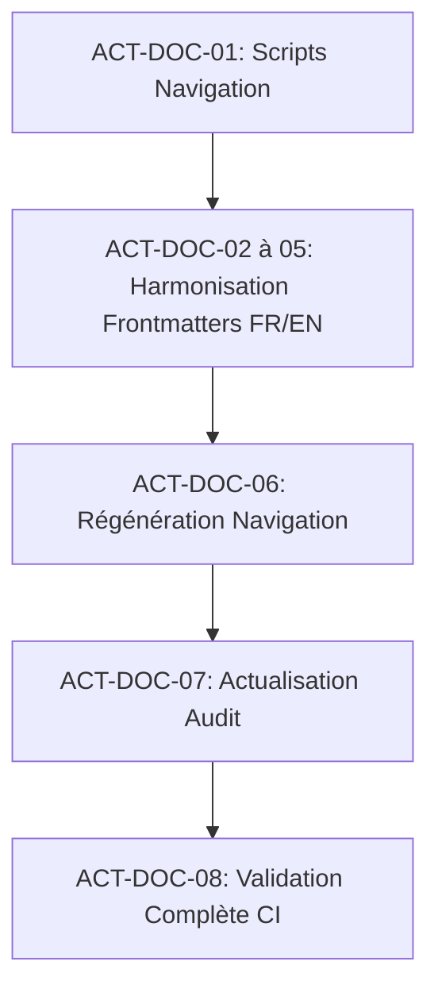

# 📋 Plan d'Actions : Harmonisation, Suppression des Préfixes Numériques & SEO de la Documentation

> **Date :** 04 Octobre 2026  
> **Workspace :** `dinum-setup`  
> **Objectif :** Supprimer tous les préfixes numériques dans les titres (`title`) et les libellés de navigation (`sidebar_label`), enrichir les métadonnées SEO/Pagefind pour éliminer les collisions, et assurer un portail international 100% anglophone.

---

## 🎯 Objectifs Stratégiques

1. **Zéro Préfixe Numérique dans la Sidebar et les Titres :**
   - Éliminer `00.`, `01.`, `02.`, etc. des générateurs de navigation (`generate-docs-navigation.mjs`), des catégories Zudoku et des frontmatters.
   - Les numéros de répertoires (`01-onboarding/`, `02-la-suite/`) restent purement techniques sur disque pour l'ordonnancement.

2. **Dédoublonnage SEO & Recherche Pagefind :**
   - Remplacer les titres génériques dupliqués dans `03-slasheurs-france` (ex: 10 fois `Benchmark APIs`) par des titres contextuels explicites (ex: `Benchmark des APIs Législatives (Légifrance, DILA)`).
   - Conserver un `sidebar_label` concis pour préserver la lisibilité de la sidebar.

3. **Portail International 100% Anglophone :**
   - Remplacer tous les résidus français (`Thèmes`, `Tutoriel`, `Sécurité`, `Europe`, `Espagne`) par leur équivalent anglophone.
   - Nettoyer les stubs et routes obsolètes.

4. **Validation de Non-Régression :**
   - `npm run docs:build` avec 0 erreur SSR / hydratation.
   - Index Pagefind généré sans collision.
   - `typecheck`, `lint` et `packages:test` 100% verts.

---

## 📋 Tableau de Bord des Tâches

| ID             | Domaine          | Description de la Tâche                                                                                          | Statut     |
| :------------- | :--------------- | :--------------------------------------------------------------------------------------------------------------- | :--------- |
| **ACT-DOC-01** | `Scripts`        | Nettoyer les scripts `generate-docs-navigation.mjs` (FR & EN) pour retirer tout préfixe numérique des catégories | � Terminé  |
| **ACT-DOC-02** | `Frontmatter FR` | Nettoyer les frontmatters `01-onboarding/` (titres et labels sans numéro)                                        | 🟢 Terminé |
| **ACT-DOC-03** | `Frontmatter FR` | Nettoyer les frontmatters `02-la-suite/` (titres enrichis, sidebar concise sans numéro)                          | 🟢 Terminé |
| **ACT-DOC-04** | `Frontmatter FR` | Contextualiser les 81 fichiers de `03-slasheurs-france/` pour un SEO Pagefind unique                             | 🟢 Terminé |
| **ACT-DOC-05** | `Frontmatter EN` | Corriger les 29 fichiers de `documentation-international/docs/` (100% anglais, zéro numéro)                      | 🟢 Terminé |
| **ACT-DOC-06** | `Navigation`     | Régénérer `zudoku.navigation.tsx` sur les deux portails via `npm run docs:nav`                                   | 🟢 Terminé |
| **ACT-DOC-07** | `Audit`          | Régénérer le rapport complet `AUDIT_ARCHITECTURE_FILESDOCS.md`                                                   | 🟢 Terminé |
| **ACT-DOC-08** | `Validation`     | Exécuter la suite complète de contrôle (`docs:build`, `typecheck`, `lint`, `tests`)                              | 🟢 Terminé |

---

## 🚀 Étapes d'Exécution

