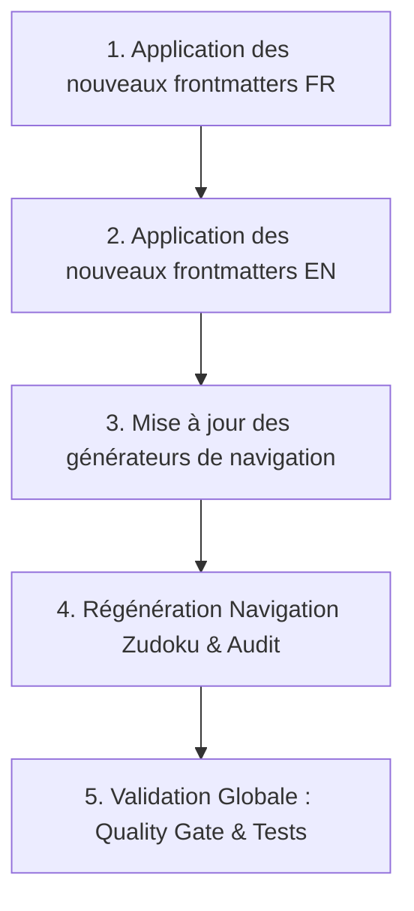

# 🎨 Plan d'Actions : Embellissement, Clarté & Équilibre des Libellés de Sidebar

> **Date :** 04 Octobre 2026  
> **Workspace :** `dinum-setup`  
> **Objectif :** Remplacer les libellés de sidebar trop télégraphiques, secs ou bruts par des titres fluides, naturels et auto-porteurs (2 à 4 mots / 15 à 30 caractères), sans aucun préfixe numérique, tout en maintenant des métadonnées SEO/Pagefind riches et uniques.

---

## 🎯 1. Principes Directeurs d'Écriture

| Règle | Approche Recommandée | Ce qu'on évite |
| :--- | :--- | :--- |
| **Longueur idéale** | **2 à 4 mots (15 à 30 caractères)** | Les mots uniques isolés (`Cache`, `Formats`, `Popover`) |
| **Clarté d'usage** | **Connecteur + Rôle** (`Docs (Éditeur)`, `Tchap (Messagerie)`) | Le nom d'outil brut sans qualificatif (`Docs`, `Tchap`) |
| **Fluidité grammaticale** | **Français / Anglais soigné avec prépositions** (`Guide du premier commit`, `Formats d'affichage`) | Le style télégraphique (`Premier Commit`, `Formats`) |
| **Zéro numéro** | **Intitulé sémantique direct** (`Vue d'ensemble`, `Socle technique`) | Les préfixes numérotés (`01. Vue d'ensemble`, `02. La Suite`) |

---

## 📋 2. Tableau Comparatif des Améliorations

### 🇫🇷 A. Portail Francophone (`documentation/docs/`)

#### 1. Section Onboarding (`01-onboarding/`)
| Fichier | Ancien `sidebar_label` | Nouveau `sidebar_label` (Fluide & Précis) |
| :--- | :--- | :--- |
| `00-contexte/challenge-42.mdx` | `Challenge 42` | **Hackathon & Contexte 42** |
| `00-contexte/planning.mdx` | `Planning` | **Planning du Hackathon** |
| `01-demarrage/configuration-serveur/...01.mdx` | `Configuration Serveur` | **Serveur distant & Déploiement** |
| `01-demarrage/configuration-serveur/...02.mdx` | `Support Serveurs` | **Support des serveurs distants** |
| `01-demarrage/environnement-machine-hote.mdx` | `Machine Hôte` | **Environnement machine hôte** |
| `01-demarrage/git-ssh.mdx` | `Git & SSH` | **Configuration Git & Clés SSH** |
| `01-demarrage/urls-et-identifiants.mdx` | `URLs & Identifiants` | **URLs & Identifiants locaux** |
| `01-demarrage/vscode.mdx` | `VS Code` | **Configuration & Extensions VS Code** |
| `02-workflow-et-contribution/adr/...0001.mdx` | `Architecture Monorepo` | **ADR-0001 : Architecture Monorepo** |
| `02-workflow-et-contribution/adr/...0002.mdx` | `Rendu Tri-Format` | **ADR-0002 : Rendu Tri-Format** |
| `02-workflow-et-contribution/adr/...0003.mdx` | `Proxy Anti-SSRF` | **ADR-0003 : Proxy Anti-SSRF** |
| `02-workflow-et-contribution/adr/...0004.mdx` | `Double Déclencheur` | **ADR-0004 : Double Déclencheur** |
| `02-workflow-et-contribution/bonnes-pratiques-dinum.mdx` | `Standards DINUM` | **Standards d'ingénierie DINUM** |
| `02-workflow-et-contribution/guide-du-premier-commit.mdx` | `Premier Commit` | **Guide du premier commit** |
| `02-workflow-et-contribution/qualite-et-architecture-la-suite.mdx` | `Qualité & Architecture` | **Architecture & Qualité logicielle** |
| `02-workflow-et-contribution/securite-du-poste-developpeur.mdx` | `Sécurité du Poste` | **Sécurité & Hygiène du poste** |
| `02-workflow-et-contribution/tests-et-qualite.mdx` | `Tests & Qualité` | **Stratégie de tests automatisés** |
| `02-workflow-et-contribution/workflow.mdx` | `Workflow Makefile` | **Workflow & Cibles Makefile** |
| `03-support/03-toml-frontmatter.mdx` | `Frontmatter TOML` | **Support du Frontmatter TOML** |
| `03-support/glossaire.mdx` | `Glossaire` | **Glossaire des termes souverains** |
| `03-support/troubleshooting.mdx` | `Dépannage FAQ` | **Dépannage & FAQ technique** |
| `04-ressources/communaute.mdx` | `Communauté` | **Communauté & Canaux d'entraide** |
| `04-ressources/roadmap.mdx` | `Roadmaps` | **Feuille de route & Jalons** |
| `04-ressources/templates-et-outils.mdx` | `Templates & Outils` | **Boîte à outils & Templates** |

#### 2. Section La Suite Numérique (`02-la-suite/`)
| Fichier | Ancien `sidebar_label` | Nouveau `sidebar_label` (Fluide & Précis) |
| :--- | :--- | :--- |
| `01-applications/01-documents-et-contenus/docs.mdx` | `Docs` | **Docs (Éditeur collaboratif)** |
| `01-applications/01-documents-et-contenus/fichiers-drive.mdx` | `Drive` | **Drive (Fichiers souverains)** |
| `01-applications/01-documents-et-contenus/grist.mdx` | `Grist` | **Grist (Bases de données & Tableur)** |
| `01-applications/02-communication-et-echange/meet.mdx` | `Meet` | **Meet (Visioconférence)** |
| `01-applications/02-communication-et-echange/tchap.mdx` | `Tchap` | **Tchap (Messagerie instantanée)** |
| `01-applications/02-communication-et-echange/transfers.mdx` | `Transfers` | **Transfers (Partage de fichiers)** |
| `01-applications/03-gestion-et-utilisateurs/accounts.mdx` | `Accounts` | **Accounts (Gestion des comptes)** |
| `01-applications/03-gestion-et-utilisateurs/people.mdx` | `People` | **People (Annuaire des agents)** |
| `01-applications/03-gestion-et-utilisateurs/projects.mdx` | `Projects` | **Projects (Gestion de tâches)** |
| `02-architecture/01-securite-et-identite/auth.mdx` | `Authentification SSO` | **Authentification & Sessions SSO** |
| `02-architecture/01-securite-et-identite/federation-identite-proconnect.mdx` | `ProConnect OIDC` | **Fédération ProConnect OIDC** |
| `02-architecture/01-securite-et-identite/secrets-sops.mdx` | `Secrets SOPS` | **Gestion des secrets SOPS & age** |
| `02-architecture/02-donnees-et-temps-reel/flux-stockage-s3.mdx` | `Stockage S3` | **Stockage objet S3 & MinIO** |
| `02-architecture/02-donnees-et-temps-reel/sauvegardes-et-restauration.mdx` | `Sauvegardes & PRA` | **Sauvegardes & Plan de reprise (PRA)** |
| `02-architecture/02-donnees-et-temps-reel/temps-reel-et-crdt.mdx` | `Temps Réel & CRDT` | **Collaboration temps réel & CRDT Yjs** |
| `02-architecture/03-devops-et-deploiement/cicd-github-actions.mdx` | `CI/CD Actions` | **Pipelines CI/CD GitHub Actions** |
| `02-architecture/03-devops-et-deploiement/deploiement-production.mdx` | `Déploiement Prod` | **Déploiement en production** |
| `02-architecture/03-devops-et-deploiement/env.mdx` | `Environnement` | **Gestion des variables d'environnement** |
| `02-architecture/03-devops-et-deploiement/hot-reload.mdx` | `Hot Reload` | **Développement local & Hot Reload** |
| `03-design-system/01-fondations/accessibilite-rgaa.mdx` | `Accessibilité RGAA` | **Accessibilité & Norme RGAA v4.1** |
| `03-design-system/01-fondations/couleurs-et-themes.mdx` | `Couleurs & Thèmes` | **Palette de couleurs & Thèmes** |
| `03-design-system/01-fondations/figma.mdx` | `Figma` | **Kits UI & Maquettes Figma** |
| `03-design-system/01-fondations/icones.mdx` | `Icônes` | **Catalogue d'icônes DSFR & Lucide** |
| `03-design-system/01-fondations/installation.mdx` | `Installation` | **Installation React DSFR & Cunningham** |
| `03-design-system/01-fondations/typographie.mdx` | `Typographie` | **Typographie Marianne & Échelles** |
| `03-design-system/02-composants/alertes-et-callouts.mdx` | `Alertes & Callouts` | **Composants Alertes & Callouts** |
| `03-design-system/02-composants/badges-et-statuts.mdx` | `Badges & Statuts` | **Composants Badges & Statuts** |
| `03-design-system/02-composants/boutons.mdx` | `Boutons` | **Composants Boutons & Liens** |
| `03-design-system/02-composants/cartes-et-conteneurs.mdx` | `Cartes & Conteneurs` | **Composants Cartes & Tuiles** |
| `03-design-system/02-composants/formulaires.mdx` | `Formulaires` | **Composants Formulaires & Saisie** |
| `03-design-system/02-composants/modales-et-dialogues.mdx` | `Modales & Dialogues` | **Composants Modales & Dialogues** |
| `03-design-system/02-composants/notices-et-bandeaux.mdx` | `Notices & Bandeaux` | **Composants Notices & Bandeaux** |
| `03-design-system/02-composants/pagination-et-stepper.mdx` | `Pagination & Stepper` | **Composants Pagination & Steppers** |
| `03-design-system/02-composants/tableaux.mdx` | `Tableaux` | **Composants Tableaux de données** |
| `03-design-system/03-layout-et-structure/navigation-et-layout.mdx` | `Navigation & Layout` | **Structure de page & En-têtes** |

#### 3. Section Slasheurs France (`03-slasheurs-france/`)
| Fichier / Sous-section | Ancien `sidebar_label` | Nouveau `sidebar_label` (Harmonieux & Clair) |
| :--- | :--- | :--- |
| `00-socle-technique.mdx` | `Socle Technique` | **Socle technique unifié** |
| `01-architecture-standardisee.mdx` | `Architecture Standard` | **Architecture 3-Tier standardisée** |
| `02-composant-customblock-unique.mdx` | `Composant CustomBlock` | **Composant CustomBlock unique** |
| `03-proxy-backend-et-cache.mdx` | `Proxy & Cache` | **Proxy backend & Cache Redis** |
| `04-tutoriel-ajouter-une-api.mdx` | `Tutoriel Nouvelle API` | **Tutoriel : Créer un connecteur** |
| `05-proposition.md` | `Proposition Sources` | **Proposition & Spécifications** |
| `06-sdk-developpeur/index.mdx` | `SDK Développeur` | **SDK TypeScript pour développeurs** |
| `07-roadmap.mdx` | `Roadmap Connecteurs` | **Feuille de route des connecteurs** |
| `13-reutilisation-transverse.mdx` | `Réutilisation Transverse` | **Intégration transverse dans La Suite** |
| `14-retour-d-experience.mdx` | `Retour d'Expérience` | **Retours d'expérience & Bonnes pratiques** |
| *Sous-pages connecteurs :* | | |
| `.../01-fondations-et-cadre.mdx` | `Fondations & Cadre` | **Fondations & Cadre réglementaire** |
| `.../02-cas-usage-et-scenarios.mdx` | `Cas d'Usage` | **Cas d'usage & Scénarios métier** |
| `.../01-benchmark-des-apis.mdx` | `Benchmark APIs` | **Benchmark & Sélection des APIs** |
| `.../02-specifications-techniques.mdx` | `Spécifications Endpoints` | **Spécifications des Endpoints** |
| `.../01-provider-django.mdx` | `Provider Django` | **Connecteur & Provider Django** |
| `.../02-rendu-et-settings.mdx` | `Rendu & Réglages` | **Rendu UI & Configuration** |

---

### 🌍 B. Portail International (`documentation-international/docs/`)

| Fichier | Ancien `sidebar_label` | Nouveau `sidebar_label` (Anglais naturel) |
| :--- | :--- | :--- |
| `00-overview/index.mdx` | `Overview` | **Standards & Vision Overview** |
| `00-overview/05-toml-frontmatter.mdx` | `TOML Frontmatter` | **TOML Frontmatter Standard** |
| `00-overview/architecture-3-tier.mdx` | `3-Tier Architecture` | **3-Tier Sovereign Architecture** |
| `00-overview/engineering-standards.mdx` | `Engineering Standards` | **Universal Engineering Standards** |
| `00-overview/international-vision.mdx` | `International Vision` | **International Data Federation** |
| `01-blocknote-extension/index.mdx` | `BlockNote Extension` | **BlockNote Extension Overview** |
| `01-blocknote-extension/3-display-formats.mdx` | `Display Formats` | **3 Display Formats (Card, Inline, Embed)** |
| `01-blocknote-extension/consumer-migration-guide.mdx` | `Migration Guide` | **Consumer Migration Guide** |
| `01-blocknote-extension/document-exports.mdx` | `Document Exports` | **Vector Document Exports** |
| `01-blocknote-extension/floating-search-popover.mdx` | `Search Popover` | **Floating Search Popover** |
| `01-blocknote-extension/styling-and-themes.mdx` | `Themes & Styling` | **Themes & Custom Styling** |
| `02-provider-sdk/index.mdx` | `SDK Overview` | **TypeScript SDK Overview** |
| `02-provider-sdk/build-provider-in-15-min.mdx` | `15-Min Quickstart` | **15-Min Quickstart Tutorial** |
| `02-provider-sdk/define-source-provider.mdx` | `Define Source Provider` | **Defining a Source Provider** |
| `02-provider-sdk/typescript-contracts.mdx` | `TypeScript Contracts` | **TypeScript Data Contracts** |
| `03-backend-proxy/index.mdx` | `Proxy Architecture` | **Backend Proxy Architecture** |
| `03-backend-proxy/defensive-security-ssrf.mdx` | `Defensive Security` | **Defensive Security & Anti-SSRF** |
| `03-backend-proxy/deterministic-cache.mdx` | `Deterministic Cache` | **Deterministic Cache & Redis** |
| `03-backend-proxy/quota-and-rate-limiting.mdx` | `Quotas & Rate Limiting` | **Quota & Rate Limiting** |
| `04-presets/index.mdx` | `Presets Overview` | **Multi-Country Presets Catalog** |
| `04-presets/canada.mdx` | `Canada` | **Canada (Open Government)** |
| `04-presets/european-union.mdx` | `European Union` | **European Union (EUR-Lex)** |
| `04-presets/germany-bund.mdx` | `Germany (Bund)` | **Germany (GovData / Bund)** |
| `04-presets/international.mdx` | `International` | **International (UN / World Bank)** |
| `04-presets/netherlands-gov.mdx` | `Netherlands (Gov)` | **Netherlands (data.overheid.nl)** |
| `04-presets/spain-boe.mdx` | `Spain (BOE)` | **Spain (BOE / datos.gob.es)** |
| `05-rfc-upstream/index.mdx` | `RFC Overview` | **RFC Overview & Upstream** |
| `05-rfc-upstream/blocknote-rfc-specification.mdx` | `BlockNote RFC` | **BlockNote RFC Specification** |

---

## 🚀 3. Étapes d'Exécution

