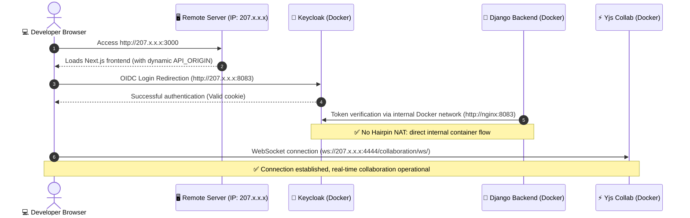

import { Mermaid } from "../../../src/components/Mermaid";

This document provides the **complete and reasoned Pull Request dossier** for maintainers of **La Suite Numérique (DINUM)** on the official [`suitenumerique/docs`](https://github.com/suitenumerique/docs) repository.

---

## 📌 Contribution Summary

| Parameter | Specification |
| :--- | :--- |
| **Target Repository** | [`suitenumerique/docs`](https://github.com/suitenumerique/docs) |
| **Suggested Title** | `feat(dev): make development URLs configurable for remote servers and cloud VMs` |
| **Backward Compatibility** | **100% Backward Compatible** — Default values remain `localhost` for local workstations. |
| **Primary Benefit** | Deploy and test on remote servers (SecNumCloud VM, Codespaces, VPS) without editing any source code lines. |

---

## 🎯 1. Context & Identified Problem

On remote machines (cloud VMs or development VPS), several network origins were historically hardcoded to `localhost`:
1. **Keycloak OIDC Redirection:** `KC_HOSTNAME=http://localhost:8083` forced browser redirection to the local client instead of the remote VM.
2. **Hairpin NAT Timeout:** Machine-to-machine calls (Django verifying Keycloak token) failed when Django attempted to reach its host's public IP.
3. **Real-time Collaboration Server:** Next.js client attempted to connect to `ws://localhost:4444` instead of the remote server IP.



---

## 📝 2. Exhaustive Git Diff for PR 1

### 🐳 2.1. Docker Compose (`compose.yml` & `compose-e2e.yml`)

```diff
--- a/compose.yml
+++ b/compose.yml
@@ -152,7 +152,7 @@ services:
       dockerfile: ./src/frontend/Dockerfile
       target: impress-dev
       args:
-        API_ORIGIN: "http://localhost:8071"
+        API_ORIGIN: "${API_ORIGIN:-http://localhost:8071}"
         PUBLISH_AS_MIT: "false"
         SW_DEACTIVATED: "true"
     image: impress:frontend-development

--- a/compose-e2e.yml
+++ b/compose-e2e.yml
@@ -6,7 +6,7 @@ services:
       dockerfile: ./src/frontend/Dockerfile
       target: frontend-production
       args:
-        API_ORIGIN: "http://localhost:8071"
+        API_ORIGIN: "${API_ORIGIN:-http://localhost:8071}"
         PUBLISH_AS_MIT: "false"
         SW_DEACTIVATED: "true"
```

---

### ⚛️ 2.2. Next.js Configuration (`src/frontend/apps/impress/next.config.js`)

```diff
--- a/src/frontend/apps/impress/next.config.js
+++ b/src/frontend/apps/impress/next.config.js
@@ -8,7 +8,7 @@ const buildId = crypto.randomBytes(256).toString('hex').slice(0, 8);
 
 /** @type {import('next').NextConfig} */
 const nextConfig = {
-  allowedDevOrigins: ['docs.127.0.0.1.nip.io'],
+  allowedDevOrigins: ['docs.127.0.0.1.nip.io', process.env.ALLOWED_DEV_ORIGIN].filter(Boolean),
   output: 'export',
   trailingSlash: true,
```

---

## 🧪 3. Verification & Testing Procedure

```bash
# 1. Set public IP of your remote server
export HOST_IP="207.175.155.66"
export API_ORIGIN="http://${HOST_IP}:8071"
export ALLOWED_DEV_ORIGIN="${HOST_IP}"

# 2. Start containers
make dev

# 3. Open in browser
# http://207.175.155.66:3000 -> OIDC login and WebSocket 100% operational
```
