import { Mermaid } from "../../../src/components/Mermaid";

Ce document fournit le **dossier de Pull Request officiel et argumenté** à soumettre sur le dépôt [`suitenumerique/docs`](https://github.com/suitenumerique/docs).

---

## 📌 En Bref

| Métrique | Description |
| :--- | :--- |
| **Dépôt Cible** | [`suitenumerique/docs`](https://github.com/suitenumerique/docs) |
| **Titre Suggéré** | `feat(sources): integrate modular French sovereign sources with progressive activation (Opt-in Plug & Play)` |
| **Empreinte sur Docs** | **Moins de 10 lignes de code modifiées dans 3 fichiers** (0 nouveau fichier métier in-tree). |
| **Gouvernance des Packages** | Publié sous le namespace `@suitenumerique/blocknote-sources` et `django-lasuite-sources` (avec option de publication sous registre privé/waxland si requis). |
| **Déploiement Progressif** | **Activation par étape :** Possibilité d'activer uniquement un sous-ensemble prioritaire de commandes (ex: `/loi` et `/entreprise`), puis d'élargir progressivement. |

---

## 🎯 1. Motivation & Stratégie d'Activation Progressive

### 💡 Le Constat Upstream
Le projet **La Suite Docs** est un commun numérique ouvert (licence MIT) utilisé tant par les ministères français que par des partenaires internationaux. Pour ne pas surcharger le cœur de l'application, l'ensemble des connecteurs ministériels est déporté dans deux packages autonomes :
- 🐍 **`django-lasuite-sources`** (Backend Django autonome avec registre de connecteurs et cache Redis 24h).
- 📦 **`@suitenumerique/blocknote-sources`** (Extension BlockNote CustomBlock aux 3 formats DSFR Marianne).

### 🪜 Déploiement par Étape (Staged Rollout)
Cette Pull Request permet à l'équipe produit de **La Suite Docs** de choisir les connecteurs à activer :
1. **Étape 1 (Pilote Prioritaire) :** Activation des commandes `/loi` (Légifrance) et `/entreprise` (Annuaire des Entreprises / INSEE).
2. **Étape 2 (Marchés & Commande Publique) :** Activation de `/marche` (BOAMP) et `/subvention` (Aides-Territoires).
3. **Étape 3 (Territoires & Géographie) :** Activation de `/adresse` (BAN), `/stats` (INSEE Données Locales) et `/cadastre` (DGFiP).
4. **Étape 4 (IA & Services Déconcentrés) :** Activation de `/albert` (IA Souveraine) et `/agent` (Annuaire DILA).

```mermaid
flowchart LR
    subgraph Etape1["Étape 1 : Pilote"]
        Loi["/loi (Légifrance)"]
        Ent["/entreprise (RNE / SIREN)"]
    end

    subgraph Etape2["Étape 2 : Commande Publique"]
        Marche["/marche (BOAMP)"]
        Subv["/subvention (Fonds Vert)"]
    end

    subgraph Etape3["Étape 3 : Territoires"]
        Adr["/adresse (BAN IGN)"]
        Stats["/stats (INSEE)"]
        Cad["/cadastre (DGFiP)"]
    end

    subgraph Etape4["Étape 4 : IA & Annuaire"]
        Alb["/albert (RAG DINUM)"]
        Ag["/agent (Annuaire SP)"]
    end

    Etape1 --> Etape2 --> Etape3 --> Etape4
```



---

## 📝 2. Diff Git Intégral (< 10 Lignes)

### 🐍 2.1. Backend Django (`src/backend/`)

#### 1. `src/backend/pyproject.toml`
```diff
--- a/src/backend/pyproject.toml
+++ b/src/backend/pyproject.toml
@@ -45,6 +45,7 @@ dependencies = [
     "django-configurations>=2.5.1",
     "django-redis>=5.4.0",
     "djangorestframework>=3.15.0",
+    "django-lasuite-sources>=1.0.0",
 ]
```

#### 2. `src/backend/impress/settings.py`
```diff
--- a/src/backend/impress/settings.py
+++ b/src/backend/impress/settings.py
@@ -120,6 +120,7 @@ INSTALLED_APPS = [
     "rest_framework",
     "core",
+    "lasuite_sources",
 ]
```

#### 3. `src/backend/impress/urls.py`
```diff
--- a/src/backend/impress/urls.py
+++ b/src/backend/impress/urls.py
@@ -35,6 +35,7 @@ urlpatterns = [
     path(f"api/{settings.API_VERSION}/", include("core.urls")),
+    path(f"api/{settings.API_VERSION}/", include("lasuite_sources.urls")),
 ]
```

---

### 📦 2.2. Frontend Next.js (`src/frontend/apps/impress/`)

#### 1. `src/frontend/apps/impress/package.json`
```diff
--- a/src/frontend/apps/impress/package.json
+++ b/src/frontend/apps/impress/package.json
@@ -52,6 +52,7 @@
     "@blocknote/core": "^0.54.2",
     "@blocknote/react": "^0.54.2",
+    "@suitenumerique/blocknote-sources": "^1.0.0",
     "@tanstack/react-query": "^5.28.4",
     "cunningham": "2.2.0"
   }
```

#### 2. `src/frontend/apps/impress/src/features/docs/doc-editor/components/BlockNoteEditor.tsx`
```diff
--- a/src/frontend/apps/impress/src/features/docs/doc-editor/components/BlockNoteEditor.tsx
+++ b/src/frontend/apps/impress/src/features/docs/doc-editor/components/BlockNoteEditor.tsx
@@ -18,6 +18,7 @@ import {
   defaultBlockSpecs,
 } from '@blocknote/core';
+import { SourceBlock } from '@suitenumerique/blocknote-sources';
 
 const baseBlockNoteSchema = withPageBreak(
   BlockNoteSchema.create({
     blockSpecs: {
       ...defaultBlockSpecs,
       callout: CalloutBlock(),
+      sourceBlock: SourceBlock(),
     },
   })
 );
```

#### 3. `src/frontend/apps/impress/src/features/docs/doc-editor/components/BlockNoteSuggestionMenu.tsx`
```diff
--- a/src/frontend/apps/impress/src/features/docs/doc-editor/components/BlockNoteSuggestionMenu.tsx
+++ b/src/frontend/apps/impress/src/features/docs/doc-editor/components/BlockNoteSuggestionMenu.tsx
@@ -12,6 +12,7 @@ import {
   filterSuggestionItems,
 } from '@blocknote/core';
+import { getSourceReactSlashMenuItems } from '@suitenumerique/blocknote-sources';
 
 export const BlockNoteSuggestionMenu = ({ editor }: { editor: BlockNoteEditor }) => {
   const { t } = useTranslation();
@@ -25,6 +26,7 @@ export const BlockNoteSuggestionMenu = ({ editor }: { editor: BlockNoteEditor }) => {
     return combineByGroup(
       defaultMenu,
+      getSourceReactSlashMenuItems(editor, t, t('Sources Souveraines')),
     );
   }, [editor, t]);
```

---

## 🛡️ 3. Conformité & Engagements Techniques

- 🔒 **Sécurité Anti-SSRF :** Blocage des adresses IP privées (`10.0.0.0/8`, `172.16.0.0/12`, `192.168.0.0/16`, `127.0.0.1`, `169.254.169.254`).
- ⚡ **Cache Déterministe SHA-256 :** Cache Redis 24h avec temps de réponse en cache inférieur à 5 ms.
- ♿ **Accessibilité RGAA v4.1 (AA) :** Navigation clavier intégrale (`↑`, `↓`, `Entrée`, `Échap`), zéro `@mantine/core` dans l'UI.
- 🎨 **Fidélité d'Export :** Mappeurs natifs pour `@react-pdf/renderer` (PDF vectoriel), Word (DOCX) et LibreOffice (ODT).
