import { Mermaid } from "../../../src/components/Mermaid";

This document provides the **complete, reasoned Pull Request dossier** to submit to the [`suitenumerique/docs`](https://github.com/suitenumerique/docs) repository.

---

## 📌 Executive Summary

| Metric | Description |
| :--- | :--- |
| **Target Repository** | [`suitenumerique/docs`](https://github.com/suitenumerique/docs) |
| **Suggested Title** | `feat(sources): integrate modular French sovereign sources with progressive activation (Opt-in Plug & Play)` |
| **Footprint on Docs** | **Fewer than 10 lines of code across 3 files** (0 new in-tree domain files). |
| **Package Governance** | Published under `@suitenumerique/blocknote-sources` and `django-lasuite-sources` (with option for private registry distribution if needed). |
| **Progressive Rollout** | **Staged activation:** Enable only priority commands initially (e.g., `/loi` and `/entreprise`), then expand progressively. |

---

## 🎯 1. Motivation & Staged Rollout Strategy

### 💡 Upstream Context
**La Suite Docs** is an open digital commons (MIT license) used by French public bodies and international partners. To avoid bloating core application code, all ministerial connectors are housed in two decoupled packages:
- 🐍 **`django-lasuite-sources`** (Autonomous Django backend with connector registry and 24h deterministic Redis cache).
- 📦 **`@suitenumerique/blocknote-sources`** (BlockNote CustomBlock extension with 3 Marianne DSFR display formats).

### 🪜 Staged Rollout
This Pull Request enables the **La Suite Docs** team to selectively activate connectors:
1. **Stage 1 (Pilot Phase):** Activate `/loi` (Légifrance) and `/entreprise` (Corporate Registry / INSEE).
2. **Stage 2 (Public Procurement):** Activate `/marche` (BOAMP) and `/subvention` (Aides-Territoires).
3. **Stage 3 (Territories & Geography):** Activate `/adresse` (BAN), `/stats` (INSEE Local Data), and `/cadastre` (DGFiP).
4. **Stage 4 (AI & Directory Services):** Activate `/albert` (Sovereign AI) and `/agent` (DILA Public Directory).

```mermaid
flowchart LR
    subgraph Stage1["Stage 1: Pilot"]
        Loi["/loi (Légifrance)"]
        Ent["/entreprise (RNE / SIREN)"]
    end

    subgraph Stage2["Stage 2: Procurement"]
        Marche["/marche (BOAMP)"]
        Subv["/subvention (Fonds Vert)"]
    end

    subgraph Stage3["Stage 3: Geography"]
        Adr["/adresse (BAN IGN)"]
        Stats["/stats (INSEE)"]
        Cad["/cadastre (DGFiP)"]
    end

    subgraph Stage4["Stage 4: AI & Directory"]
        Alb["/albert (DINUM RAG)"]
        Ag["/agent (Directory)"]
    end

    Stage1 --> Stage2 --> Stage3 --> Stage4
```



---

## 📝 2. Complete Git Diff (< 10 Lines)

### 🐍 2.1. Django Backend (`src/backend/`)

#### 1. `src/backend/pyproject.toml`
```diff
--- a/src/backend/pyproject.toml
+++ b/src/backend/pyproject.toml
@@ -45,6 +45,7 @@ dependencies = [
     "django-configurations>=2.5.1",
     "django-redis>=5.4.0",
     "djangorestframework>=3.15.0",
+    "django-lasuite-sources>=1.0.0",
 ]
```

#### 2. `src/backend/impress/settings.py`
```diff
--- a/src/backend/impress/settings.py
+++ b/src/backend/impress/settings.py
@@ -120,6 +120,7 @@ INSTALLED_APPS = [
     "rest_framework",
     "core",
+    "lasuite_sources",
 ]
```

#### 3. `src/backend/impress/urls.py`
```diff
--- a/src/backend/impress/urls.py
+++ b/src/backend/impress/urls.py
@@ -35,6 +35,7 @@ urlpatterns = [
     path(f"api/{settings.API_VERSION}/", include("core.urls")),
+    path(f"api/{settings.API_VERSION}/", include("lasuite_sources.urls")),
 ]
```

---

### 📦 2.2. Next.js Frontend (`src/frontend/apps/impress/`)

#### 1. `src/frontend/apps/impress/package.json`
```diff
--- a/src/frontend/apps/impress/package.json
+++ b/src/frontend/apps/impress/package.json
@@ -52,6 +52,7 @@
     "@blocknote/core": "^0.54.2",
     "@blocknote/react": "^0.54.2",
+    "@suitenumerique/blocknote-sources": "^1.0.0",
     "@tanstack/react-query": "^5.28.4",
     "cunningham": "2.2.0"
   }
```

#### 2. `src/frontend/apps/impress/src/features/docs/doc-editor/components/BlockNoteEditor.tsx`
```diff
--- a/src/frontend/apps/impress/src/features/docs/doc-editor/components/BlockNoteEditor.tsx
+++ b/src/frontend/apps/impress/src/features/docs/doc-editor/components/BlockNoteEditor.tsx
@@ -18,6 +18,7 @@ import {
   defaultBlockSpecs,
 } from '@blocknote/core';
+import { SourceBlock } from '@suitenumerique/blocknote-sources';
 
 const baseBlockNoteSchema = withPageBreak(
   BlockNoteSchema.create({
     blockSpecs: {
       ...defaultBlockSpecs,
       callout: CalloutBlock(),
+      sourceBlock: SourceBlock(),
     },
   })
 );
```

#### 3. `src/frontend/apps/impress/src/features/docs/doc-editor/components/BlockNoteSuggestionMenu.tsx`
```diff
--- a/src/frontend/apps/impress/src/features/docs/doc-editor/components/BlockNoteSuggestionMenu.tsx
+++ b/src/frontend/apps/impress/src/features/docs/doc-editor/components/BlockNoteSuggestionMenu.tsx
@@ -12,6 +12,7 @@ import {
   filterSuggestionItems,
 } from '@blocknote/core';
+import { getSourceReactSlashMenuItems } from '@suitenumerique/blocknote-sources';
 
 export const BlockNoteSuggestionMenu = ({ editor }: { editor: BlockNoteEditor }) => {
   const { t } = useTranslation();
@@ -25,6 +26,7 @@ export const BlockNoteSuggestionMenu = ({ editor }: { editor: BlockNoteEditor }) => {
     return combineByGroup(
       defaultMenu,
+      getSourceReactSlashMenuItems(editor, t, t('Sovereign Sources')),
     );
   }, [editor, t]);
```

---

## 🛡️ 3. Technical Compliance & Guarantees

- 🔒 **Anti-SSRF Defense:** Strict blocking of private IP ranges (`10.0.0.0/8`, `172.16.0.0/12`, `192.168.0.0/16`, `127.0.0.1`, `169.254.169.254`).
- ⚡ **Deterministic SHA-256 Cache:** 24h Redis cache delivering cached responses in under 5 ms.
- ♿ **RGAA v4.1 (AA) Accessibility:** Full keyboard navigation (`↑`, `↓`, `Enter`, `Escape`), zero `@mantine/core` in UI.
- 🎨 **Export Fidelity:** Native mapping for `@react-pdf/renderer` (vector PDF), Word (DOCX), and LibreOffice (ODT).
