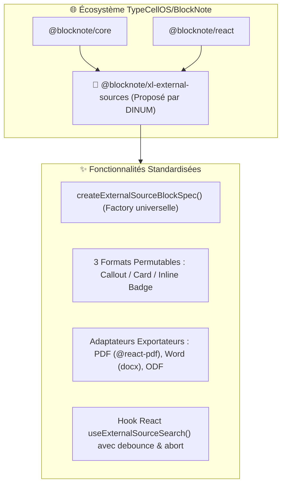

import { Mermaid } from "../../../src/components/Mermaid";
import { FeatureCard, FeatureGrid } from "../../../src/components/Cards";

Au-delà de l'intégration interne à La Suite Docs, les travaux conduits par la DINUM constituent une **contribution open source amont à destination de l'écosystème international [`TypeCellOS/BlockNote`](https://github.com/TypeCellOS/BlockNote)**.

---

## 📌 Synthèse de la Démarche Upstream

| Paramètre | Spécification |
| :--- | :--- |
| **Dépôt Cible** | [`TypeCellOS/BlockNote`](https://github.com/TypeCellOS/BlockNote) |
| **Statut de Contribution** | **Package d'extension communautaire** dans un premier temps (`@blocknote/xl-external-sources`), avec demande formelle d'intégration dans la suite officielle à terme (`@blocknote/xl-*`). |
| **Package Proposé** | `@blocknote/xl-external-sources` (TypeScript, React 18/19, zero-UI lock-in). |
| **Bénéfice Communautaire** | Standardise l'insertion, la recherche flottante contextuelle et l'affichage multi-formats pour toutes données distantes connectées. |

---

## 🧭 1. Vision & Plaidoyer Architectural

Actuellement, l'écosystème BlockNote propose des blocs riches pour les équations mathématiques (`@blocknote/math-block`) et les diagrammes Mermaid (`@blocknote/diagram-block`), mais **aucun standard officiel** pour connecter des entités distantes (APIs publiques, registres légaux, bases SQL d'entreprise, RAG IA).



---

## 🎨 2. Standardisation des 3 Formats & Configuration du Liseré

Le composant supporte par défaut le style officiel du Design System de l'État (bleu Marianne `#000091`), tout en offrant un **paramètre optionnel de personnalisation de la couleur de bordure** (`borderColor`) permettant à n'importe quelle organisation publique ou privée d'adapter la charte graphique :

<FeatureGrid cols={3}>
  <FeatureCard
    icon="📢"
    title="1. Mode Callout"
    badge="Mise en avant"
    description="Encadré avec liseré latéral personnalisable (ex: #000091), titre institutionnel cliquable et extrait de texte complet."
  />
  <FeatureCard
    icon="🗂️"
    title="2. Mode Card"
    badge="Métadonnées"
    description="Grille structurée 3 colonnes affichant les identifiants clés, la date d'effet, le statut et l'organisme émetteur."
  />
  <FeatureCard
    icon="🔗"
    title="3. Mode Inline Link"
    badge="Pastille discrète"
    description="Pastille compacte insérée dans la phrase avec infobulle interactive au survol révélant la métadonnée."
  />
</FeatureGrid>

---

## 📝 3. Modèle de RFC GitHub Prêt à Soumettre sur `TypeCellOS/BlockNote`

```markdown
# RFC: Standardized External Data Sources Extension for BlockNote (@blocknote/xl-external-sources)

**Author:** French Inter-ministerial Digital Directorate (DINUM) & La Suite Team  
**Status:** Community Extension Proposal -> Proposed Core Module  
**Target Repository:** TypeCellOS/BlockNote

## 📌 Motivation
Modern collaborative document workflows frequently reference live entities from external systems:
- Public registers & open data APIs (legal codes, address registries, corporate databases).
- Enterprise systems (CRM records, tickets, inventory assets).
- AI vector stores (RAG citations and factual synthesis).

Currently, developers using BlockNote must handcraft custom blocks, handle keyboard-accessible search popovers, manage multi-format switching, and write PDF/DOCX export mappers from scratch.

## 💡 Proposed Solution
We propose releasing `@blocknote/xl-external-sources` as a community extension, with a path to graduate into the official `@blocknote/xl-*` suite:

1. **`createExternalSourceBlockSpec(config)`**: Factory supporting seamless in-place switching between **Callout**, **Card**, and **Inline Badge** formats.
2. **Accessible Search Popover**: Keyboard-first popover with debouncing and query cancellation (`ArrowUp`/`ArrowDown`/`Enter`/`Escape`).
3. **Turnkey Export Adapters**: Native mappings for `@blocknote/xl-pdf-exporter`, `@blocknote/xl-docx-exporter`, and `@blocknote/xl-odt-exporter`.
4. **Themeable Styling**: Neutral default theme with simple configurable accent/border colors.

## 🧪 Battle-Tested Implementation
This architecture is currently running across 12 public service APIs in **La Suite Docs**, supporting full keyboard accessibility (WCAG / RGAA AA compliant) and lossless vector PDF export.

We would be thrilled to submit this contribution to the BlockNote community!
```
