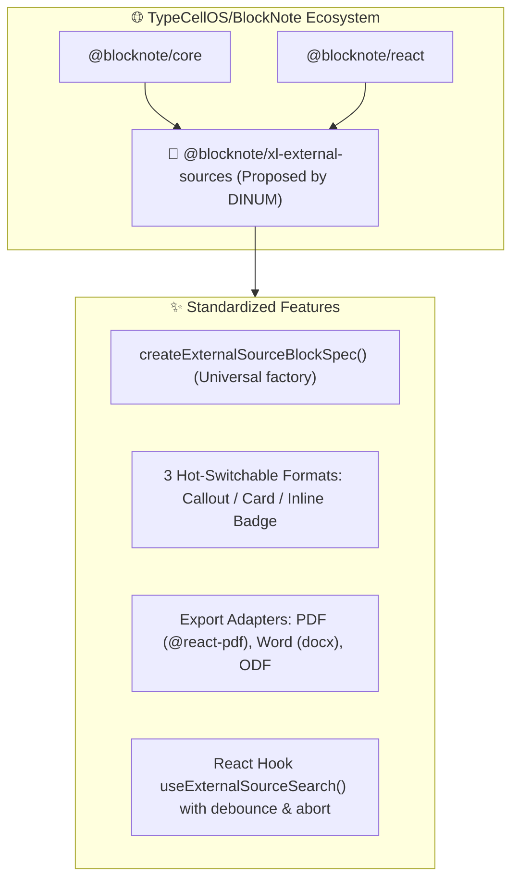

import { Mermaid } from "../../../src/components/Mermaid";
import { FeatureCard, FeatureGrid } from "../../../src/components/Cards";

Beyond internal integration within La Suite Docs, this work represents an **upstream open source contribution to the international [`TypeCellOS/BlockNote`](https://github.com/TypeCellOS/BlockNote) ecosystem**.

---

## 📌 Upstream Contribution Summary

| Parameter | Specification |
| :--- | :--- |
| **Target Repository** | [`TypeCellOS/BlockNote`](https://github.com/TypeCellOS/BlockNote) |
| **Contribution Status** | **Community extension package** initially (`@blocknote/xl-external-sources`), with graduation path to official `@blocknote/xl-*` suite. |
| **Proposed Package** | `@blocknote/xl-external-sources` (TypeScript, React 18/19, zero-UI lock-in). |
| **Community Benefit** | Standardizes insertion, floating contextual search, and 3-format display for any connected remote data. |

---

## 🧭 1. Vision & Architectural Rationale

Currently, the BlockNote ecosystem provides rich blocks for math equations (`@blocknote/math-block`) and Mermaid diagrams (`@blocknote/diagram-block`), but **no official standard** for referencing external entities (public APIs, legal registries, enterprise SQL databases, AI RAG).



---

## 🎨 2. Standardizing the 3 Formats & Border Customization

The component defaults to a clean theme while supporting an **optional border color customization parameter** (`borderColor`) enabling any organization to match its design system:

<FeatureGrid cols={3}>
  <FeatureCard
    icon="📢"
    title="1. Callout Mode"
    badge="Callout"
    description="Highlighted container with customizable left accent border, clickable title, and full text excerpt."
  />
  <FeatureCard
    icon="🗂️"
    title="2. Card Mode"
    badge="Metadata"
    description="Structured 3-column metadata grid displaying key identifiers, effective date, status, and issuing authority."
  />
  <FeatureCard
    icon="🔗"
    title="3. Inline Link Mode"
    badge="Inline Badge"
    description="Compact badge seamlessly embedded in prose with interactive hover tooltip revealing metadata."
  />
</FeatureGrid>

---

## 📝 3. GitHub RFC Template Ready to Submit to `TypeCellOS/BlockNote`

```markdown
# RFC: Standardized External Data Sources Extension for BlockNote (@blocknote/xl-external-sources)

**Author:** French Inter-ministerial Digital Directorate (DINUM) & La Suite Team  
**Status:** Community Extension Proposal -> Proposed Core Module  
**Target Repository:** TypeCellOS/BlockNote

## 📌 Motivation
Modern collaborative document workflows frequently reference live entities from external systems:
- Public registers & open data APIs (legal codes, address registries, corporate databases).
- Enterprise systems (CRM records, tickets, inventory assets).
- AI vector stores (RAG citations and factual synthesis).

Currently, developers using BlockNote must handcraft custom blocks, handle keyboard-accessible search popovers, manage multi-format switching, and write PDF/DOCX export mappers from scratch.

## 💡 Proposed Solution
We propose releasing `@blocknote/xl-external-sources` as a community extension, with a path to graduate into the official `@blocknote/xl-*` suite:

1. **`createExternalSourceBlockSpec(config)`**: Factory supporting seamless in-place switching between **Callout**, **Card**, and **Inline Badge** formats.
2. **Accessible Search Popover**: Keyboard-first popover with debouncing and query cancellation (`ArrowUp`/`ArrowDown`/`Enter`/`Escape`).
3. **Turnkey Export Adapters**: Native mappings for `@blocknote/xl-pdf-exporter`, `@blocknote/xl-docx-exporter`, and `@blocknote/xl-odt-exporter`.
4. **Themeable Styling**: Neutral default theme with simple configurable accent/border colors.

## 🧪 Battle-Tested Implementation
This architecture is currently running across 12 public service APIs in **La Suite Docs**, supporting full keyboard accessibility (WCAG / RGAA AA compliant) and lossless vector PDF export.

We would be thrilled to submit this contribution to the BlockNote community!
```
