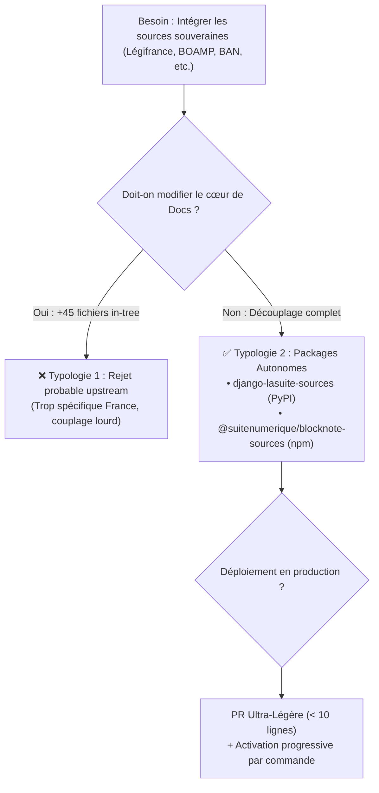

import { Mermaid } from "../../../src/components/Mermaid";

Ce guide fournit la **matrice d'arbitrage multicritères** permettant à la gouvernance de la DINUM et aux mainteneurs de La Suite Docs de valider l'approche packagée low-code.

---

## 📊 1. Matrice Comparative des Stratégies

| Dimension Stratégique | Typologie 1 : Monolithe In-Tree (+45 fichiers) | Typologie 2 : Packages Découplés (< 10 lignes) | Arbitrage Recommandé |
| :--- | :--- | :--- | :---: |
| **Empreinte sur `suitenumerique/docs`** | $+45$ fichiers créés dans le cœur de l'app | **$0$ nouveau fichier**, $9$ lignes modifiées | 🟢 **Typologie 2** |
| **Charge de Revue de Code (PR Review)** | Élevée (~1 850 lignes à auditer) | Faible (< 10 lignes de câblage) | 🟢 **Typologie 2** |
| **Dette Technique & Pollution Métier** | Forte (logique France injectée dans un outil international) | Nulle (application de Docs générique) | 🟢 **Typologie 2** |
| **Agilité de Mise à Jour des APIs** | Re-publication complète de Docs à chaque fix d'API | Mise à jour indépendante du package en < 15 min | 🟢 **Typologie 2** |
| **Réutilisation Transverse par l'État** | Confiné exclusivement à Docs | Réutilisable dans *Projects*, *Meet* et portails tiers | 🟢 **Typologie 2** |
| **Activation Progressive (Staged Rollout)** | Tout ou rien | Activation au choix par commande (`/loi`, `/marche`...) | 🟢 **Typologie 2** |

---

## 🏗️ 2. Schéma Décisionnel

---

## 📜 3. Recommandation Finale pour la DINUM

La **Typologie 2 (Packages Découplés)** est unanimement recommandée car elle concilie l'autonomie des équipes françaises et l'intégrité de l'écosystème open source international de La Suite Numérique.
