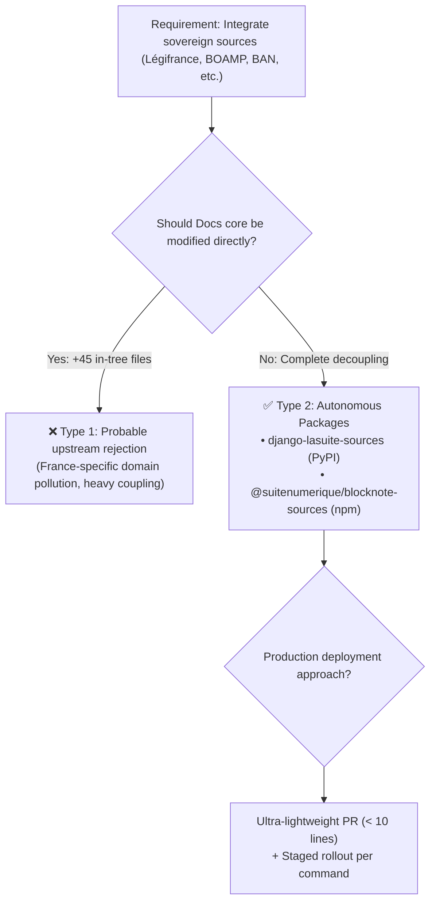

import { Mermaid } from "../../../src/components/Mermaid";

This guide provides the **multi-criteria decision matrix** enabling DINUM leadership and La Suite Docs maintainers to validate the low-code packaged approach.

---

## 📊 1. Strategy Comparison Matrix

| Strategic Dimension | Type 1: In-Tree Monolith (+45 files) | Type 2: Decoupled Packages (< 10 lines) | Recommended Arbitrage |
| :--- | :--- | :--- | :---: |
| **Footprint on `suitenumerique/docs`** | $+45$ files created in application core | **$0$ new files**, $9$ modified lines | 🟢 **Type 2** |
| **PR Review Overhead** | High (~1,850 lines to audit) | Low (< 10 plumbing lines) | 🟢 **Type 2** |
| **Technical Debt & Domain Pollution** | High (France-specific logic injected into generic international app) | None (Docs core remains clean) | 🟢 **Type 2** |
| **API Maintenance Agility** | Full Docs release required for every external API change | Independent package updates in < 15 min | 🟢 **Type 2** |
| **Cross-App Reusability across State** | Confined strictly to Docs | Reusable across *Projects*, *Meet*, and third-party portals | 🟢 **Type 2** |
| **Progressive Staged Rollout** | All-or-nothing | Granular command-by-command opt-in (`/loi`, `/marche`...) | 🟢 **Type 2** |

---

## 🏗️ 2. Decision Tree

---

## 📜 3. Final Recommendation

**Type 2 (Decoupled Packages)** is strongly recommended as it combines independence for national public sector needs with upstream compatibility for La Suite's international open source community.
