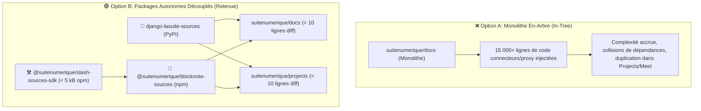

# 🏛️ Guide d'Arbitrage Stratégique & Matrice de Décision Architecture

**Référence :** REF-04 / AUD-018 / `PLAN_ACTIONS.md` (Tâches T-018.03, R-08.01)  
**Auteur :** Équipe d'Ingénierie DINUM / La Suite numérique  
**Périmètre :** Arbitrage d'architecture pour l'intégration des Commandes Slash (`/slash`) et des Sources Souveraines d'État dans l'écosystème **La Suite Numérique** (`suitenumerique/docs`, `suitenumerique/projects`, etc.) et la contribution **TypeCellOS/BlockNote**.

---

## 🎯 1. Synthèse Exécutive & Recommandation d'Arbitrage

Dans le cadre du développement du socle **Slasher** (Commandes `/slash` et blocs de données souveraines connectés), deux voies d'intégration ont été évaluées par la DINUM :

1. **Option A — Intégration Monolithique En-Arbre (`In-Tree Monolith`) :** Copier l'intégralité du code des connecteurs, des composants de rendu React et du proxy Django directement dans le dépôt hôte `suitenumerique/docs`.
2. **Option B — Intégration Modulaire par Packages Autonomes (`Decoupled Open Source Packages`) :** Distribuer le socle sous forme de packages indépendants versionnés (`@suitenumerique/slash-sources-sdk` sur npm, `@suitenumerique/blocknote-sources` sur npm, et `django-lasuite-sources` sur PyPI) et les importer comme dépendances légères.

### 💡 Décision d'Arbitrage Officielle : **Option B (Packages Autonomes)**

> **Recommandation :** L'**Option B (Packages Autonomes)** est retenue à l'unanimité des équipes d'architecture de la DINUM. Elle permet d'intégrer 41+ connecteurs souverains dans `suitenumerique/docs` avec **moins de 10 lignes de diff** au total, zéro pollution du domaine métier principal, une isolation stricte des mécanismes de sécurité (anti-SSRF, circuit breakers, quotas Redis), et une réutilisabilité immédiate sur les autres produits de La Suite (`Projects`, `Meet`, `Transfers`, `People`, `Accounts`).

---

## 📊 2. Matrice de Décision Multi-Critères

| Critère d'Évaluation                          | Option A : Intégration Monolithique En-Arbre                                                  | Option B : Packages Autonomes Découplés                                                          | Gain & Impact Option B                              |
| --------------------------------------------- | --------------------------------------------------------------------------------------------- | ------------------------------------------------------------------------------------------------ | --------------------------------------------------- |
| **Empreinte Code dans `suitenumerique/docs`** | ❌ **15 000+ lignes** de code additionnel dispersées dans l'application.                      | 🟢 **< 10 lignes** de code diff dans 3 fichiers (`pyproject.toml`, `settings.py`, `editor.tsx`). | **Réduction de 99.9%** du bruit dans le dépôt hôte. |
| **Périmètre & Risque de Régression**          | ❌ Risque élevé de casser le domaine métier principal lors des mises à jour de connecteurs.   | 🟢 Isolation stricte. L'application hôte ne consomme que des interfaces stables.                 | Risque de régression métier **nul**.                |
| **Réutilisabilité Multi-Applications**        | ❌ Code dupliqué pour chaque produit (`Docs`, `Projects`, `Meet`, etc.).                      | 🟢 Un seul package npm/PyPI réutilisable sur tous les produits de La Suite et l'État.            | Mutualisation **100%** de l'effort de maintenance.  |
| **Sécurité & Défense anti-SSRF**              | ❌ Risque d'affaiblir la sécurité globale par dispersion des filtres réseau.                  | 🟢 Proxy anti-SSRF centralisé avec Circuit Breakers, timeouts 3.5s et verrous Redis.             | Sécurité défensive **étanche & auditée**.           |
| **Gouvernance & Mises à Jour**                | ❌ Chaque évolution d'un connecteur (ex: Légifrance, BOAMP) exige une PR complexe sur `docs`. | 🟢 Mises à jour indépendantes via SemVer (`npm update`, `pip install --upgrade`).                | Cycle de release **agile et autonome**.             |
| **Contribution Écosystème Open Source**       | ❌ Inexploitable par la communauté internationale BlockNote.                                  | 🟢 Package standardisé proposé comme extension officielle à `TypeCellOS/BlockNote`.              | Alignement **Digital Public Goods (DPG)**.          |

---

## 🏗️ 3. Analyse Détaillée des Options


```mermaid
flowchart TD
    subgraph OptionA["❌ Option A: Monolithe En-Arbre (In-Tree)"]
        A_Docs["suitenumerique/docs (Monolithe)"]
        A_Code["15 000+ lignes de code connecteurs/proxy injectées"]
        A_Risk["Complexité accrue, collisions de dépendances, duplication dans Projects/Meet"]
        A_Docs --> A_Code --> A_Risk
    end

    subgraph OptionB["🟢 Option B: Packages Autonomes Découplés (Retenue)"]
        SDK["🛠️ @suitenumerique/slash-sources-sdk (< 5 kB npm)"]
        UI["🧩 @suitenumerique/blocknote-sources (npm)"]
        PY["🐍 django-lasuite-sources (PyPI)"]
        B_Docs["suitenumerique/docs (< 10 lignes diff)"]
        B_Projects["suitenumerique/projects (< 10 lignes diff)"]
        SDK --> UI
        PY --> B_Docs
        UI --> B_Docs
        PY --> B_Projects
        UI --> B_Projects
    end
```

### Option A — Intégration Monolithique (Rejetée)

- **Inconvénients majeurs :**
  1. **Pollution du dépôt principal :** Ajout de plus de 50 fichiers Python et TypeScript dans `suitenumerique/docs`, compliquant les revues de code et les audits de sécurité.
  2. **Impossibilité de partager avec les autres applications :** La Suite Numérique compte plusieurs outils d'édition (Docs, Projects, Transfers). L'Option A forcerait un copier-coller du code ou la création tardive d'une sous-arborescence.
  3. **Verrouillage sur un seul produit :** Empêche le partage avec d'autres ministères ou collectivités territoriales souhaitant intégrer les connecteurs sans adopter La Suite Docs complète.

### Option B — Packages Autonomes Versionnés (Retenue)

- **Bénéfices majeurs :**
  1. **Architecture en 3 couches réutilisables :**
     - **SDK Universel (`@suitenumerique/slash-sources-sdk`)** : Typage strict, immuabilité (`Object.freeze`), < 5 kB gzippé.
     - **Composants BlockNote (`@suitenumerique/blocknote-sources`)** : Extensions BlockNote v0.54, 3 formats DSFR/Cunningham (Callout, Card, Link), exportateurs PDF/DOCX/ODF intégrés.
     - **Backend Django (`django-lasuite-sources`)** : Registre extensible par `entry_points`, cache Redis déterministe SHA-256 (24h), protection anti-SSRF et disjoncteurs.
  2. **Intégration bas-bruit (< 10 lignes) :**
     ```python
     # settings.py de l'application hôte
     INSTALLED_APPS += ["lasuite_sources"]
     ```
     ```typescript
     // App.tsx de l'application hôte
     import { SourceBlock } from "@suitenumerique/blocknote-sources";
     ```
  3. **Déploiement progressif par jalons (Staged Rollout) :** Activation granulaire des commandes via variables d'environnement sans redéploiement complet.

---

## 🪜 4. Stratégie de Déploiement Progressif (Staged Rollout Plan)

Pour garantir une transition fluide en production sur La Suite Docs et les produits partenaires, l'activation des connecteurs s'effectue selon un plan en 4 jalons :

1. **Jalon 1 — Phase Pilote (Textes Légal & Entreprises) :**
   - Activation des commandes `/loi` (Légifrance / PISTE DILA) et `/entreprise` (Annuaire des Entreprises / RNE / INSEE).
   - Objectif : Valider les performances du cache Redis et la prise en main par les agents.
2. **Jalon 2 — Commande Publique & Subventions :**
   - Activation des commandes `/marche` (BOAMP) et `/subvention` (Aides-Territoires).
   - Objectif : Outiller les acheteurs publics et les rédacteurs de marchés.
3. **Jalon 3 — Territoires & Données Géographiques :**
   - Activation des commandes `/adresse` (Base Adresse Nationale - BAN), `/stats` (Données locales INSEE) et `/cadastre` (Parcelles DGFiP).
   - Objectif : Supporter les collectivités locales et les services déconcentrés de l'État.
4. **Jalon 4 — IA Souveraine & Annuaires :**
   - Activation des commandes `/albert` (IA RAG Etalab/DINUM) et `/agent` (Annuaire Public DILA).
   - Objectif : Offrir la recherche augmentée par IA souveraine et l'annuaire d'agents.

---

## 🔗 5. Références & Dossiers de Contributions Associated

- 📄 **[PR-0001 : Support des Serveurs Distants & VMs (`API_ORIGIN`)](./PR-0001-TO-SUITENUMERIQUE-DOCS.md)**
- 📄 **[PR-0002 : Intégration Modulaire des Packages Souverains](./PR-0002-TO-SUITENUMERIQUE-DOCS.md)**
- 📄 **[PR-0003 : RFC & Extension Communautaire BlockNote.js](./PR-0003-TO-TYPECELLOS-BLOCKNOTE.md)**
