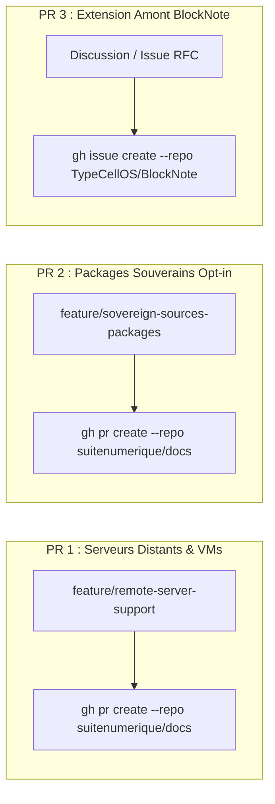

import { Mermaid } from "../../../src/components/Mermaid";

Ce guide récapitule l'ensemble des commandes **GitHub CLI (`gh`)** pour soumettre les Pull Requests officielles vers les dépôts amont `suitenumerique/docs` et `TypeCellOS/BlockNote`.



---

## 🚀 1. Soumission de la PR 1 : `suitenumerique/docs` (Support VM & Hairpin NAT)

### Objectif
Permettre le déploiement transparent de **La Suite Docs** sur serveurs distants, VPS et VMs sans blocage OIDC.

### Commandes Git & GitHub CLI

```bash
# 1. Se positionner dans le clone local de Docs
cd LaSuite/docs

# 2. Créer la branche dédiée
git checkout -b feature/remote-server-support

# 3. Ajouter les fichiers modifiés
git add compose.yml compose-e2e.yml src/frontend/apps/impress/.env.development src/frontend/apps/impress/next.config.js

# 4. Créer le commit conventionnel
git commit -m "feat(dev): make development URLs configurable for remote servers and VMs"

# 5. Pousser la branche
git push origin feature/remote-server-support

# 6. Créer la Pull Request officielle
gh pr create \
  --repo suitenumerique/docs \
  --title "feat(dev): make development URLs configurable for remote servers and VMs" \
  --body-file ../../documentation/docs/09-PR/01-docs-serveur-config.mdx \
  --base main \
  --head feature/remote-server-support
```

---

## 🚀 2. Soumission de la PR 2 : `suitenumerique/docs` (Intégration Packages Souverains)

### Objectif
Intégrer les 12 sources souveraines sous forme de packages autonomes avec activation progressive (diff < 10 lignes).

### Commandes Git & GitHub CLI

```bash
# 1. Se positionner dans le clone local de Docs
cd LaSuite/docs

# 2. Créer la branche dédiée
git checkout -b feature/sovereign-sources-packages

# 3. Ajouter les fichiers modifiés (< 10 lignes)
git add src/backend/pyproject.toml \
        src/backend/impress/settings.py \
        src/backend/impress/urls.py \
        src/frontend/apps/impress/package.json \
        src/frontend/apps/impress/src/features/docs/doc-editor/components/BlockNoteEditor.tsx \
        src/frontend/apps/impress/src/features/docs/doc-editor/components/BlockNoteSuggestionMenu.tsx

# 4. Créer le commit conventionnel
git commit -m "feat(sources): integrate modular French sovereign sources with progressive activation (Opt-in Plug & Play)"

# 5. Pousser la branche
git push origin feature/sovereign-sources-packages

# 6. Créer la Pull Request officielle
gh pr create \
  --repo suitenumerique/docs \
  --title "feat(sources): integrate modular French sovereign sources with progressive activation (Opt-in Plug & Play)" \
  --body-file ../../documentation/docs/09-PR/02-docs-packages-souverains.mdx \
  --base main \
  --head feature/sovereign-sources-packages
```

---

## 🌐 3. Soumission de la RFC 3 : `TypeCellOS/BlockNote` (Extension Amont)

### Objectif
Proposer la standardisation des blocs connectés à des APIs distantes multi-formats (`@blocknote/xl-external-sources`).

### Commandes GitHub CLI

```bash
# Dépôt de la RFC sur les discussions / issues TypeCellOS/BlockNote
gh issue create \
  --repo TypeCellOS/BlockNote \
  --title "RFC: Standardized External Data Sources & Multi-Format Connected Blocks (@blocknote/xl-external-sources)" \
  --body-file documentation/docs/09-PR/03-blocknote-external-sources.mdx \
  --label "enhancement,rfc,community-extension"
```
