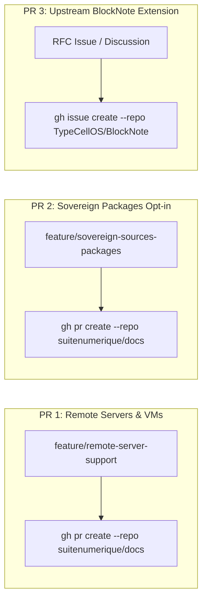

import { Mermaid } from "../../../src/components/Mermaid";

This guide summarizes all **GitHub CLI (`gh`)** commands to submit official Pull Requests to upstream repositories `suitenumerique/docs` and `TypeCellOS/BlockNote`.




## 🚀 2. Submitting PR 2: `suitenumerique/docs` (Sovereign Packages Integration)

### Objective
Integrate the 12 sovereign sources as autonomous packages with staged rollout (< 10 lines diff).

### Git & GitHub CLI Commands

```bash
# 1. Navigate to local Docs clone
cd LaSuite/docs

# 2. Create dedicated feature branch
git checkout -b feature/sovereign-sources-packages

# 3. Stage modified files (< 10 lines)
git add src/backend/pyproject.toml \
        src/backend/impress/settings.py \
        src/backend/impress/urls.py \
        src/frontend/apps/impress/package.json \
        src/frontend/apps/impress/src/features/docs/doc-editor/components/BlockNoteEditor.tsx \
        src/frontend/apps/impress/src/features/docs/doc-editor/components/BlockNoteSuggestionMenu.tsx

# 4. Create conventional commit
git commit -m "feat(sources): integrate modular French sovereign sources with progressive activation (Opt-in Plug & Play)"

# 5. Push branch
git push origin feature/sovereign-sources-packages

# 6. Create official Pull Request
gh pr create \
  --repo suitenumerique/docs \
  --title "feat(sources): integrate modular French sovereign sources with progressive activation (Opt-in Plug & Play)" \
  --body-file ../../documentation/docs/09-PR/02-docs-packages-souverains.mdx \
  --base main \
  --head feature/sovereign-sources-packages
```

---

## 🌐 3. Submitting RFC 3: `TypeCellOS/BlockNote` (Upstream Extension)

### Objective
Propose standardizing remote connected data blocks with multi-format rendering (`@blocknote/xl-external-sources`).

### GitHub CLI Commands

```bash
# Submit RFC to TypeCellOS/BlockNote discussions / issues
gh issue create \
  --repo TypeCellOS/BlockNote \
  --title "RFC: Standardized External Data Sources & Multi-Format Connected Blocks (@blocknote/xl-external-sources)" \
  --body-file documentation/docs/09-PR/03-blocknote-external-sources.mdx \
  --label "enhancement,rfc,community-extension"
```
