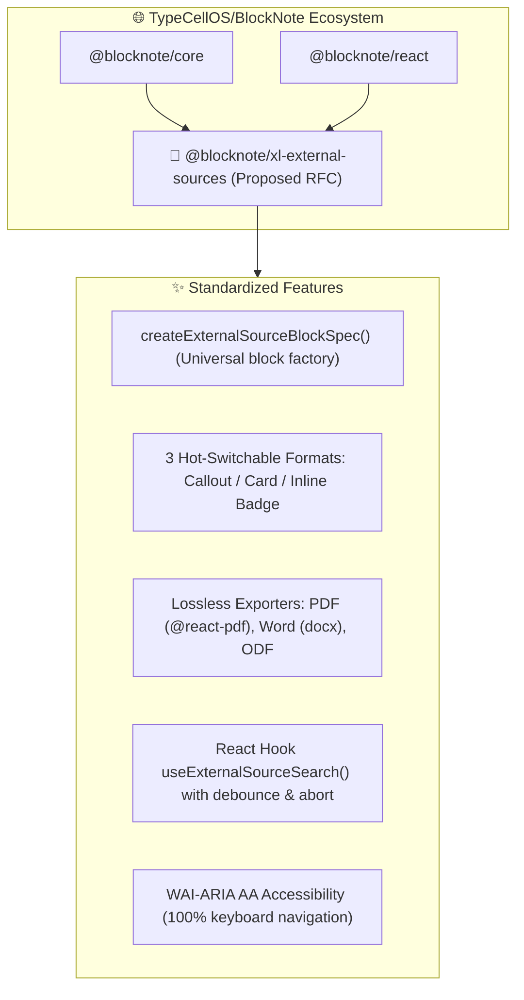

import { Mermaid } from "../../../src/components/Mermaid";
import { FeatureCard, FeatureGrid } from "../../../src/components/Cards";
import { PackageInstallTabs, DualLanguageTabs } from "../../../src/components/CodeTabs";
import { DocHeaderSummary } from "../../../src/components/DocHeaderSummary";

# 🌐 PR 3: RFC & Upstream Extension Proposal for BlockNote.js (`TypeCellOS/BlockNote`)

<DocHeaderSummary
  readingTime="8 min"
  level="Advanced"
  roles={["Frontend BlockNote", "Architect", "Open Source Maintainer"]}
  prerequisites={["@blocknote/core", "TypeScript", "WCAG 2.1 AA"]}
  status="Ready for Upstream RFC Submission"
  statusColor="info"
  takeaway="Formal Request for Comments (RFC) proposing @blocknote/xl-external-sources to standardize connected data blocks across the global BlockNote ecosystem."
/>

Beyond internal integration within La Suite Docs, this specification represents an **upstream open source contribution to the international [`TypeCellOS/BlockNote`](https://github.com/TypeCellOS/BlockNote) ecosystem**.

---

## 📌 Upstream Contribution Summary

| Parameter | Specification |
| :--- | :--- |
| **Target Repository** | [`TypeCellOS/BlockNote`](https://github.com/TypeCellOS/BlockNote) |
| **Contribution Type** | **RFC Discussion & Community Extension Package** initially (`@blocknote/xl-external-sources`), with graduation path to official `@blocknote/xl-*` suite. |
| **Proposed Package** | `@blocknote/xl-external-sources` (TypeScript, React 18/19, zero-UI lock-in, WAI-ARIA AA). |
| **Author & Governance** | Contributed by **waxland** (DINUM / La Suite Numérique contributor) under **MIT License**. |
| **Community Benefit** | Standardizes insertion, floating contextual search, and 3-format display (Callout, Card, Link) for any connected remote data with lossless PDF/DOCX exporters. |

---

## 🧭 1. Vision & Architectural Rationale

Currently, the BlockNote ecosystem provides rich blocks for math equations (`@blocknote/math-block`) and Mermaid diagrams (`@blocknote/diagram-block`), but **no official standard** for referencing external entities (public APIs, legal registries, enterprise SQL databases, AI RAG citations).



---

## 🎨 2. Standardizing the 3 Formats & Border Customization

The component defaults to a clean theme while supporting an **optional border color customization parameter** (`borderColor`) enabling any organization to match its design system:

<FeatureGrid cols={3}>
  <FeatureCard
    icon="📢"
    title="1. Callout Mode"
    badge="Callout"
    description="Highlighted container with customizable left accent border, clickable title, and full text excerpt."
  />
  <FeatureCard
    icon="🗂️"
    title="2. Card Mode"
    badge="Metadata"
    description="Structured 3-column metadata grid displaying key identifiers, effective date, status, and issuing authority."
  />
  <FeatureCard
    icon="🔗"
    title="3. Inline Link Mode"
    badge="Inline Badge"
    description="Compact badge seamlessly embedded in prose with interactive hover tooltip revealing metadata."
  />
</FeatureGrid>

---

## 📦 3. Developer Experience & Quick Start

Installing the proposed extension in any standard BlockNote project:

<PackageInstallTabs packages="@blocknote/xl-external-sources @blocknote/core @blocknote/react" />

### TypeScript Factory Example

```tsx
import { BlockNoteSchema, defaultBlockSpecs } from "@blocknote/core";
import { BlockNoteView } from "@blocknote/mantine";
import { useCreateBlockNote } from "@blocknote/react";
import { createExternalSourceBlockSpec } from "@blocknote/xl-external-sources";

const customSourceBlock = createExternalSourceBlockSpec({
  defaultDisplayMode: "callout",
  accentColor: "#000091", // Customizable theme token
});

const schema = BlockNoteSchema.create({
  blockSpecs: {
    ...defaultBlockSpecs,
    sourceBlock: customSourceBlock,
  },
});

export function AppEditor() {
  const editor = useCreateBlockNote({ schema });
  return <BlockNoteView editor={editor} />;
}
```

---

## 📝 4. GitHub RFC Template Ready to Submit to `TypeCellOS/BlockNote`

```markdown
# RFC: Standardized External Data Sources Extension for BlockNote (@blocknote/xl-external-sources)

**Author:** waxland (La Suite Numérique / DINUM Contributor)  
**Status:** Community Extension Proposal -> Proposed Core Module  
**Target Repository:** TypeCellOS/BlockNote  
**License:** MIT  

## 📌 Motivation
Modern collaborative document workflows frequently reference live entities from external systems:
- **Public Registers & Open Data APIs** (legislation, address registries, corporate databases, statistics).
- **Enterprise Databases** (CRM records, tickets, inventory assets).
- **AI Vector Stores** (RAG citations, semantic retrieval, factual synthesis).

Currently, developers using BlockNote must handcraft custom blocks, handle keyboard-accessible search popovers, manage multi-format switching, and write PDF/DOCX export mappers from scratch.

## 💡 Proposed Solution
We propose releasing `@blocknote/xl-external-sources` as a community extension, with a path to graduate into the official `@blocknote/xl-*` suite:

1. **`createExternalSourceBlockSpec(config)`**: Factory supporting seamless in-place switching between **Callout**, **Card**, and **Inline Badge** formats.
2. **Accessible Search Popover**: Keyboard-first popover with debouncing and query cancellation (`ArrowUp`/`ArrowDown`/`Enter`/`Escape`).
3. **Turnkey Export Adapters**: Native lossless export mappings for `@blocknote/xl-pdf-exporter`, `@blocknote/xl-docx-exporter`, and `@blocknote/xl-odt-exporter`.
4. **Universal Accessibility**: 100% keyboard navigable and screen-reader compliant (**WCAG 2.1 AA / RGAA v4.1 AA**).
5. **Themeable Styling**: Neutral default theme with simple configurable accent/border tokens.

## 🧪 Battle-Tested Implementation
This architecture is currently running across **41 public service APIs** (France, EU, Canada, Germany, Netherlands, Spain, and UN/World Bank) in **La Suite Docs**, supporting full keyboard accessibility, zero hydration errors, and lossless document exports.

We would be thrilled to submit this contribution to the BlockNote community!
```

---

## 🚀 5. Exact GitHub CLI Command to Submit this RFC

```bash
# 1. Open an RFC Issue / Discussion on TypeCellOS/BlockNote
gh issue create \
  --repo TypeCellOS/BlockNote \
  --title "RFC: Standardized External Data Sources & Multi-Format Connected Blocks (@blocknote/xl-external-sources)" \
  --body-file PR/PR-0003-TO-TYPECELLOS-BLOCKNOTE.md \
  --label "enhancement,rfc,community-extension"
```
