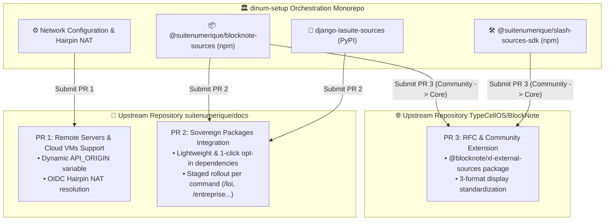

import { Mermaid } from "../../../src/components/Mermaid";
import { FeatureCard, FeatureGrid } from "../../../src/components/Cards";

All engineering and optimization work carried out in `dinum-setup` is formalized through **targeted, structured Pull Requests (PR) categorized by target repository**.

This hub centralizes complete specifications, contribution contexts, code diffs, and verification procedures for each upstream project.

---

## 🧭 1. Overview of Contributions by Target Repository

<FeatureGrid cols={3}>
  <FeatureCard
    icon="🌐"
    title="PR 1: Docs — Remote Servers & Cloud VMs Support"
    badge="suitenumerique/docs"
    description="Make La Suite Docs compatible with remote deployments and VMs without modifying source code (Hairpin NAT & dynamic API_ORIGIN)."
    href="/09-PR/01-docs-serveur-config"
  />
  <FeatureCard
    icon="📦"
    title="PR 2: Docs — Sovereign Foundation Integration"
    badge="suitenumerique/docs"
    description="Low-code (< 10 lines) modular integration of sovereign packages with staged progressive activation of slash commands."
    href="/09-PR/02-docs-packages-souverains"
  />
  <FeatureCard
    icon="📝"
    title="PR 3: BlockNote — External Data Sources Extension"
    badge="TypeCellOS/BlockNote"
    description="RFC and community package @blocknote/xl-external-sources standardizing 3-format remote data blocks."
    href="/09-PR/03-blocknote-external-sources"
  />
</FeatureGrid>

---

## 🏗️ 2. Upstream Contributions Map & Git Workflow

---

## 📊 3. Summary Table of Contributions

| PR ID | Target Repo | Title & Scope | Status | Key Benefit |
| :--- | :--- | :--- | :---: | :--- |
| **[PR-0001](./PR-0001-TO-SUITENUMERIQUE-DOCS.md)** | [`suitenumerique/docs`](https://github.com/suitenumerique/docs) | Remote server & VM support (`API_ORIGIN`) | 🟢 [PR #2703](https://github.com/suitenumerique/docs/pull/2703) | Instant deployment on VM/Cloud without OIDC blocking |
| **[PR-0002](./PR-0002-TO-SUITENUMERIQUE-DOCS.md)** | [`suitenumerique/docs`](https://github.com/suitenumerique/docs) | Sovereign packages & progressive activation | 🟡 Ready to submit | Zero in-tree pollution, granular command opt-in |
| **[PR-0003](./PR-0003-TO-TYPECELLOS-BLOCKNOTE.md)** | [`TypeCellOS/BlockNote`](https://github.com/TypeCellOS/BlockNote) | External Data Blocks RFC & Multi-Format extension | 🟡 Ready to submit | Open source standardization, path to official ecosystem |
| **[REF-04](./04-guide-d-arbitrage.md)** | *Internal Arbitrage* | Decision Guide & Arbitrage Matrix | Reference | Comparative analysis: In-Tree Monolith vs Decoupled Packages |

---

## 🚀 4. Detailed PR Dossiers

Access the complete ready-to-submit dossiers with exact `gh` CLI commands:
- 🔗 **[PR 1: Remote Servers & Cloud VMs Support (suitenumerique/docs — PR #2703)](./PR-0001-TO-SUITENUMERIQUE-DOCS.md)**
- 🔗 **[PR 2: Sovereign Packages Integration & Progressive Rollout (suitenumerique/docs)](./PR-0002-TO-SUITENUMERIQUE-DOCS.md)**
- 🔗 **[PR 3: BlockNote RFC & Community Extension (TypeCellOS/BlockNote)](./PR-0003-TO-TYPECELLOS-BLOCKNOTE.md)**
- 🔗 **[Strategic Arbitrage Guide & Decision Matrix](./04-guide-d-arbitrage.md)**
