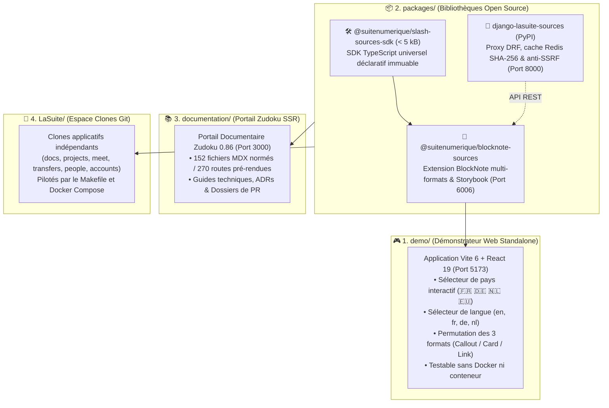

# 🏛️ Projet Slasher — DINUM / La Suite Dev Setup (Monorepo 4 Piliers)

> **Slasher** : Standard universel de blocs de données distantes pour BlockNote (`@blocknote/xl-external-sources`), SDK zéro-dépendance (`@blocknote/source-provider-sdk`) et socle souverain des sources connectées de l'État français (DINUM / Hackathon 42 Oléron).  
> Proposé à l'écosystème open source international **TypeCellOS/BlockNote**.


---

## 🧭 1. Architecture du Monorepo en 4 Piliers

Le dépôt est structuré en **4 piliers étanches et indépendants** :



---

## ⚡ 2. Démarrage Rapide & Tableau des Commandes

| Action / Composant | Commande npm | Commande Make | URL / Port |
| :--- | :--- | :--- | :---: |
| **🎮 Démonstrateur Web Standalone** | `npm run demo:dev` | `make demo-dev` | [`http://localhost:5173`](http://localhost:5173) |
| **📚 Portail Documentaire Zudoku** | `npm run docs:dev` | `make docs-dev` | [`http://localhost:3000`](http://localhost:3000) |
| **🎨 Storybook Composants BlockNote** | `npm run storybook` | `make storybook` | [`http://localhost:6006`](http://localhost:6006) |
| **🐍 Sandbox Django Demo Server** | `cd packages/django-lasuite-sources/demo && PYTHONPATH=.. ../.venv/bin/python manage.py runserver 8000` | - | [`http://localhost:8000`](http://localhost:8000) |
| **🧪 Tests Unitaires TypeScript (15/15)** | `npm run packages:test` | `make packages-test` | - |
| **🧪 Tests Unitaires Django (22/22)** | `cd packages/django-lasuite-sources && PYTHONPATH=. .venv/bin/pytest` | `make -C packages/django-lasuite-sources test` | - |
| **🏗️ Build Packages TypeScript** | `npm run packages:build` | `make packages-build` | `packages/*/dist/` |
| **🏗️ Build Démonstrateur Web** | `npm run demo:build` | `make demo-build` | `demo/dist/` |
| **🏗️ Build Documentation (270 routes)** | `npm run docs:build` | `make docs-build` | `documentation/dist/` |

---

## 🎮 3. Lancer le Démonstrateur Web Standalone (`demo/`)

Le démonstrateur web est une application autonome moderne (Vite 6 + React 19) qui embarque l'éditeur BlockNote.js et permet de tester tous les connecteurs souverains **sans nécessiter Docker ni backend local**.

### 🚀 Démarrage en Mode Développement :

```bash
# Via npm
npm run demo:dev

# Ou via Make
make demo-dev
```

👉 Ouvrez [`http://localhost:5173`](http://localhost:5173) dans votre navigateur.

### ✨ Fonctionnalités du Démonstrateur :
- **🌍 Sélecteur de Pays Interactif :**
  - 🇫🇷 **France (DINUM) :** Commandes `/loi` (Légifrance), `/entreprise` (RNE), `/marche` (BOAMP), `/adresse` (BAN), `/subvention`, `/stats` (INSEE), `/agent`, `/cadastre`, `/demarche`, `/opendata`, `/albert` (IA RAG).
  - 🇩🇪 **Deutschland (Bund) :** Commandes `/gesetz` (*Gesetze im Internet* / BMJ), `/register` (*Handelsregister*), `/bundestag`, `/govdata`.
  - 🇳🇱 **Nederland (Overheid) :** Commandes `/wet` (*Wettenbank* / Overheid.nl), `/kvk` (*Kamer van Koophandel*), `/bag` (Adresses), `/dataoverheid`.
  - 🇪� **España (Estado) :** Commandes `/ley` (*BOE*), `/empresa` (*Registro Mercantil*), `/licitacion` (*Contratación del Estado*), `/catastro` (*Sede del Catastro*).
  - 🇪🇺 **European Union :** Commandes `/eurlex` (*EUR-Lex* - RGPD / Directives), `/ted` (*Tenders Electronic Daily*), `/dataeuropa`.
- **🌐 Sélecteur de Langue :** Bascule instantanée de la locale de l'UI (`en` 🇬🇧, `fr` 🇫🇷, `de` 🇩🇪, `nl` 🇳🇱, `es` 🇪🇸).
- **🌙 Thème Sombre / Clair :** Bouton de bascule en haut à droite respectant les contrastes WCAG AA.
- **🔄 Permutation des Formats :** Basculez à chaud chaque bloc entre les formats **Callout**, **Card (Carte)** et **Link (Lien Inline)**.


### 🏗️ Compiler pour la Production :

```bash
npm run demo:build
# Ou : make demo-build
```

---

## 🎨 4. Lancer et Visualiser les Storybooks

### 🎨 4.1. Storybook Local des Composants BlockNote (`packages/blocknote-sources/`)

Le package `@suitenumerique/blocknote-sources` inclut une suite de Stories isolées pour tester chaque format et état du composant :
- `SourceCalloutFormat.stories.tsx` (Rendu Callout Marianne avec bordure `#000091`)
- `SourceCardFormat.stories.tsx` (Rendu Carte 3 colonnes avec métadonnées)
- `SourceLinkFormat.stories.tsx` (Rendu Lien Inline compact)
- `SourceSearchPopover.stories.tsx` (Palette de recherche contextuelle WAI-ARIA `cmdk`)

#### Démarrage du Storybook Local :

```bash
# Via npm
npm run storybook

# Ou via Make
make storybook
```

👉 Ouvrez [`http://localhost:6006`](http://localhost:6006) dans votre navigateur.

### 🌐 4.2. Storybooks Officiels en Ligne de La Suite :
- 📖 **Storybook Cunningham Design System :** [suitenumerique.github.io/cunningham](https://suitenumerique.github.io/cunningham/storybook/)
- 📖 **Storybook UI Kit La Suite (`@gouvfr-lasuite`) :** [suitenumerique.github.io/ui-kit](https://suitenumerique.github.io/ui-kit/)
- 📖 **Storybook React-DSFR Officiel :** [components.react-dsfr.fr](https://components.react-dsfr.fr/)

---

## 📦 5. Lancer, Développer et Tester les Packages (`packages/`)

Le dossier `packages/` héberge les 3 bibliothèques open source découplées :

### 🛠️ 5.1. Package `@suitenumerique/slash-sources-sdk` (TypeScript SDK)

SDK ultra-léger (< 5 kB) sans dépendance pour déclarer des connecteurs distants immuables.

```bash
# Lancer les tests unitaires Vitest
npm --prefix packages/slash-sources-sdk test

# Compiler en ESM + DTS
npm --prefix packages/slash-sources-sdk run build
```

### 🧩 5.2. Package `@suitenumerique/blocknote-sources` (Extension BlockNote)

Composant React pour BlockNote avec WAI-ARIA, i18n et exports PDF/DOCX/ODT.

```bash
# Lancer les tests unitaires et RGAA Vitest (12/12)
npm --prefix packages/blocknote-sources test

# Compiler les bundles CJS + ESM + DTS avec tsup
npm --prefix packages/blocknote-sources run build

# Lancer Storybook
npm --prefix packages/blocknote-sources run storybook
```

### 🐍 5.3. Package `django-lasuite-sources` (Backend Django)

Package Python / Django REST Framework encapsulant les 12 connecteurs certifiés de l'État, le cache Redis déterministe SHA-256 (24h) et le filtrage anti-SSRF.

```bash
# 1. Se positionner dans le dossier du package
cd packages/django-lasuite-sources

# 2. Exécuter la suite complète de 22 tests pytest (anti-SSRF, circuit breaker, registry, DRF)
PYTHONPATH=. .venv/bin/pytest

# 3. Lancer la mini-application Django autonome de démonstration (Port 8000)
cd demo
PYTHONPATH=.. ../.venv/bin/python manage.py runserver 8000
```

👉 Tester un connecteur via curl :
```bash
curl "http://localhost:8000/sources/suggest/?type=law&q=commande"
```

---

## 📚 6. Lancer le Portail Documentaire Zudoku (`documentation/`)

Le portail documentaire Zudoku (Vite SSR + React 19) expose les **152 fichiers documentaires** et les **270 routes** pré-rendues.

### 🚀 Démarrage en Mode Développement :

```bash
# Via npm
npm run docs:dev

# Ou via Make
make docs-dev
```

👉 Ouvrez [`http://localhost:3000`](http://localhost:3000) dans votre navigateur.

### 🏗️ Build SSR & Génération Statique :

```bash
# Génération de l'arbre de navigation
npm run docs:nav

# Compilation statique SSR (270 routes pré-rendues)
npm run docs:build

# Prévisualisation du build de production
npm run docs:preview
```

---

## 🐙 7. Gérer les Clones Applicatifs de La Suite (`LaSuite/`)

Le Makefile permet de cloner et d'orchestrer localement les applications de La Suite Numérique dans le dossier `LaSuite/` (isolé de la racine) :

```bash
# Cloner l'ensemble des dépôts configurés (docs, projects, meet, transfers, people, accounts)
make clone

# Cloner uniquement des dépôts spécifiques
REPOS="docs projects" make clone

# Préparer les fichiers .env locaux
make env

# Préparer les conteneurs et les bases de données locales
make bootstrap

# Démarrer la stack de développement Docker
make dev

# Arrêter les conteneurs
make stop
```

---

## 🛡️ 8. Qualité, Sécurité & Traçabilité

- **Accessibilité Universelle :** 100% conforme **RGAA v4.1 (Niveau AA)** et navigation clavier intégrale.
- **Pureté UI :** Zéro Tailwind CSS, zéro composant visuel `@mantine/core` dans les bibliothèques, tokens Cunningham officiels et composants DSFR.
- **Typage Strict :** Zéro `any`, `strict: true` sur l'ensemble du monorepo TypeScript.
- **Sécurité Défensive :** Filtrage anti-SSRF sur toutes les requêtes distantes et circuit breaker 3.5s.
- **Fichiers de Pilotage :**
  - [`RECAP.md`](RECAP.md) : Historique chronologique des itérations et tableau de bord 100% validé.
  - [`ISSUES.md`](ISSUES.md) : Registre officiel des contrôles de sécurité et de santé (0 bloqueur critique).
  - [`AUDIT_COMPLET.md`](AUDIT_COMPLET.md) : Audit technique complet et analyse critique d'ingénierie.
  - [`ARCHITECTURE.md`](ARCHITECTURE.md) : Cartographie des 4 piliers du monorepo.

