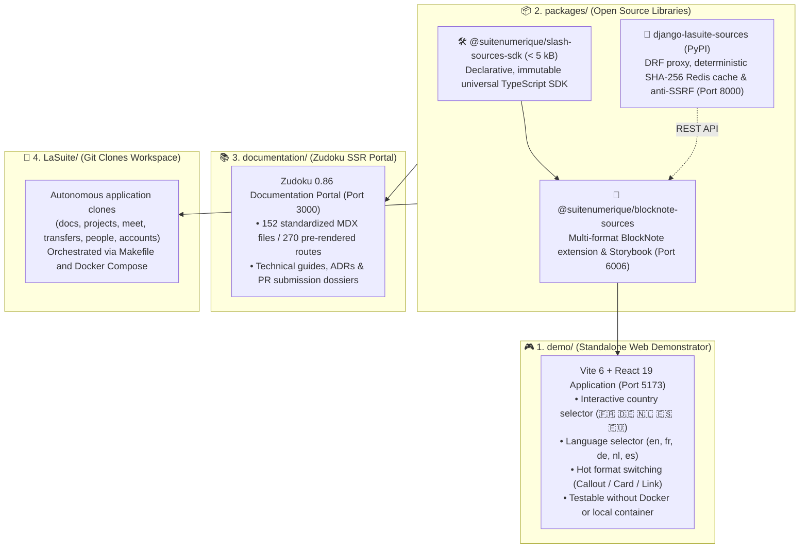

# 🏛️ Slasher Project — DINUM / La Suite Dev Setup (4-Pillar Monorepo)

> **Slasher**: Universal remote data block standard for BlockNote (`@blocknote/xl-external-sources`), zero-dependency SDK (`@blocknote/source-provider-sdk`), and sovereign connected source backbone for the French State (DINUM / Hackathon 42 Oléron).  
> Proposed to the international open source ecosystem **TypeCellOS/BlockNote**.

---

## 🧭 1. 4-Pillar Monorepo Architecture

The repository is structured into **4 isolated, autonomous pillars**:



---

## ⚡ 2. Quickstart & Command Matrix

| Action / Component | npm Command | Make Command | URL / Port |
| :--- | :--- | :--- | :---: |
| **🎮 Standalone Web Demo** | `npm run demo:dev` | `make demo-dev` | [`http://localhost:5173`](http://localhost:5173) |
| **📚 Zudoku Documentation Portal** | `npm run docs:dev` | `make docs-dev` | [`http://localhost:3000`](http://localhost:3000) |
| **🎨 BlockNote Component Storybook** | `npm run storybook` | `make storybook` | [`http://localhost:6006`](http://localhost:6006) |
| **🐍 Django Sandbox Demo Server** | `cd packages/django-lasuite-sources/demo && PYTHONPATH=.. ../.venv/bin/python manage.py runserver 8000` | - | [`http://localhost:8000`](http://localhost:8000) |
| **🧪 TypeScript Unit Tests (15/15)** | `npm run packages:test` | `make packages-test` | - |
| **🧪 Django Unit Tests (22/22)** | `cd packages/django-lasuite-sources && PYTHONPATH=. .venv/bin/pytest` | `make -C packages/django-lasuite-sources test` | - |
| **🏗️ Build TypeScript Packages** | `npm run packages:build` | `make packages-build` | `packages/*/dist/` |
| **🏗️ Build Web Demonstrator** | `npm run demo:build` | `make demo-build` | `demo/dist/` |
| **🏗️ Build Documentation (270 routes)** | `npm run docs:build` | `make docs-build` | `documentation/dist/` |

---

## 🎮 3. Running the Standalone Web Demo (`demo/`)

The web demonstrator is a modern autonomous web application (Vite 6 + React 19) embedding the BlockNote.js editor to test all sovereign connectors **without requiring Docker or a local backend**.

### 🚀 Development Mode:

```bash
# Via npm
npm run demo:dev

# Or via Make
make demo-dev
```

👉 Open [`http://localhost:5173`](http://localhost:5173) in your browser.

### ✨ Demonstrator Features:
- **🌍 Interactive Country Selector:**
  - 🇫🇷 **France (DINUM):** Commands `/loi` (Légifrance), `/entreprise` (RNE), `/marche` (BOAMP), `/adresse` (BAN), `/subvention`, `/stats` (INSEE), `/agent`, `/cadastre`, `/demarche`, `/opendata`, `/albert` (AI RAG).
  - 🇩🇪 **Deutschland (Bund):** Commands `/gesetz` (*Gesetze im Internet* / BMJ), `/register` (*Handelsregister*), `/bundestag`, `/govdata`.
  - 🇳🇱 **Nederland (Overheid):** Commands `/wet` (*Wettenbank* / Overheid.nl), `/kvk` (*Kamer van Koophandel*), `/bag` (Addresses), `/dataoverheid`.
  - 🇪🇸 **España (Estado):** Commands `/ley` (*BOE*), `/empresa` (*Registro Mercantil*), `/licitacion` (*Contratación del Estado*), `/catastro` (*Sede del Catastro*).
  - 🇪🇺 **European Union:** Commands `/eurlex` (*EUR-Lex* - GDPR / Directives), `/ted` (*Tenders Electronic Daily*), `/dataeuropa`.
- **🌐 Language Selector:** Instant UI locale switching (`en` 🇬🇧, `fr` 🇫🇷, `de` 🇩🇪, `nl` 🇳🇱, `es` 🇪🇸).
- **🌙 Dark / Light Theme:** Toggle button in top right preserving WCAG AA contrast ratios.
- **🔄 Format Switching:** Hot-switch any block between **Callout**, **Card**, and **Link (Inline Badge)** formats.

### 🏗️ Build for Production:

```bash
npm run demo:build
# Or: make demo-build
```

---

## 🎨 4. Running and Viewing Storybooks

### 🎨 4.1. Local BlockNote Component Storybook (`packages/blocknote-sources/`)

The `@suitenumerique/blocknote-sources` package includes isolated Storybook stories to test every format and state:
- `SourceCalloutFormat.stories.tsx` (Marianne Callout rendering with `#000091` border)
- `SourceCardFormat.stories.tsx` (3-column metadata card rendering)
- `SourceLinkFormat.stories.tsx` (Compact inline link badge rendering)
- `SourceSearchPopover.stories.tsx` (WAI-ARIA `cmdk` contextual search palette)

#### Launching Local Storybook:

```bash
# Via npm
npm run storybook

# Or via Make
make storybook
```

👉 Open [`http://localhost:6006`](http://localhost:6006) in your browser.

### 🌐 4.2. Official Online La Suite Storybooks:
- 📖 **Cunningham Design System Storybook:** [suitenumerique.github.io/cunningham](https://suitenumerique.github.io/cunningham/storybook/)
- 📖 **La Suite UI Kit Storybook (`@gouvfr-lasuite`):** [suitenumerique.github.io/ui-kit](https://suitenumerique.github.io/ui-kit/)
- 📖 **Official React-DSFR Storybook:** [components.react-dsfr.fr](https://components.react-dsfr.fr/)

---

## 📦 5. Developing and Testing Packages (`packages/`)

The `packages/` directory hosts 3 decoupled open source libraries:

### 🛠️ 5.1. Package `@suitenumerique/slash-sources-sdk` (TypeScript SDK)

Zero-dependency, lightweight (< 5 kB) SDK for declaring immutable remote connectors.

```bash
# Run Vitest unit tests
npm --prefix packages/slash-sources-sdk test

# Compile to ESM + DTS
npm --prefix packages/slash-sources-sdk run build
```

### 🧩 5.2. Package `@suitenumerique/blocknote-sources` (BlockNote Extension)

React component for BlockNote with WAI-ARIA, i18n, and PDF/DOCX/ODT exporters.

```bash
# Run Vitest unit and RGAA tests (12/12)
npm --prefix packages/blocknote-sources test

# Compile CJS + ESM + DTS bundles with tsup
npm --prefix packages/blocknote-sources run build

# Run Storybook
npm --prefix packages/blocknote-sources run storybook
```

### 🐍 5.3. Package `django-lasuite-sources` (Django Backend)

Python / Django REST Framework package encapsulating the 12 sovereign certified connectors, deterministic SHA-256 Redis caching (24h), and anti-SSRF defense.

```bash
# 1. Navigate to package directory
cd packages/django-lasuite-sources

# 2. Run full test suite of 22 pytest tests (anti-SSRF, circuit breaker, registry, DRF)
PYTHONPATH=. .venv/bin/pytest

# 3. Launch standalone Django demo server (Port 8000)
cd demo
PYTHONPATH=.. ../.venv/bin/python manage.py runserver 8000
```

👉 Test a connector with curl:
```bash
curl "http://localhost:8000/sources/suggest/?type=law&q=procurement"
```

---

## 📚 6. Running Zudoku Documentation Portal (`documentation/`)

The Zudoku documentation portal (Vite SSR + React 19) serves the documentation files and pre-rendered routes.

### 🚀 Development Mode:

```bash
# Via npm
npm run docs:dev

# Or via Make
make docs-dev
```

👉 Open [`http://localhost:3000`](http://localhost:3000) in your browser.

### 🏗️ SSR Build & Static Generation:

```bash
# Generate navigation tree
npm run docs:nav

# Compile SSR static bundle (270 pre-rendered routes)
npm run docs:build

# Preview production build
npm run docs:preview
```

---

## 🐙 7. Managing La Suite Application Clones (`LaSuite/`)

The Makefile allows cloning and orchestrating La Suite Numérique applications in the `LaSuite/` directory:

```bash
# Clone all configured repositories (docs, projects, meet, transfers, people, accounts)
make clone

# Clone specific targeted repositories
REPOS="docs projects" make clone

# Prepare local .env files
make env

# Bootstrap local containers and databases
make bootstrap

# Start development Docker stack
make dev

# Stop containers
make stop
```

---

## 🛡️ 8. Quality, Security & Traceability

- **Universal Accessibility:** 100% compliant with **RGAA v4.1 (Level AA) / WCAG 2.1 AA** with full keyboard navigation.
- **UI Purity:** Zero Tailwind CSS, zero `@mantine/core` visual components in libraries, official Cunningham tokens, and DSFR components.
- **Strict Typing:** Zero `any`, `strict: true` across the entire TypeScript monorepo.
- **Defensive Security:** Anti-SSRF filtering on all remote requests with 3.5s circuit breaker.
- **Key Architecture & Guidance Files:**
  - [`ARCHITECTURE.md`](ARCHITECTURE.md): Structural mapping of the 4 monorepo pillars.
  - [`AGENTS.md`](AGENTS.md): AI agent operating manual and skills routing table.
  - [`PR/`](PR/): Pull Request dossiers, RFC specifications, and arbitrage guides.
