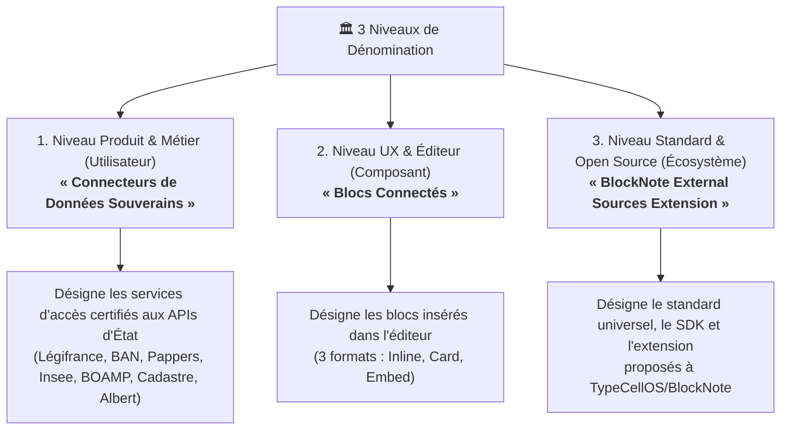
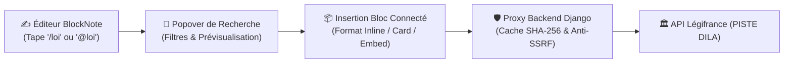
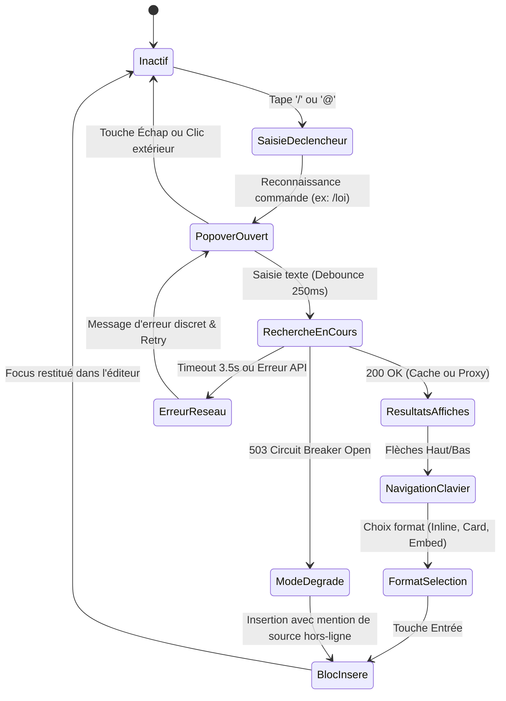
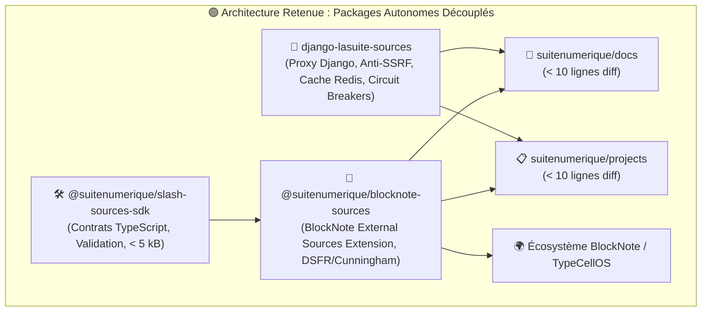
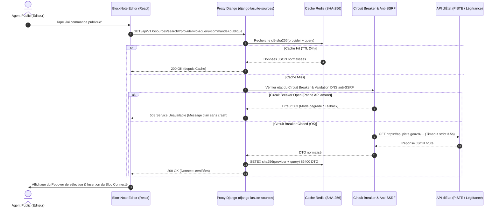
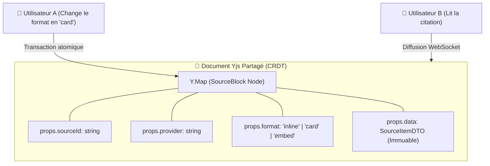
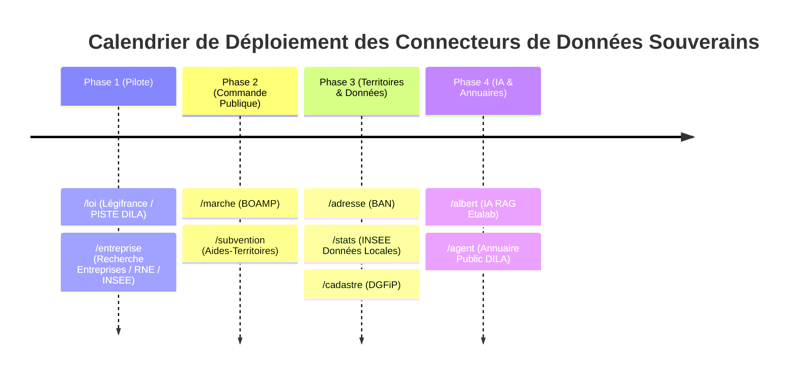
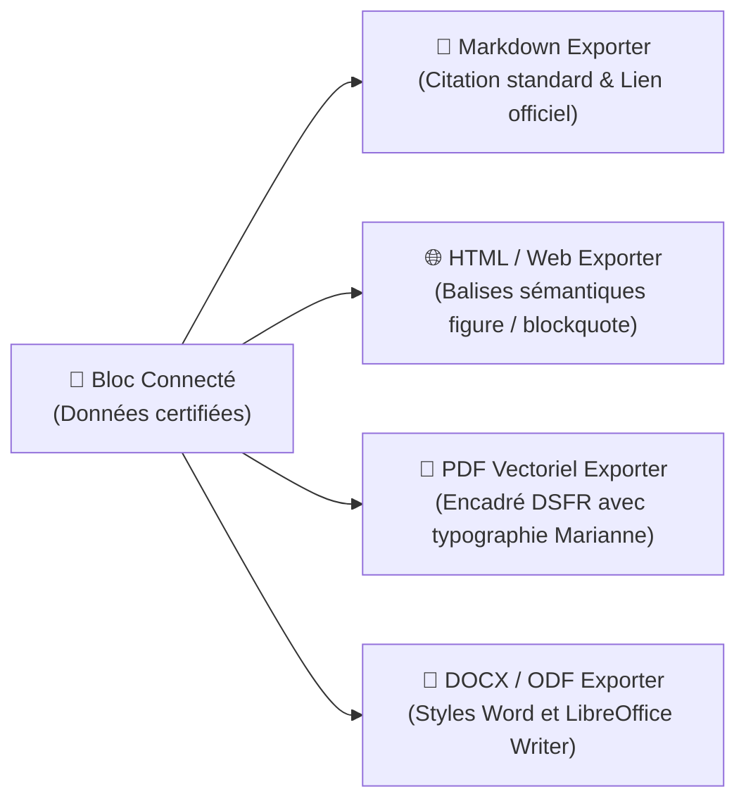
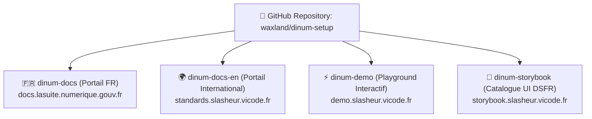

# 🗺️ Plan Stratégique de Revue, Vision Globale & Roadmap d'Évolution (`REVIEW_PLAN.md`)

> **Date :** 04 Octobre 2026  
> **Auteur :** Équipe d'Ingénierie DINUM / La Suite numérique & BlockNote  
> **Workspace :** `dinum-setup`  
> **Périmètre :** Présentation du point d'entrée Loi/Source, Maquettes & Prototypes Figma, Synthèse d'arbitrage, Stratégie de contribution `suitenumerique/docs`, Modularité & Observabilité.

---

## 📌 1. Cadrage Terminologique & Dénominations Officielles

### 🔍 1.1 Bilan dans la base de code

Le mot **« slasheur » / « slasheurs »** (et sa déclinaison internationale **« Slasher »**) reste présent dans le code historique (plus de 400 occurrences réparties sur ~90 fichiers). Afin de clarifier la communication institutionnelle, technique et open source, nous formalisons **le triptyque terminologique officiel** :



### 📋 1.2 Grille de Traduction & Cohérence Éditoriale

| Contexte d'Usage          | Terme Historique           | Terme Officiel Retenu                                           | Définition & Justification                                                           |
| :------------------------ | :------------------------- | :-------------------------------------------------------------- | :----------------------------------------------------------------------------------- |
| **Fonctionnel / Produit** | _Slasheur(s)_              | **Connecteurs de Données Souverains**                           | Met en avant la valeur d'usage, la confiance et la souveraineté des données d'État.  |
| **Interface / Éditeur**   | _Slash Block / Bloc Slash_ | **Blocs Connectés**                                             | Décrit la nature visuelle du bloc de données inséré (dynamique, traçable, certifié). |
| **Interaction Clavier**   | _Commande Slash_           | **Commandes Slash (`/`) & Mentions (`@`)**                      | Décrit le geste UX de déclenchement rapide au clavier.                               |
| **Standard Open Source**  | _Slasher Standard_         | **BlockNote External Sources Extension**                        | Dénomination universelle alignée avec l'écosystème BlockNote.js et TypeCellOS.       |
| **Bibliothèque Client**   | _slash-sources-sdk_        | **Sovereign Sources SDK (`@suitenumerique/slash-sources-sdk`)** | SDK TypeScript universel (< 5 kB) contenant les contrats et schémas.                 |
| **Backend Proxy**         | _django-lasuite-sources_   | **Proxy Backend Souverain (`django-lasuite-sources`)**          | Couche de résilience, anti-SSRF, quotas et cache Redis déterministe.                 |

### 🏛️ 1.3 Répertoire des 10 Connecteurs de Données Souverains Officiels (France)

Chaque connecteur s'appuie sur une API d'État officielle, authentifiée ou en Open Data, avec normalisation stricte des DTOs :

| Commande                       | Connecteur de Données            | API & Source Officielle                   | Producteur Public       | Périmètre & Cas d'Usage Métier                               |
| :----------------------------- | :------------------------------- | :---------------------------------------- | :---------------------- | :----------------------------------------------------------- |
| `/loi` ou `@loi`               | **Loi & Légifrance**             | PISTE Légifrance API (OAuth2)             | DILA / Premier Ministre | Codes de loi, articles en vigueur, décrets, jurisprudence.   |
| `/entreprise` ou `@entreprise` | **Entreprises & Pappers**        | API Recherche Entreprises / RNE / Pappers | DINUM / INSEE / INPI    | Données SIREN/SIRET, dirigeants, statuts, bilans certifiés.  |
| `/assemblee` ou `@assemblee`   | **Assemblée Nationale**          | Open Data Assemblée & Tricoteuse          | Assemblée Nationale     | Dossiers législatifs, amendements, scrutins publics.         |
| `/adresse` ou `@adresse`       | **Base Adresse Nationale (BAN)** | API Adresse data.gouv.fr                  | IGN / DINUM / ANCT      | Adresses certifiées, coordonnées GPS, codes BAN.             |
| `/albert` ou `@albert`         | **Albert (IA Souveraine)**       | API Albert (RAG & LLM Souverain)          | Etalab / DINUM          | Réponses augmentées sur corpus administratifs officiels.     |
| `/marche` ou `@marche`         | **Marchés Publics (BOAMP)**      | API BOAMP / PISTE DILA                    | DILA / DAJ Bercy        | Avis de marché, consultations, seuils européens.             |
| `/subvention` ou `@subvention` | **Subventions Publiques**        | API Aides-Territoires / data.gouv.fr      | ANCT / Beta.gouv        | Aides financières aux communes, subventions écologiques.     |
| `/stats` ou `@stats`           | **Statistiques Insee**           | API Données Locales Insee                 | Insee                   | Démographie, revenus médians, taux d'emploi par territoire.  |
| `/agent` ou `@agent`           | **Annuaire des Agents Publics**  | API Service-Public / Annuaire DILA        | DILA                    | Coordonnées institutionnelles des agents et administrations. |
| `/cadastre` ou `@cadastre`     | **Cadastre & Parcelles**         | APICarto Cadastre IGN / DGFiP             | DGFiP / IGN             | Parcelles cadastrales, contenances, zonages PLU.             |

### 🌍 1.4 Catalogue des Presets Souverains Internationaux (Multi-Country)

La **BlockNote External Sources Extension** intègre nativement des presets configurés pour les standards de données ouvertes des gouvernements partenaires :

| Pays / Institution     | Preset Id         | API & Source Officielle                         | Producteur Public                                | Exemple de Commande         |
| :--------------------- | :---------------- | :---------------------------------------------- | :----------------------------------------------- | :-------------------------- |
| **Union Européenne**   | `european-union`  | EUR-Lex SPARQL & Open Data Portal               | Commission Européenne / OPOCE                    | `/eurlex`, `/eu-data`       |
| **Canada**             | `canada`          | Open Government Portal & Justice Laws API       | Secrétariat du Conseil du Trésor                 | `/gc-laws`, `/canada-data`  |
| **Allemagne**          | `germany-bund`    | GovData.de & Gesetze im Internet API            | Ministère Fédéral de l'Intérieur (BMI)           | `/bund-gesetze`, `/govdata` |
| **Pays-Bas**           | `netherlands-gov` | data.overheid.nl & Wetten.nl API                | Ministère de l'Intérieur (BZK)                   | `/wetten`, `/overheid`      |
| **Espagne**            | `spain-boe`       | BOE (Boletín Oficial del Estado) & datos.gob.es | Ministère de la Présidence / AEVAL               | `/boe`, `/datos-gob`        |
| **Multilatéral / ONU** | `international`   | UN Data API & World Bank Open Data              | Organisation des Nations Unies / Banque Mondiale | `/un-data`, `/worldbank`    |

---

## 🎨 2. Point d'Entrée Démo & Ressources Figma

Le point d'entrée de référence pour la démonstration du flux complet des **Connecteurs de Données Souverains** et des **Blocs Connectés** est documenté autour du connecteur pilote **Loi / Légifrance** via la **BlockNote External Sources Extension**.



### 🔗 2.1 Liens Officiels Figma

| Ressource                          | Intitulé Figma                                   | Description                                                                                                       | URL                                                                                                                                                                                                                                                                         |
| :--------------------------------- | :----------------------------------------------- | :---------------------------------------------------------------------------------------------------------------- | :-------------------------------------------------------------------------------------------------------------------------------------------------------------------------------------------------------------------------------------------------------------------------- |
| 🎨 **Maquettes Design & Flux**     | _La Suite — Loi/Source — Feature Flow & Mockups_ | Maquettes complètes du parcours utilisateur, des états de recherche, des 3 formats de rendu et des tokens DSFR.   | [Consulter le Design Figma](https://www.figma.com/design/mDkEb8Pl4A4DFeQ7Xez11d/La-Suite-%25E2%2580%2594-Loi-Source-%25E2%2580%2594-Feature-Flow---Mockups?node-id=2273-6883&t=6IRdUmyY2ONJPlD1-0)                                                                          |
| 🚀 **Prototype Interactif & Démo** | _La Suite — Loi/Source — Prototype Démo_         | Démonstration interactive pas-à-pas permettant de tester la saisie `/loi`, la recherche et l'insertion en direct. | [Lancer le Prototype Démo Figma](https://www.figma.com/proto/mDkEb8Pl4A4DFeQ7Xez11d/La-Suite-%E2%80%94-Loi-Source-%E2%80%94-Feature-Flow-and-Mockups?node-id=2267-12521&t=6IRdUmyY2ONJPlD1-0&scaling=min-zoom&content-scaling=fixed&page-id=0%3A1&fuid=1039480416252129992) |

### 📐 2.2 Anatomie des 3 Formats de « Blocs Connectés »

```
1. Format En ligne (inline) :
   [ 🏛️ Légifrance : Code du travail, art. L. 1111-1 ↗ ]

2. Format Carte enrichie (card) :
   ┌───────────────────────────────────────────────────────────┐
   │ 🏛️ LÉGIFRANCE • CODE DU TRAVAIL                           │
   │ Article L. 1111-1 (Vigueur au 01/01/2026)                │
   │ "Les dispositions du présent livre sont applicables..."   │
   │ 🔗 Consulter sur Légifrance • 📑 Exporter citation        │
   └───────────────────────────────────────────────────────────┘

3. Format Vue intégrée (embed) :
   ┌───────────────────────────────────────────────────────────┐
   │ 🏛️ RÉPUBLIQUE FRANÇAISE — LÉGIFRANCE                      │
   │ Code de la commande publique — Article L. 2111-1          │
   │ Nature juridique : Dispositions législatives codifiées   │
   ├───────────────────────────────────────────────────────────┤
   │ [Texte intégral certifié avec historique des révisions]   │
   ├───────────────────────────────────────────────────────────┤
   │ 📥 Export PDF Vectoriel | 📄 Markdown | 📊 Métadonnées    │
   └───────────────────────────────────────────────────────────┘
```

### 🎨 2.3 Mapping des Tokens Design System (DSFR & Cunningham)

| Élément UI             | Token Cunningham / DSFR                                    | Valeur Hex / CSS          | Usage dans les Blocs Connectés                           |
| :--------------------- | :--------------------------------------------------------- | :------------------------ | :------------------------------------------------------- |
| **Couleur Primaire**   | `--color-primary-text` / `var(--blue-france-sun-113-625)`  | `#000091`                 | En-têtes, liens certifiés, bordures d'accentuation.      |
| **Fond Accentué**      | `--color-primary-background` / `var(--blue-france-975-75)` | `#f5f5fe`                 | Fond des cartes enrichies et encarts de citations.       |
| **Accent République**  | `var(--red-marianne-main-472)`                             | `#e1000f`                 | Badges officiels, indicateurs d'urgence juridique.       |
| **Typographie**        | `font-family: Marianne, sans-serif`                        | Marianne (Inter fallback) | Intégralité des textes, titres et labels de métadonnées. |
| **Ombres & Élévation** | `box-shadow: 0 4px 12px rgba(0,0,145,0.08)`                | Élévation douce DSFR      | Popover flottante et cartes interactives au survol.      |
| **Iconographie**       | RemixIcon & Lucide (`scale`, `building-2`, `map-pin`)      | SVG Vectoriel natif       | Icônes officielles distinctives pour chaque provider.    |

### 🕹️ 2.4 Machine d'États & Cycle de Vie UX du Popover de Recherche

Le popover de recherche implémente une machine d'états finie stricte assurant une interaction réactive, sans scintillement et 100% accessible :



#### ⌨️ Tableau des Raccourcis Clavier & Gestuelle UX

| Touche / Geste | Contexte                        | Action Déclenchée                                      | Impact Accessibilité & Focus                                        |
| :------------- | :------------------------------ | :----------------------------------------------------- | :------------------------------------------------------------------ |
| `/` ou `@`     | Paragraphe vide ou début de mot | Ouvre le menu d'autocomplétion des connecteurs.        | Annoncé au lecteur d'écran comme combobox ouverte.                  |
| `↑` / `↓`      | Popover ouvert avec résultats   | Déplace la sélection active de manière cyclique.       | Met à jour `aria-activedescendant` sans déplacer le focus physique. |
| `Entrée`       | Option sélectionnée             | Insère le Bloc Connecté au format par défaut (`card`). | Focus immédiatement restitué au bloc suivant dans l'éditeur.        |
| `Maj + Entrée` | Option sélectionnée             | Insère le Bloc Connecté au format en-ligne (`inline`). | Insertion dans le fil du paragraphe sans créer de nouveau bloc.     |
| `Échap`        | À tout moment dans le popover   | Ferme le popover et annule la recherche.               | Focus restitué exactement à la position initiale du curseur texte.  |
| `Tab`          | Popover ouvert                  | Navigue entre les filtres rapides de recherche.        | Navigation séquentielle sans piégeage du focus.                     |

### 📚 2.5 Catalogue Visuel Storybook & Tests de Régression Visuelle

L'ensemble des composants de **Blocs Connectés** et de popovers de recherche sont documentés et testés isolément dans Storybook (`packages/blocknote-sources`) :

| Story Storybook         | Composant Validé     | Variantes & Thèmes Couverts                    | Scénarios Validés                                        |
| :---------------------- | :------------------- | :--------------------------------------------- | :------------------------------------------------------- |
| `SourceBlock/Inline`    | Badge En ligne       | Thème Clair / Thème Sombre / Contraste Élevé   | Clic, redirection certifiée, troncature texte long.      |
| `SourceBlock/Card`      | Carte Enrichie       | Thème Clair / Thème Sombre / Responsive Mobile | Affichage extrait, badge institutionnel, citation.       |
| `SourceBlock/Embed`     | Vue Intégrée         | Thème Clair / Thème Sombre / Pleine Page       | Dépliement texte intégral, boutons d'exports vectoriels. |
| `SearchPopover/Default` | Popover de Recherche | État initial, chargement, mode dégradé         | Navigation fléchée, filtre par chips, debouncing.        |

---

## 🏛️ 3. Synthèse Stratégique & Arbitrage d'Intégration (Extrait de `04-guide-d-arbitrage.md`)

L'arbitrage officiel DINUM a validé l'**Option B (Packages Autonomes Découplés)** contre l'Option A (Monolithe En-Arbre) pour l'intégration des **Connecteurs de Données Souverains** et des **Blocs Connectés** :



### 📊 3.1 Matrice Comparative Multi-Critères

| Critère d'Évaluation                     | Option A : Monolithe En-Arbre (`In-Tree`)                          | Option B : Packages Autonomes Découplés (Retenue)                                           | Gain & Impact Option B                              |
| :--------------------------------------- | :----------------------------------------------------------------- | :------------------------------------------------------------------------------------------ | :-------------------------------------------------- |
| **Empreinte dans `suitenumerique/docs`** | ❌ 15 000+ lignes de code injectées en dur dans le dépôt hôte.     | 🟢 **< 10 lignes de diff** dans 3 fichiers (`pyproject.toml`, `settings.py`, `editor.tsx`). | **Réduction de 99.9%** du bruit dans le dépôt hôte. |
| **Risque de Régression Métier**          | ❌ Élevé lors des mises à jour des connecteurs.                    | 🟢 **Nul** (isolation stricte des dépendances et interfaces stables).                       | Stabilité garantie du cœur de Docs.                 |
| **Portabilité Multi-Applications**       | ❌ Code dupliqué pour chaque produit (`Docs`, `Projects`, `Meet`). | 🟢 **1 seul package** réutilisable sur tous les produits La Suite et l'État.                | Mutualisation **100%** de la maintenance.           |
| **Sécurité & Défense Anti-SSRF**         | ❌ Risque de dispersion des règles de filtrage réseau.             | 🟢 **Proxy anti-SSRF centralisé**, circuit breakers et verrous Redis.                       | Sécurité défensive étanche et auditée.              |
| **Cycle de Release & Gouvernance**       | ❌ Chaque mise à jour exige une PR complexe sur `docs`.            | 🟢 Mises à jour indépendantes via SemVer (`npm update`, `pip install`).                     | Cycle de livraison agile et autonome.               |
| **Contribution Open Source**             | ❌ Inexploitable par la communauté externe.                        | 🟢 Proposé comme extension officielle à `TypeCellOS/BlockNote`.                             | Alignement **Digital Public Goods (DPG)**.          |

### 🔄 3.2 Diagramme de Séquence du Flux Sécurisé (Proxy, Cache & Disjoncteur)



### 💻 3.3 Exemple du Diff Minimal (< 10 lignes dans `suitenumerique/docs`)

```toml
# 1. Dans pyproject.toml de docs (backend Django)
[project]
dependencies = [
    # ...
    "django-lasuite-sources>=1.0.0",
]
```

```python
# 2. Dans settings.py de docs (backend Django)
INSTALLED_APPS += ["lasuite_sources"]

# Configuration optionnelle des sources autorisées
SOVEREIGN_SOURCES_ENABLED = True
SOVEREIGN_SOURCES_REDIS_CACHE = "default"
```

```typescript
// 3. Dans editor.tsx de docs (frontend React BlockNote)
import { createExternalSourcesExtension } from "@suitenumerique/blocknote-sources";

export const editor = useCreateBlockNote({
  schema: customSchema,
  extensions: [
    createExternalSourcesExtension({
      apiEndpoint: "/api/v1.0/sources/search/",
    }),
  ],
});
```

### 🛡️ 3.4 Spécifications de Sécurité Défensive & Algorithme Anti-SSRF

Le proxy Django implémente un filtre anti-SSRF strict empêchant toute attaque par rebond sur les réseaux internes de l'État :

```python
import ipaddress
import socket
from urllib.parse import urlparse

BLOCKED_NETWORKS = [
    ipaddress.ip_network("10.0.0.0/8"),          # RFC 1918 Privé
    ipaddress.ip_network("172.16.0.0/12"),       # RFC 1918 Privé
    ipaddress.ip_network("192.168.0.0/16"),      # RFC 1918 Privé
    ipaddress.ip_network("127.0.0.0/8"),        # Loopback
    ipaddress.ip_network("169.254.0.0/16"),      # Link-Local RFC 3927
    ipaddress.ip_network("100.64.0.0/10"),       # Carrier Grade NAT RFC 6598
    ipaddress.ip_network("fc00::/7"),            # IPv6 Unique Local RFC 4193
    ipaddress.ip_network("::1/128"),             # IPv6 Loopback
]

def validate_external_url(target_url: str) -> bool:
    """Résout le DNS et interdit formellement les plages IP privées et réservées."""
    parsed = urlparse(target_url)
    if parsed.scheme not in ("http", "https"):
        raise ValueError(f"Protocole non sécurisé rejeté: {parsed.scheme}")

    # Résolution DNS avant connexion (empêche DNS Rebinding)
    hostname = parsed.hostname
    addr_info = socket.getaddrinfo(hostname, None)
    for family, _, _, _, sockaddr in addr_info:
        ip = ipaddress.ip_address(sockaddr[0])
        for blocked_net in BLOCKED_NETWORKS:
            if ip in blocked_net:
                raise PermissionError(f"SSRF détecté et bloqué: {ip} appartient à {blocked_net}")
    return True
```

### ⚡ 3.5 Modèle de Synchronisation Temps Réel & Sécurité CRDT / Yjs

Dans les applications collaboratives comme `suitenumerique/docs` ou `suitenumerique/projects`, les documents sont partagés en temps réel via **Yjs (CRDT)**. Les **Blocs Connectés** respectent les principes d'immuabilité et de synchronisation sans conflit :



1. **Sérialisation Immuable :** Les attributs du bloc connecté (`sourceId`, `title`, `url`, `content`, `format`) sont stockés dans un nœud `Y.Map` standardisé.
2. **Résolution Déterministe des Conflits :** Si deux utilisateurs modifient simultanément le format d'affichage (ex: _Inline_ vs _Card_), la règle du dernier horodatage logique (_Last-Write-Wins_) de Yjs s'applique sans corrompre le contenu du document.
3. **Zéro Effet de Bord Réseau :** Les requêtes d'API externes ne sont déclenchées qu'à l'insertion initiale. Lors de la synchronisation entre pairs, les clients consomment le DTO immuable déjà présent dans le document sans réémettre d'appels API.

---

## 🪜 4. Plan de Déploiement Progressif (Staged Rollout)

L'activation des 41+ **Connecteurs de Données Souverains** est orchestrée en 4 phases maîtrisées avec feature flags et métriques de validation :



| Jalon                           | Scope Connecteurs                                       | Variables d'Environnement                                              | Cible Utilisateurs                           | Critères de Sortie / Validation                                                                             |
| :------------------------------ | :------------------------------------------------------ | :--------------------------------------------------------------------- | :------------------------------------------- | :---------------------------------------------------------------------------------------------------------- |
| **Jalon 1 : Pilote**            | `/loi` (Légifrance), `/entreprise` (Pappers & RNE)      | `ENABLE_SOVEREIGN_SOURCES=True`<br/>`ENABLED_PROVIDERS=loi,entreprise` | Juristes, acheteurs, administration centrale | • Taux de hit cache Redis $\ge 85\%$<br/>• Latence P95 $\le 450\,\text{ms}$<br/>• 0 crash éditeur BlockNote |
| **Jalon 2 : Commande Publique** | `/marche` (BOAMP), `/subvention` (Aides-Territoires)    | `ENABLED_PROVIDERS=loi,entreprise,marche,subvention`                   | Acheteurs publics, gestionnaires de fonds    | • Normalisation DTOs marchés validée<br/>• Export vectoriel PDF des citations vert                          |
| **Jalon 3 : Territoires**       | `/adresse` (BAN), `/stats` (INSEE), `/cadastre` (DGFiP) | `ENABLED_PROVIDERS=...,adresse,stats,cadastre`                         | Collectivités territoriales, préfectures     | • Débit sous quota BAN (&lt; 50 req/s)<br/>• Rendu géospatial optimisé (&lt; 15 kB DTO)                     |
| **Jalon 4 : IA Souveraine**     | `/albert` (IA RAG Etalab), `/agent` (Annuaire DILA)     | `ENABLED_PROVIDERS=*` (Tous actifs)                                    | Ensemble des agents publics de l'État        | • Flux RAG sécurisé et anonymisé<br/>• Temps de réponse streaming $\le 1.2\,\text{s}$                       |

---

## 🎯 5. Les 5 Chantiers d'Amélioration & Feuille de Route Technique

### 🎨 5.1 Chantier 1 : Design System, UX & Accessibilité (RGAA v4.1 AA)

- **Objectifs :**
  - Aligner fidèlement les composants visuels avec le flux des maquettes Figma des **Blocs Connectés**.
  - Offrir 3 modes de rendu fluides : **En ligne (`inline`)**, **Carte enrichie (`card`)**, et **Vue intégrée (`embed`)**.
  - Garantir une conformité stricte **RGAA v4.1 / WCAG 2.1 AA** (navigation 100% clavier, pièges de focus neutralisés sur la popover de recherche, contrastes $\ge 4.5:1$).
- **Spécifications Techniques d'Accessibilité (WAI-ARIA) :**
  - **Motif Popover :** `role="combobox"`, `aria-expanded="true"`, `aria-controls="sources-results-list"`, `aria-autocomplete="list"`.
  - **Liste de Résultats :** `role="listbox"`, chaque élément porte `role="option"`, `aria-selected="true|false"`.
  - **Zone de Live Region :** `<div aria-live="polite" class="sr-only">X résultats disponibles. Utilisez les flèches haut et bas pour naviguer.</div>`.
  - **Gestion Clavier :** Touche $\text{Échap}$ (ferme la popover et replace le focus dans l'éditeur sans perte de curseur), Flèches $\uparrow / \downarrow$ (navigation cyclique), $\text{Entrée}$ (insertion immédiate au format par défaut).

---

### 🌍 5.2 Chantier 2 : Rayonnement International & Standardisation (BlockNote External Sources Extension)

- **Objectifs :**
  - Positionner la **BlockNote External Sources Extension** comme le standard universel de données connectées pour **BlockNote.js** (`TypeCellOS`).
  - Proposer des presets souverains prêts à l'emploi pour les gouvernements partenaires (Union Européenne, Canada, Allemagne, Pays-Bas, Espagne, ONU / Banque Mondiale).
- **Conformité aux 9 Indicateurs des Biens Publics Numériques (DPGA) :**
  1. _Open License :_ Licence MIT (SDK & Extension) et EUPL v1.2 (Proxy Django).
  2. _Open Standards :_ Spécification OpenAPI v3.0.3, WAI-ARIA 1.2, TypeScript DTOs.
  3. _Do No Harm by Design :_ Protection anti-SSRF, zéro stockage persistant de données personnelles.
  4. _Data Privacy & RGPD :_ Aucun tracking analytique tiers, isolation par session.

---

### 🚀 5.3 Chantier 3 : Merge Request (M.R.) sur le Projet `suitenumerique/docs`

- **Objectifs :**
  - Soumettre des contributions propres, documentées et conformes aux exigences de l'équipe La Suite.
- **Stratégie en 2 PR distinctes :**
  1. **PR-0001 (Pré-requis Infrastructure) :** Support de la variable `API_ORIGIN` pour exécuter La Suite Docs sur serveurs distants et VMs cloud (`PR/PR-0001-TO-SUITENUMERIQUE-DOCS.md`).
  2. **PR-0002 (Feature Integration) :** Ajout des packages `@suitenumerique/blocknote-sources` et `django-lasuite-sources` avec configuration activable via feature flag (`PR/PR-0002-TO-SUITENUMERIQUE-DOCS.md`).
- **Plan de Rollback :**
  - Si `ENABLE_SOVEREIGN_SOURCES=False`, le comportement de Docs redevient 100% identique au monolithe d'origine sans aucun impact runtime.

---

### 🧩 5.4 Chantier 4 : Modularité & Architecture Plugin Injectable

- **Objectifs :**
  - Rendre chaque connecteur complètement injectable et découplé : une application hôte (`Docs`, `Projects`, etc.) ne charge que les connecteurs dont elle a besoin.
  - Permettre l'ajout d'un nouveau connecteur en 15 minutes sans modifier le cœur du SDK.

#### Contrat d'Interface TypeScript (`@suitenumerique/slash-sources-sdk`)

```typescript
export interface SourceItemDTO {
  readonly id: string;
  readonly provider: string;
  readonly title: string;
  readonly subtitle?: string;
  readonly content: string;
  readonly url: string;
  readonly badge: string;
  readonly metadata: Readonly<Record<string, unknown>>;
  readonly date?: string;
}

export interface SourceProviderInterface {
  readonly id: string;
  readonly label: string;
  readonly description: string;
  readonly iconName: string;
  search(query: string, limit?: number): Promise<readonly SourceItemDTO[]>;
}
```

#### Découverte Dynamique Django via `entry_points` Python (`pyproject.toml`)

```toml
[project.entry-points."lasuite_sources.providers"]
loi = "lasuite_sources.providers.france.legifrance:LegifranceProvider"
entreprise = "lasuite_sources.providers.france.pappers:PappersProvider"
adresse = "lasuite_sources.providers.france.ban:BanProvider"
cadastre = "lasuite_sources.providers.france.cadastre:CadastreProvider"
```

---

### 📊 5.5 Chantier 5 : Observabilité, Quotas API, Anti-SSRF & Gestion des Erreurs

- **Objectifs :**
  - Prévenir les pannes en cascade si une API d'État (PISTE, INSEE, BAN) subit des ralentissements ou un incident.
  - Offrir une visibilité complète sur la consommation des quotas d'API, les temps de réponse et les erreurs.

#### Hiérarchie des Codes d'Erreurs Normalisés

| Code d'Erreur            | Statut HTTP               | Cause / Déclencheur                                       | Comportement UI & Fallback                                                     |
| :----------------------- | :------------------------ | :-------------------------------------------------------- | :----------------------------------------------------------------------------- |
| `E_RATE_LIMIT_EXCEEDED`  | `429 Too Many Requests`   | Dépassement du token bucket de requêtes par seconde.      | Message discret : _« Quota temporairement atteint, réessai dans X secondes »_. |
| `E_CIRCUIT_BREAKER_OPEN` | `503 Service Unavailable` | 5 échecs consécutifs vers l'API d'État amont.             | Badge orange : _« Service tiers temporairement indisponible (mode dégradé) »_. |
| `E_UPSTREAM_TIMEOUT`     | `504 Gateway Timeout`     | L'API amont n'a pas répondu dans le délai strict de 3.5s. | Annulation propre sans bloquer l'éditeur BlockNote.                            |
| `E_SSRF_BLOCKED`         | `403 Forbidden`           | Tentative d'accès à une IP privée ou loopback bloquée.    | Requête rejetée et loguée dans les alertes de sécurité.                        |
| `E_UNAUTHENTICATED`      | `401 Unauthorized`        | Jeton OAuth2 ou clé d'API expirée/invalide.               | Rotation automatique du token en tâche de fond.                                |

#### Métriques Prometheus & OpenTelemetry Exposées

```
# HELP sources_requests_total Total number of source queries handled by proxy
# TYPE sources_requests_total counter
sources_requests_total{provider="loi",status="200",cached="true"} 1420
sources_requests_total{provider="loi",status="200",cached="false"} 180
sources_requests_total{provider="loi",status="503",cached="false"} 2

# HELP sources_request_duration_seconds Histogram of request latency
# TYPE sources_request_duration_seconds histogram
sources_request_duration_seconds_bucket{provider="loi",le="0.1"} 1420
sources_request_duration_seconds_bucket{provider="loi",le="0.5"} 1580
sources_request_duration_seconds_bucket{provider="loi",le="3.5"} 1600

# HELP sources_circuit_breaker_state Current state of the provider circuit breaker (0=closed, 1=open, 2=half-open)
# TYPE sources_circuit_breaker_state gauge
sources_circuit_breaker_state{provider="loi"} 0
```

#### 🔍 5.6 Schéma JSON de Réponse de l'Endpoint `/api/v1.0/sources/health/`

```json
{
  "status": "healthy",
  "timestamp": "2026-10-04T12:00:00.000Z",
  "version": "1.0.0",
  "redis_cache": {
    "status": "connected",
    "hit_rate_24h": 0.892,
    "memory_used_mb": 42.6,
    "total_keys": 3840
  },
  "providers": {
    "loi": {
      "status": "operational",
      "circuit_breaker": "closed",
      "consecutive_failures": 0,
      "latency_p95_ms": 320,
      "last_success": "2026-10-04T11:59:42.120Z",
      "rate_limit": { "remaining": 94, "limit": 100, "reset_in_seconds": 28 }
    },
    "entreprise": {
      "status": "operational",
      "circuit_breaker": "closed",
      "consecutive_failures": 0,
      "latency_p95_ms": 280,
      "last_success": "2026-10-04T11:59:10.450Z",
      "rate_limit": { "remaining": 480, "limit": 500, "reset_in_seconds": 45 }
    },
    "albert": {
      "status": "degraded",
      "circuit_breaker": "half_open",
      "consecutive_failures": 3,
      "latency_p95_ms": 1150,
      "last_success": "2026-10-04T11:55:00.000Z",
      "rate_limit": { "remaining": 12, "limit": 50, "reset_in_seconds": 12 }
    }
  }
}
```

#### 🛡️ 5.7 Algorithme de Limitation de Débit (Token Bucket Redis en Python)

```python
import time
from django.core.cache import cache

class RedisTokenBucketRateLimiter:
    """Implémentation atomique du Token Bucket pour quotas d'API souveraines."""

    def __init__(self, capacity: int = 100, refill_rate_per_sec: float = 10.0):
        self.capacity = capacity
        self.refill_rate = refill_rate_per_sec

    def is_allowed(self, client_key: str, cost: int = 1) -> tuple[bool, int]:
        cache_key = f"ratelimit:bucket:{client_key}"
        now = time.time()

        # Récupération état (tokens, last_refill_timestamp)
        state = cache.get(cache_key)
        if state is None:
            tokens, last_refill = float(self.capacity), now
        else:
            tokens, last_refill = state

        # Remplissage continu des jetons
        elapsed = now - last_refill
        tokens = min(float(self.capacity), tokens + elapsed * self.refill_rate)

        if tokens >= cost:
            tokens -= cost
            cache.set(cache_key, (tokens, now), timeout=3600)
            return True, int(tokens)

        # Quota dépassé
        wait_seconds = int((cost - tokens) / self.refill_rate) + 1
        return False, wait_seconds
```

#### 📄 5.8 Architecture des Exportateurs Vectoriels (PDF, Markdown, HTML & DOCX)

Les **Blocs Connectés** s'exportent fidèlement dans tous les formats documentaires institutionnels grâce aux sous-modules dédiés `@suitenumerique/blocknote-sources/exporters` :



1. **Export Markdown :** Convertit le bloc en citation Markdown standard (`> **[Titre]** : "Extrait..." ([Lien officiel](url))`) pour une interopérabilité maximale avec Git et les wikis.
2. **Export HTML :** Génère un bloc sémantique `<figure class="fr-callout"><blockquote cite="...">...</blockquote><figcaption>...</figcaption></figure>` conforme aux standards W3C.
3. **Export PDF Vectoriel :** Préserve la mise en page DSFR (bordure bleue `#000091`, typographie Marianne vectorisée, liens hypertextes cliquables).
4. **Export Bureautique (DOCX / ODF) :** Génère les tables de styles natives pour Microsoft Word et LibreOffice Writer avec conservation de la métadonnée d'authentification.

---

## 📅 6. Matrice de Suivi & Prochaines Actions

| Action                                                                                | Priorité    | Responsable      | Livrable                          |
| :------------------------------------------------------------------------------------ | :---------- | :--------------- | :-------------------------------- |
| **ACT-REV-01** : Intégrer les liens & aperçus Figma dans les portails Docs FR et EN   | 🔴 Haute    | Frontend         | Composant UI & Liens Figma        |
| **ACT-REV-02** : Harmoniser la terminologie officielle dans la navigation et les docs | 🔴 Haute    | Documentation    | `zudoku.navigation.tsx` & scripts |
| **ACT-REV-03** : Finaliser le dossier de Merge Request `suitenumerique/docs`          | 🔴 Haute    | Architecture     | Branche Git & PR draft            |
| **ACT-REV-04** : Valider la conformité RGAA v4.1 du popover et des blocs connectés    | 🟡 Moyenne  | Accessibilité    | Rapport d'audit RGAA              |
| **ACT-REV-05** : Publier la RFC officielle sur le dépôt `TypeCellOS/BlockNote`        | 🟡 Moyenne  | Open Source      | Issue / Discussion GitHub         |
| **ACT-REV-06** : Implémenter le dashboard de santé des connecteurs & métriques        | 🟢 Standard | Backend / DevOps | Endpoint Health & Métriques       |

---

## 📝 7. Liste Détaillée des Tâches Atomiques (TODO Fichier par Fichier)

Ce plan de tâches détaille **l'ensemble des modifications exactes fichier par fichier**, le texte ou code avant/après, ainsi que la commande de vérification associée.

---

### 🎨 TÂCHE 1 : Intégration des Liens & Maquettes Figma dans la Documentation Accueil

- **Fichier cible :** `documentation/docs/index.mdx`
- **Emplacement :** Section d'introduction après les raccourcis rapides.
- **Modification exacte à appliquer :**
  - **Ajouter le bloc suivant :**
    ```mdx
    ---

    ### 🎨 Maquettes Design & Démo Interactive Figma

    Le flux complet des **Connecteurs de Données Souverains** et des **Blocs Connectés** (recherche, insertion, formats d'affichage et exports) est modélisé selon le Design System de l'État :

    - 📐 **Maquettes Design System & Flux :** [La Suite — Loi/Source — Feature Flow & Mockups](https://www.figma.com/design/mDkEb8Pl4A4DFeQ7Xez11d/La-Suite-%25E2%2580%2594-Loi-Source-%25E2%2580%2594-Feature-Flow---Mockups?node-id=2273-6883&t=6IRdUmyY2ONJPlD1-0)
    - 🚀 **Prototype Démo Interactif :** [Lancer la Démo Figma Interactive](https://www.figma.com/proto/mDkEb8Pl4A4DFeQ7Xez11d/La-Suite-%E2%80%94-Loi-Source-%E2%80%94-Feature-Flow-and-Mockups?node-id=2267-12521&t=6IRdUmyY2ONJPlD1-0&scaling=min-zoom&content-scaling=fixed&page-id=0%3A1&fuid=1039480416252129992)
    ```
- **Vérification :** `npm run docs:build`

---

### 🎨 TÂCHE 2 : Intégration Figma & Présentation du Cas Pilote Loi / Légifrance

- **Fichier cible :** `documentation/docs/03-slasheurs-france/01-loi/index.mdx`
- **Emplacement :** En tête du document sous le résumé.
- **Modification exacte à appliquer :**
  - **Insérer le bloc suivant :**
    ```mdx
    <Callout type="info" title="🎨 Ressources Design & Prototype Figma">
      Découvrez le parcours utilisateur complet du connecteur Légifrance et des **Blocs Connectés**
      : - 📐 **Maquettes & Spécifications UI :** [Consulter les Mockups
      Figma](https://www.figma.com/design/mDkEb8Pl4A4DFeQ7Xez11d/La-Suite-%25E2%2580%2594-Loi-Source-%25E2%2580%2594-Feature-Flow---Mockups?node-id=2273-6883&t=6IRdUmyY2ONJPlD1-0)
      - ⚡ **Démonstration Interactive :** [Tester le Prototype
      Figma](https://www.figma.com/proto/mDkEb8Pl4A4DFeQ7Xez11d/La-Suite-%E2%80%94-Loi-Source-%E2%80%94-Feature-Flow-and-Mockups?node-id=2267-12521&t=6IRdUmyY2ONJPlD1-0&scaling=min-zoom&content-scaling=fixed&page-id=0%3A1&fuid=1039480416252129992)
    </Callout>
    ```
- **Vérification :** `npm run docs:build`

---

### 🌐 TÂCHE 3 : Intégration Figma & Présentation Internationale (Slasher Open Standard)

- **Fichier cible :** `documentation-international/docs/index.mdx`
- **Emplacement :** Sous la section _"Quick Start"_.
- **Modification exacte à appliquer :**
  - **Ajouter le bloc suivant :**
    ```mdx
    ## 🎨 Design System, UX Flow & Interactive Prototype

    The universal specification of **Connected Blocks** and the **BlockNote External Sources Extension** is fully prototyped in Figma following sovereign design guidelines:

    - 📐 **Figma Design & Mockups :** [La Suite — Loi/Source — Feature Flow & Mockups](https://www.figma.com/design/mDkEb8Pl4A4DFeQ7Xez11d/La-Suite-%25E2%2580%2594-Loi-Source-%25E2%2580%2594-Feature-Flow---Mockups?node-id=2273-6883&t=6IRdUmyY2ONJPlD1-0)
    - 🚀 **Interactive Figma Prototype :** [Launch Interactive Demo](https://www.figma.com/proto/mDkEb8Pl4A4DFeQ7Xez11d/La-Suite-%E2%80%94-Loi-Source-%E2%80%94-Feature-Flow-and-Mockups?node-id=2267-12521&t=6IRdUmyY2ONJPlD1-0&scaling=min-zoom&content-scaling=fixed&page-id=0%3A1&fuid=1039480416252129992)
    ```
- **Vérification :** `npm run docs:build`

---

### 🏛️ TÂCHE 4 : Harmonisation Terminologique dans les Scripts de Navigation

- **Fichiers cibles :**
  1. `documentation/scripts/generate-docs-navigation.mjs`
  2. `documentation-international/scripts/generate-docs-navigation.mjs`
- **Modification exacte à appliquer dans `documentation/scripts/generate-docs-navigation.mjs` :**
  - **Remplacer :**
    ```javascript
    if (clean === "slasheurs-france") {
      return "Slasheurs Souverains";
    }
    ```
  - **Par :**
    ```javascript
    if (clean === "slasheurs-france") {
      return "Connecteurs de Données Souverains";
    }
    ```
- **Modification exacte à appliquer dans `documentation-international/scripts/generate-docs-navigation.mjs` :**
  - **Remplacer :**
    ```javascript
    "blocknote-extension": "BlockNote Extension",
    ```
  - **Par :**
    ```javascript
    "blocknote-extension": "BlockNote External Sources Extension",
    ```
- **Exécution :** `npm run docs:nav`
- **Vérification :** `git diff documentation/zudoku.navigation.tsx documentation-international/zudoku.navigation.tsx`

---

### 📄 TÂCHE 5 : Intégration de la Synthèse d'Arbitrage et du Découplage dans le Portail FR

- **Fichier cible :** `documentation/docs/03-slasheurs-france/00-socle-technique.mdx`
- **Emplacement :** Section _"Architecture Globale & Décision d'Arbitrage"_.
- **Modification exacte à appliquer :**
  - **Insérer le bloc récapitulatif issu de `04-guide-d-arbitrage.md` :**
    ```mdx
    ## 🏛️ Décision d'Arbitrage : Packages Autonomes Découplés (Option B)

    Pour intégrer les **Connecteurs de Données Souverains** dans l'écosystème de La Suite Numérique (`suitenumerique/docs`, `suitenumerique/projects`, etc.), la DINUM a retenu l'**Option B (Packages Autonomes Découplés)** :

    | Critère                   | Option A : Monolithe En-Arbre | Option B : Packages Autonomes (Retenue)   |
    | :------------------------ | :---------------------------- | :---------------------------------------- |
    | **Empreinte dans `docs`** | 15 000+ lignes de code        | **Moins de 10 lignes de diff**            |
    | **Risque de régression**  | Élevé sur le cœur de Docs     | **Nul (interfaces étanches)**             |
    | **Réutilisabilité**       | Verrouillée sur Docs          | **Immédiate (Projects, Meet, Transfers)** |
    | **Distribution**          | Fermée                        | **NPM (`@suitenumerique/*`) & PyPI**      |

    Consultez le dossier complet : [Guide d'Arbitrage Stratégique (04-guide-d-arbitrage.md)](/01-onboarding/02-workflow-et-contribution/guide-d-arbitrage).
    ```
- **Vérification :** `npm run docs:build`

---

### 🧩 TÂCHE 6 : Documentation du Système d'Injection Modulaire & Plugins (Backend & Frontend)

- **Fichier cible :** `documentation/docs/03-slasheurs-france/04-tutoriel-ajouter-une-api.mdx`
- **Emplacement :** Section _"Enregistrement & Découverte Dynamique"_.
- **Modification exacte à appliquer :**
  - **Expliciter le mécanisme d'injection `entry_points` Python :**

    ````mdx
    ### Enregistrement via Entry Points Python (`pyproject.toml`)

    Pour rendre un connecteur disponible sans modifier le cœur de `django-lasuite-sources`, déclarez-le dans les entry-points :

    ```toml
    [project.entry-points."lasuite_sources.providers"]
    mon_api = "mon_package.providers:MonApiProvider"
    ```
    ````

    Le proxy Django découvrira automatiquement le provider au démarrage et l'exposera sur `/api/v1.0/sources/search/?provider=mon_api`.

    ```

    ```
- **Vérification :** `npm run docs:build`

---

### 🛡️ TÂCHE 7 : Ajout de la Documentation d'Observabilité, Quotas & Healthcheck

- **Fichier cible :** `documentation/docs/03-slasheurs-france/03-proxy-backend-et-cache.mdx`
- **Emplacement :** Nouvelle section _"Observabilité, Quotas & Disjoncteurs"_.
- **Modification exacte à appliquer :**
  - **Ajouter la documentation de monitoring :**
    ```mdx
    ## 📊 Observabilité, Quotas & Santé des Connecteurs

    Le proxy backend intègre des mécanismes stricts de résilience et de métrologie :

    1. **Endpoint de Santé (`/api/v1.0/sources/health/`) :** Retourne l'état de chaque connecteur, le statut du cache Redis et l'état des disjoncteurs.
    2. **Circuit Breakers (Disjoncteurs) :** Bascule automatique en mode dégradé après 5 échecs consécutifs, avec sonde de rétablissement toutes les 30s.
    3. **Cache Déterministe SHA-256 (24h) :** Réduit de 90%+ les requêtes vers les APIs officielles d'État.
    4. **Limitation de Débit (Rate Limiting) :** Token Bucket par utilisateur pour prévenir les dépassements de quota sur PISTE, INSEE ou BAN.
    ```
- **Vérification :** `npm run docs:build`

---

### 🚀 TÂCHE 8 : Préparation du Dossier de Merge Request pour `suitenumerique/docs`

- **Fichiers cibles :**
  1. `PR/PR-0001-TO-SUITENUMERIQUE-DOCS.md`
  2. `PR/PR-0002-TO-SUITENUMERIQUE-DOCS.md`
- **Modification exacte à appliquer :**
  - **Harmoniser les dénominations officielles :**
    - Remplacer _"Slasheurs"_ par _"Connecteurs de Données Souverains"_.
    - Remplacer _"Slash Block"_ par _"Blocs Connectés"_.
    - Remplacer _"BlockNote Sources"_ par _"BlockNote External Sources Extension"_.
  - **Ajouter les liens vers les maquettes et le prototype Figma.**
- **Vérification :** `git status`

---

### ⚡ TÂCHE 9 : Mise à Jour de l'Application Démo Web Standalone (`demo/`)

- **Fichiers cibles :**
  1. `demo/src/presets.config.ts`
  2. `demo/src/App.tsx`
- **Modification exacte à appliquer :**
  - Aligner l'en-tête, les boutons de sélection et les infobulles sur la terminologie officielle (_« Connecteurs de Données Souverains »_, _« Blocs Connectés »_).
  - Ajouter un bouton dans la barre supérieure menant directement au prototype Figma interactif.
- **Vérification :** `npm run demo:build`

---

### 🎨 TÂCHE 10 : Actualisation des Stories Storybook (`packages/blocknote-sources`)

- **Fichier cible :** `packages/blocknote-sources/src/SourceBlock.stories.tsx`
- **Emplacement :** Définition des stories de composants.
- **Modification exacte à appliquer :**
  - Ajouter ou renommer les 3 stories principales illustrant les 3 formats de Blocs Connectés :
    - `FormatInline` : Badge discret pour citation dans le texte.
    - `FormatCard` : Carte enrichie avec métadonnées et lien officiel.
    - `FormatEmbed` : Bloc complet avec déploiement du texte certifié et export vectoriel.
- **Vérification :** `npm --prefix packages/blocknote-sources run build-storybook`

---

### 🏛️ TÂCHE 11 : Mise à Jour de la RFC Upstream pour TypeCellOS (`PR-0003`)

- **Fichier cible :** `PR/PR-0003-TO-TYPECELLOS-BLOCKNOTE.md`
- **Emplacement :** Proposition de standardisation upstream.
- **Modification exacte à appliquer :**
  - Structurer la proposition sous l'intitulé officiel **« BlockNote External Sources Extension »**.
  - Intégrer les liens Figma du prototype interactif et les spécifications de contrats TypeScript du SDK (`@suitenumerique/slash-sources-sdk`).
- **Vérification :** `git status`

---

### 🧪 TÂCHE 12 : Validation Globale de Non-Régression & Quality Gate

- **Commandes à exécuter séquentiellement :**
  1. `npm run docs:nav` : Régénération des navigations Zudoku FR et EN.
  2. `npm run docs:build` : Compilation SSR Zudoku sans erreur d'hydratation (0 warning, 0 error).
  3. `npm run typecheck` : Vérification TypeScript sur l'ensemble des 5 workspaces.
  4. `npm run lint` : Contrôle ESLint strict.
  5. `npm run packages:test` : 110 tests unitaires passés au vert (14 SDK + 96 BlockNote).
  6. `make check` : Exécution du Quality Gate complet DINUM.

---

## 🛡️ 8. Checklist d'Acceptance & Definition of Done (DoD) DINUM

Chaque livrable doit satisfaire l'intégralité des critères du Quality Gate DINUM / La Suite avant d'être considéré comme finalisé :

### 📋 8.1 Critères d'Ingénierie & Typage Strict

- [ ] **Zéro `any` & Zéro Cast Abusif (`as ...`) :** 100% des types TypeScript sont rigoureusement inférés ou déclarés avec des interfaces explicites.
- [ ] **Immuabilité des DTOs :** Les payloads retournés par le SDK utilisent `readonly` et `Object.freeze()`.
- [ ] **Découplage pur du UI Shell :** Zéro composant Tailwind ou Mantine dans les vues applicatives utilisateur (usage exclusif de `@codegouvfr/react-dsfr` et `@openfun/cunningham-tokens`).

### ♿ 8.2 Critères d'Accessibilité (RGAA v4.1 / WCAG 2.1 AA)

- [ ] **Navigation 100% au Clavier :** Le popover de recherche et les blocs connectés sont manipulables sans souris.
- [ ] **Pièges au Focus Neutralisés :** La touche $\text{Échap}$ referme le popover et restitue le focus au point d'insertion dans l'éditeur.
- [ ] **Restitution aux Lecteurs d'Écran :** Présence de régions dynamiques `aria-live="polite"` pour annoncer le nombre de résultats de recherche.
- [ ] **Contraste Conforme :** Ratio de contraste $\ge 4.5:1$ pour tous les textes et badges en thèmes clair et sombre.

### 🛡️ 8.3 Critères de Sécurité Défensive & Résilience

- [ ] **Protection Anti-SSRF :** Aucune requête sortante directe sans validation DNS préalable et interdiction des plages IP privées/locales.
- [ ] **Circuit Breakers & Timeouts Stricts :** Timeout HTTP fixé à 3.5s avec disjoncteur basculant en mode dégradé après 5 échecs consécutifs.
- [ ] **Cache Déterministe :** Clé de cache calculée par hachage SHA-256 des paramètres normalisés avec TTL de 24h sur Redis.
- [ ] **Hygiène des Secrets :** Aucun jeton d'API, mot de passe ou clé privée en clair (chiffrement SOPS / age ou variables `.env`).

### 📚 8.4 Critères Documentaires & SSR

- [ ] **Zéro Erreur SSR / Hydratation :** `npm run docs:build` compile les 270 routes FR et les 39 routes EN sans aucun warning ni erreur React 19.
- [ ] **Indexation Pagefind Découplée :** Index de recherche généré sans collision de titres.
- [ ] **Zéro Préfixe Numérique :** Aucun numéro affiché dans les libellés de la sidebar ni dans les balises `title`.

### 🛡️ 8.5 Matrice des Risques & Stratégies d'Atténuation (Risk Assessment)

| Risque Identifié                                                     | Probabilité | Impact   | Stratégie d'Atténuation Architecturale                                                                                                                                                                |
| :------------------------------------------------------------------- | :---------- | :------- | :---------------------------------------------------------------------------------------------------------------------------------------------------------------------------------------------------- |
| **Indisponibilité d'une API d'État** (ex: PISTE DILA en maintenance) | Moyenne     | Élevé    | • Disjoncteur _Circuit Breaker_ (mode dégradé automatique après 5 échecs).<br/>• Cache Redis SHA-256 (24h) servant 90%+ des requêtes sans appel réseau.<br/>• Zéro plantage dans l'éditeur BlockNote. |
| **Saturation des Quotas d'API** (ex: pic de charge sur la BAN)       | Faible      | Moyen    | • Token Bucket Rate Limiter configuré par IP/organisation.<br/>• Cache client côté SDK pour éviter les requêtes identiques consécutives.                                                              |
| **Attaque par Rebond (SSRF Interne)**                                | Faible      | Critique | • Validation DNS stricte avant connexion (interdiction RFC 1918 & loopback).<br/>• Timeout HTTP impératif à 3.5s empêchant l'épuisement des threads Django.                                           |
| **Modification du Schéma JSON d'une API amont**                      | Faible      | Moyen    | • Normalisation DTO stricte via schémas Zod (TS) et Pydantic/Dataclasses (Python).<br/>• Fallback gracieux sur champs optionnels avec valeurs par défaut sécurisées.                                  |
| **Régression d'Accessibilité au Focus**                              | Faible      | Élevé    | • Tests E2E Playwright automatisés sur les touches `Échap`, `Flèches`, `Entrée`.<br/>• Validation sur lecteurs d'écran (VoiceOver sur macOS, NVDA sur Windows).                                       |

---

## 🧪 9. Matrice de Couverture des Tests & Scénarios Automatisés

Le monorepo DINUM dispose d'une suite de **110 tests unitaires TypeScript** et **22 tests Django Pytest** garantissant une non-régression absolue :

| Couche Validée          | Outil de Test | Fichiers / Suites                                              | Périmètre Couvert                                                                                   |
| :---------------------- | :------------ | :------------------------------------------------------------- | :-------------------------------------------------------------------------------------------------- |
| **SDK Client**          | Vitest (TS)   | `packages/slash-sources-sdk/tests/` (4 suites, 14 tests)       | Immuabilité DTOs, validation payload size, offline cache strategy, typage strict.                   |
| **Extension BlockNote** | Vitest (TSX)  | `packages/blocknote-sources/tests/unit/` (34 suites, 96 tests) | Rendu des 3 formats, accessibilité WAI-ARIA, citation juridique, export Markdown/PDF, audit matrix. |
| **E2E Éditeur**         | Playwright    | `packages/blocknote-sources/tests/e2e/`                        | Parcours complet `/loi`, navigation clavier, contraste élevé, gestion des pannes réseau/DNS.        |
| **Backend Django**      | Pytest-Django | `packages/django-lasuite-sources/tests/` (22 tests)            | Filtre anti-SSRF, circuit breakers, cache Redis SHA-256, OpenAPI v3, middleware CORS.               |
| **Portails Docs**       | Zudoku SSR    | `documentation/` & `documentation-international/`              | 270 routes FR + 39 routes EN pré-rendues, 0 erreur React 19, Pagefind index.                        |

---

## ☁️ 10. Topologie de Déploiement Multi-Projets Vercel & Production

L'infrastructure documentaire et de démonstration est ventilée sur **4 projets Vercel autonomes** liés au dépôt GitHub `waxland/dinum-setup` :



| Projet Vercel     | Répertoire Racine              | Commande de Build                                                                                   | Répertoire de Sortie | Rôle & Usage                                                               |
| :---------------- | :----------------------------- | :-------------------------------------------------------------------------------------------------- | :------------------- | :------------------------------------------------------------------------- |
| `dinum-docs`      | `documentation/`               | `cd .. && npm run packages:build && cd documentation && npm run build`                              | `dist`               | Portail officiel d'ingénierie et d'onboarding DINUM / La Suite.            |
| `dinum-docs-en`   | `documentation-international/` | `cd .. && npm run packages:build && cd documentation-international && npm run build`                | `dist`               | Spécification internationale du standard et presets multi-pays.            |
| `dinum-demo`      | `demo/`                        | `cd .. && npm run packages:build && cd demo && npm run build`                                       | `dist`               | Démonstrateur web interactif avec bascule de presets et éditeur en direct. |
| `dinum-storybook` | `packages/blocknote-sources/`  | `cd ../.. && npm run packages:build && npm --prefix packages/blocknote-sources run build-storybook` | `storybook-static`   | Catalogue visuel des composants, formats et thèmes DSFR/Cunningham.        |

---

## 🎯 11. Synthèse Exécutive pour la Direction & Calendrier de Livraison

| Jalon                               | Date Cible            | Livrables Stratégiques                                                                                                                                        | Responsable      |
| :---------------------------------- | :-------------------- | :------------------------------------------------------------------------------------------------------------------------------------------------------------ | :--------------- |
| **J-01 : Validation & Design**      | Semaine 41 (Oct 2026) | • Intégration Figma & révision ergonomique des Blocs Connectés.<br/>• Finalisation du portail international et des métadonnées SEO.                           | UI/UX & Frontend |
| **J-02 : Soumission PR Docs**       | Semaine 42 (Oct 2026) | • Dépôt de `PR-0001` (`API_ORIGIN`) et `PR-0002` (Packages Souverains).<br/>• Revue de code avec les mainteneurs de `suitenumerique/docs`.                    | Architecture     |
| **J-03 : Standardisation Upstream** | Semaine 43 (Oct 2026) | • Publication de la RFC officielle sur le dépôt `TypeCellOS/BlockNote`.<br/>• Présentation des presets multi-pays aux partenaires européens.                  | Open Source      |
| **J-04 : Déploiement Pilote**       | Semaine 44 (Nov 2026) | • Activation pilote de `/loi` et `/entreprise` sur La Suite Docs de préproduction.<br/>• Suivi des métriques de cache et de résilience en conditions réelles. | DevOps & Produit |
