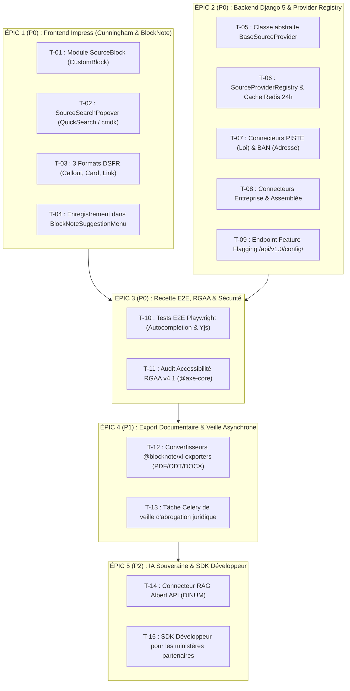

# 📋 Feuille de Route & Plan d'Action Opérationnel (`TODO.md`)

Ce document constitue le **plan de travail exhaustif et actionnable** issu de l'audit approfondi de **La Suite Docs** (`AUDIT.md`). Il détaille l'ensemble des tâches unitaires, des fichiers à créer/modifier, des contrats d'interface et des critères d'acceptation pour industrialiser le **Socle Universel des Commandes Slash** dans le produit officiel [`suitenumerique/docs`](https://github.com/suitenumerique/docs).

---

## 🧭 1. Vue d'Ensemble des Épics & Jalons

---

## 🎯 ÉPIC 1 (Priorité P0) : Implémentation Frontend Impress (100% Cunningham + BlockNote)

*Cible : `src/docs/src/frontend/apps/impress/src/`*  
*Références Design : [Figma Docs Officiel](https://www.figma.com/design/qdCWR4tTUr7vQSecEjCyqO/Docs?node-id=9722-19469&p=f&t=r1O6Np4JgTbRWrCR-0) • [Storybook Cunningham](https://suitenumerique.github.io/cunningham/storybook/?path=/story/components-loader-wip--medium) • [Figma UI Kit](https://www.figma.com/community/file/1562860630562131728/lasuite-ui-kit)*

### [ ] T-01 — Création des types et interfaces TypeScript
- **Fichier à créer :** `src/features/docs/doc-editor/components/custom-blocks/SourceBlock/types.ts`
- **Spécifications :**
  - Définir `SourceEntityType` (`'law' | 'company' | 'parliament' | 'address' | 'custom'`).
  - Définir `DisplayMode` (`'callout' | 'card' | 'link'`).
  - Définir l'interface complète `SourceEntityProps` (titre, sous-titre, statut, métadonnées 1-3, extrait HTML, résumé, URL).
- **Critère d'acceptation :** 100% typé sous TypeScript strict sans `any`.

---

### [ ] T-02 — Composant de Recherche Popover (`SourceSearchPopover.tsx`)
- **Fichier à créer :** `src/features/docs/doc-editor/components/custom-blocks/SourceBlock/SourceSearchPopover.tsx`
- **Spécifications :**
  - Intégrer les composants standardisés `QuickSearch`, `QuickSearchInput`, `QuickSearchItem` et `QuickSearchItemContent` basés sur **`cmdk`** (`src/components/quick-search/`).
  - Encapsuler la recherche dans un `<Popover opened={isOpen}>` flottant sous le curseur.
  - Onglets de sélection de source avec composants Cunningham (`⚖️ Loi`, `🏢 Entreprise`, `🏛️ Assemblée`, `📍 Adresse`).
  - Gestion du focus automatique au montage (`inputRef.current.focus()`).
  - Navigation complète au clavier : `↑` `↓` pour naviguer, `Entrée` pour insérer, `Échap` pour annuler sans laisser de bloc vide.
- **Critère d'acceptation :** Zéro modale intrusive ; expérience fluide 100% Cunningham calquée sur `Interlinking/SearchPage.tsx`.

---

### [ ] T-03 — Composants de Rendu des 3 Formats Cunningham (`Callout`, `Card`, `Link`)
- **Dossier à créer :** `src/features/docs/doc-editor/components/custom-blocks/SourceBlock/formats/`
- **Fichiers :**
  1. `SourceCalloutFormat.tsx` : Encadré officiel stylé avec `<Box>` et bordure gauche Marianne (`var(--c--globals--colors--brand-primary)`), extrait textuel in extenso, badge de statut et lien externe.
  2. `SourceCardFormat.tsx` : Carte horizontale Cunningham (`<Card>`) avec grille à 3 colonnes de métadonnées construite avec `<Box $direction="row" $gap="sm">`.
  3. `SourceLinkFormat.tsx` : Badge compact inline cliquable dans la phrase avec mini-popover de détail au survol (modèle `LinkSelected.tsx`).
  4. `SourceBlockToolbar.tsx` : Barre d'outils flottante au survol construite avec `<Box>` et `<BoxButton>` permettant de basculer en direct entre les formats Callout, Carte et Lien.
- **Conventions de style obligatoires :** Utiliser exclusivement le conteneur polymorphique `<Box>` (`src/components/Box.tsx`) et les tokens CSS Cunningham (`var(--c--globals--...)`).
- **Critère d'acceptation :** Support parfait du mode sombre via le store Zustand `useCunninghamTheme()`.

---

### [ ] T-04 — Factory `SourceBlock` & Enregistrement dans le Menu Slash
- **Fichiers à modifier :**
  1. `src/features/docs/doc-editor/components/custom-blocks/SourceBlock/SourceBlock.tsx` : Implémenter la factory function `SourceBlock()` via `createReactBlockSpec`.
  2. `src/features/docs/doc-editor/components/custom-blocks/index.ts` : Exporter `SourceBlock`.
  3. `src/features/docs/doc-editor/components/BlockNoteEditor.tsx` : Ajouter `sourceBlock: SourceBlock()` dans `baseBlockNoteSchema`.
  4. `src/features/docs/doc-editor/components/BlockNoteSuggestionMenu.tsx` : Déclarer les items du menu slash (`/loi`, `/entreprise`, `/assemblee`, `/adresse`) avec leurs icônes et alias dans le groupe *« Sources Souveraines »*.
- **Critère d'acceptation :** La saisie de `/loi` ou `/adresse` ouvre instantanément la palette d'autocomplétion.

---

## 🐍 ÉPIC 2 (Priorité P0) : Backend Django 5 & Provider Registry

*Cible : `src/docs/src/backend/core/`*

### [ ] T-05 — Contrat d'Interface `BaseSourceProvider`
- **Fichier à créer :** `src/backend/core/sources/base.py`
- **Spécifications :**
  - Définir la classe abstraite `BaseSourceProvider(ABC)` avec les méthodes obligatoires :
    - `is_enabled() -> bool` (contrôle des clés d'environnement).
    - `suggest(query: str, limit: int = 5) -> list[dict]` (autocomplétion rapide < 100ms).
    - `search(query: str, limit: int = 10) -> list[SourceSearchResult]` (recherche structurée).
    - `get_detail(source_id: str) -> Optional[SourceSearchResult]` (fiche complète).
  - Définir le `TypedDict` normalisé `SourceSearchResult`.
- **Critère d'acceptation :** Typage Python 3.12+ strict avec `mypy`.

---

### [ ] T-06 — Singleton `SourceProviderRegistry` & Mise en Cache Redis
- **Fichier à créer :** `src/backend/core/sources/registry.py`
- **Spécifications :**
  - Mettre en place le registre central des providers (`register(provider)`, `get_provider(source_type)`).
  - Implémenter la mise en cache Redis automatique sur les clés `source:search:{type}:{hash}` avec TTL de 24h (86400 secondes).
  - Gérer la tolérance aux pannes réseau (Circuit Breaker : timeout à 3.5s).
- **Critère d'acceptation :** Temps de réponse en cache < 5ms.

---

### [ ] T-07 — Connecteurs `LawSourceProvider` (Légifrance) & `AddressSourceProvider` (BAN)
- **Fichiers à créer :**
  1. `src/backend/core/sources/providers/law.py` : Authentification OAuth2 Client Credentials PISTE, endpoints `/suggest` et `/search`, mapping des fonds `LODA`, `CODE` et `JORF`.
  2. `src/backend/core/sources/providers/address.py` : Interrogation de `https://api-adresse.data.gouv.fr/search`, extraction GeoJSON des coordonnées GPS et code INSEE.
- **Critère d'acceptation :** Mode Mock activable via `PISTE_MOCK_ENABLED=true` pour le développement local.

---

### [ ] T-08 — Connecteurs `CompanySourceProvider` & `ParliamentSourceProvider`
- **Fichiers à créer :**
  1. `src/backend/core/sources/providers/company.py` : Interrogation Pappers / API Entreprise, détection des procédures collectives BODACC (*In Bonis* vs *Redressement*).
  2. `src/backend/core/sources/providers/parliament.py` : Interrogation de l'API `claire.vite` / Tricoteuse, suivi des amendements et sorts (*Adopté*, *Rejeté*), cache court de 5 min.
- **Critère d'acceptation :** Fixtures de test réalistes incluses pour le mode hors-ligne.

---

### [ ] T-09 — Vues DRF & Feature Flagging d'Environnement
- **Fichiers à créer :**
  1. `src/backend/core/sources/views.py` : `SourceSearchView` (`GET /api/v1.0/sources/search/`) avec pagination et contrôle de permissions `IsAuthenticated`.
  2. `src/backend/core/sources/urls.py` : Enregistrement des routes d'API.
  3. Mettre à jour `GET /api/v1.0/config/` pour exposer la liste des providers actifs (`features.sources.enabled_types`).
- **Critère d'acceptation :** Si `PISTE_CLIENT_ID` est absent, `/loi` n'apparaît pas dans la réponse `/config/`.

---

## 🧪 ÉPIC 3 (Priorité P0) : Recette E2E, Accessibilité RGAA & CI/CD

*Cible : `src/docs/src/frontend/apps/impress/tests/`*

### [ ] T-10 — Scénarios de Test E2E Playwright (`slash-sources.spec.ts`)
- **Fichier à créer :** `src/docs/src/frontend/apps/impress/tests/e2e/slash-sources.spec.ts`
- **Scénarios automatisés à couvrir :**
  1. *Scénario 1 :* Frappe de `/loi` $\rightarrow$ ouverture du popover $\rightarrow$ saisie de « commande publique » $\rightarrow$ sélection du 1er résultat avec `Entrée` $\rightarrow$ vérification de la présence de l'encadré Callout avec le texte de l'article L. 111-1.
  2. *Scénario 2 :* Clic sur le bouton « Format Carte » dans la barre d'outils flottante $\rightarrow$ vérification du passage au format Card 3 colonnes.
  3. *Scénario 3 :* Clic sur « Format Lien » $\rightarrow$ vérification de la présence de la pastille inline dans le paragraphe.
  4. *Scénario 4 :* Collaboration multi-utilisateurs : un second navigateur connecté au même document voit le bloc s'afficher et changer de mode en temps réel via Yjs.
- **Critère d'acceptation :** Exécution réussie via `pnpm test:e2e` dans la CI GitHub Actions.

---

### [ ] T-11 — Audit d'Accessibilité RGAA v4.1 (@axe-core/playwright)
- **Objectifs :**
  - Vérifier le piégeage et la libération du focus clavier dans le popover (`Tab` / `Shift+Tab` / `Échap`).
  - Vérifier la présence des attributs ARIA (`role="combobox"`, `aria-expanded`, `aria-autocomplete="list"`).
  - Contrôler les ratios de contraste Marianne (minimum 4.5:1 en mode clair et sombre).
- **Critère d'acceptation :** 0 violation détectée par `@axe-core/playwright`.

---

## 📦 ÉPIC 4 (Priorité P1) : Export Documentaire & Veille Asynchrone

### [ ] T-12 — Intégration des Exportateurs de Documents (PDF / ODT / DOCX)
- **Fichiers à modifier :**
  - `src/features/docs/doc-editor/components/xl-pdf-exporter/`
  - `src/features/docs/doc-editor/components/xl-docx-exporter/`
- **Spécifications :**
  - Mapper le `sourceBlock` vers une table ou un encadré stylé dans le document PDF généré.
  - Conserver les hyperliens officiels et les mentions d'état de vigueur dans les exports LibreOffice (`.odt`) et Microsoft Word (`.docx`).
- **Critère d'acceptation :** L'export d'une note contenant un bloc `/loi` ou `/entreprise` produit un PDF paginé fidèle sans débordement.

---

### [ ] T-13 — Tâche Celery de Veille d'Abrogation Juridique
- **Fichier à créer :** `src/backend/core/sources/tasks.py`
- **Spécifications :**
  - Tâche nocturne `check_laws_validity_task()` analysant les documents modifiés dans les 30 derniers jours.
  - Interrogation batch de l'API Légifrance pour détecter si les `sourceId` (`LEGIARTI...`) sont passés à l'état `ABROGE`.
  - Notification discrète ou affichage d'un badge d'alerte orange dans l'éditeur : *« Cet article a été modifié le [Date] »*.
- **Critère d'acceptation :** Exécution asynchrone sans impact sur les performances de l'API web.

---

## 🌐 ÉPIC 5 (Priorité P2) : IA Souveraine Albert & Écosystème Partenaires

### [ ] T-14 — Connecteur RAG Albert API (IA Souveraine DINUM / Etalab)
- **Fichier à créer :** `src/backend/core/sources/providers/albert.py`
- **Spécifications :**
  - Brancher le moteur de recherche sémantique en langage naturel sur le cluster Albert API (`https://albert.api.etalab.gouv.fr/v1`).
  - Permettre aux agents de poser une question administrative (*« Quel est le préavis de démission d'un contractuel ? »*) et de recevoir une synthèse sourcée avec les articles applicables.
- **Critère d'acceptation :** Citations précises des articles sans hallucination de texte.

---

### [ ] T-15 — SDK Développeur & Documentation d'Extension Ministérielle
- **Livrables :**
  - Guide pas-à-pas pour les ministères partenaires souhaitant déclarer leur propre provider (ex: *Casier Judiciaire*, *Cadastre*, *Immatriculations*).
  - Package `@suitenumerique/slash-sources-sdk` simplifiant la création de connecteurs conformes.
- **Critère d'acceptation :** Un développeur externe peut brancher une nouvelle source en moins de 15 minutes.

---

## 📊 Matrice d'Avancement des Tâches

| ID | Intitulé de la Tâche | Épic | Priorité | Responsable | Statut |
| :--- | :--- | :--- | :--- | :--- | :--- |
| **T-01** | Typage TypeScript `SourceEntityProps` & `DisplayMode` | Épic 1 (Front) | **P0** | Dev Front | ⏳ À démarrer |
| **T-02** | Composant `SourceSearchPopover` (QuickSearch/cmdk) | Épic 1 (Front) | **P0** | Dev Front | ⏳ À démarrer |
| **T-03** | Rendu des 3 formats Cunningham (`Callout`, `Card`, `Link`) | Épic 1 (Front) | **P0** | Dev Front | ⏳ À démarrer |
| **T-04** | Factory `SourceBlock` & `BlockNoteSuggestionMenu` | Épic 1 (Front) | **P0** | Dev Front | ⏳ À démarrer |
| **T-05** | Classe abstraite Python `BaseSourceProvider` | Épic 2 (Back) | **P0** | Dev Back | ⏳ À démarrer |
| **T-06** | `SourceProviderRegistry` & Cache Redis 24h | Épic 2 (Back) | **P0** | Dev Back | ⏳ À démarrer |
| **T-07** | Connecteurs `LawSourceProvider` (PISTE) & BAN (Adresse) | Épic 2 (Back) | **P0** | Dev Back | ⏳ À démarrer |
| **T-08** | Connecteurs Entreprise (Pappers) & Assemblée (claire.vite) | Épic 2 (Back) | **P0** | Dev Back | ⏳ À démarrer |
| **T-09** | Vues DRF `/api/v1.0/sources/search/` & Feature Flags | Épic 2 (Back) | **P0** | Dev Back | ⏳ À démarrer |
| **T-10** | Tests E2E Playwright de la palette et insertion | Épic 3 (QA) | **P0** | QA / Dev | ⏳ À démarrer |
| **T-11** | Audit d'accessibilité automatisé RGAA v4.1 (axe-core) | Épic 3 (QA) | **P0** | Accessibilité | ⏳ À démarrer |
| **T-12** | Export documentaire multi-formats (PDF / ODT / DOCX) | Épic 4 (Export) | **P1** | Dev Front | 📅 Sprint 2 |
| **T-13** | Tâche Celery de veille d'abrogation juridique nocturne | Épic 4 (Veille) | **P1** | Dev Back | 📅 Sprint 2 |
| **T-14** | Connecteur RAG Albert API (IA Souveraine DINUM) | Épic 5 (IA) | **P2** | Dev IA / Back | 📅 Sprint 3 |
| **T-15** | Publication du SDK Développeur Ministères | Épic 5 (Écosystème)| **P2** | Core Team | 📅 Sprint 3 |
