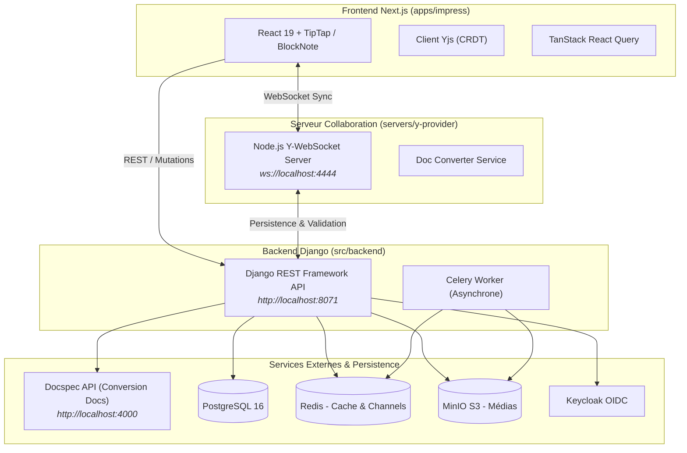
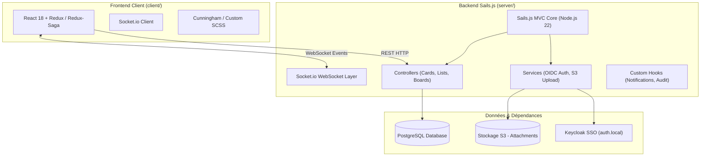

# 🏗️ Architecture Globale & Technique de La Suite Numérique

> Ce document offre une vue détaillée, technique et fonctionnelle de toutes les briques de l'écosystème de **La Suite numérique** (DINUM / ANCT) hébergées dans `./src/`.

---

## 📑 Sommaire

1. [Vue d'Ensemble & Schéma Global](#1-vue-densemble--schéma-global)
2. [Docs (Édition Collaborative de Documents)](#2-docs-édition-collaborative-de-documents)
3. [Projects (Gestion de Projets & Tableaux Kanban)](#3-projects-gestion-de-projets--tableaux-kanban)
4. [Meet (Visioconférence & Agents IA)](#4-meet-visioconférence--agents-ia)
5. [Transfers (Envoi Sécurisé de Fichiers Volumineux)](#5-transfers-envoi-sécurisé-de-fichiers-volumineux)
6. [People (Annuaire & Distribution des Droits)](#6-people-annuaire--distribution-des-droits)
7. [Accounts (Gestion des Comptes & Identités)](#7-accounts-gestion-des-comptes--identités)
8. [Matrice Technique & Comparatif des Projets](#8-matrice-technique--comparatif-des-projets)

---

## 1. Vue d'Ensemble & Schéma Global

L'écosystème de La Suite repose sur une architecture de services indépendants et interconnectés :
- **Identité partagée** : Authentification centralisée via OpenID Connect (Keycloak / ProConnect).
- **Communication hybride** : API REST pour la gestion des ressources, couplée à des protocoles temps réel adaptés (WebSockets / CRDT pour Docs, WebSockets / Socket.io pour Projects, WebRTC pour Meet).
- **Stockage d'objets standardisé** : Stockage compatible S3 (MinIO, RustFS, Scaleway, AWS).

```mermaid
graph TB
    subgraph Clients["📱 Navigateurs & Postes Clients"]
        UserBrowser["Navigateur Utilisateur"]
    end

    subgraph AuthLayer["🔐 Couche Identité & SSO"]
        Keycloak["Keycloak / ProConnect (OIDC)<br/><i>Port: 8080 / 8083</i>"]
        Accounts["Accounts (Gestion Identités)<br/><i>Port: 9900</i>"]
    end

    subgraph AppLayer["🚀 Applications & Micro-services"]
        DocsFront["Docs (Next.js/React)<br/><i>Port: 3000</i>"]
        DocsBack["Docs API (Django 5)<br/><i>Port: 8071</i>"]
        DocsYjs["Docs Yjs CRDT Server<br/><i>Port: 4444</i>"]
        Docspec["Docspec Conversion API<br/><i>Port: 4000</i>"]

        ProjectsApp["Projects (Node.js/Sails/React)<br/><i>Port: 8000</i>"]

        MeetFront["Meet Frontend (React/LiveKit)<br/><i>Port: 3001</i>"]
        MeetLiveKit["LiveKit SFU (WebRTC Engine)<br/><i>Port: 7880 / UDP</i>"]
        MeetAgents["Meet IA Agents (Transcription/Summary)"]

        TransfersFront["Transfers (Vite/TanStack)<br/><i>Port: 8980</i>"]
        TransfersBack["Transfers API (Django/Celery)<br/><i>Port: 8981</i>"]

        PeopleApp["People (Django/React - Annuaire)<br/><i>Port: 8071</i>"]
    end

    subgraph DataLayer["💾 Couche Données & Stockage"]
        PostgresDocs[(PostgreSQL Docs<br/><i>Port: 15432</i>)]
        PostgresProjects[(PostgreSQL Projects)]
        PostgresTransfers[(PostgreSQL Transfers)]
        PostgresKC[(PostgreSQL Keycloak<br/><i>Port: 5433</i>)]
        RedisCache[(Redis Cache & Queues<br/><i>Port: 6379</i>)]
        S3Storage[(Stockage S3 / MinIO / RustFS<br/><i>Port: 9000/9001</i>)]
    end

    %% Relations Auth
    UserBrowser -->|1. Authentification OIDC| Keycloak
    Keycloak <--> Accounts
    DocsFront -.->|JWT Token| Keycloak
    ProjectsApp -.->|JWT Token| Keycloak
    MeetFront -.->|JWT Token| Keycloak
    TransfersFront -.->|JWT Token| Keycloak

    %% Relations Docs
    UserBrowser -->|HTTPS / UI| DocsFront
    UserBrowser -->|CRDT WebSocket| DocsYjs
    DocsFront -->|REST API| DocsBack
    DocsBack --> PostgresDocs
    DocsBack --> RedisCache
    DocsBack --> S3Storage
    DocsBack --> Docspec

    %% Relations Projects
    UserBrowser -->|HTTP + WebSocket| ProjectsApp
    ProjectsApp --> PostgresProjects
    ProjectsApp --> S3Storage

    %% Relations Meet
    UserBrowser <-->|WebRTC Audio/Vidéo| MeetLiveKit
    MeetFront -->|Room Tokens| MeetLiveKit
    MeetLiveKit <--> MeetAgents

    %% Relations Transfers
    UserBrowser -->|Upload Multipart S3| TransfersFront
    TransfersFront -->|REST API| TransfersBack
    TransfersBack --> PostgresTransfers
    TransfersBack --> RedisCache
    TransfersBack --> S3Storage

    %% Relations People
    PeopleApp -.->|Rôles & Permissions| DocsBack
    PeopleApp -.->|Rôles & Permissions| ProjectsApp
```



---

## 2. Docs (Édition Collaborative de Documents)

### A. Rôle Fonctionnel
- Alternative souveraine à **Notion** et **Google Docs**.
- Éditeur de texte enrichi par blocs, Markdown et commandes slash (`/`).
- Collaboration temps réel sans conflits d'édition avec curseurs partagés.
- Mode présentation automatique et exports PDF/DOCX/ODT.
- Assistance rédactionnelle IA souveraine (résumé, reformulation, traduction).

### B. Schéma d'Architecture Détaillé



### C. Bibliothèques Clés & Justifications Techniques
- **Yjs** (`yjs`, `y-prosemirror`, `y-protocols`) : Structure de données CRDT répliquée assurant la fusion de texte synchrone sans risque de corruption ou d'écrasement de données.
- **BlockNote** & **TipTap / ProseMirror** : Moteur d'édition par blocs avec plugins extensibles.
- **Next.js 16 (React 19 / Turbopack)** : Rendu hybride et rechargement ultra-rapide.
- **Django 5 & DRF** : Robustesse de l'ORM, typage et sécurité de l'API.
- **Docspec API** (`ghcr.io/docspec/api`) : Micro-service conteneurisé dédié aux conversions complexes de documents.

### D. Arborescence de Fichiers
```text
src/docs/
├── compose.yml                     # Stack Docker locale (11 conteneurs)
├── Makefile                        # Commandes de build, bootstrap, migrations
├── src/backend/                    # Code Django (core, impress, permissions)
└── src/frontend/                   # Monorepo Yarn Workspaces
    ├── apps/impress/               # Application Next.js principale
    └── servers/y-provider/         # Serveur WebSocket Yjs (CRDT)
```

---

## 3. Projects (Gestion de Projets & Tableaux Kanban)

### A. Rôle Fonctionnel
- Alternative souveraine à **Trello** et **Jira**.
- Organisation en projets, tableaux Kanban, listes de cartes et sous-tâches.
- Synchronisation instantanée entre utilisateurs via WebSockets.
- Notifications internes, assignation de membres, gestion des délais et pièces jointes S3.

### B. Schéma d'Architecture Détaillé



### C. Bibliothèques Clés & Justifications Techniques
- **Sails.js (Node.js 22)** : Framework MVC Express avec support temps réel Socket.io intégré nativement.
- **Redux & Redux-Saga** : Gestion prédictive des actions complexes et des mises à jour optimistes de l'UI.
- **Knex.js** : Constructeur de requêtes et migrations SQL pour PostgreSQL.

---

## 4. Meet (Visioconférence & Agents IA)

### A. Rôle Fonctionnel
- Solution de visioconférence souveraine déployée pour l'ensemble des agents de l'État sous le nom de **Visio**.
- Réunions 100+ participants stables dans le navigateur sans installation logicielle.
- Partage d'écrans multiples, chat sécurisé, enregistrement et transcription automatique par IA.

### B. Schéma d'Architecture Détaillé

```mermaid
graph TD
    subgraph Browser["Navigateur Utilisateur"]
        WebRTCClient["WebRTC Media Engine"]
        LiveKitSDK["@livekit/components-react"]
        MeetApp["Meet Frontend (React)"]
    end

    subgraph MediaServer["Moteur Média LiveKit (Go)"]
        LiveKitSFU["LiveKit SFU Server<br/><i>Selective Forwarding Unit</i>"]
        EgressService["LiveKit Egress Service (Enregistrement)"]
    end

    subgraph BackendAPI["Backend Meet (Python/Django)"]
        MeetDjango["Django REST API<br/><i>Gestion des Rooms & Droits</i>"]
        TokenGenerator["Générateur de JWT LiveKit"]
    end

    subgraph AIAgents["Agents IA & Résumés"]
        STTAgent["LiveKit STT Agent (Speech-To-Text)"]
        SummaryAgent["AI Summary Agent (Transcription / Synthèse)"]
    end

    Browser <-->|Flux Média WebRTC (UDP)| LiveKitSFU
    Browser -->|Requête de Token de Salle| MeetDjango
    MeetDjango -->|Génération Token Signé| Browser
    LiveKitSFU <-->|Enregistrement Vidéo| EgressService
    LiveKitSFU <-->|Audio Stream| STTAgent
    STTAgent --> SummaryAgent
```

### C. Bibliothèques Clés & Justifications Techniques
- **LiveKit Server (Go)** : SFU haute performance gérant l'allocation de bande passante et le simulcast (codecs VP9/AV1).
- **@livekit/components-react** : Kit de composants UI officiel pour le rendu audio/vidéo et les contrôles de salle.
- **Whisper & LLM Agents** : Traitement de la transcription et génération de synthèses en fin de réunion.

---

## 5. Transfers (Envoi Sécurisé de Fichiers Volumineux)

### A. Rôle Fonctionnel
- Service d'envoi et de partage sécurisé de fichiers très volumineux (jusqu'à 20 Go par envoi).
- Téléversement direct en fragments (chunks) parallèles vers le stockage S3 via URLs pré-signées.
- Expiration automatique et purge programmée du stockage.

### B. Schéma d'Architecture Détaillé

```mermaid
graph LR
    subgraph Frontend["Frontend React / Vite"]
        Chunker["Chunker Multi-part (25 Mo)"]
        UploadWorker["Upload Parallèle (4 flux)"]
    end

    subgraph Backend["Backend Django DRF"]
        TransferAPI["API Django"]
        Presigner["Générateur Presigned URLs S3"]
        CeleryCleaner["Celery Beat (Daemon Purge)"]
    end

    subgraph Storage["Stockage S3"]
        S3Bucket[(S3 Bucket / RustFS / MinIO)]
    end

    Frontend -->|1. Créer transfert & Demander URLs| TransferAPI
    TransferAPI -->|2. URLs pré-signées S3| Frontend
    Frontend -->|3. Upload direct des chunks (PUT)| S3Bucket
    Frontend -->|4. Finaliser transfert| TransferAPI
    CeleryCleaner -->|5. Suppression après expiration| S3Bucket
```

### C. Bibliothèques Clés & Justifications Techniques
- **Vite + TanStack Router** : Frontend ultra-rapide et entièrement typé.
- **S3 Presigned URLs** : Décharge totale du serveur backend lors des téléversements lourds.
- **Celery Beat** : Automatisation de la purge des fichiers expirés.

---

## 6. People (Annuaire & Distribution des Droits)

### A. Rôle Fonctionnel
- Annuaire centralisé d'utilisateurs et de collectifs de travail.
- Distribution des rôles et des autorisations d'accès aux autres applications de La Suite (Docs, Projects, Drive).
- Fourniture d'un SDK TypeScript pour les appels inter-services.

---

## 7. Accounts (Gestion des Comptes & Identités)

### A. Rôle Fonctionnel
- Séparation des concepts de compte `User` et d'identités d'authentification `Identity`.
- Support de l'authentification multi-facteurs (2FA/TOTP).
- Gestion des invités externes et transmission des niveaux d'assurance de l'identité aux applications clientes.

---

## 8. Matrice Technique & Comparatif des Projets

| Projet | Langage Backend | Langage Frontend | Base de Données | Communication Temps Réel | Ports Principaux |
|---|---|---|---|---|---|
| **Docs** | Python 3.14 (Django 5) | TypeScript (Next.js 16) | PostgreSQL 16 | WebSockets + Yjs CRDT | `3000` (Front), `8071` (API), `4444` (Yjs), `8080/8083` (Auth) |
| **Projects** | JavaScript (Node.js 22 / Sails) | JavaScript/TypeScript (React 18) | PostgreSQL 16 | WebSockets (Socket.io) | `8000` (App) |
| **Meet** | Python (Django) / Go (LiveKit) | TypeScript (React) | PostgreSQL / Redis | WebRTC / LiveKit SFU | `3001` (Front), `7880` (LiveKit SFU) |
| **Transfers** | Python (Django 5 / Celery) | TypeScript (React / Vite) | PostgreSQL / S3 | REST + Presigned S3 | `8980` (Front), `8981` (API), `8902` (KC) |
| **People** | Python (Django) | TypeScript (React) | PostgreSQL | REST (TS Client SDK) | `8071` (API) |
| **Accounts** | Python (Django) | TypeScript (Next.js) | PostgreSQL | REST / OIDC | `9900` (App) |
