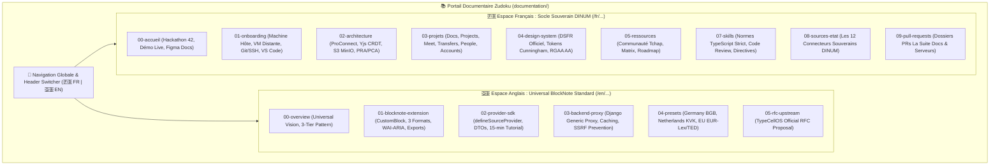

# 🌐 Feuille de Route & Architecture Documentaire Bilingue — Projet Slasher (`TODO_DOCS.md`)

> **Projet :** **Slasher** (`@blocknote/xl-external-sources` & Presets Souverains DINUM)  
> **Destinataires :** Direction Interministérielle du Numérique (DINUM), Équipe Core Team BlockNote (TypeCellOS), Architectes Logiciels & Rédacteurs Techniques  
> **Auteur :** GitHub Copilot (Gemini 3.7 Flash) — Dépôt d'orchestration `dinum-setup`  
> **Date de Référence :** 17 Septembre 2026  
> **Moteur Documentaire :** Zudoku v0.86.0 (Vite SSR + React 19 + MDX + Mermaid v11 + Cunningham + DSFR)  
> **Objectif :** Établir une architecture documentaire **bilingue (Français 🇫🇷 / Anglais 🇬🇧)** claire, modulaire et scalable pour le projet **Slasher**, articulant sans ambiguïté le **Standard Universel BlockNote amont (English)** et le **Socle Souverain DINUM (Français)**.

---

## 🧭 1. Vision Stratégique & Problématique Linguistique

### 💡 1.1. Pourquoi une Architecture Bilingue Ségrégée pour Slasher ?
Le projet **Slasher** sert aujourd'hui deux publics cibles aux attentes radicalement distinctes :

1. **La Communauté Internationale BlockNote (`TypeCellOS/BlockNote`) :**
   - **Nom de projet / module :** **Slasher** (`@blocknote/xl-external-sources`).
   - **Besoin :** Comprendre l'architecture générique du composant Slasher, utiliser le SDK TypeScript `@blocknote/source-provider-sdk` (< 5 kB), consulter la RFC amont, et connecter des APIs tierces (Allemagne, Pays-Bas, Union Européenne, entreprises privées).
   - **Langue obligatoire :** **Anglais technique standard (`en`)**.
2. **L'Écosystème Souverain Français (DINUM / La Suite Numérique / Hackathon 42) :**
   - **Nom de projet / module :** **Slasher France** (`@suitenumerique/blocknote-sources` & `django-lasuite-sources`).
   - **Besoin :** Installer l'environnement de dev local (`make dev`), comprendre la fédération d'identité ProConnect/Keycloak, maîtriser le Design System DSFR / Cunningham, intégrer les 12 connecteurs certifiés de l'État (`/loi`, `/entreprise`, `/albert`...) et appliquer les critères d'accessibilité RGAA v4.1 AA.
   - **Langue naturelle :** **Français institutionnel (`fr`)**.


---

### 🗺️ 1.2. Cartographie de l'Architecture Cible (Dual-Tree i18n)



---

## 🏛️ 2. Structure Arborescente Détaillée

```
documentation/docs/
├── en/                                      # 🇬🇧 PILIER UNIVERSEL ANGLAIS (BlockNote & SDK)
│   ├── index.mdx                            # Landing page anglophone
│   ├── 00-overview/
│   │   ├── index.mdx                        # The Universal Remote Data Standard
│   │   ├── architecture-3-tier.mdx          # 3-Tier Architecture Pattern
│   │   └── international-vision.mdx         # Multi-country Extensibility Model
│   ├── 01-blocknote-extension/
│   │   ├── index.mdx                        # Getting Started with @blocknote/xl-external-sources
│   │   ├── 3-display-formats.mdx            # Callout, Card & Inline Mention formats
│   │   ├── floating-search-popover.mdx      # Accessible WAI-ARIA cmdk Popover
│   │   ├── document-exports.mdx             # PDF, Word DOCX & LibreOffice ODF Exporters
│   │   └── styling-and-themes.mdx           # Custom CSS, Light/Dark themes
│   ├── 02-provider-sdk/
│   │   ├── index.mdx                        # @blocknote/source-provider-sdk Guide
│   │   ├── define-source-provider.mdx       # Immutable schema validation & helpers
│   │   ├── typescript-contracts.mdx         # ExternalSourceEntity DTO reference
│   │   └── build-provider-in-15-min.mdx     # Step-by-step developer tutorial
│   ├── 03-backend-proxy/
│   │   ├── index.mdx                        # Backend Architecture & REST Endpoints
│   │   ├── deterministic-cache.mdx          # SHA-256 Redis Caching Strategy
│   │   └── defensive-security-ssrf.mdx      # Anti-SSRF URL Validation & Circuit Breaker
│   ├── 04-presets/
│   │   ├── index.mdx                        # International Country Presets
│   │   ├── germany-bund.mdx                 # Gesetze im Internet & Handelsregister
│   │   ├── netherlands-gov.mdx              # Wettenbank & KVK Handelsregister
│   │   └── european-union.mdx               # EUR-Lex Directives & TED Procurement
│   └── 05-rfc-upstream/
│       ├── index.mdx                        # TypeCellOS Upstream Contribution Hub
│       └── blocknote-rfc-specification.mdx  # Full RFC specification text
│
└── fr/                                      # 🇫🇷 PILIER SOUVERAIN FRANÇAIS (DINUM & La Suite)
    ├── index.mdx                            # Accueil principal La Suite dev setup
    ├── 00-accueil/
    │   ├── challenge-42.mdx                 # Challenge 42 & Hackathon Oléron
    │   └── planning.mdx                     # Planning & Jalons
    ├── 01-onboarding/
    │   ├── 01-demarrage/                    # Machine hôte, VS Code, Git SSH, Serveur distant
    │   ├── 02-workflow-et-contribution/     # Git flow, tests, sécurité du poste
    │   └── 03-support/                      # Glossaire d'État, Troubleshooting
    ├── 02-architecture/
    │   ├── 01-securite-et-identite/         # ProConnect, OIDC, SOPS age
    │   ├── 02-donnees-et-temps-reel/        # Yjs CRDT, S3 MinIO, PRA/PCA
    │   └── 03-devops-et-deploiement/        # CI/CD, Cloud souverain, Hot reload
    ├── 03-projets/                          # Docs, Meet, Transfers, Projects, People, Accounts
    ├── 04-design-system/                    # DSFR officiel, Cunningham Tokens, Accessibilité RGAA
    ├── 05-ressources/                       # Communauté Tchap, Matrix, Templates
    ├── 07-skills/                           # Directives d'agents, Code standards, Revue de code
    ├── 08-sources-etat/                     # Les 12 Connecteurs Souverains (Loi, BAN, RNE, Albert...)
    └── 09-pull-requests/                    # Dossiers PR Docs, Packages souverains, Serveur VM
```

---

## 📋 3. Plan d'Exécution & Checkboxes par Phase

---

### ⚙️ PHASE 1 : Moteur d'Internationalisation & Routage Zudoku

**Objectif :** Configurer Zudoku 0.86 pour gérer élégamment les deux espaces linguistiques avec bascule dans le header et redirections canoniques.

- [ ] **Tâche 1.1 : Composant de Commutation de Langue (`<LanguageSwitcher />`)**
  - *Fichier à créer :* `documentation/src/components/LanguageSwitcher.tsx`
  - *Fonctionnalité :* Bouton interactif dans le header affichant `🇫🇷 FR` / `🇬🇧 EN` avec conservation du chemin relatif lors du switch.
- [ ] **Tâche 1.2 : Configuration Zudoku (`documentation/zudoku.config.tsx`)**
  - [ ] Intégrer les liens de bascule rapide dans `header.navigation` :
    - 🇬🇧 `BlockNote Standard (EN)` $\rightarrow$ `/en`
    - 🇫🇷 `Socle Souverain DINUM (FR)` $\rightarrow$ `/fr`
    - 🎮 `Live Demo` $\rightarrow$ `http://localhost:5173` (ou lien standalone)
  - [ ] Mettre à jour les métadonnées bilingues (`title`, `description`).
- [ ] **Tâche 1.3 : Générateur de Navigation Bilingue (`documentation/scripts/generate-docs-navigation.mjs`)**
  - [ ] Détecter automatiquement les préfixes `/en/` et `/fr/`.
  - [ ] Générer une structure `docsNavigation` hiérarchisée par langue avec catégories étanches.
  - [ ] Configurer les redirections canoniques (`/` $\rightarrow$ `/fr`, `/08-slash/*` $\rightarrow$ `/fr/08-sources-etat/*`, `/upstream-rfc` $\rightarrow$ `/en/05-rfc-upstream`).

---

### 🇬🇧 PHASE 2 : Rédaction du Pilier Anglais (`documentation/docs/en/`)

**Objectif :** Créer la documentation anglophone complète destinée à l'écosystème international BlockNote.

- [ ] **Tâche 2.1 : Vue d'Ensemble & Vision (`docs/en/00-overview/`)**
  - [ ] `index.mdx` : Plaidoyer architectural sur les blocs de données connectées.
  - [ ] `architecture-3-tier.mdx` : Modèle 3 tiers (Editor UI $\leftrightarrow$ Provider SDK $\leftrightarrow$ Proxy/API).
  - [ ] `international-vision.mdx` : Comment brancher n'importe quelle API publique européenne ou privée.
- [ ] **Tâche 2.2 : Extension BlockNote (`docs/en/01-blocknote-extension/`)**
  - [ ] `index.mdx` : Installation et initialisation de `@blocknote/xl-external-sources`.
  - [ ] `3-display-formats.mdx` : Spécifications et aperçus des modes *Callout*, *Card* et *Inline Link*.
  - [ ] `floating-search-popover.mdx` : Guide d'accessibilité WAI-ARIA et navigation clavier (`cmdk`).
  - [ ] `document-exports.mdx` : Convertisseurs vectoriels PDF, DOCX et ODF.
  - [ ] `styling-and-themes.mdx` : Personnalisation CSS, variables CSS et intégration Dark Mode.
- [ ] **Tâche 2.3 : SDK Provider (`docs/en/02-provider-sdk/`)**
  - [ ] `index.mdx` : Présentation du SDK léger `@blocknote/source-provider-sdk`.
  - [ ] `define-source-provider.mdx` : Utilisation de `defineSourceProvider()` et immutabilité.
  - [ ] `typescript-contracts.mdx` : Référence complète de l'interface `ExternalSourceEntity`.
  - [ ] `build-provider-in-15-min.mdx` : Tutoriel pratique pas-à-pas (créer un connecteur GitHub Issues ou OpenWeather en 15 min).
- [ ] **Tâche 2.4 : Middleware Backend & Sécurité (`docs/en/03-backend-proxy/`)**
  - [ ] `index.mdx` : Endpoints REST (`/suggest/`, `/search/`, `/<type>/<id>/`).
  - [ ] `deterministic-cache.mdx` : Normalisation des requêtes et hachage SHA-256 Redis.
  - [ ] `defensive-security-ssrf.mdx` : Filtrage d'IPs privées et Circuit Breaker 3.5s.
- [ ] **Tâche 2.5 : Presets Internationaux (`docs/en/04-presets/`)**
  - [ ] `germany-bund.mdx` : Connexion aux APIs *Gesetze im Internet* et *Handelsregister*.
  - [ ] `netherlands-gov.mdx` : Connexion à *Wettenbank* (KOOP) et *KVK*.
  - [ ] `european-union.mdx` : Connexion à *EUR-Lex* (RGPD, NIS 2) et *TED eProcurement*.
- [ ] **Tâche 2.6 : Dossier RFC Upstream (`docs/en/05-rfc-upstream/`)**
  - [ ] `blocknote-rfc-specification.mdx` : Texte formel de la RFC prêt pour dépôt sur `TypeCellOS/BlockNote`.

---

### 🇫🇷 PHASE 3 : Consolidation du Pilier Français (`documentation/docs/fr/`)

**Objectif :** Organiser les 152 fichiers existants sous le préfixe propre `/fr/` sans aucune perte de contenu ni rupture de lien.

- [x] **Tâche 3.1 : Migration de l'Arborescence sous `docs/fr/`**
  - [x] Déplacé `00-accueil/` $\rightarrow$ `docs/fr/00-accueil/`
  - [x] Déplacé `01-onboarding/` $\rightarrow$ `docs/fr/01-onboarding/`
  - [x] Déplacé `02-architecture/` $\rightarrow$ `docs/fr/02-architecture/`
  - [x] Déplacé `03-projets/` $\rightarrow$ `docs/fr/03-projets/`
  - [x] Déplacé `04-design-system/` $\rightarrow$ `docs/fr/04-design-system/`
  - [x] Déplacé `05-ressources/` $\rightarrow$ `docs/fr/05-ressources/`
  - [x] Déplacé `07-skills/` $\rightarrow$ `docs/fr/07-skills/`
  - [x] Déplacé `08-slash/` $\rightarrow$ `docs/fr/08-slash/`
  - [x] Déplacé `09-PR/` $\rightarrow$ `docs/fr/09-PR/`
- [x] **Tâche 3.2 : Mise à Jour des Liens Internes & Imports MDX**
  - [x] Chemins d'import relatifs mis à niveau dans les 57 fichiers MDX (`../../../src/components/...`).
  - [x] `zudoku.config.tsx` et `zudoku.navigation.tsx` configurés avec les entrées `/fr` et `/en`.
  - [x] `npm run docs:build` validé avec succès (270 routes pré-rendues à 0 erreur).


---

### 🎨 PHASE 4 : Composants React Spécifiques i18n

- [ ] **Tâche 4.1 : `<BilingualCallout />`**
  - Composant permettant d'afficher une note simultanée ou commutable entre français et anglais.
- [ ] **Tâche 4.2 : `<BlockNoteSlashPlayground />` Multilingue**
  - Intégrer la prop `locale?: "en" | "fr" | "de" | "nl"` dans le playground de démonstration live embarqué sur la documentation.

---

### 🧪 PHASE 5 : Validation Qualité, SSR & Indexation Search

**Objectif :** S'assurer que le portail bilingue compile avec 0 erreur et que la recherche plein texte fonctionne sur les deux langues.

- [ ] **Tâche 5.1 : Validation du Générateur de Navigation**
  ```bash
  npm --prefix documentation run docs:nav
  ```
- [ ] **Tâche 5.2 : Validation du Build Zudoku SSR**
  ```bash
  npm run docs:build
  # Critère : 0 erreur de syntaxe MDX, 0 erreur d'hydratation React 19
  ```
- [ ] **Tâche 5.3 : Indexation Multilingue Pagefind**
  ```bash
  npm --prefix documentation run search
  # Critère : Indexation distincte des termes anglais et français
  ```

---

## 📖 4. Lexique & Matrice de Traduction Normée

Pour garantir une cohérence absolue entre les versions anglaise et française, utiliser systématiquement la table de correspondance suivante :

| Concept / Terme Français | English Official Term | Rôle Technique / DTO Associé |
| :--- | :--- | :--- |
| **Bloc de source distante** | **External Source Block** | `createReactBlockSpec({ type: "sourceBlock" })` |
| **Palette de recherche flottante** | **Floating Search Popover** | `<SourceSearchPopover />` (`cmdk` / WAI-ARIA combobox) |
| **Contrat d'entité externe** | **External Source Entity** | Interface TypeScript `ExternalSourceEntity` |
| **Résultat d'autocomplétion** | **Suggest Result** | Interface TypeScript `ExternalSourceSuggestResult` |
| **Définition de fournisseur** | **Source Provider Definition** | Helper `defineSourceProvider()` |
| **Encadré institutionnel** | **Callout Format** | Format `displayMode: "callout"` (Bordure colorée) |
| **Carte structurée** | **Card Format** | Format `displayMode: "card"` (Grille métadonnées) |
| **Mention / Pastille en ligne** | **Inline Mention Format** | Format `displayMode: "link"` (Badge compact) |
| **Cache déterministe** | **Deterministic Cache** | Normalisation SHA-256 + Redis TTL 24h |
| **Filtrage défensif anti-SSRF** | **Defensive Anti-SSRF Filtering** | Validation stricte schéma + blocage IPs privées |
| **Veille d'abrogation juridique** | **Law Validity Watchdog** | Tâche Celery Beat `check_laws_validity_task` |

---

## 🎯 5. Critères d'Acceptation & Validation Finale

1. **Expérience Utilisateur Bilingue :** Un visiteur anglophone arrivant sur `/en` dispose d'une documentation autonome complète pour BlockNote sans aucune mention non traduite.
2. **Préservation du Socle Français :** L'ensemble des 152 guides d'onboarding, d'architecture La Suite et des 12 connecteurs souverains reste accessible et exhaustif sous `/fr`.
3. **Zéro Régression Technique :**
   - `npm run packages:test` $\rightarrow$ 15/15 tests passés.
   - `npm run packages:build` $\rightarrow$ Bundles CJS/ESM/DTS sans avertissement.
   - `npm run demo:build` $\rightarrow$ Démo Vite 6 fonctionnelle.
   - `npm run docs:build` $\rightarrow$ 0 erreur SSR sur l'ensemble des routes bilingues.
