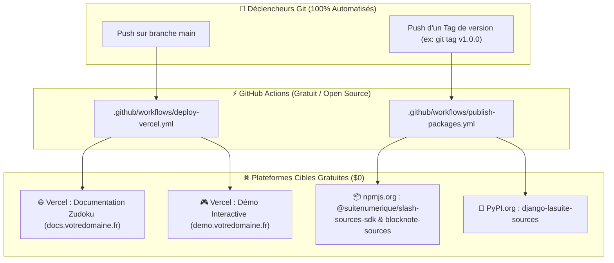

# 🚀 Guide & Checklist de Publication Gratuite des Packages & Déploiements (`TODO_HOW_TO_PUBLISH_PACKAGE.md`)

> **Projet :** Slasher — Packages Souverains & Portails Web  
> **Modèle Économique :** **100% GRATUIT ($0 / mois)** grâce aux offres gratuites officielles pour projets open source (Vercel Hobby, npmjs.com, PyPI.org, GitHub Actions & GitHub Pages).

---

## 💡 Réponse Rapide : Vercel vs Git / GitHub (C'est 100% Gratuit !)

| Type de Composant | Outil Gratuit Recommandé | Coût | Rôle & Usage |
|---|---|:---:|---|
| **Site Web & Portail Docs** (`documentation/`) | **Vercel (Hobby Tier)** ou **GitHub Pages** | **0 €** | Hébergement web mondial SSR / CDN du portail Zudoku (270 routes). |
| **Démonstrateur Web Live** (`demo/`) | **Vercel** ou **GitHub Pages** | **0 €** | Bac à sable interactif BlockNote.js en ligne pour les testeurs. |
| **Storybook des Composants** (`packages/blocknote-sources/`) | **Vercel** ou **GitHub Pages / Chromatic** | **0 €** | Visualisation interactive des composants Marianne / DSFR. |
| **Packages TypeScript (npm)** (`slash-sources-sdk`, `blocknote-sources`) | **npmjs.com (Public)** ou **GitHub Packages** | **0 €** | Distribution universelle via `npm install` / `pnpm add` / `yarn add`. |
| **Package Python (PyPI)** (`django-lasuite-sources`) | **PyPI.org** | **0 €** | Distribution universelle via `pip install django-lasuite-sources`. |
| **Automatisation CI/CD (Build & Publish)** | **GitHub Actions** | **0 €** | Minutes d'exécution illimitées et gratuites sur dépôts publics. |

---

## 🧭 1. Vue d'Ensemble des Pipelines de Publication



---

## 🌐 2. Déploiement Web Gratuit sur Vercel (`documentation/` & `demo/`)

Vercel propose un plan **Hobby gratuit à vie** parfait pour héberger le portail Zudoku et l'application Démo React 19.

### Option A : Déploiement en 1 Clic via l'Interface Web Vercel (Le plus simple)
1. Rendez-vous sur **[vercel.com/signup](https://vercel.com/signup)** et connectez-vous avec votre compte **GitHub**.
2. Cliquez sur **"Add New Project"** $\to$ Sélectionnez votre dépôt (`dinum-setup` ou `waxland/dinum-setup`).
3. Vercel détecte automatiquement le fichier [`vercel.json`](vercel.json) à la racine :
   - **Framework Preset :** Other / Vite
   - **Build Command :** `npm run build`
   - **Output Directory :** `documentation/dist`
4. Cliquez sur **"Deploy"** : votre documentation est en ligne en ~60 secondes sur une URL HTTPS gratuite `https://dinum-setup.vercel.app`.

### Option B : Déploiement Automatisé via GitHub Actions
Le workflow [`.github/workflows/deploy-vercel.yml`](.github/workflows/deploy-vercel.yml) est déjà configuré dans le projet. Pour l'activer :
1. Récupérez vos identifiants Vercel :
   - **`VERCEL_TOKEN`** : Créé dans [vercel.com/account/tokens](https://vercel.com/account/tokens).
   - **`VERCEL_ORG_ID`** & **`VERCEL_PROJECT_ID`** : Visibles dans les paramètres de votre projet Vercel (`.vercel/project.json`).
2. Ajoutez-les dans **GitHub Settings** $\to$ **Secrets and variables** $\to$ **Actions** de votre dépôt.
3. Chaque `git push origin main` déclenchera automatiquement le déploiement en production !

---

## 📦 3. Publication Gratuite des Packages TypeScript sur `npmjs.com`

Les packages publics sur [npmjs.com](https://www.npmjs.com) sont **100% gratuits et illimités**.

### Étape 1 : Créer un Compte Gratuit sur npm
1. Inscrivez-vous gratuitement sur [npmjs.com/signup](https://www.npmjs.com/signup).
2. Créez un **Access Token d'automatisation** dans [npmjs.com/settings/tokens](https://www.npmjs.com/settings/tokens) (type *Granular Access Token* ou *Classic Automation Token*).
3. Enregistrez ce jeton dans vos secrets GitHub sous le nom **`NPM_TOKEN`**.

### Étape 2 : Vérifier le Nom du Scope du Package
Si vous n'êtes pas administrateur de l'organisation `@suitenumerique` sur npm, vous pouvez publier sous votre propre pseudo ou créer une organisation gratuite :
- Sous votre compte : `@waxland/slash-sources-sdk` et `@waxland/blocknote-sources`
- Ou sous l'organisation officielle : `@suitenumerique/slash-sources-sdk` (si droits accordés).

### Étape 3 : Publication Manuelle Locale (Optionnelle)
```bash
# 1. Se connecter à npm depuis le terminal
npm login

# 2. Compiler les packages TypeScript
npm run packages:build

# 3. Publier le SDK
cd packages/slash-sources-sdk
npm publish --access public

# 4. Publier l'extension BlockNote
cd ../blocknote-sources
npm publish --access public
```

---

## 🐍 4. Publication Gratuite du Package Python sur `PyPI.org`

Le dépôt officiel des packages Python [PyPI.org](https://pypi.org) est une infrastructure publique **100% gratuite**.

### Étape 1 : Créer un Compte sur PyPI
1. Inscrivez-vous sur [pypi.org/account/register/](https://pypi.org/account/register/).
2. Activez l'authentification 2FA (obligatoire sur PyPI).
3. Générez un API Token dans [pypi.org/manage/account/token/](https://pypi.org/manage/account/token/) avec la portée *Entire account (all projects)*.
4. Enregistrez le jeton dans les secrets GitHub sous le nom **`PYPI_API_TOKEN`**.

### Étape 2 : Publication Manuelle Locale via Twine (Optionnelle)
```bash
# 1. Se positionner dans le dossier du package
cd packages/django-lasuite-sources

# 2. Installer les outils de packaging
pip install build twine

# 3. Construire les distributions source (.tar.gz) et wheel (.whl)
python -m build

# 4. Vérifier la conformité des archives
twine check dist/*

# 5. Uploader sur PyPI officiel
twine upload dist/* -u __token__ -p pypi-VOTRE_TOKEN_ICI
```

👉 Dès la publication terminée, n'importe qui peut installer votre module via :
```bash
pip install django-lasuite-sources
```

---

## 🐙 5. Alternative 100% Git : GitHub Packages & GitHub Pages

Si vous souhaitez tout centraliser sur GitHub sans passer par des services tiers :

### 📦 A. GitHub Packages (npm & Python Registry)
GitHub héberge gratuitement des registres de packages liés directement à votre dépôt Git :
- Pour npm : `https://npm.pkg.github.com/@waxland`
- Utilise votre token GitHub standard (`GITHUB_TOKEN`), aucune création de compte tiers n'est nécessaire.

### 🌐 B. GitHub Pages (Hébergement Statique Gratuit)
Pour héberger la documentation sans Vercel :
1. Dans GitHub, allez dans **Settings** $\to$ **Pages**.
2. Source : **GitHub Actions**.
3. Utilisez l'action standard `actions/deploy-pages@v4` pointant sur le dossier `documentation/dist/`.

---

## 🏷️ 6. Procédure de Publication en 1 Commande Git (Recommandée)

Grâce au fichier [`.github/workflows/publish-packages.yml`](.github/workflows/publish-packages.yml), la publication sur **npm** et **PyPI** se fait automatiquement dès que vous poussez un tag de version :

```bash
# 1. Vérifier que tous les tests passent localement
npm run packages:test
cd packages/django-lasuite-sources && PYTHONPATH=. .venv/bin/pytest && cd ../..

# 2. Incrémenter les versions dans les package.json et pyproject.toml (ex: 1.0.0 -> 1.0.1)

# 3. Créer le tag Git officiel
git tag v1.0.1

# 4. Pousser le tag sur GitHub
git push origin v1.0.1
```

🎉 **GitHub Actions prend le relais :** Il compile le code, exécute les suites de tests, et publie automatiquement les nouvelles versions sur **npm** et **PyPI** sans aucune action manuelle !

---

## ✅ 7. Checklist Récapitulative Avant Publication

- [ ] **Tests unitaires TypeScript au vert (15/15) :** `npm run packages:test`
- [ ] **Tests unitaires Django au vert (22/22) :** `pytest`
- [ ] **Build Documentation SSR sans erreur (270 routes) :** `npm run docs:build`
- [ ] **Build Démonstrateur autonome validé :** `npm run demo:build`
- [ ] **Secrets GitHub renseignés :**
  - [ ] `VERCEL_TOKEN`, `VERCEL_ORG_ID`, `VERCEL_PROJECT_ID` (pour le déploiement web)
  - [ ] `NPM_TOKEN` (pour la publication des bibliothèques JavaScript/TypeScript)
  - [ ] `PYPI_API_TOKEN` (pour la publication du module Python Django)
- [ ] **Fichiers README à jour :** Descriptions, exemples de code et badges de statut en anglais.
