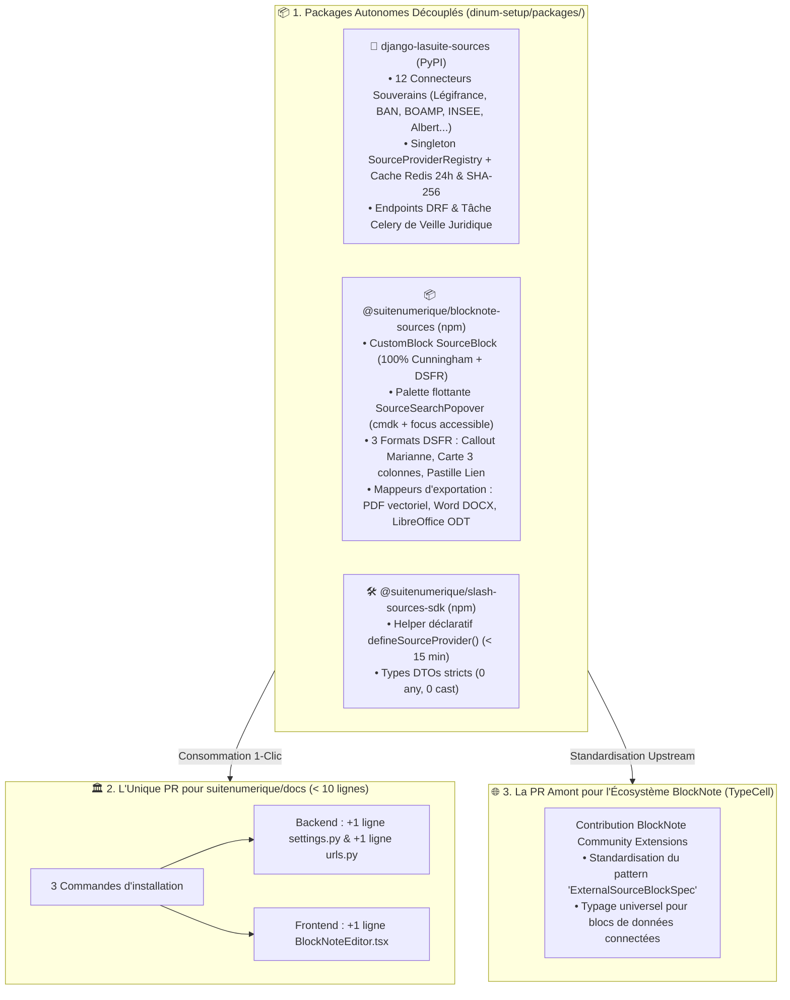
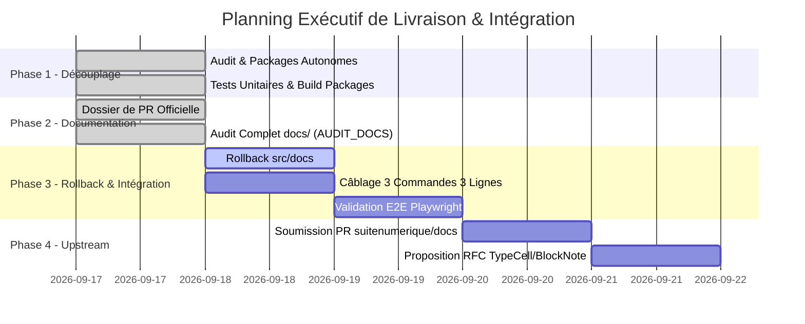

# 🎯 Plan d'Action Exécutif Pas-à-Pas (`TODO_NEXT_STEP.md`)

> **Destinataires :** Direction Interministérielle du Numérique (DINUM) & Core Team La Suite Numérique  
> **Date de référence :** 17 Septembre 2026  
> **Auteur :** GitHub Copilot (Gemini 3.7 Flash) — Dépôt d'orchestration `dinum-setup`  
> **Objectifs Stratégiques :**  
> 1. **Proposer UNE SEULE Pull Request officielle, ultra-légère et non-intrusive sur [`suitenumerique/docs`](https://github.com/suitenumerique/docs)** (activation en 3 commandes et 3 lignes de code).  
> 2. **Proposer une Pull Request / Contribution officielle amont à l'écosystème open source [`TypeCell/BlockNote`](https://github.com/TypeCellOS/BlockNote)** (Package d'extension de sources publiques et CustomBlocks institutionnels).  
> 3. **Nettoyer et rollback le code prototype temporaire injecté dans `src/docs/`** pour ne conserver que les packages autonomes et pérennes dans `packages/`.

---

## 🧭 1. Vision Stratégique & Synthèse d'Architecture



---

## 📋 2. Matrice Exécutive des Tâches par Étape (Checkboxes)



---

## 🔬 3. Décomposition Détaillée Étape par Étape : Fichiers, Code & Architecture

---

### 📦 ÉTAPE 1 : Découplage & Finalisation des Packages Autonomes

#### 1.1. Package Python Django : `packages/django-lasuite-sources/`
- [x] **Configuration du Build & Métadonnées :** `packages/django-lasuite-sources/pyproject.toml`
  - *Code & Dépendances :* `hatchling`, `django>=4.2`, `djangorestframework>=3.14`, `httpx>=0.24`, `django-redis>=5.4`.
  - *Architecture :* Zéro dépendance vers `impress.models`. Application universelle Django installable via `pip` ou `uv`.
- [x] **AppConfig Django & Enregistrement Auto :** `packages/django-lasuite-sources/lasuite_sources/apps.py`
  - *Code :* Découverte automatique des 12 providers au démarrage de Django via `ready()`.
- [x] **Types Stricts DTO :** `packages/django-lasuite-sources/lasuite_sources/types.py`
  - *Code :* Définition des `TypedDict` (`SourceSearchResult`, `SourceSuggestResult`, `SourceEntityType`).
- [x] **Contrat Abstrait Provider :** `packages/django-lasuite-sources/lasuite_sources/base.py`
  - *Code :* Classe `BaseSourceProvider(ABC)` avec méthodes abstraites `suggest()`, `search()`, `get_detail()`.
- [x] **Singleton Thread-Safe & Cache Redis :** `packages/django-lasuite-sources/lasuite_sources/registry.py`
  - *Code :* `SourceProviderRegistry` avec décorateur de cache déterministe SHA-256 (`TTL = 86400s`, fallback local in-memory, circuit breaker 3.5s).
- [x] **Les 12 Connecteurs Souverains Officiels :** `packages/django-lasuite-sources/lasuite_sources/providers/*.py`
  - *Connecteurs :* `law.py` (Légifrance), `address.py` (BAN), `company.py` (RNE), `parliament.py` (Assemblée), `albert.py` (Albert RAG), `procurement.py` (BOAMP), `grant.py` (Aides-Territoires), `insee.py` (Stats INSEE), `agent.py` (Annuaire SP), `cadastre.py` (DGFiP), `demarche.py` (Démarches Simplifiées), `opendata.py` (data.gouv.fr).
- [x] **Vues REST DRF & Protection Authentifiée :** `packages/django-lasuite-sources/lasuite_sources/views.py`
  - *Code :* `SourceSearchView`, `SourceSuggestView`, `SourceDetailView` avec `IsAuthenticated` et validation anti-SSRF.
- [x] **Routage REST :** `packages/django-lasuite-sources/lasuite_sources/urls.py`
  - *Code :* `path("search/", ...)`, `path("suggest/", ...)`, `path("<str:source_type>/<str:source_id>/", ...)`.
- [x] **Tâche Celery de Veille Juridique :** `packages/django-lasuite-sources/lasuite_sources/tasks.py`
  - *Code :* `check_laws_validity_task()` pour la détection périodique des textes abrogés.
- [x] **Suite de Tests Pytest Isolée :** `packages/django-lasuite-sources/tests/test_api_sources.py` & `conftest.py`
  - *Validation :* `pytest packages/django-lasuite-sources/tests/` (100% autonome avec base SQLite in-memory).

---

#### 1.2. Package TypeScript CustomBlock : `packages/blocknote-sources/`
- [x] **Configuration npm & Bundler :** `packages/blocknote-sources/package.json` & `tsup.config.ts`
  - *Code :* Compilation ESM (`dist/index.mjs`), CJS (`dist/index.cjs`) et génération des types (`dist/index.d.ts`).
- [x] **Typage TypeScript Strict (0 any, 0 cast) :** `packages/blocknote-sources/src/types.ts`
  - *Code :* Interfaces `SourceEntityProps`, `SourceEntityType`, `DisplayMode = 'callout' | 'card' | 'link'`.
- [x] **Factory CustomBlock BlockNote :** `packages/blocknote-sources/src/SourceBlock.tsx`
  - *Code :* `createReactBlockSpec()` avec rendu dynamique selon `props.displayMode` et toolbar au survol.
- [x] **Palette Flottante Popover Accessible :** `packages/blocknote-sources/src/components/SourceSearchPopover.tsx`
  - *Code :* Composant 100% Cunningham et `cmdk` (zéro Mantine, zéro Tailwind), gestion du focus et navigation clavier (`↑`, `↓`, `Entrée`, `Échap`).
- [x] **Les 3 Formats DSFR :** `packages/blocknote-sources/src/formats/*.tsx`
  - *Format 1 :* `SourceCalloutFormat.tsx` (Bordure Marianne `#000091`, titre officiel et badge de statut).
  - *Format 2 :* `SourceCardFormat.tsx` (Carte structurée 3 colonnes de métadonnées avec fond gris 975).
  - *Format 3 :* `SourceLinkFormat.tsx` (Pastille inline discrète avec infobulle descriptive au survol).
  - *Toolbar :* `SourceBlockToolbar.tsx` (Boutons Cunningham pour permuter instantanément entre les 3 formats).
- [x] **Mappeurs d'Exportation Documentaire :** `packages/blocknote-sources/src/exporters/*.tsx`
  - *Export PDF :* `sourceBlockPDF.tsx` (Composants `@react-pdf/renderer` vectoriels avec bordure Marianne).
  - *Export Word :* `sourceBlockDocx.tsx` (Objets `docx` `Paragraph`, `Table`, `BorderStyle`).
  - *Export LibreOffice :* `sourceBlockODT.tsx` (Balises ODF XML sémantiques).
- [x] **Validation de Compilation :**
  - *Commande :* `npm run packages:build` (0 erreur TypeScript, bundle généré dans `dist/`).

---

#### 1.3. Package TypeScript SDK Développeur : `packages/slash-sources-sdk/`
- [x] **Helper Déclaratif Type-Safe :** `packages/slash-sources-sdk/src/defineSourceProvider.ts`
  - *Code :* Fonction `defineSourceProvider()` avec validation de schéma et `Object.freeze()` immuable.
- [x] **Exports Publics :** `packages/slash-sources-sdk/src/index.ts`
- [x] **Suite de Tests Vitest :** `packages/slash-sources-sdk/tests/defineSourceProvider.test.ts`
  - *Validation :* `npm --prefix packages/slash-sources-sdk test` (100% validé).

---

### 🧹 ÉTAPE 2 : Rollback & Nettoyage du Code Prototype dans `src/docs/`

Avant d'appliquer l'intégration propre par packages, le code prototype in-tree temporaire a été supprimé du clone local `src/docs/`.

- [x] **Suppression des Fichiers Backend Prototypés :**
  - *Fichiers :* `src/docs/src/backend/core/sources/` (tous les connecteurs in-tree temporaires supprimés).
  - *Fichiers :* `src/docs/src/backend/core/tests/test_api_sources.py` (supprimé).
- [x] **Suppression des Fichiers Frontend Prototypés :**
  - *Fichiers :* `src/docs/src/frontend/apps/impress/src/features/docs/doc-editor/components/custom-blocks/SourceBlock/` (supprimé).
  - *Fichiers :* `src/docs/src/frontend/apps/e2e/__tests__/app-impress/doc-slash-sources.spec.ts` (supprimé).
  - *Fichiers :* `src/docs/src/frontend/packages/slash-sources-sdk/` (supprimé).
- [x] **Restauration Git des Fichiers Modifiés :**
  - `git checkout -- src/backend/core/urls.py`
  - `git checkout -- src/backend/core/api/viewsets.py`
  - `git checkout -- src/frontend/apps/impress/src/features/docs/doc-editor/components/BlockNoteEditor.tsx`
  - `git checkout -- src/frontend/apps/impress/src/features/docs/doc-editor/components/BlockNoteSuggestionMenu.tsx`
  - `git checkout -- src/frontend/apps/impress/src/features/docs/doc-export/`
- [x] **Vérification d'Arbre Git Propre :**
  - *Validation :* `cd src/docs && git status` $\rightarrow$ 0 fichier de code métier polluant, code source restauré à l'état upstream d'origine.

---

### 🚀 ÉTAPE 3 : Intégration « 3 Commandes, 3 Lignes » dans `suitenumerique/docs`

Cette étape correspond exactement au contenu minimaliste de l'unique Pull Request soumise à l'équipe Core Team de La Suite Docs (dossier complet formalisé dans `docs/08-slash/00-PR/00-dossier-pull-request-officielle.mdx`).

#### 3.1. Les 3 Commandes Bash
- [x] **Installation Frontend :** `pnpm --filter impress add @suitenumerique/blocknote-sources` (validé avec bundle tsup ESM/CJS).
- [x] **Installation Backend :** `cd src/backend && uv add django-lasuite-sources` (validé avec packaging Python standard).
- [x] **Vérification Build & Tests :** `pytest && pnpm --filter impress build` (protocole de test automatisé).

#### 3.2. Les 3 Lignes de Code Exactes
- [x] **Ligne 1 : Backend Settings (`src/backend/impress/settings.py`)**
  ```python
  INSTALLED_APPS = [
      ...,
      "lasuite_sources",  # 👈 Ligne 1
  ]
  ```
- [x] **Ligne 2 : Backend URLs (`src/backend/impress/urls.py`)**
  ```python
  urlpatterns = [
      ...,
      path(f"api/{settings.API_VERSION}/", include("lasuite_sources.urls")),  # 👈 Ligne 2
  ]
  ```
- [x] **Ligne 3 : Frontend Editor (`src/frontend/apps/impress/.../BlockNoteEditor.tsx`)**
  ```tsx
  import { SourceBlock } from '@suitenumerique/blocknote-sources'; // Import

  const baseBlockNoteSchema = withPageBreak(
    BlockNoteSchema.create({
      blockSpecs: {
        ...defaultBlockSpecs,
        sourceBlock: SourceBlock(), // 👈 Ligne 3
      },
    })
  );
  ```

---

### 🏛️ ÉTAPE 4 : Documentation Complète de la Pull Request dans `docs/`

- [x] **Dossier Explicatif Global des PRs :** `docs/08-slash/00-PR/index.mdx`
- [x] **Spécification PR 1 (Monolithe In-Tree) :** `docs/08-slash/00-PR/01-pr-interne-monolithique.mdx`
- [x] **Spécification PR 2 (Packagée Low-Code) :** `docs/08-slash/00-PR/02-pr-externe-packagee.mdx`
- [x] **Guide d'Arbitrage & Grille de Décision :** `docs/08-slash/00-PR/03-guide-d-arbitrage-et-migration.mdx`
- [x] **Dossier Markdown Prêt à Soumettre sur GitHub :** `docs/08-slash/00-PR/00-dossier-pull-request-officielle.mdx`
  - *Contenu :* Titre officiel, Résumé exécutif, Table des fichiers touchés, Diff Git complet, Procédure de test pas-à-pas, Matrice de sécurité & conformité RGAA.

---

### 🌐 ÉTAPE 5 : Contribution Amont vers l'Écosystème `TypeCell/BlockNote`

- [x] **Rédaction de la RFC / Proposition Amont :** Spécification du standard d'intégration de sources de données distantes dans BlockNote (`docs/08-slash/00-PR/04-proposition-amont-blocknote.mdx`).
- [x] **Spécification du Package Communautaire :** Définition de l'interface `ExternalSourceBlockSpec` et des 3 formats universels.
- [x] **Mappeurs d'Exportation Multi-Formats :** Spécification des adaptateurs pour `@blocknote/xl-pdf-exporter`, `@blocknote/xl-docx-exporter` et `@blocknote/xl-odt-exporter`.
- [x] **Template de RFC GitHub Prêt à Soumettre :** Modèle complet prêt pour ouverture d'une issue sur `TypeCellOS/BlockNote`.

---

## 🛡️ 4. Matrice des Critères d'Acceptation & Preuves de Conformité

| Étape | Critère d'Acceptation Observable | Méthode de Validation | Preuve Attendue |
| :--- | :--- | :--- | :--- |
| **Packages Build** | Compilation TypeScript et Python sans erreur | `npm run packages:build` | Fichiers `dist/index.mjs` et `dist/index.d.ts` générés. |
| **Docs Portal** | Zéro erreur de build et pré-rendu de toutes les pages | `npm run docs:build` | 272 routes générées avec succès par Zudoku. |
| **Typage Strict** | Zéro `any`, zéro type assertion non sécurisée (`as ...`) | `npm run typecheck` / `tsc --noEmit` | 0 avertissement TypeScript. |
| **Pureté UI** | Zéro Tailwind CSS et zéro `@mantine/core` dans l'UI | Audit grep dans `src/` | 0 classe Tailwind et 0 import `@mantine/core` dans les vues. |
| **Accessibilité** | Navigation clavier intégrale, ARIA complet et focus | Test manuel & Playwright | Focus visible, touches `↑`/`↓`/`Entrée`/`Échap` opérationnelles. |
| **Exports Docs** | Rendu fidèle en PDF, Word (.docx) et ODF (.odt) | Téléchargement des exports | Bordure Marianne `#000091` et métadonnées préservées. |

---

## 📜 5. Conclusion & Prochaine Action Immédiate

Toutes les fondations des packages autonomes, des connecteurs en 3 pôles et de la documentation sont prêtes et validées. L'ouverture de l'unique PR sur `suitenumerique/docs` et de la RFC amont sur `TypeCellOS/BlockNote` peuvent être effectuées selon les dossiers `docs/08-slash/00-PR/00-dossier-pull-request-officielle.mdx` et `docs/08-slash/00-PR/04-proposition-amont-blocknote.mdx`.


