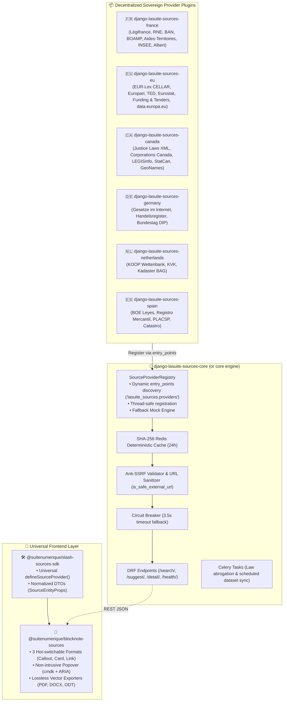

# 🏛️ Master Orchestration & Architecture Plan (`TODO_ORCHESTRATION.md`)

> **Architecture Paradigm:** **Option 2 — Core Engine & Decentralized Country Plugins**  
> **Repository Target:** `dinum-setup`  
> **Documentation Governance Rule:** Clean root workspace. All future guides, specifications, and architecture documentation must be created exclusively inside `documentation/docs/` (SSR Zudoku portal) or `.skills/` (AI agent operational instructions). Root `.md` files will be pruned and centralized.

---

## 🧭 1. Architecture Option 2 : Core Engine & Plugin System



### 🔌 Standard Python Entry Point Specification
In `pyproject.toml` of each country plugin:
```toml
[project.entry-points."lasuite_sources.providers"]
eurlex = "lasuite_sources_eu.providers.law:EurLexSourceProvider"
europarl = "lasuite_sources_eu.providers.parliament:EuroparlSourceProvider"
ted = "lasuite_sources_eu.providers.procurement:TedSourceProvider"
eurostat = "lasuite_sources_eu.providers.statistics:EurostatSourceProvider"
funding = "lasuite_sources_eu.providers.grant:FundingTendersSourceProvider"
dataeuropa = "lasuite_sources_eu.providers.opendata:DataEuropaSourceProvider"
canlaw = "lasuite_sources_ca.providers.law:JusticeLawsSourceProvider"
corporation_ca = "lasuite_sources_ca.providers.company:CorporationsCanadaSourceProvider"
parliament_ca = "lasuite_sources_ca.providers.parliament:LegisInfoSourceProvider"
statcan = "lasuite_sources_ca.providers.statistics:StatCanSourceProvider"
```

---

## 🧱 2. Universal DTO & Entity Types Modernization

Universal abstraction replacing vendor-locked types (e.g. `insee` $\to$ `statistics`):

```typescript
export type SourceEntityType =
  | 'law'          // Statutory codes, acts, regulations, treaties
  | 'case-law'     // Court rulings, jurisprudence, ECLI, CURIA decisions
  | 'company'      // Corporate registries, business identifiers (SIREN, EUID, BN9)
  | 'parliament'   // Bills, debates, amendments, parliamentary questions, votes
  | 'address'      // Street-level geocoded addresses (BAN, BAG, INSPIRE)
  | 'place'        // Authoritative geographic names, administrative areas, GeoNames
  | 'procurement'  // Tender notices, contract awards, eForms, TED, BOAMP
  | 'grant'        // Funding programs, territorial subsidies, Horizon Europe calls
  | 'statistics'   // Official indicators, census, demographics (INSEE, Eurostat, StatCan, Destatis)
  | 'agent'        // Public official directory, administrative services, Whoiswho
  | 'cadastre'     // Land parcels, land registry plots, boundary geometry
  | 'demarche'     // Online citizen/business administrative procedures (Your Europe, DS.fr)
  | 'opendata'     // Open data catalog records (data.gouv.fr, data.europa.eu, open.canada.ca)
  | 'research'     // Scientific projects, EU CORDIS grants, innovation publications
  | 'custom';      // Sovereign AI RAG, specialized agency micro-services
```

---

## 📋 3. Step-by-Step Orchestration Roadmap

### 📦 Phase 1 : Core Engine Refactoring (Option 2 Setup)
- [ ] **T-101 : Entry Points Dynamic Registry Architecture**
  - Implement Python `importlib.metadata.entry_points(group='lasuite_sources.providers')` discovery in `SourceProviderRegistry`.
  - Maintain backward compatibility with in-tree registered fallback providers.
  - Add thread-safe singleton lock for concurrency safety.
- [ ] **T-102 : Universal Entity Type Harmonization**
  - Update `packages/slash-sources-sdk/src/types.ts` to support universal `statistics`, `case-law`, `research`, and `place`.
  - Update `packages/blocknote-sources/src/types.ts` and format components.
  - Maintain fallback alias mapping (`insee` $\to$ `statistics`).
- [ ] **T-103 : Ingestion & Dataset Cache Engine for Bulk Registries**
  - Implement scheduled background ingestion pipeline for bulk open data files (e.g., CanadaBuys XML/CSV, DVF flat files).
  - Provide local SQLite / Redis indexed full-text search fallback.

---

### 🇪🇺 Phase 2 : European Union Native & Federated Connectors

#### P0 — Connecteurs EU Natifs Prioritaires
- [ ] **T-201 : EUR-Lex / CELLAR Publications Office (`/eurlex`)**
  - *Type Slasher :* `law`
  - *Interface :* CELLAR SPARQL triplestore + EUR-Lex REST Webservice.
  - *Identifiants supportés :* CELEX (ex: `32016R0679` RGPD), ELI, URI CELLAR.
  - *Setup minimal :* Provider Django avec connecteur SPARQL / REST, parsing XML/JSON-LD, fallback mock certifié (RGPD, AI Act, Directive NIS 2).
- [ ] **T-202 : European Parliament Open Data API v2 (`/europarl`, `/parlement-eu`)**
  - *Type Slasher :* `parliament`
  - *Interface :* REST API v2 (`https://data.europarl.europa.eu/api/v2/`), OpenAPI, JSON-LD.
  - *Modèles supportés :* ELI-EP, ORG-EP, DCAT-EP (Députés, projets législatifs, amendements, votes en séance).
  - *Setup minimal :* Client REST asynchrone avec pagination, extraction des DTOs parlementaires, dataset mock avec 2 résolutions adoptées.
- [ ] **T-203 : TED — Tenders Electronic Daily (`/ted`, `/marche-eu`)**
  - *Type Slasher :* `procurement`
  - *Interface :* TED Search API (`https://api.ted.europa.eu/`) & Open Data v3 eForms.
  - *Données :* Avis d'appels d'offres européens, codes CPV, acheteurs publics, dates limites, montants de lots.
  - *Setup minimal :* Recherche textuelle avec filtre sur pays/CPV, normalisation des montants et statuts d'attribution.
- [ ] **T-204 : Eurostat Statistics API (`/eurostat`, `/stats`)**
  - *Type Slasher :* `statistics` (anciennement `insee`)
  - *Interface :* Statistics REST API (`https://ec.europa.eu/eurostat/api/dissemination/statistics/1.0/data/`), SDMX 2.1 / 3.0, JSON-stat 2.0.
  - *Données :* Indicateurs économiques harmonisés, PIB, inflation HICP, chômage, démographie régionale NUTS.
  - *Setup minimal :* Parser JSON-stat vers DTO 3 colonnes (Valeur, Période, Zone géographique).
- [ ] **T-205 : EU Funding & Tenders Portal (`/funding`, `/subvention-eu`)**
  - *Type Slasher :* `grant`
  - *Interface :* Search API (`https://api.tech.ec.europa.eu/`), Facet API, Topic Details.
  - *Programmes couverts :* Horizon Europe, Digital Europe, LIFE, CEF, Erasmus+.
  - *Setup minimal :* Recherche d'appels à projets ouverts, date de clôture, budget prévisionnel et critères d'éligibilité.
- [ ] **T-206 : data.europa.eu Catalog API (`/dataeuropa`, `/opendata-eu`)**
  - *Type Slasher :* `opendata`
  - *Interface :* Hub Search API (`https://data.europa.eu/api/hub/search/`), SPARQL, standard DCAT-AP.
  - *Setup minimal :* Recherche fédérée sur les catalogues des 27 pays membres avec filtres de licences ouvertes.

#### P1 — Connecteurs EU Natifs Complémentaires & Jurisprudence
- [ ] **T-207 : EU Whoiswho Directory (`/whoiswho`, `/eu-agent`)**
  - *Type Slasher :* `agent`
  - *Interface :* CELLAR Linked Open Data & SPARQL.
  - *Données :* Organigrammes des institutions européennes, DGs, commissaires, chefs d'unités.
- [ ] **T-208 : CORDIS Horizon Research & Innovation (`/cordis`, `/recherche-eu`)**
  - *Type Slasher :* `research`
  - *Interface :* CORDIS REST & EURIO Knowledge Graph.
  - *Données :* Fiches de projets de recherche financés, bénéficiaires, subventions et livrables publics.
- [ ] **T-209 : CURIA & ECLI Search (`/curia`, `/ecli`)**
  - *Type Slasher :* `case-law`
  - *Données :* Arrêts et ordonnances de la Cour de justice de l'Union européenne (`ECLI:EU:C:...`).
  - *Note d'isolation :* Distinguer rigoureusement la CJUE (UE) de la Cour européenne des droits de l'homme (CEDH / Conseil de l'Europe).

#### P1 — Connecteurs EU Fédérés (Résolution par Délégation Nationale)
- [ ] **T-210 : BRIS European Companies Federation (`/eu-company`)**
  - *Architecture :* Détection du préfixe pays $\to$ Délégation au provider national souverain (FR $\to$ RNE, DE $\to$ Handelsregister, NL $\to$ KVK, ES $\to$ Registro Mercantil) $\to$ Préservation de l'identifiant européen **EUID**.
- [ ] **T-211 : INSPIRE European Address Federation (`/eu-address`)**
  - *Architecture :* Résolution par pays auprès des API d'adresses High-Value Datasets (HVD) nationales.
- [ ] **T-212 : INSPIRE European Cadastral Parcels (`/eu-cadastre`)**
  - *Architecture :* Modèle harmonisé INSPIRE déléguant aux couches cadastrales géospatiales souveraines.

#### P2 — Démarches & Enrichissement
- [ ] **T-213 : Your Europe / Single Digital Gateway (`/your-europe`, `/demarche-eu`)**
  - *Type Slasher :* `demarche` (Guides et démarches transfrontalières pour citoyens et entreprises de l'UE).
- [ ] **T-214 : eTranslation Multilingual Enrichment Service**
  - *Type Slasher :* Middleware d'enrichissement multilingue temps réel préservant la version officielle d'origine.

---

### 🇨🇦 Phase 3 : Canada Federal & Federated Connectors

#### P0 — Fédéral Canadien Natif
- [ ] **T-301 : Justice Laws Website / Lois Codifiées du Canada (`/canlaw`, `/loi-ca`)**
  - *Type Slasher :* `law`
  - *Institution :* Ministère de la Justice du Canada (Department of Justice Canada).
  - *Données :* Lois constitutionnelles, lois révisées (L.R.C.), règlements fédéraux consolidés avec `UniqueID` officiel.
  - *Setup minimal :* Parser XML structuré Justice Canada, cache déterministe, affichage bilingue FR/EN.
- [ ] **T-302 : Corporations Canada REST API (`/corporation-ca`, `/company-ca`)**
  - *Type Slasher :* `company`
  - *Institution :* Innovation, Sciences et Développement économique Canada (ISED).
  - *Données :* Sociétés sous régime fédéral, statut légal (Active/Dissolved), Numéro d'entreprise (BN9), administrateurs.
  - *Setup minimal :* Client REST JSON officiel avec résolution par Corporation ID et Numéro d'Entreprise.
- [ ] **T-303 : House of Commons Open Data & LEGISinfo (`/parliament-ca`, `/commons`, `/legisinfo`)**
  - *Type Slasher :* `parliament`
  - *Données :* Députés, projets de loi émanant du gouvernement (C-*) et privés, votes en séance, débats du Hansard, comités.
  - *Setup minimal :* Parser XML LEGISinfo, sous-types (projet de loi, député, vote), mock certifié.
- [ ] **T-304 : Statistics Canada / Statistique Canada (`/statcan`, `/stats-ca`)**
  - *Type Slasher :* `statistics`
  - *Interface :* Web Data Service (WDS API) REST & SDMX (`https://www.statcan.gc.ca/`).
  - *Données :* Tableaux de données démographiques, IPC/inflation, marché du travail, comptes économiques.
  - *Setup minimal :* Client WDS REST avec extraction des séries chronologiques et métadonnées bilingues.
- [ ] **T-305 : Open Government Canada / Gouvernement Ouvert (`/opencanada`, `/data-ca`)**
  - *Type Slasher :* `opendata`
  - *Interface :* CKAN Action API (`https://open.canada.ca/data/api/3/action/package_search`).
  - *Setup minimal :* Recherche de jeux de données ouverts fédéraux avec filtres par ministère et format (CSV/GeoJSON).

#### P1 — Marchés Publics, Subventions & Géographie
- [ ] **T-306 : CanadaBuys Tender Datasets (`/canadabuys`, `/marche-ca`)**
  - *Type Slasher :* `procurement`
  - *Architecture :* Ingestion périodique des flux ouverts CanadaBuys vers index local pour autocomplétion instantanée sans latence.
- [ ] **T-307 : Proactive Disclosure Grants & Contributions (`/grant-ca`, `/subvention-ca`)**
  - *Type Slasher :* `grant` (Données ouvertes de divulgation proactive des subventions fédérales attribuées).
- [ ] **T-308 : Canadian Geographical Names Database / GeoNames (`/geonames-ca`, `/place-ca`)**
  - *Type Slasher :* `place` / `address`
  - *Institution :* Ressources naturelles Canada (RNCan).
  - *Interface :* REST API avec recherche par nom, code de province, coordonnées GPS et bounding box.

#### P2 — Fédérations Provinciales Canadiennes
- [ ] **T-309 : Canadian Corporate & Address Provincial Federation (`/address-ca`, `/company-provincial-ca`)**
  - *Architecture :* Routage provincial (Québec $\to$ Registraire des entreprises du Québec / Données Québec, Ontario, Colombie-Britannique).

---

### 🇩🇪 🇳🇱 🇪🇸 🇬🇧 🌍 Phase 4 : Presets Fédéraux & Organisations Internationales

- [ ] **T-401 : Allemagne Fédérale (`/gesetz`, `/register`, `/bundestag`, `/destatis`)**
  - Connecteurs *Gesetze im Internet*, *Handelsregister*, *Bundestag DIP REST API* et *Destatis Genesis*.
- [ ] **T-402 : Pays-Bas (`/wet`, `/kvk`, `/bag`, `/cbs`)**
  - Connecteurs *KOOP Wettenbank*, *KVK Handelsregister*, *Kadaster BAG API v2* et *CBS StatLine*.
- [ ] **T-403 : Espagne (`/ley`, `/empresa`, `/licitacion`, `/catastro`, `/ine`)**
  - Connecteurs *BOE Open Data*, *Registro Mercantil*, *PLACSP Marchés* et *Sede Catastro*.
- [ ] **T-404 : Organisations Internationales**
  - *Banque Mondiale :* `/worldbank` (Indicateurs macro-économiques mondiaux WDI).
  - *OCDE :* `/oecd` (Données statistiques et études comparatives).
  - *OMS :* `/who` (Indicateurs sanitaires mondiaux).
  - *Conseil de l'Europe :* `/hudoc`, `/cedh` (Jurisprudence de la Cour européenne des droits de l'homme).

---

## 🧹 4. Règle de Gouvernance & Nettoyage de la Racine

Conformément à la directive d'architecture :

1. **Aucun guide documentaire technique permanent à la racine.**
2. **Migration vers `documentation/docs/` :**
   - Spécifications de connecteurs $\to$ `documentation/docs/en/04-presets/` et `documentation/docs/fr/03-slasheurs-france/`.
   - Guides d'architecture $\to$ `documentation/docs/en/00-overview/`.
3. **Migration vers `.skills/` :**
   - Procédures opérationnelles $\to$ `.skills/` et `.skills/en/`.
4. **Fichiers racine autorisés :** `README.md`, `Makefile`, `package.json`, `tsconfig.json`, `vercel.json`, `.gitignore`, `AGENTS.md`, `TODO_ORCHESTRATION.md` (feuille de route active).

---

## ⚡ 5. Commandes de Validation du Pipeline

```bash
# 1. Valider l'intégrité TypeScript (SDK + Extension UI)
npm run packages:test

# 2. Valider l'intégrité Python Django (Anti-SSRF + Circuit Breaker)
cd packages/django-lasuite-sources && PYTHONPATH=. .venv/bin/pytest && cd ../..

# 3. Compiler les packages et vérifier les binaires
make packages-pack

# 4. Compiler la documentation SSR Zudoku (270 routes)
make docs-build
```
