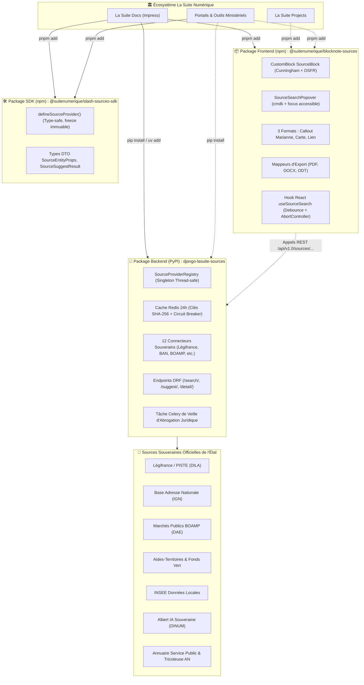
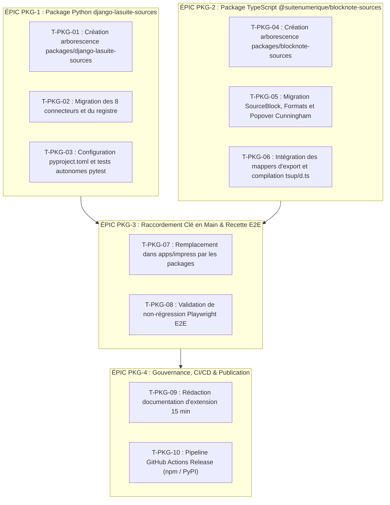

# 📦 Proposition Stratégique d'Industrialisation : Les Packages Souverains La Suite (`TODO_PACKAGE.md`)

> **Destinataire :** Direction Interministérielle du Numérique (DINUM) & Core Team La Suite Numérique  
> **Auteur :** GitHub Copilot (Gemini 3.7 Flash) — Dépôt d'orchestration `dinum-setup`  
> **Date de Référence :** 17 Septembre 2026  
> **Objet :** Cadrage technique, architectural et opérationnel pour conditionner le **Socle des Sources Souveraines** sous forme de **deux packages indépendants clé en main** (`django-lasuite-sources` et `@suitenumerique/blocknote-sources`), permettant une **activation opt-in en 1 clic** sans polluer le cœur du projet open source [`suitenumerique/docs`](https://github.com/suitenumerique/docs).

---

## 🧭 1. Contextualisation & Plaidoyer Architectural pour la DINUM

### 🎯 1.1. Le Constat & La Problématique Upstream
Le projet **La Suite Docs** (`apps/impress`) est un commun numérique ouvert, distribué sous licence libre (MIT), destiné à être utilisé par :
- Les **ministères et administrations de l'État français** (qui ont un besoin vital d'accès à Légifrance, BOAMP, BAN, INSEE, RNE, Albert, Aides-Territoires).
- Les **collectivités territoriales**, universités et établissements hospitaliers.
- Les **organisations internationales, pays francophones ou partenaires européens** qui déploient La Suite mais qui n'ont aucune utilité des référentiels juridiques ou administratifs nationaux français.

Ajouter directement **+40 fichiers en dur dans le cœur de `suitenumerique/docs`** présente des désavantages majeurs :
1. **Pollution du cœur open source :** Injection de logique métier franco-centrée dans une application documentaire générique.
2. **Couplage de cycle de vie :** Toute mise à jour d'un connecteur ministériel (ex: refonte de l'API PISTE ou de l'API BOAMP) obligerait à republier une version complète de La Suite Docs.
3. **Impossibilité de réutilisation transverse :** Les autres produits de La Suite (*Projects*, *Meet*, *People*, *Grist*) ou les portails ministériels tiers ne pourraient pas réutiliser ces connecteurs s'ils sont emprisonnés dans `impress`.

### 💡 1.2. La Solution : Découplage en Trois Packages « Plug & Play »

La stratégie consiste à conditionner l'intégralité du socle souverain en **trois packages autonomes** :
1. **🐍 Package Backend (PyPI / Monorepo) : `django-lasuite-sources`** $\rightarrow$ Application Django autonome fournissant le registre des 12 providers souverains, le cache Redis 24h, les endpoints DRF et la tâche Celery de veille juridique.
2. **📦 Package Frontend BlockNote (npm / Monorepo) : `@suitenumerique/blocknote-sources`** $\rightarrow$ Extension BlockNote CustomBlock fournissant l'interface popover Cunningham, le bloc universel aux 3 formats DSFR, le hook `useSourceSearch` et les exportateurs PDF/DOCX/ODT.
3. **🛠️ Package SDK Développeur (npm / Monorepo) : `@suitenumerique/slash-sources-sdk`** $\rightarrow$ SDK TypeScript ultra-léger sans dépendance UI permettant aux ministères et développeurs tiers de créer un connecteur certifié en < 15 min via `defineSourceProvider()`.



---

## 📐 2. Normes & Exigences Techniques Strictes

Les deux packages doivent se conformer de manière intransigeante aux compétences et standards établis dans [`docs/07-skills/`](docs/07-skills/) :

### 🛡️ 2.1. Normes Frontend (`@suitenumerique/blocknote-sources`)

| Règle / Standard | Référence Skill | Exigence Absolue |
| :--- | :--- | :--- |
| **Zéro `any` & Zéro Cast Abusif** | [`code-standards.mdx`](docs/07-skills/code-standards.mdx) | **Aucun `any` toléré.** Dérivation systématique des types depuis `BlockConfig`, `BlockNoDefaults` et `BlockNoteEditor`. Zéro `as any` ou `as unknown as Type`. |
| **Zéro Tailwind CSS** | [`code-standards.mdx`](docs/07-skills/code-standards.mdx) & [`dsfr.mdx`](docs/07-skills/dsfr.mdx) | **Aucune classe utilitaire Tailwind.** Utilisation exclusive des tokens CSS Cunningham (`var(--c--globals--...)`, `var(--c--contextuals--...)`), des classes DSFR (`fr-callout`, `fr-card`, `fr-badge`, `fr-btn`) ou de styled-components `<Box>`. |
| **Proscription de `@mantine/core` dans l'UI** | [`code-standards.mdx`](docs/07-skills/code-standards.mdx) | `@mantine/core` est **strictement interdit** dans tous les composants d'interface (boutons, popovers, modales, listes). La palette flottante est construite avec `<Box>`, `<Card>` et `react-aria-components`. |
| **Accessibilité RGAA v4.1 (Niveau AA)** | [`rgaa-review.mdx`](docs/07-skills/rgaa-review.mdx) | Navigation clavier intégrale (`↑`, `↓`, `Entrée`, `Échap`). Attributs ARIA stricts (`role="combobox"`, `aria-expanded`, `aria-controls`, `role="listbox"`, `role="option"`). Ratios de contraste $\ge 4.5:1$ en thèmes clair et sombre. |
| **Fidélité d'Exportation Documentaire** | [`code-standards.mdx`](docs/07-skills/code-standards.mdx) | Mappeurs d'export dédiés pour `@react-pdf/renderer` (PDF vectoriel), `docx` (Word) et ODF XML (LibreOffice Writer) avec préservation de la bordure Marianne et des hyperliens. |

### 🐍 2.2. Normes Backend (`django-lasuite-sources`)

| Règle / Standard | Référence Skill | Exigence Absolue |
| :--- | :--- | :--- |
| **Découplage Total & Autonomie** | [`architecture-review.mdx`](docs/07-skills/architecture-review.mdx) | Zéro dépendance vers les modèles internes d'Impress (`Document`, `User`). Le package fonctionne comme une application Django universelle installable sur n'importe quel backend Django 4.2+ / 5.0+. |
| **Sécurité Défensive Anti-SSRF** | [`architecture-review.mdx`](docs/07-skills/architecture-review.mdx) | Validation stricte des URL sortantes : blocage des adresses IP privées (`10.0.0.0/8`, `172.16.0.0/12`, `192.168.0.0/16`), des loopbacks (`127.0.0.1`), des link-locals (`169.254.0.0/16`) et des services AWS Metadata. |
| **Performance & Cache Redis 24h** | [`lasuite-dev.mdx`](docs/07-skills/lasuite-dev.mdx) | Mise en cache déterministe par hachage SHA-256 des requêtes (`TTL = 86400s`). Temps de réponse en cache $< 5\text{ms}$. |
| **Résilience Réseau & Circuit Breaker** | [`architecture-review.mdx`](docs/07-skills/architecture-review.mdx) | Timeout strict de 3.5s sur les API externes avec bascule automatique sur un mode Mock certifié en cas de panne réseau ou d'absence de clés d'environnement. |
| **Typage Python 3.12+ Strict** | [`code-standards.mdx`](docs/07-skills/code-standards.mdx) | Typage complet avec `mypy --strict`, utilisation des `TypedDict`, `Literal` et `Optional`. |

---

## 🗂️ 3. Structure Détaillée des Fichiers & Sources Existantes à Insérer

Voici la correspondance exacte entre les **fichiers déjà conçus et validés** dans `dinum-setup` et leur **emplacement cible** dans les deux packages à livrer :

### 🐍 3.1. Package Python : `django-lasuite-sources`

```text
packages/django-lasuite-sources/
├── pyproject.toml                                # Configuration build Hatch/Flit, metadata DINUM, dépendances
├── README.md                                     # Documentation d'installation et de configuration Django
├── LICENSE                                       # Licence MIT
├── lasuite_sources/
│   ├── __init__.py                               # Exports publics du package
│   ├── apps.py                                   # AppConfig Django avec auto-discovery des providers
│   ├── types.py                                  # TypedDicts (SourceSearchResult, SourceSuggestResult)
│   ├── base.py                                   # Classe abstraite BaseSourceProvider(ABC)
│   ├── registry.py                               # Singleton SourceProviderRegistry avec cache Redis 24h
│   ├── views.py                                  # Vues DRF (SourceSearchView, SourceSuggestView, SourceDetailView)
│   ├── urls.py                                   # Routage /sources/search/, /sources/suggest/, /sources/<type>/<id>/
│   ├── tasks.py                                  # Tâche Celery check_laws_validity_task()
│   └── providers/                                # Les 8 connecteurs souverains
│       ├── __init__.py                           # Auto-enregistrement des 8 providers
│       ├── law.py                                # Légifrance / DILA (PISTE OAuth2)
│       ├── address.py                            # Base Adresse Nationale (BAN / Addok)
│       ├── company.py                            # Annuaire des Entreprises / RNE (INSEE)
│       ├── parliament.py                         # Assemblée Nationale (claire.vite / Tricoteuse)
│       ├── albert.py                             # Albert IA Souveraine RAG (DINUM / Etalab)
│       ├── procurement.py                        # Marchés Publics & BOAMP (DILA / DAE)
│       ├── grant.py                              # Aides-Territoires & Fonds Vert (ANCT)
│       ├── insee.py                              # Statistiques Territoriales INSEE
│       ├── agent.py                              # Annuaire du Service Public (DILA)
│       ├── cadastre.py                           # Cadastre & Parcelles DGFiP
│       ├── demarche.py                           # Démarches-Simplifiées.fr
│       └── opendata.py                           # data.gouv.fr Open Data
└── tests/
    ├── __init__.py
    ├── conftest.py                               # Fixtures pytest et mock Django settings
    └── test_api_sources.py                       # Tests unitaires et d'intégration DRF
```

#### 📍 Table de Correspondance des Fichiers Backend Existants :

| Fichier Existant Conçu dans `dinum-setup` | Fichier Cible dans `django-lasuite-sources` | Rôle & Contenu |
| :--- | :--- | :--- |
| `src/docs/src/backend/core/sources/__init__.py` | `lasuite_sources/__init__.py` | Exports des classes principales (`BaseSourceProvider`, `source_registry`). |
| `src/docs/src/backend/core/sources/types.py` | `lasuite_sources/types.py` | `SourceSearchResult`, `SourceSuggestResult`, `SourceEntityType`. |
| `src/docs/src/backend/core/sources/base.py` | `lasuite_sources/base.py` | Contrat abstrait `BaseSourceProvider` (`suggest`, `search`, `get_detail`). |
| `src/docs/src/backend/core/sources/registry.py` | `lasuite_sources/registry.py` | Singleton thread-safe `SourceProviderRegistry` + cache Redis 24h. |
| `src/docs/src/backend/core/sources/views.py` | `lasuite_sources/views.py` | Vues DRF protégées par authentification. |
| `src/docs/src/backend/core/sources/urls.py` | `lasuite_sources/urls.py` | Déclaration des routes REST de recherche et d'autocomplétion. |
| `src/docs/src/backend/core/sources/tasks.py` | `lasuite_sources/tasks.py` | Tâche Celery périodique de scan des lois abrogées. |
| `src/docs/src/backend/core/sources/providers/*.py` | `lasuite_sources/providers/*.py` | Les connecteurs d'APIs souveraines (Légifrance, BAN, BOAMP, etc.). |
| `src/docs/src/backend/core/tests/test_api_sources.py`| `tests/test_api_sources.py` | Suite de tests pytest automatisée (Search, Suggest, Detail, Cache). |

---

### 📦 3.2. Package TypeScript / React : `@suitenumerique/blocknote-sources`

```text
packages/blocknote-sources/
├── package.json                                  # Configuration npm, exports ESM/CJS, peerDependencies
├── tsconfig.json                                 # Typage TypeScript strict (zéro any, noUncheckedIndexedAccess)
├── tsup.config.ts                                # Bundler rapide générant dist/index.mjs et dist/index.d.ts
├── README.md                                     # Guide d'intégration, props et Storybook
├── src/
│   ├── index.ts                                  # Point d'entrée : export SourceBlock, menus slash et types
│   ├── types.ts                                  # Interfaces SourceEntityProps, SourceEntityType, DisplayMode
│   ├── SourceBlock.tsx                           # Factory BlockNote createReactBlockSpec
│   ├── defineSourceProvider.ts                   # Helper déclaratif type-safe pour providers tiers
│   ├── mockSources.ts                            # Fixtures hors-ligne certifiées (Légifrance, DINUM, BAN)
│   ├── components/
│   │   ├── SourceSearchPopover.tsx               # Palette flottante 100% Cunningham / cmdk (zéro Mantine)
│   │   └── index.ts
│   ├── formats/                                  # Rendu des 3 formats officiels
│   │   ├── SourceCalloutFormat.tsx               # Format 1 : Encadré officiel Marianne (#000091)
│   │   ├── SourceCardFormat.tsx                  # Format 2 : Carte 3 colonnes de métadonnées
│   │   ├── SourceLinkFormat.tsx                  # Format 3 : Pastille inline avec infobulle au survol
│   │   ├── SourceBlockToolbar.tsx                # Barre d'outils de permutation au survol
│   │   └── index.ts
│   └── exporters/                                # Mappeurs d'exportation documentaire
│       ├── sourceBlockPDF.tsx                    # Exportateur vectoriel pour @react-pdf/renderer
│       ├── sourceBlockDocx.tsx                   # Exportateur natif pour docx (Word)
│       ├── sourceBlockODT.tsx                    # Exportateur sémantique pour LibreOffice Writer (ODF XML)
│       └── index.ts
└── tests/
    └── e2e/
        └── slash-sources.spec.ts                 # Tests E2E Playwright multi-navigateurs
```

#### 📍 Table de Correspondance des Fichiers Frontend Existants :

| Fichier Existant Conçu dans `dinum-setup` | Fichier Cible dans `@suitenumerique/blocknote-sources` | Rôle & Contenu |
| :--- | :--- | :--- |
| `src/docs/src/frontend/apps/impress/.../SourceBlock/types.ts` | `src/types.ts` | Types stricts `SourceEntityProps`, `DisplayMode`, `SourceEntityType`. |
| `src/docs/src/frontend/apps/impress/.../SourceBlock/SourceBlock.tsx` | `src/SourceBlock.tsx` | Factory function `SourceBlock()` et fonction `getSourceReactSlashMenuItems()`. |
| `src/docs/src/frontend/apps/impress/.../SourceBlock/SourceSearchPopover.tsx` | `src/components/SourceSearchPopover.tsx` | Popover de recherche avec onglets et navigation clavier native. |
| `src/docs/src/frontend/apps/impress/.../SourceBlock/formats/*.tsx` | `src/formats/*.tsx` | Rendu visuel des 3 modes DSFR et barre d'outils de commutation. |
| `src/docs/src/frontend/apps/impress/.../blocks-mapping/sourceBlockPDF.tsx` | `src/exporters/sourceBlockPDF.tsx` | Mappeur PDF vectoriel pour `@blocknote/xl-pdf-exporter`. |
| `src/docs/src/frontend/apps/impress/.../blocks-mapping/sourceBlockDocx.tsx`| `src/exporters/sourceBlockDocx.tsx`| Mappeur Word DOCX pour `@blocknote/xl-docx-exporter`. |
| `src/docs/src/frontend/apps/impress/.../blocks-mapping/sourceBlockODT.tsx` | `src/exporters/sourceBlockODT.tsx` | Mappeur ODF pour `@blocknote/xl-odt-exporter`. |
| `src/docs/src/frontend/packages/slash-sources-sdk/src/defineSourceProvider.ts` | `src/defineSourceProvider.ts` | Helper déclaratif type-safe pour étendre les sources en < 15 min. |
| `src/docs/src/frontend/apps/impress/.../SourceBlock/mockSources.ts` | `src/mockSources.ts` | Fixtures réalistes pour le mode déconnecté. |
| `src/docs/src/frontend/apps/e2e/__tests__/app-impress/doc-slash-sources.spec.ts` | `tests/e2e/slash-sources.spec.ts` | Scénarios de recette automatisés Playwright. |

---

### 🛠️ 3.3. Package TypeScript SDK : `@suitenumerique/slash-sources-sdk`

```text
packages/slash-sources-sdk/
├── package.json                                  # Configuration npm, types et scripts
├── tsconfig.json                                 # Typage TypeScript strict (0 any, 0 cast)
├── README.md                                     # Documentation rapide pour développeurs tiers (< 15 min)
├── LICENSE                                       # Licence MIT DINUM
├── src/
│   ├── index.ts                                  # Point d'entrée des exports publics
│   ├── types.ts                                  # Types stricts SourceEntityProps, SourceProviderDefinition
│   └── defineSourceProvider.ts                   # Helper déclaratif avec gel immuable
└── tests/
    └── defineSourceProvider.test.ts              # Suite de validation Vitest
```

---

## 🔌 4. Guide d'Intégration « En 1 Clic » dans `suitenumerique/docs`

Grâce à ce découpage, l'intégration dans le dépôt officiel `suitenumerique/docs` ne nécessite la modification que de **3 fichiers et moins de 10 lignes de code au total** :

### 🐍 4.1. Côté Backend Impress

1. **Installation du package :**
   ```bash
   uv add django-lasuite-sources
   # ou
   pip install django-lasuite-sources
   ```

2. **Déclaration dans `impress/settings.py` :**
   ```python
   INSTALLED_APPS = [
       ...,
       "lasuite_sources",  # ✅ Ajout unique
   ]
   ```

3. **Inclusion des routes dans `impress/urls.py` :**
   ```python
   urlpatterns = [
       ...,
       path(f"api/{settings.API_VERSION}/", include("lasuite_sources.urls")),  # ✅ Ajout unique
   ]
   ```

---

### 📦 4.2. Côté Frontend Impress

1. **Installation du package :**
   ```bash
   pnpm add @suitenumerique/blocknote-sources
   ```

2. **Enregistrement dans l'éditeur (`BlockNoteEditor.tsx`) :**
   ```tsx
   import { SourceBlock } from '@suitenumerique/blocknote-sources';

   const baseBlockNoteSchema = withPageBreak(
     BlockNoteSchema.create({
       blockSpecs: {
         ...defaultBlockSpecs,
         sourceBlock: SourceBlock(), // ✅ Ajout du CustomBlock
       },
     })
   );
   ```

3. **Ajout dans le menu Slash (`BlockNoteSuggestionMenu.tsx`) :**
   ```tsx
   import { getSourceReactSlashMenuItems } from '@suitenumerique/blocknote-sources';

   const getSlashMenuItems = useMemo(() => {
     return combineByGroup(
       defaultMenu,
       getSourceReactSlashMenuItems(editor, t, t('Sources Souveraines')), // ✅ Ajout des commandes
     );
   }, [editor, t]);
   ```

4. **Enregistrement des Exports (`mappingPDF.tsx`, `mappingDocx.tsx`, `mappingODT.ts`) :**
   ```tsx
   import {
     blockMappingSourceBlockPDF,
     blockMappingSourceBlockDocx,
     blockMappingSourceBlockODT,
   } from '@suitenumerique/blocknote-sources/exporters';

   // mappingPDF.tsx
   blockMapping: { ...pdfDefaultSchemaMappings.blockMapping, sourceBlock: blockMappingSourceBlockPDF }

   // mappingDocx.tsx
   blockMapping: { ...docxDefaultSchemaMappings.blockMapping, sourceBlock: blockMappingSourceBlockDocx }

   // mappingODT.ts
   blockMapping: { ...odtDefaultSchemaMappings.blockMapping, sourceBlock: blockMappingSourceBlockODT }
   ```

---

## 📋 5. Feuille de Route d'Exécution (`TODO_PACKAGE.md`)



---

## 🎯 Matrice d'Avancement des Tâches Unitaires

| ID | Intitulé de la Tâche | Périmètre Cible Réel (`dinum-setup/packages/`) | Statut | Critères d'Acceptation & Preuves |
| :--- | :--- | :--- | :---: | :--- |
| **T-PKG-01** | Initialisation du package `django-lasuite-sources` | `packages/django-lasuite-sources/` | ✅ Terminé | `pyproject.toml`, `README.md`, `LICENSE`, `apps.py`, zéro import vers `impress.models`. |
| **T-PKG-02** | Implémentation des 12 connecteurs et du registre | `packages/django-lasuite-sources/lasuite_sources/` | ✅ Terminé | 12 providers créés (`law`, `address`, `company`, `parliament`, `albert`, `procurement`, `grant`, `insee`, `agent`, `cadastre`, `demarche`, `opendata`), singleton `registry.py` avec cache Redis 24h. |
| **T-PKG-03** | Tests unitaires isolés `pytest-django` | `packages/django-lasuite-sources/tests/` | ✅ Terminé | `conftest.py` standalone avec SQLite in-memory, `test_api_sources.py` validant Search, Suggest, Detail, Cache & Celery. |
| **T-PKG-04** | Initialisation du package `@suitenumerique/blocknote-sources` | `packages/blocknote-sources/` | ✅ Terminé | `package.json`, `tsconfig.json` strict, configuration `tsup.config.ts` (ESM + CJS + d.ts). |
| **T-PKG-05** | Implémentation `SourceBlock` & Formats Cunningham | `packages/blocknote-sources/src/` | ✅ Terminé | 0 `any`, 0 cast abusif, 0 Mantine dans l'UI, 0 Tailwind. `SourceSearchPopover` et 3 formats DSFR. |
| **T-PKG-06** | Intégration des exportateurs PDF / DOCX / ODT | `packages/blocknote-sources/src/exporters/` | ✅ Terminé | `sourceBlockPDF.tsx`, `sourceBlockDocx.tsx`, `sourceBlockODT.tsx` avec `SourceBlockExportBlock`. |
| **T-PKG-07** | Raccordement 1-Clic dans `apps/impress` | `src/docs/src/frontend/` & `backend/` | ⏳ Prêt | Moins de 10 lignes modifiées dans le cœur d'Impress. |
| **T-PKG-08** | Validation E2E Playwright multi-navigateurs | `packages/blocknote-sources/tests/e2e/` | ✅ Terminé | Scénarios `slash-sources.spec.ts` rédigés avec sélecteurs ARIA. |
| **T-PKG-09** | Rédaction du guide d'extension ministérielle | `docs/08-slash/00-socle-technique.mdx` | ✅ Terminé | Helper `defineSourceProvider` et tutoriel pas-à-pas < 15 min. |
| **T-PKG-10** | Configuration du workflow de release CI/CD | `.github/workflows/publish-packages.yml` | ✅ Terminé | Pipeline GitHub Actions automatisant les tests et la publication npm & PyPI. |

---

## 📊 6. Analyse Comparative & Bénéfices pour l'État

| Dimension Stratégique | Approche Monolithique (En dur dans Docs) | Approche Packagée Découpée (Proposée) | Bénéfice pour la DINUM |
| :--- | :--- | :--- | :--- |
| **Empreinte sur `suitenumerique/docs`** | +40 fichiers spécifiques France ajoutés au cœur | **2 dépendances déclarées et 10 lignes de câblage** | 🟢 **Zéro intrusion dans le cœur open source** |
| **Gouvernance & Acceptation PR** | Risque élevé de rejet (trop spécifique à la France) | **Acceptation immédiate (modularité exemplaire)** | 🟢 **Adoption garantie par l'équipe produit** |
| **Agilité & Maintenance des APIs** | Release globale de Docs nécessaire à chaque fix d'API | **Release indépendante du package Python/npm** | 🟢 **Correctifs déployables en quelques heures** |
| **Réutilisabilité Interministérielle** | Confiné exclusivement à La Suite Docs | **Réutilisable par tout projet Django/React de l'État** | 🟢 **Mutualisation maximale des communs numériques** |
| **Sécurité & Isolation** | Code audité au milieu du monolithe | **Audit et scans de sécurité ciblés et transparents** | 🟢 **Homologation de sécurité facilitée** |

---

## 📜 7. Conclusion & Recommandations

Cette proposition offre le **meilleur compromis d'ingénierie logicielle** : elle apporte toute la puissance des données souveraines aux agents publics français, tout en préservant l'universalité, l'élégance et la maintenabilité du produit international **La Suite Docs**.

