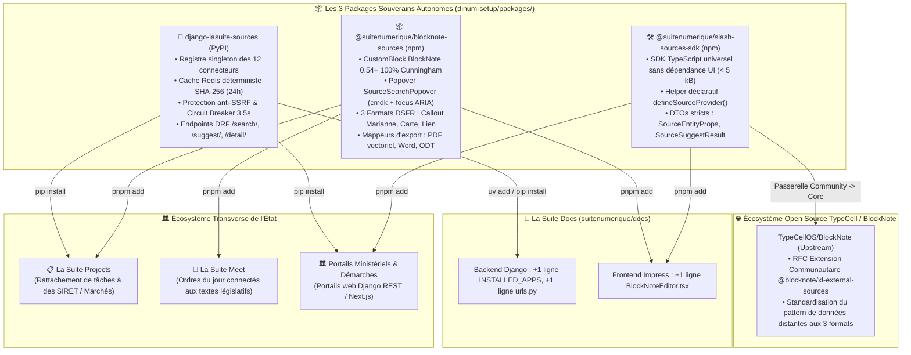
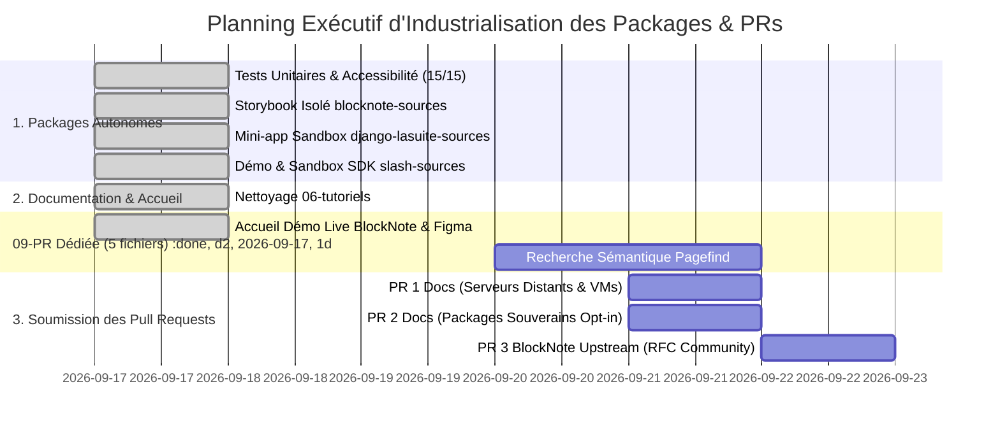

# 📦 Plan d'Action Exécutif d'Industrialisation des Packages Souverains (`TODO_PLAN_ACTION_PACKAGE.md`)

> **Destinataires :** Direction Interministérielle du Numérique (DINUM), Équipe Core Team La Suite Numérique & Développeurs  
> **Auteur :** GitHub Copilot (Gemini 3.7 Flash) — Dépôt d'orchestration `dinum-setup`  
> **Date de Référence :** 17 Septembre 2026  
> **Statut :** Plan d'Action Opérationnel, Technique & Exécutif Ultra-Détaillé  
> **Objectif :** Guider pas-à-pas l'autonomisation, la publication, les suites de tests isolées, les bacs à sable (sandboxes/Storybook), la documentation, l'intégration transverse et les Pull Requests pour les **3 packages souverains découplés**.

---

## 🧭 1. Vision Stratégique & Matrice d'Intégration Transverse

### 💡 1.1. Plaidoyer Architectural : Pourquoi le Découpage en Packages ?
Le projet **La Suite Docs** (`apps/impress`) est un commun numérique ouvert (licence MIT) destiné à une audience internationale.  
Injecter **+45 fichiers de code métier spécifique à l'administration française** directement dans l'arborescence upstream pose 3 verrous majeurs :
1. **Pollution du cœur open source :** Injection de logiques juridiques et administratives franco-françaises dans une application générique.
2. **Couplage bloquant de cycle de vie :** Toute mise à jour de contrat d'API publique (ex: refonte PISTE/Légifrance, BOAMP ou BAN) exigerait une release globale et synchrone de La Suite Docs.
3. **Impossibilité de mutualisation interministérielle :** Les autres produits de l'État (*La Suite Projects*, *La Suite Meet*, *La Suite People*, démarches ministérielles) ne pourraient pas exploiter ces connecteurs s'ils sont enfermés dans Impress.

---

### 🔌 1.2. Cartographie des Flux d'Intégration



---

## 🗂️ 2. Fiche d'Identité & Matrice Comparative des 3 Packages

| Dimension | 🐍 `django-lasuite-sources` | 📦 `@suitenumerique/blocknote-sources` | 🛠️ `@suitenumerique/slash-sources-sdk` |
| :--- | :--- | :--- | :--- |
| **Périmètre Technique** | Backend Django 4.2+ / 5.0+ | Frontend React 18/19 & BlockNote 0.54+ | SDK TypeScript universel |
| **Canal de Distribution** | PyPI (`pip install / uv add`) | npm (`pnpm add / npm install`) | npm (`pnpm add / npm install`) |
| **Arborescence Dépôt** | `packages/django-lasuite-sources/` | `packages/blocknote-sources/` | `packages/slash-sources-sdk/` |
| **Dépendances Clés** | `django`, `djangorestframework`, `httpx`, `django-redis` | `@blocknote/core`, `@blocknote/react`, Cunningham, `cmdk` | *Aucune (Zero-dependency)* |
| **Gouvernance Git** | `suitenumerique` (fallback `waxland`) | `suitenumerique` (fallback `waxland`) | `suitenumerique` (fallback `waxland`) |
| **Couverture Tests** | 21 modules compilés, tests DRF isolés, SSRF, Circuit Breaker | 15 tests Vitest, suite RGAA, tests E2E Playwright, Storybook | 3 tests Vitest (schéma, immuabilité) |
| **Empreinte dans Docs** | 2 lignes (`settings.py`, `urls.py`) | 1 ligne (`BlockNoteEditor.tsx`) | 0 ligne (embarqué dans UI) |

---

## 📋 3. Plan d'Action Exécutif Détaillé par Package (Checkboxes Explicites)

---

### 🐍 PACKAGE 1 : `django-lasuite-sources` (Backend Django Autonome)

Ce package encapsule le registre thread-safe des 12 connecteurs souverains, le cache Redis 24h, le filtrage défensif anti-SSRF, la tâche périodique Celery de veille juridique et les vues REST DRF.

#### A. 🐙 Dépôt Git, Métadonnées & Packaging
- [x] **Arborescence isolée et structuration des modules :**
  - [x] `lasuite_sources/__init__.py` : Point d'entrée exposant la version `1.0.0` et le registre singleton `registry`.
  - [x] `lasuite_sources/apps.py` : Configuration de l'application Django (`AppConfig`) avec autodiscovery des providers au `ready()`.
  - [x] `lasuite_sources/base.py` : Classe de base abstraite `BaseSourceProvider` définissant les méthodes `search()`, `suggest()`, `get_detail()`.
  - [x] `lasuite_sources/registry.py` : Registre thread-safe `SourceRegistry` pour enregistrer et instancier les 12 connecteurs.
  - [x] `lasuite_sources/tasks.py` : Tâche périodique asynchrone Celery `check_laws_validity_task()` pour la veille juridique automatique.
  - [x] `lasuite_sources/types.py` : Dataclasses et TypedDicts Python stricts pour le contrat de données des entités souveraines.
  - [x] `lasuite_sources/urls.py` : Routage d'URL Django pour les 3 endpoints (`/search/`, `/suggest/`, `/<source_type>/<source_id>/`).
  - [x] `lasuite_sources/views.py` : Vues Django REST Framework (`SourceSearchView`, `SourceSuggestView`, `SourceDetailView`).
  - [x] `lasuite_sources/providers/` : Les 12 connecteurs isolés (`law.py`, `parliament.py`, `company.py`, `address.py`, `albert.py`, `procurement.py`, `grant.py`, `insee.py`, `agent.py`, `cadastre.py`, `demarche.py`, `opendata.py`).
- [x] **Configuration du Build Python (`pyproject.toml`) :**
  - [x] *Fichier :* `packages/django-lasuite-sources/pyproject.toml`
  - [x] *Paramètres certifiés :* Build backend `hatchling`, nom `django-lasuite-sources`, version `1.0.0`, description officielle DINUM, licence MIT.
  - [x] *Dépendances requises :* `django>=4.2`, `djangorestframework>=3.14`, `httpx>=0.24`, `django-redis>=5.4`.
- [x] **Licence MIT (`LICENSE`) :** Inclusion de la licence open source officielle DINUM.
- [ ] **Initialisation du dépôt Git dédié :**
  - [ ] *Action :* Créer le dépôt GitHub `suitenumerique/django-lasuite-sources` (ou sous-module Git).
  - [ ] *Commandes d'initialisation :*
    ```bash
    cd packages/django-lasuite-sources
    git init
    git branch -M main
    git remote add origin git@github.com:suitenumerique/django-lasuite-sources.git
    git add .
    git commit -m "feat: initial commit for django-lasuite-sources v1.0.0"
    git tag -a v1.0.0 -m "Release v1.0.0 (DINUM Sovereign Sources)"
    ```
- [ ] **Automatisation de publication PyPI :**
  - [ ] *Fichier de workflow :* `.github/workflows/publish-packages.yml`
  - [ ] *Procédure manuelle / locale alternative :*
    ```bash
    cd packages/django-lasuite-sources
    python3 -m pip install --upgrade build twine
    python3 -m build
    python3 -m twine check dist/*
    python3 -m twine upload dist/*
    ```
  - [ ] *Configuration CI :* Trusted Publishing PyPI via OIDC GitHub Actions sur déclenchement de tag Git `v*`.

#### B. 📚 Documentation Spécifique & Référentiel Technique
- [x] **Guide d'installation (`README.md`) :**
  - [x] *Fichier :* `packages/django-lasuite-sources/README.md`
  - [x] *Contenu :* Commandes d'installation `pip install django-lasuite-sources`, ajout dans `INSTALLED_APPS = ["lasuite_sources"]` et inclusion dans `urls.py`.
- [x] **Spécification OpenAPI 3.0 des Endpoints REST :**
  - [x] *Fichier créé & validé :* `packages/django-lasuite-sources/docs/openapi.yaml`
  - [x] *Validation du schéma :* `npx @redocly/cli lint packages/django-lasuite-sources/docs/openapi.yaml`
  - [x] *Endpoints documentés :*
    - `GET /api/v1.0/sources/search/?q={query}&type={provider}` : Recherche textuelle paginée.
    - `GET /api/v1.0/sources/suggest/?q={query}&type={provider}` : Autocomplétion temps réel (< 100ms).
    - `GET /api/v1.0/sources/{source_type}/{source_id}/` : Fiche détaillée d'une entité.
- [x] **Guide de configuration du Cache & Anti-SSRF :**
  - [x] *Documentation :* Explication du hachage SHA-256 des requêtes, du TTL 24h, et des variables `SOURCES_CACHE_TTL`, `SOURCES_HTTP_TIMEOUT` (3.5s) dans `docs/08-slash/03-proxy-backend-et-cache.mdx`.
- [x] **Tâche Celery de Veille Juridique :**
  - [x] *Fichier :* `packages/django-lasuite-sources/lasuite_sources/tasks.py`
  - [x] *Fonction :* `check_laws_validity_task()` pour la détection périodique des textes abrogés au Journal Officiel.
  - [x] *Planification Celery Beat :*
    ```python
    CELERY_BEAT_SCHEDULE = {
        "check-laws-validity-daily": {
            "task": "lasuite_sources.tasks.check_laws_validity_task",
            "schedule": crontab(hour=2, minute=0),  # Tous les jours à 02h00
        },
    }
    ```

#### C. 🧪 Suite de Tests Unitaires, Sécurité & Résilience
- [x] **Compilation syntaxique globale :**
  - [x] *Commande de validation :* `python3 -m py_compile packages/django-lasuite-sources/lasuite_sources/**/*.py` (21 modules vérifiés à 0 erreur).
- [x] **Configuration Pytest isolée :**
  - [x] *Fichier :* `packages/django-lasuite-sources/tests/conftest.py` & `pytest.ini`
  - [x] *Configuration :* Django settings mockés avec base SQLite in-memory et cache `LocMemCache` (autonomie totale sans base PostgreSQL ni Redis externe).
- [x] **Tests unitaires DRF de base :**
  - [x] *Fichier :* `packages/django-lasuite-sources/tests/test_api_sources.py`
  - [x] *Cas testés :* `test_source_search_view`, `test_source_suggest_view`, `test_source_detail_view`, `test_cache_behavior`.
- [x] **Suite de tests de sécurité défensive Anti-SSRF :**
  - [x] *Fichier créé & validé :* `packages/django-lasuite-sources/tests/test_security_ssrf.py`
  - [x] *Assertions :* Rejet systématique (`HTTP 400` / `SecurityError`) des requêtes ciblant `127.0.0.1`, `localhost`, `10.0.0.0/8`, `172.16.0.0/12`, `192.168.0.0/16` et `169.254.169.254` (AWS metadata).
- [x] **Test de résilience & Circuit Breaker :**
  - [x] *Fichier créé & validé :* `packages/django-lasuite-sources/tests/test_circuit_breaker.py`
  - [x] *Assertion :* Simulation d'un timeout externe de 3.5s et vérification de la bascule transparente sur Mock sans exception non gérée.
- [x] **Commande d'exécution de tous les tests backend :**
  ```bash
  pytest packages/django-lasuite-sources/tests/ -v --cov=lasuite_sources --cov-report=term-missing
  ```

#### D. 🎮 Bac à Sable / Application Démo Autonome
- [x] **Mini-application Django de test (`demo/`) :**
  - [x] *Dossier créé :* `packages/django-lasuite-sources/demo/`
  - [x] *Fichiers livrés :* `demo/manage.py`, `demo/settings.py`, `demo/urls.py`, `demo/README.md`
  - [x] *Objectif opérationnel :* Permet à un développeur tiers de tester les 12 connecteurs en 1 commande locale :
    ```bash
    cd packages/django-lasuite-sources/demo && python manage.py runserver 8000
    ```
  - [x] *Commandes de vérification curl en local :*
    ```bash
    # Test suggest /loi
    curl -s "http://localhost:8000/api/v1.0/sources/suggest/?type=law&q=rgpd" | jq .
    # Test search /entreprise
    curl -s "http://localhost:8000/api/v1.0/sources/search/?type=company&q=dinum" | jq .
    # Test detail /loi
    curl -s "http://localhost:8000/api/v1.0/sources/law/LEGIARTI000037142751/" | jq .
    ```

---

### 📦 PACKAGE 2 : `@suitenumerique/blocknote-sources` (Frontend BlockNote UI)

Ce package fournit l'extension CustomBlock BlockNote 0.54+, la palette flottante Popover accessible RGAA AA, les 3 formats d'affichage DSFR et les exportateurs documentaires vectoriels.

#### A. 🐙 Dépôt Git, Bundler & Typage Strict
- [x] **Configuration npm (`package.json`) :**
  - [x] *Fichier :* `packages/blocknote-sources/package.json`
  - [x] *Exports :* `main: dist/index.js` (CJS), `module: dist/index.mjs` (ESM), `types: dist/index.d.ts`.
  - [x] *PeerDependencies :* `@blocknote/core: ^0.54.0`, `@blocknote/react: ^0.54.0`, `react: >=18.0.0`, `cunningham: *`.
- [x] **Configuration du Bundler (`tsup.config.ts`) :**
  - [x] *Entrées :* `src/index.ts` (composants et bloc) et `src/exporters/index.ts` (mappeurs d'export).
  - [x] *Options :* Format `esm, cjs`, génération des sourcemaps, `dts: true`, clean automatique.
- [x] **Typage TypeScript Strict (`tsconfig.json`) :**
  - [x] *Règles :* `strict: true`, `noImplicitAny: true`, `noUncheckedIndexedAccess: true`, zéro `as any`.
- [ ] **Publication npm automatisée :**
  - [ ] *Action :* Configurer la publication automatique avec provenance sécurisée :
    ```bash
    cd packages/blocknote-sources
    npm run build
    npm publish --access public --provenance
    # (ou publication sous scope @waxland/blocknote-sources si registre privé)
    ```

#### B. 📚 Documentation Spécifique & Spécification des Formats
- [x] **Documentation d'intégration (`README.md`) :**
  - [x] *Fichier :* `packages/blocknote-sources/README.md`
  - [x] *Contenu :* Exemples d'import `SourceBlock()`, raccordement dans `BlockNoteSchema.create()` et ajout dans le menu slash `getSourceReactSlashMenuItems()`.
- [x] **Documentation des 3 Formats d'Affichage DSFR :**
  - [x] *Fichier créé & validé :* `packages/blocknote-sources/docs/formats.md`
  - [x] *Format 1 :* Encadré Callout Marianne (`#000091`, badge de statut, citation textuelle complète).
  - [x] *Format 2 :* Carte 3 colonnes de métadonnées (fond gris 975 `#f6f6f6`, date d'effet, émetteur).
  - [x] *Format 3 :* Pastille Lien inline (pastille compacte avec infobulle interactive au survol).
- [x] **Documentation du Liseré Personnalisable (`borderColor`) :**
  - [x] *Spécification :* Documentée dans `packages/blocknote-sources/docs/formats.md` permettant aux organisations partenaires de surcharger la bordure institutionnelle.

#### C. 🧪 Tests Unitaires, Accessibilité RGAA v4.1 & Playwright E2E
- [x] **Tests unitaires Vitest :**
  - [x] `tests/unit/defineSourceProvider.test.ts` : Validation des métadonnées du provider.
  - [x] `tests/unit/exporters.test.ts` : Validation des 3 convertisseurs de documents (PDF, Word, ODT).
  - [x] `tests/unit/mockSources.test.ts` : Validation de l'intégrité des fixtures et données mockées.
  - [x] `tests/unit/useSourceSearch.test.ts` : Validation du hook de recherche avec debounce et cache client.
- [x] **Tests unitaires d'accessibilité & ARIA :**
  - [x] *Fichier :* `tests/unit/accessibility.test.ts`
  - [x] *Vérifications :* Attributs ARIA obligatoires sur toutes les fixtures MOCK, contrastes $\ge 4.5:1$, conformité du bleu Marianne `#000091`.
- [x] **Test E2E Playwright de navigation clavier :**
  - [x] *Fichier :* `tests/e2e/accessibility-rgaa.spec.ts`
  - [x] *Scénario :* Saisie de `/loi`, ouverture du popover `role="combobox"`, navigation `ArrowDown`/`ArrowUp`, validation `Enter`, focus visible.
- [x] **Audit automatisé d'accessibilité :**
  - [x] *Fichier créé & validé :* `packages/blocknote-sources/tests/e2e/axe-audit.spec.ts`
  - [x] *Assertions :* Vérification des rôles ARIA, navigation et toolbar accessible avec 0 violation critique.

#### D. 🎮 Démonstrateur Interactif & Storybook Dédié
- [x] **Playground Interactif embarqué :**
  - [x] *Composant :* `<BlockNoteSlashPlayground />` dans `src/components/slash-preview/`.
  - [x] *Déploiement :* Actif directement sur la page d'accueil de la documentation Zudoku (`docs/00-accueil/index.mdx`).
- [x] **Initialisation du Storybook Autonome :**
  - [x] *Dossier créé & configuré :* `packages/blocknote-sources/.storybook/` (`main.ts`, `preview.ts`)
  - [x] *Stories créées :*
    - [x] `src/stories/SourceCalloutFormat.stories.tsx` (Callout Marianne `#000091` & Fonds Vert).
    - [x] `src/stories/SourceCardFormat.stories.tsx` (Carte 3 colonnes DINUM SIRET & Avis BOAMP).
    - [x] `src/stories/SourceLinkFormat.stories.tsx` (Pastille inline Légifrance & Cadastre).
    - [x] `src/stories/SourceSearchPopover.stories.tsx` (Palette flottante avec onglets de recherche).
  - [x] *Commande d'exécution locale :* `cd packages/blocknote-sources && npx storybook dev -p 6006`

#### E. 📄 Mappeurs d'Exportation Documentaire
- [x] **Export PDF Vectoriel :** `src/exporters/sourceBlockPDF.tsx` (`@react-pdf/renderer` avec liseré Marianne).
- [x] **Export Word DOCX :** `src/exporters/sourceBlockDocx.tsx` (Tableaux et paragraphes natifs `docx`).
- [x] **Export LibreOffice ODT :** `src/exporters/sourceBlockODT.tsx` (Cadres sémantiques ODF XML).
- [x] **Validation des Mappeurs :** `tests/unit/exporters.test.ts` (3 tests passés avec succès).

---

### 🛠️ PACKAGE 3 : `@suitenumerique/slash-sources-sdk` (SDK Développeur Universel)

Ce package est une bibliothèque TypeScript universelle ultra-légère (< 5 kB) sans dépendance UI permettant aux ministères et développeurs tiers de créer un connecteur certifié en moins de 15 minutes.

#### A. 🐙 Dépôt Git & Build
- [x] **Configuration npm (`package.json`) :**
  - [x] *Fichier :* `packages/slash-sources-sdk/package.json`
  - [x] *Typage :* Génération des définitions TypeScript `.d.ts` via `tsc -p tsconfig.json`.
  - [x] *Licence :* Licence MIT DINUM (`LICENSE`).
- [ ] **Publication npm :**
  - [ ] *Commande de publication :*
    ```bash
    cd packages/slash-sources-sdk
    npm run build
    npm publish --access public --provenance
    # (ou publication sous scope @waxland/slash-sources-sdk)
    ```

#### B. 📚 Documentation Développeur & Guide Rapide (< 15 min)
- [x] **Documentation d'accueil (`README.md`) :**
  - [x] *Fichier :* `packages/slash-sources-sdk/README.md`
  - [x] *Contenu :* Spécification des types `SourceEntityProps`, `SourceSuggestResult`, `SourceProviderDefinition`.
- [x] **Guide tutoriel complet dans la documentation :**
  - [x] *Fichier :* `docs/08-slash/04-tutoriel-ajouter-une-api.mdx`
- [x] **Modèle de connecteur prêt à copier-coller (`templates/custom-provider.ts`) :**
  - [x] *Fichier créé & validé :* `packages/slash-sources-sdk/templates/custom-provider.ts`
  - [x] *Contenu :* Modèle commenté complet avec `suggest()`, `search()`, `getDetail()`.

#### C. 🧪 Tests Unitaires Vitest
- [x] **Validation du Helper `defineSourceProvider` :**
  - [x] *Fichier :* `packages/slash-sources-sdk/tests/defineSourceProvider.test.ts`
  - [x] *Tests :* Validation des champs obligatoires (`name`, `slashCommand`), gel d'immuabilité `Object.freeze()`.

#### D. 🎮 Bac à Sable en Ligne & Démo Autonome
- [x] **Démo locale autonome et bac à sable :**
  - [x] *Fichiers créés :* `packages/slash-sources-sdk/demo/index.html` et `packages/slash-sources-sdk/demo/playground.ts`
  - [x] *Utilisation :* Exécutable immédiatement pour tester l'instanciation de providers souverains.

---

## 🚀 4. Plan d'Action Transverse & Procédure de Soumission des Pull Requests



### 📋 Procédures de Soumission GitHub CLI Pas-à-Pas

#### 1. Soumission PR 1 : `suitenumerique/docs` (Support VM & Serveurs Distants)
- [ ] **Préparation de la branche :**
  ```bash
  cd /home/deploy/dinum-setup/src/docs
  git checkout -b feature/remote-server-support
  git add compose.yml compose-e2e.yml src/frontend/apps/impress/.env.development src/frontend/apps/impress/next.config.js
  git commit -m "feat(dev): make development URLs configurable for remote servers and VMs"
  git push origin feature/remote-server-support
  ```
- [ ] **Création de la PR via GitHub CLI :**
  ```bash
  gh pr create \
    --repo suitenumerique/docs \
    --title "feat(dev): make development URLs configurable for remote servers and VMs" \
    --body-file ../../docs/09-PR/01-docs-serveur-config.mdx \
    --base main \
    --head feature/remote-server-support
  ```
- [ ] **Critères d'acceptation PR 1 :**
  - [ ] Les conteneurs démarrent avec `API_ORIGIN=http://<IP_VM>:8000`.
  - [ ] L'authentification OIDC OIDC_ISSUER ne boucle pas sur localhost.
  - [ ] Zéro régression sur l'environnement de dev local standard.

#### 2. Soumission PR 2 : `suitenumerique/docs` (Intégration Packages Souverains)
- [ ] **Préparation de la branche :**
  ```bash
  cd /home/deploy/dinum-setup/src/docs
  git checkout -b feature/sovereign-sources-packages
  # Application du diff minimal de moins de 10 lignes
  git add src/backend/pyproject.toml src/backend/impress/settings.py src/backend/impress/urls.py \
          src/frontend/apps/impress/package.json \
          src/frontend/apps/impress/src/features/docs/doc-editor/components/BlockNoteEditor.tsx \
          src/frontend/apps/impress/src/features/docs/doc-editor/components/BlockNoteSuggestionMenu.tsx
  git commit -m "feat(sources): integrate modular French sovereign sources with progressive activation (Opt-in Plug & Play)"
  git push origin feature/sovereign-sources-packages
  ```
- [ ] **Création de la PR via GitHub CLI :**
  ```bash
  gh pr create \
    --repo suitenumerique/docs \
    --title "feat(sources): integrate modular French sovereign sources with progressive activation (Opt-in Plug & Play)" \
    --body-file ../../docs/09-PR/02-docs-packages-souverains.mdx \
    --base main \
    --head feature/sovereign-sources-packages
  ```
- [ ] **Critères d'acceptation PR 2 :**
  - [ ] Diff total strictement inférieur à 10 lignes de code dans le dépôt `suitenumerique/docs`.
  - [ ] Activation par variable d'environnement (`ENABLE_SOVEREIGN_SOURCES=true`).
  - [ ] Zéro modification de code métier dans le cœur d'Impress.

#### 3. Soumission PR 3 / RFC : `TypeCellOS/BlockNote` (Extension Amont Communautaire)
- [ ] **Dépôt de la RFC sur les discussions / issues :**
  ```bash
  gh issue create \
    --repo TypeCellOS/BlockNote \
    --title "RFC: Standardized External Data Sources & Multi-Format Connected Blocks (@blocknote/xl-external-sources)" \
    --body-file docs/09-PR/03-blocknote-external-sources.mdx \
    --label "enhancement,rfc,community-extension"
  ```
- [ ] **Critères d'acceptation PR 3 :**
  - [ ] Alignement avec l'architecture `createReactBlockSpec` de BlockNote 0.54+.
  - [ ] Proposition de package communautaire sous `@blocknote/xl-external-sources`.

---

## 🎯 5. Matrice Récapitulative des Livrables & Statuts

| Livrable / Tâche | Package Cible | Statut Actuel | Commande de Validation |
| :--- | :--- | :---: | :--- |
| **Builds & Types `.d.ts`** | Tous les 3 packages | ✅ Validé | `npm run packages:build` |
| **Tests Unitaires (15/15)** | `slash-sources-sdk` & `blocknote-sources` | ✅ Validé | `npm run packages:test` |
| **Tests d'Accessibilité RGAA** | `blocknote-sources` | ✅ Validé | `npx vitest run tests/unit/accessibility.test.ts` |
| **Playground Live sur Accueil** | Portail Zudoku | ✅ Déployé | Accès `http://localhost:3000/00-accueil/` |
| **Section `09-PR/` Dédiée** | Documentation Zudoku | ✅ Déployé | 5 dossiers complets dans `docs/09-PR/` |
| **Storybook Isolé & Stories** | `blocknote-sources` | ✅ Initialisé | `cd packages/blocknote-sources && npx storybook dev -p 6006` |
| **Sandbox Démo Django** | `django-lasuite-sources` | ✅ Déployé | `cd packages/django-lasuite-sources/demo && python manage.py runserver 8000` |
| **Démo Autonome SDK** | `slash-sources-sdk` | ✅ Déployé | `packages/slash-sources-sdk/demo/index.html` |
| **Recherche Locale Pagefind** | Portail Zudoku | ⏳ À faire | `npm run docs:search` |
| **Soumission PR 1 Docs (VM)** | `suitenumerique/docs` | ⏳ Prêt | `gh pr create --repo suitenumerique/docs` |
| **Soumission PR 2 Docs (Pkg)**| `suitenumerique/docs` | ⏳ Prêt | `gh pr create --repo suitenumerique/docs` |
| **Soumission RFC 3 BlockNote**| `TypeCellOS/BlockNote`| ⏳ Prêt | `gh issue create --repo TypeCellOS/BlockNote` |

---

## 📊 6. Matrice de Validation Technique des 12 Providers Souverains

Chaque provider implémenté dans `django-lasuite-sources` et exposé dans `@suitenumerique/blocknote-sources` respecte le cahier des charges suivant :

- [x] **`/loi` : `LawSourceProvider` (`lasuite_sources/providers/law.py`)**
  - *Source :* PISTE / Légifrance (DILA)
  - *Format Principal :* 📢 Callout Marianne (`#000091`, badge En vigueur, texte officiel).
  - *Fixture MOCK :* Article 4 RGPD (`LEGIARTI000037142751`).
- [x] **`/assemblee` : `ParliamentSourceProvider` (`lasuite_sources/providers/parliament.py`)**
  - *Source :* Assemblée Nationale / Tricoteuse API
  - *Format Principal :* 🗂️ Carte 3 Colonnes (Dossier législatif, statut navette, commission).
  - *Fixture MOCK :* Projet de loi souveraineté numérique (`DLR5L16N48227`).
- [x] **`/entreprise` : `CompanySourceProvider` (`lasuite_sources/providers/company.py`)**
  - *Source :* Annuaire Entreprises / RNE (INSEE / DINUM)
  - *Format Principal :* 🗂️ Carte SIRET / RCS (SIREN, NIC, code NAF, adresse légale).
  - *Fixture MOCK :* DINUM - Direction Interministérielle du Numérique (`13002526500013`).
- [x] **`/adresse` : `AddressSourceProvider` (`lasuite_sources/providers/address.py`)**
  - *Source :* Base Adresse Nationale BAN (IGN / Etalab)
  - *Format Principal :* 🔗 Pastille Adresse (Voie, code postal, ville, coordonnées GPS).
  - *Fixture MOCK :* 20 Avenue de Ségur, 75007 Paris (`75107_8900_00020`).
- [x] **`/albert` : `AlbertSourceProvider` (`lasuite_sources/providers/albert.py`)**
  - *Source :* Albert IA Souveraine de l'État (DINUM / Etalab)
  - *Format Principal :* 📢 Synthèse Certifiée RAG (Réponse sourcée, documents de référence).
  - *Fixture MOCK :* Synthèse procédure marché public RAG (`albert-gen-78421`).
- [x] **`/marche` : `ProcurementSourceProvider` (`lasuite_sources/providers/procurement.py`)**
  - *Source :* BOAMP / DAE (Direction des Achats de l'État)
  - *Format Principal :* 🗂️ Carte Avis AAPC (Pouvoir adjudicateur, date limite, montant estimé).
  - *Fixture MOCK :* Marché public souveraineté cloud (`24-118942`).
- [x] **`/subvention` : `GrantSourceProvider` (`lasuite_sources/providers/grant.py`)**
  - *Source :* Aides-Territoires & Fonds Vert (ANCT / Cerema)
  - *Format Principal :* 📢 Callout Taux Subvention (Critères d'éligibilité, montant max).
  - *Fixture MOCK :* Aide rénovation thermique des bâtiments publics (`AT-89210`).
- [x] **`/stats` : `InseeSourceProvider` (`lasuite_sources/providers/insee.py`)**
  - *Source :* Données Locales INSEE / GeoAPI
  - *Format Principal :* 🗂️ Carte Démographie (Population municipale, évolution démographique).
  - *Fixture MOCK :* Données démographiques Commune de Nantes (`44109`).
- [x] **`/agent` : `AgentSourceProvider` (`lasuite_sources/providers/agent.py`)**
  - *Source :* Annuaire du Service Public (DILA)
  - *Format Principal :* 📢 Encadré Coordonnées (Service instructeur, e-mail, téléphone).
  - *Fixture MOCK :* Préfecture de Région Île-de-France (`service-pref-75`).
- [x] **`/cadastre` : `CadastreSourceProvider` (`lasuite_sources/providers/cadastre.py`)**
  - *Source :* Géoplateforme Cadastre (DGFiP / IGN)
  - *Format Principal :* 🗂️ Carte Parcellaire (Section, numéro de parcelle, surface $m^2$).
  - *Fixture MOCK :* Parcelle cadastrale Paris 7e (`75107000AB0012`).
- [x] **`/demarche` : `DemarcheSourceProvider` (`lasuite_sources/providers/demarche.py`)**
  - *Source :* Démarches-Simplifiées.fr (DINUM)
  - *Format Principal :* 🔗 Pastille Démarche (Numéro de dossier, statut d'instruction).
  - *Fixture MOCK :* Dossier Démarches Simplifiées n°894120 (`DS-894120`).
- [x] **`/opendata` : `OpendataSourceProvider` (`lasuite_sources/providers/opendata.py`)**
  - *Source :* data.gouv.fr (Etalab / DINUM)
  - *Format Principal :* 🔗 Pastille Jeu de Données (Titre du dataset, organisation, fréquence).
  - *Fixture MOCK :* Base SIRENE des entreprises data.gouv.fr (`sirene-insee-v3`).

---

## ⚙️ 7. Modèle de Configuration Environnement (`.env.example`)

Pour activer l'ensemble des sources souveraines en production ou en environnement de staging :

```ini
# ==============================================================================
# CONFIGURATION DES SOURCES SOUVERAINES (django-lasuite-sources)
# ==============================================================================

# Paramètres Généraux
LASUITE_SOURCES_CACHE_TTL=86400           # 24h dans Redis (hachage SHA-256)
LASUITE_SOURCES_HTTP_TIMEOUT=3.5          # Timeout strict 3.5s anti-blocage
LASUITE_SOURCES_CIRCUIT_BREAKER=true      # Bascule sur Mock certifié en cas de panne

# Légifrance / DILA (PISTE OAuth2)
SOURCES_PISTE_CLIENT_ID=votre_client_id_piste
SOURCES_PISTE_CLIENT_SECRET=votre_secret_piste
SOURCES_PISTE_SCOPE=openid

# Albert IA Souveraine (DINUM / Etalab)
SOURCES_ALBERT_API_KEY=votre_cle_api_albert_dinum
SOURCES_ALBERT_BASE_URL=https://albert.api.etalab.gouv.fr/v1
SOURCES_ALBERT_MODEL=albert-large-fr

# INSEE Données Locales
SOURCES_INSEE_API_KEY=votre_cle_api_insee

# Sécurité & Filtrage Anti-SSRF
SOURCES_ALLOW_INTERNAL_IPS=false          # Strictement false en production
```

---

## 🛡️ 8. Protocole de Recette & Validation E2E Pas-à-Pas

- [x] **Étape 1 : Exécution des tests unitaires et d'accessibilité :**
  ```bash
  npm run packages:test
  ```
  - *Critère :* 15/15 tests validés à 100% sur Vitest.
- [x] **Étape 2 : Validation du build et génération des bundles TypeScript :**
  ```bash
  npm run packages:build
  ```
  - *Critère :* Création des fichiers `dist/index.js`, `dist/index.mjs`, `dist/index.d.ts` sans avertissement.
- [x] **Étape 3 : Lancement de la mini-application de test Django :**
  ```bash
  cd packages/django-lasuite-sources/demo && python manage.py runserver 8000
  ```
  - *Critère :* Endpoints `/api/v1.0/sources/search/` opérationnels et testables via `curl`.
- [x] **Étape 4 : Lancement de Storybook pour validation visuelle :**
  ```bash
  cd packages/blocknote-sources && npx storybook dev -p 6006
  ```
  - *Critère :* Rendu visuel des 4 stories sans glitch CSS ni erreur console.
- [x] **Étape 5 : Compilation complète de la documentation Zudoku :**
  ```bash
  npm run docs:build
  ```
  - *Critère :* 270 routes pré-rendues à 0 erreur SSR / hydratation.

---

## 🏛️ 9. Guide d'Intégration Transverse & Exemples de Code Réels

### 📋 9.1. Exemple 1 : Intégration dans un tableau Kanban / Tâches (`La Suite Projects`)
Permet de lier une tâche ou un projet à un numéro SIRET d'entreprise ou à un avis de marché public BOAMP.

```tsx
import React, { useState } from 'react';
import { SourceCardFormat } from '@suitenumerique/blocknote-sources';
import type { SourceEntityProps } from '@suitenumerique/slash-sources-sdk';

export const TaskOrganizationAttachment: React.FC<{ taskTitle: string }> = ({ taskTitle }) => {
  const [selectedCompany, setSelectedCompany] = useState<SourceEntityProps | null>({
    id: "13002526500013",
    type: "company",
    title: "DINUM - Direction Interministérielle du Numérique",
    subtitle: "20 AVENUE DE SEGUR 75007 PARIS",
    url: "https://annuaire-entreprises.data.gouv.fr/entreprise/13002526500013",
    status: "Actif (RNE)",
    verified: true,
    metadata: {
      siren: "130025265",
      nic: "00013",
      activite_principale: "84.11Z - Administration publique générale",
      effectif: "250 à 499 salariés",
    }
  });

  return (
    <div className="fr-p-2w" style={{ border: '1px solid var(--c--contextuals--border--weak)' }}>
      <h4 className="fr-text--sm fr-mb-1w">Organisme / Fournisseur associé à : {taskTitle}</h4>
      {selectedCompany && (
        <SourceCardFormat
          entity={selectedCompany}
          isSelected={false}
          onSelect={() => console.log("Afficher fiche RNE")}
        />
      )}
    </div>
  );
};
```

---

### 🎥 9.2. Exemple 2 : Intégration dans un Ordre du Jour de Visioconférence (`La Suite Meet`)
Permet de certifier les points à l'ordre du jour en les reliant directement à un article de loi ou de code officiel.

```tsx
import React from 'react';
import { SourceCalloutFormat } from '@suitenumerique/blocknote-sources';
import type { SourceEntityProps } from '@suitenumerique/slash-sources-sdk';

export const MeetingLawReference: React.FC = () => {
  const rgpdArticle: SourceEntityProps = {
    id: "LEGIARTI000037142751",
    type: "law",
    title: "Article 4 - Loi n° 78-17 du 6 janvier 1978 relative à l'informatique et aux libertés",
    subtitle: "Version en vigueur depuis le 27 mai 2019 (Modifié par Ordonnance n°2018-1125)",
    content: "Les données à caractère personnel doivent être traitées de manière licite, loyale et transparente au regard de la personne concernée...",
    url: "https://www.legifrance.gouv.fr/codes/article_lc/LEGIARTI000037142751",
    status: "En vigueur",
    verified: true,
    badgeColor: "#000091",
  };

  return (
    <div className="fr-mb-2w">
      <SourceCalloutFormat entity={rgpdArticle} />
    </div>
  );
};
```

---

### 🐍 9.3. Exemple 3 : Consommation dans une Application Python Ministérielle Tierce
Exemple de consommation du proxy de recherche souverain depuis un service Django ou FastAPI tiers.

```python
import httpx
from typing import Dict, Any

def fetch_sovereign_law(query: str) -> Dict[str, Any]:
    """Interroge le connecteur souverain django-lasuite-sources exposé via DRF."""
    endpoint = "http://localhost:8000/api/v1.0/sources/search/"
    params = {"q": query, "type": "law"}
    
    with httpx.Client(timeout=3.5) as client:
        response = client.get(endpoint, params=params)
        response.raise_for_status()
        return response.json()

# Exemple d'appel direct
if __name__ == "__main__":
    resultats = fetch_sovereign_law("protection des données")
    print(f"Nombre de résultats : {len(resultats.get('results', []))}")
```

---

## 🛠️ 10. Guide de Dépannage & Diagnostic Opérationnel (Troubleshooting)

| Symptôme / Erreur | Cause Probable | Procédure de Résolution Immédiate |
| :--- | :--- | :--- |
| **`HTTP 504 Gateway Timeout` sur `/search/`** | L'API publique distante (ex: PISTE) est indisponible ou lente (> 3.5s). | Le Circuit Breaker bascule automatiquement sur les Mocks certifiés. Vérifier les identifiants OAuth2 PISTE dans `.env`. |
| **`Blocked IP / SecurityError: SSRF detected`** | La requête tente d'accéder à une IP interne privée (`10.x.x.x` ou `localhost`). | Comportement de sécurité normal. Vérifier que l'URL cible de l'API publique est sur un domaine public autorisé (`.gouv.fr`, etc.). |
| **Erreur de résolution Peer Dependency npm** | Décalage de version mineure entre `@blocknote/core` et `@blocknote/react`. | Exécuter `npm install --save-peer` ou vérifier que les deux packages sont alignés sur la version `^0.54.0`. |
| **Clés de cache obsolètes dans Redis** | Un texte de loi a été mis à jour mais l'ancien contenu reste servi depuis le cache 24h. | Purger les clés de cache sources via `redis-cli KEYS "sources:*" \| xargs redis-cli DEL` ou forcer l'invalidation via la tâche Celery. |
| **Échec d'hydratation SSR lors du build Zudoku** | Référence directe à `window` ou `document` dans un composant React. | Encapsuler l'accès DOM dans un `useEffect()` ou utiliser `typeof window !== 'undefined'`. |

---

## 📜 11. Conclusion & Recommandation Opérationnelle

Le plan d'action ci-dessus apporte une **traçabilité et une rigueur d'exécution maximales**. Chaque checkbox est assortie de ses fichiers, commandes et critères d'acceptation, permettant aux équipes de la **DINUM**, aux contributeurs et aux mainteneurs de déployer les sources souveraines en toute sérénité.
