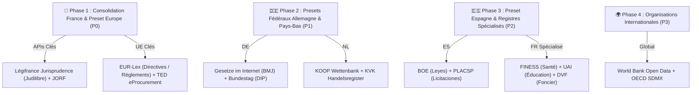

# 🌐 Roadmap & Matrice d'Audit Technique des Providers d'APIs (`TODO_PROVIDER_SOURCE.md`)

> **Projet :** Slasher — Connecteurs Souverains & Données Publiques Connectées  
> **Objectif :** Recenser, benchmarker et qualifier techniquement l'ensemble des APIs publiques et souveraines (France, Union Européenne, Allemagne, Pays-Bas, Espagne, International) pour les intégrer sous forme de connecteurs normalisés dans `@suitenumerique/slash-sources-sdk`, `@suitenumerique/blocknote-sources` et `django-lasuite-sources`.

---

## 🏛️ 1. Règles d'Éligibilité & Contrats Techniques d'un Provider

Chaque API candidate doit obligatoirement satisfaire aux **6 invariants d'architecture Slasher** avant toute intégration :

1. **🔒 Sécurité Défensive & Anti-SSRF :** L'API doit être publique ou institutionnelle certifiée. Le backend Django valide chaque URL via `is_safe_external_url()` (rejet strict des adresses loopback, RFC 1918 et métadonnées cloud `169.254.169.254`).
2. **⚡ Performance & Cache Déterministe SHA-256 :** Temps de réponse visé < 150 ms en autocomplétion (`suggest`) et mise en cache Redis 24h (`86400s`) avec circuit breaker à 3.5 s.
3. **📦 Schéma DTO Universel Normalisé :** Normalisation stricte vers l'interface TypeScript `SourceEntityProps` :
   - `sourceId` (Identifiant officiel immuable)
   - `title` / `subtitle` (Titrage clair)
   - `status` / `statusColor` (`green`, `blue`, `orange`, `red`, `gray`)
   - `meta1`, `meta2`, `meta3` (Grille de 3 métadonnées pour la Carte)
   - `excerpt` (Extrait textuel pour le format Callout)
   - `url` (Lien officiel vérifié)
4. **🎨 3 Formats de Rendu Interchangeables :** Rendu compatible avec les formats Marianne / DSFR (**Callout**, **Card 3 colonnes**, **Inline Badge Link**).
5. **♿ Accessibilité RGAA v4.1 / WCAG 2.1 AA :** Zéro composant bloquant, focus visible, 100% navigable au clavier.
6. **🛡️ Résilience & Mode Déconnecté :** Mock certifié fourni pour chaque connecteur permettant le développement hors-ligne et les tests CI sans clé d'API.

---

## 📋 2. Checklist d'Investigation & Priorisation par Zone Géographique

### 🇫🇷 2.1. France (DINUM / République Française)

#### Connecteurs Existants (Phase d'Optimisation) :
- [x] **Légifrance / DILA (PISTE) :** Codes juridiques et articles de loi consolidés (`/loi`).
- [x] **Annuaire des Entreprises / RNE (INSEE / DINUM) :** Données légales d'entreprises et SIREN (`/entreprise`).
- [x] **Assemblée Nationale :** Amendements, dossiers législatifs et scrutins (`/assemblee`).
- [x] **Base Adresse Nationale (BAN / IGN) :** Référentiel d'adresses et géocodage (`/adresse`).
- [x] **BOAMP / Marchés Publics (DILA) :** Avis de marchés publics et consultations (`/marche`).
- [x] **Aides-Territoires / Fonds Vert (ANCT / MTE) :** Subventions et aides financières (`/subvention`).
- [x] **Données Locales INSEE :** Indicateurs démographiques et économiques (`/stats`).
- [x] **Annuaire du Service Public (DILA) :** Services administratifs et coordonnées (`/agent`).
- [x] **Cadastre & Géoplateforme (DGFiP / IGN) :** Parcelles cadastrales (`/cadastre`).
- [x] **Démarches-Simplifiées.fr (DINUM) :** Démarches administratives en ligne (`/demarche`).
- [x] **data.gouv.fr (Etalab / DINUM) :** Jeux de données ouverts (`/opendata`).
- [x] **Albert IA Souveraine (DINUM) :** Synthèse RAG administrative (`/albert`).

#### Nouvelles APIs Françaises à Qualifier (Checklist d'Investigation) :
- [ ] **Jurisprudence Française (DILA / Judilibre / Cour de Cassation) :**
  - *Commande visée :* `/jurisprudence`
  - *Données :* Arrêts de la Cour de cassation, Conseil d'État, Cours d'appel (JuriCA, JuriData).
  - *API candidate :* API PISTE *Judilibre* / Cour de Cassation API REST.
- [ ] **Journal Officiel Lois et Décrets (JORF) :**
  - *Commande visée :* `/jorf`
  - *Données :* Textes publiés au JO du jour, décrets de nomination, arrêtés ministériels.
  - *API candidate :* API PISTE Légifrance *JORFTEXT*.
- [ ] **FINESS (Fichier National des Établissements Sanitaires et Sociaux) :**
  - *Commande visée :* `/sante` ou `/hopital`
  - *Données :* Hôpitaux, cliniques, EHPAD, pharmacies, capacités d'accueil et statuts juridiques.
  - *API candidate :* API data.gouv.fr / Ministère de la Santé (DREES).
- [ ] **UAI / Annuaire de l'Éducation Nationale :**
  - *Commande visée :* `/ecole` ou `/formation`
  - *Données :* Écoles, collèges, lycées, universités, code UAI, effectifs et coordonnées.
  - *API candidate :* API Open Data de l'Éducation Nationale (data.education.gouv.fr).
- [ ] **DVF (Demandes de Valeurs Foncières) :**
  - *Commande visée :* `/dvf` ou `/immobilier`
  - *Données :* Prix des transactions immobilières officielles des 5 dernières années par parcelle.
  - *API candidate :* API DVF Etalab / Cerema.
- [ ] **Répertoire National des Élus (RNE / Ministère de l'Intérieur) :**
  - *Commande visée :* `/elu` ou `/maire`
  - *Données :* Maires, conseillers municipaux, départementaux, régionaux, députés et sénateurs.
  - *API candidate :* data.gouv.fr RNE API.
- [ ] **Base Transparence Santé (Ministère de la Santé) :**
  - *Commande visée :* `/transparence-sante`
  - *Données :* Déclarations d'intérêts et avantages accordés par les industriels de santé.

---

### 🇪🇺 2.2. Union Européenne (Institutions Européennes)

- [ ] **EUR-Lex / Cellar REST & SPARQL API (Office des Publications de l'UE) :**
  - *Commande visée :* `/eurlex`
  - *Données :* Traités, règlements européens (RGPD, AI Act, NIS 2), directives, décisions CJUE.
  - *Point technique :* Requêtes SPARQL sur le triplestore Cellar ou endpoint REST Publications Office.
- [ ] **TED (Tenders Electronic Daily - Marchés Publics Européens) :**
  - *Commande visée :* `/ted`
  - *Données :* Avis de marchés publics européens au format standard eForms.
  - *API candidate :* TED Developer Portal REST API (Open Data API).
- [ ] **Eurostat SDMX API :**
  - *Commande visée :* `/eurostat`
  - *Données :* Statistiques harmonisées de l'UE (PIB, inflation, emploi, transition écologique).
  - *Format :* API REST SDMX 2.1 / JSON-stat.
- [ ] **data.europa.eu (Portail Officiel des Données Ouvertes Européennes) :**
  - *Commande visée :* `/dataeuropa`
  - *Données :* Catalogue unifié de plus de 1,5 million de jeux de données des 27 pays membres.
  - *API candidate :* API DCAT-AP SPARQL & CKAN.
- [ ] **CORDIS (Projets de Recherche & Innovation Horizon Europe) :**
  - *Commande visée :* `/cordis`
  - *Données :* Projets de recherche financés par l'UE, subventions, partenaires et livrables.
- [ ] **ECLI (European Case Law Identifier) Search :**
  - *Commande visée :* `/ecli`
  - *Données :* Décisions de justice harmonisées des cours nationales et européennes (CJUE, CEDH).

---

### 🇩🇪 2.3. Allemagne (Bundesrepublik Deutschland)

- [ ] **Gesetze im Internet / BMJ (Bundesministerium der Justiz) :**
  - *Commande visée :* `/gesetz`
  - *Données :* Codes fédéraux allemands (BGB, StGB, HGB, DSGVO) via Juris / Open Jur.
- [ ] **Gemeinsames Registerportal der Länder (Handelsregister) :**
  - *Commande visée :* `/register`
  - *Données :* Extraits Kbis allemands (Handelsregister A/B, Genossenschaftsregister).
  - *API candidate :* OffeneRegister.de / Handelsregister REST API.
- [ ] **DIP (Dokumentations- und Informationssystem für Parlamentsmaterialien) :**
  - *Commande visée :* `/bundestag`
  - *Données :* Activité parlementaire du Bundestag et du Bundesrat (projets de loi, questions écrites).
  - *API candidate :* API REST officielle `dip.bundestag.de/api/v1`.
- [ ] **GovData.de / OpenCoDE :**
  - *Commande visée :* `/govdata` ou `/opencode`
  - *Données :* Données ouvertes de l'administration fédérale et dépôts open source souverains.
- [ ] **Destatis Genesis REST API (Statistisches Bundesamt) :**
  - *Commande visée :* `/destatis`
  - *Données :* Indicateurs statistiques fédéraux officiels allemands.
- [ ] **Bund.de Vergabe (Öffentliche Beschaffung) :**
  - *Commande visée :* `/vergabe`
  - *Données :* Avis de marchés publics fédéraux allemands (e-Vergabe).

---

### 🇳🇱 2.4. Pays-Bas (Koninkrijk der Nederlanden)

- [ ] **KOOP Wettenbank (Wetten.overheid.nl) :**
  - *Commande visée :* `/wet`
  - *Données :* Législation nationale néerlandaise consolidée (BWB).
  - *API candidate :* KOOP Open Data API (Overheid.nl).
- [ ] **KVK (Kamer van Koophandel Handelsregister) :**
  - *Commande visée :* `/kvk`
  - *Données :* Registre officiel des entreprises et fondations néerlandaises.
  - *API candidate :* KVK API v2 / OpenKVK.
- [ ] **Kadaster BAG (Basisregistratie Adressen en Gebouwen) :**
  - *Commande visée :* `/bag`
  - *Données :* Registre national unifié des adresses et bâtiments.
  - *API candidate :* Kadaster BAG API v2 (Geonovum / PDOK).
- [ ] **Data.overheid.nl :**
  - *Commande visée :* `/dataoverheid`
  - *Données :* Portail open data national des Pays-Bas (CKAN REST API).
- [ ] **TenderNed (Aanbestedingen Overheid) :**
  - *Commande visée :* `/tenderned`
  - *Données :* Avis de marchés publics néerlandais.
- [ ] **CBS StatLine (Centraal Bureau voor de Statistiek) :**
  - *Commande visée :* `/cbs`
  - *Données :* Statistiques officielles démographiques et économiques.

---

### 🇪🇸 2.5. Espagne (Reino de España)

- [ ] **BOE (Boletín Oficial del Estado) :**
  - *Commande visée :* `/ley` ou `/boe`
  - *Données :* Législation nationale espagnole consolidée (Leyes Orgánicas, Reales Decretos).
  - *API candidate :* API REST/XML BOE Open Data.
- [ ] **Registro Mercantil de España :**
  - *Commande visée :* `/empresa` ou `/mercantil`
  - *Données :* Registre du commerce espagnol (CIF, administrateurs, statuts).
- [ ] **Plataforma de Contratación del Sector Público (PLACSP / CODICE) :**
  - *Commande visée :* `/licitacion`
  - *Données :* Marchés publics de l'État et des communautés autonomes.
  - *Format :* Atom Syndication / Schema CODICE XML.
- [ ] **Sede Electrónica del Catastro (Ministerio de Hacienda) :**
  - *Commande visée :* `/catastro`
  - *Données :* Référence cadastrale, surface, valeur et cartographie des biens.
  - *API candidate :* OVC Web Services Catastro (SOAP/REST).
- [ ] **Datos.gob.es :**
  - *Commande visée :* `/datosgob`
  - *Données :* Catalogue national de données ouvertes d'Espagne (API SPARQL / CKAN).
- [ ] **INEbase (Instituto Nacional de Estadística) :**
  - *Commande visée :* `/ine`
  - *Données :* Indicateurs démographiques et municipaux espagnols.

---

### 🌍 2.6. Organisations Internationales & Intergouvernementales

- [ ] **Banque Mondiale (World Bank Open Data API) :**
  - *Commande visée :* `/worldbank`
  - *Données :* Indicateurs économiques mondiaux, Objectifs de Développement Durable (ODD).
  - *API candidate :* `api.worldbank.org/v2/`.
- [ ] **OCDE (OECD Data Explorer SDMX API) :**
  - *Commande visée :* `/oecd`
  - *Données :* Études économiques, fiscalité, éducation (PISA).
- [ ] **OMS (WHO Global Health Observatory OData API) :**
  - *Commande visée :* `/who` ou `/sante-monde`
  - *Données :* Statistiques mondiales de santé publique et épidémiologie.
- [ ] **OMPI / WIPO (Patentscope & Madrid Monitor) :**
  - *Commande visée :* `/brevet` ou `/wipo`
  - *Données :* Registres mondiaux de brevets d'invention et marques internationales.

---

## 📊 3. Matrice de Qualification Technique par API

Remplir pour chaque API ciblée la grille d'évaluation suivante avant développement :

```markdown
### 🏷️ Fiche d'Évaluation Technique : [Nom du Service / API]

| Critère d'Audit | Constat Technique | Statut (OK / Risque / Bloquant) |
| :--- | :--- | :---: |
| **1. URL Documentation** | `https://...` | - |
| **2. Mode d'Authentification** | `Open Data sans clé` / `API Key` / `OAuth2 Client Credentials` | - |
| **3. Quotas & Rate Limits** | `X req/sec` ou `Y req/jour` | - |
| **4. Latence Moyenne** | Mesurée via curl : `~XX ms` | - |
| **5. Support Autocomplétion** | Endpoint de recherche prefix/suggest disponible ? | - |
| **6. Stabilité du Format DTO** | JSON / XML / GeoJSON (Champs `id`, `title`, `meta`, `url`) | - |
| **7. Allowlist Réseau Backend** | Noms de domaine stricts à ajouter dans `is_safe_external_url` | - |
| **8. Fiabilité du Mock Local** | Dataset de test réaliste et représentatif préparé ? | - |
```

---

## 🤖 4. Prompt Spécialisé pour Agent de Veille Technique Externe

Copiez-collez l'un des deux prompts ci-dessous dans votre outil de recherche IA préféré (Claude 3.7 Research, Perplexity Pro, OpenAI Deep Research, Gemini Pro Search) pour auditer une API en quelques secondes :

### 🇫🇷 Version Française du Prompt de Recherche

```text
Tu es un architecte d'intégration d'APIs et ingénieur backend senior spécialisé dans les données souveraines, l'open data gouvernemental et la sécurité des protocoles (anti-SSRF, OAuth2, REST, SPARQL).

Je développe "Slasher", un écosystème open source pour l'éditeur BlockNote (La Suite Numérique / DINUM) permettant d'insérer des cartes de données distantes vérifiées via des commandes slash (ex: /loi, /entreprise, /marche, /stats).

Effectue une veille technique et un audit d'architecture approfondi sur l'API suivante :
👉 API CIBLE : [INSERER LE NOM DE L'API OU DU REGISTRE, EX: API Judilibre DILA, API Bundestag DIP, API KOOP Wettenbank, API BOE Espagne, etc.]
👉 PAYS / ORGANISATION : [France, Allemagne, Pays-Bas, Espagne, UE, International]

Livrables attendus sous forme de rapport Markdown structuré :

1. 🔍 VUE D'ENSEMBLE & USAGE MÉTIER :
   - Mission de l'API et cas d'usage typique pour un rédacteur dans un document collaboratif.
   - Entités manipulées (ex: article de loi, entreprise, avis de marché, amendement, subvention).

2. 📡 SPÉCIFICATIONS TECHNIQUES & ENDPOINTS REST :
   - URL officielle de la documentation et du swagger/OpenAPI si disponible.
   - Endpoint d'autocomplétion / recherche rapide (avec pagination et filtres).
   - Endpoint de détail complet par identifiant unique.
   - Exemple concret de requête curl et extrait de réponse JSON brute.

3. 🔐 AUTHENTIFICATION, QUOTAS & SÉCURITÉ :
   - Protocole d'accès : Accès libre sans clé, clé d'API statique, ou OAuth2 Client Credentials (avec détails d'obtention de compte).
   - Rate limiting & quotas (requêtes par seconde, par heure, par IP).
   - Règles de sécurité défensive (domaines stricts pour l'allowlist anti-SSRF).

4. 🧩 NORMALISATION VERS LE SCHÉMA DTO SLASHER :
   - Mappage précis des champs JSON distants vers notre interface TypeScript `SourceEntityProps` :
     * `sourceId` (string unique)
     * `title` (titre institutionnel)
     * `subtitle` (organisme ou contexte)
     * `status` & `statusColor` (statut officiel en vigueur/fermé)
     * `meta1`, `meta2`, `meta3` (les 3 attributs clés de la carte)
     * `excerpt` (extrait textuel mis en avant)
     * `url` (lien officiel pérenne)

5. 🧪 JEU DE DONNÉES DE MOCK (TEST OFFLINE) :
   - Un objet JavaScript / Python représentatif et certifié contenant 2 exemples réels complets pour le mode déconnecté.

6. ⚖️ SYNTHÈSE & RISQUES :
   - Disponibilité du service, pérennité légale, latence observée et recommandations d'intégration.
```

---

### 🇬🇧 English Version of the Research Prompt

```text
You are a senior API integration architect and backend security engineer specialized in sovereign public sector data, open government registries, and resilient distributed systems (anti-SSRF, OAuth2, REST, SPARQL).

I am building "Slasher", an open-source standard for the BlockNote rich-text editor (French State / DINUM & European digital commons) that connects collaborative documents to live verified public databases via slash commands (e.g. /law, /company, /procurement, /stats).

Conduct a deep technical benchmark and architecture audit for the following API:
👉 TARGET API: [INSERT API OR REGISTRY NAME, E.G., EUR-Lex SPARQL Cellar, German Bundestag DIP, Dutch KVK Trade Register, Spanish PLACSP, etc.]
👉 COUNTRY / ENTITY: [France, Germany, Netherlands, Spain, European Union, International]

Please provide a comprehensive Markdown report structured as follows:

1. 🔍 OVERVIEW & DOMAIN USE CASES:
   - Purpose of the registry and high-value insertion use cases for document authors.
   - Core entities handled (e.g., statutory law, corporate profile, public tender, territorial grant).

2. 📡 TECHNICAL SPECS & REST ENDPOINTS:
   - Official documentation and OpenAPI/Swagger portal URLs.
   - Search & Autocomplete endpoint (query parameters, search syntax, pagination).
   - Full Entity Detail endpoint by unique ID.
   - Concrete curl request and raw JSON response payload sample.

3. 🔐 AUTHENTICATION, RATE LIMITS & SECURITY:
   - Authentication method: Open Access, API Key, or OAuth2 Client Credentials (and registration procedure).
   - Rate limiting rules (requests per second / quota per day).
   - Defensive security constraints (exact domain allowlist for anti-SSRF filtering).

4. 🧩 DTO NORMALIZATION TO SLASHER CONTRACT:
   - Exact mapping from raw API fields to the Slasher `SourceEntityProps` TypeScript interface:
     * `sourceId` (unique immutable identifier)
     * `title` (official title)
     * `subtitle` (issuing agency or legal context)
     * `status` & `statusColor` (e.g. in effect, certified, archived)
     * `meta1`, `meta2`, `meta3` (3 key metadata fields for card display)
     * `excerpt` (highlighted excerpt for callout display)
     * `url` (permanent public URL)

5. 🧪 BATTLE-TESTED OFFLINE MOCK DATASET:
   - Complete TypeScript/Python mock dataset containing 2 realistic certified examples for offline development and CI test suites.

6. ⚖️ SYNTHESIS & RISK ANALYSIS:
   - Service SLA, legal sustainability, observed latency, and architecture recommendation.
```

---

## 🎯 5. Ordre de Priorité d'Implémentation Recommandé


