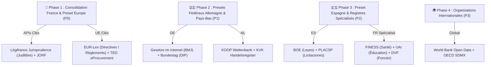

# 🌐 Roadmap & Matrice d'Audit Technique des Providers d'APIs (`TODO_PROVIDER_SOURCE.md`)

> **Projet :** Slasher — Connecteurs Souverains & Données Publiques Connectées  
> **Objectif :** Recenser, benchmarker par recherche web approfondie et qualifier techniquement l'ensemble des APIs publiques et souveraines (France, Union Européenne, Allemagne, Pays-Bas, Espagne, International) pour les intégrer sous forme de connecteurs normalisés dans `@suitenumerique/slash-sources-sdk`, `@suitenumerique/blocknote-sources` et `django-lasuite-sources`.

---

## 🏛️ 1. Règles d'Éligibilité & Contrats Techniques d'un Provider

Chaque API candidate doit obligatoirement satisfaire aux **6 invariants d'architecture Slasher** avant toute intégration :

1. **🔒 Sécurité Défensive & Anti-SSRF :** L'API doit être publique ou institutionnelle certifiée. Le backend Django valide chaque URL via `is_safe_external_url()` (rejet strict des adresses loopback, RFC 1918 et métadonnées cloud `169.254.169.254`).
2. **⚡ Performance & Cache Déterministe SHA-256 :** Temps de réponse visé < 150 ms en autocomplétion (`suggest`) et mise en cache Redis 24h (`86400s`) avec circuit breaker à 3.5 s.
3. **📦 Schéma DTO Universel Normalisé :** Normalisation stricte vers l'interface TypeScript `SourceEntityProps` :
   - `sourceId` (Identifiant officiel immuable)
   - `title` / `subtitle` (Titrage clair)
   - `status` / `statusColor` (`green`, `blue`, `orange`, `red`, `gray`, `purple`)
   - `meta1`, `meta2`, `meta3` (Grille de 3 métadonnées pour la Carte)
   - `excerpt` (Extrait textuel pour le format Callout)
   - `url` (Lien officiel vérifié)
4. **🎨 3 Formats de Rendu Interchangeables :** Rendu compatible avec les formats Marianne / DSFR (**Callout**, **Card 3 colonnes**, **Inline Badge Link**).
5. **♿ Accessibilité RGAA v4.1 / WCAG 2.1 AA :** Zéro composant bloquant, focus visible, 100% navigable au clavier.
6. **🛡️ Résilience & Mode Déconnecté :** Mock certifié fourni pour chaque connecteur permettant le développement hors-ligne et les tests CI sans clé d'API.

---

## 📋 2. Checklist d'Investigation & Priorisation par Zone Géographique

### 🇫🇷 2.1. France (DINUM / République Française)

#### Connecteurs Existants (Phase d'Optimisation) :
- [x] **Légifrance / DILA (PISTE) :** Codes juridiques et articles de loi consolidés (`/loi`).
- [x] **Annuaire des Entreprises / RNE (INSEE / DINUM) :** Données légales d'entreprises et SIREN (`/entreprise`).
- [x] **Assemblée Nationale :** Amendements, dossiers législatifs et scrutins (`/assemblee`).
- [x] **Base Adresse Nationale (BAN / IGN) :** Référentiel d'adresses et géocodage (`/adresse`).
- [x] **BOAMP / Marchés Publics (DILA) :** Avis de marchés publics et consultations (`/marche`).
- [x] **Aides-Territoires / Fonds Vert (ANCT / MTE) :** Subventions et aides financières (`/subvention`).
- [x] **Données Locales INSEE :** Indicateurs démographiques et économiques (`/stats`).
- [x] **Annuaire du Service Public (DILA) :** Services administratifs et coordonnées (`/agent`).
- [x] **Cadastre & Géoplateforme (DGFiP / IGN) :** Parcelles cadastrales (`/cadastre`).
- [x] **Démarches-Simplifiées.fr (DINUM) :** Démarches administratives en ligne (`/demarche`).
- [x] **data.gouv.fr (Etalab / DINUM) :** Jeux de données ouverts (`/opendata`).
- [x] **Albert IA Souveraine (DINUM) :** Synthèse RAG administrative (`/albert`).

#### Nouvelles APIs Françaises à Qualifier :
- [ ] **Jurisprudence Française (Judilibre / Cour de Cassation) :** `/jurisprudence`
- [ ] **Journal Officiel Lois et Décrets (JORF) :** `/jorf`
- [ ] **FINESS (Établissements Sanitaires et Sociaux - Santé) :** `/sante`
- [ ] **UAI / Éducation Nationale (Écoles, Universités) :** `/ecole`
- [ ] **DVF (Demandes de Valeurs Foncières - Immobilier) :** `/dvf`
- [ ] **Répertoire National des Élus (RNE Intérieur) :** `/elu`

---

### 🇪🇺 2.2. Union Européenne (Institutions Européennes)
- [ ] **EUR-Lex / Cellar REST & SPARQL :** `/eurlex` (Traités, Règlements RGPD/AI Act, Directives)
- [ ] **TED (Tenders Electronic Daily) :** `/ted` (Marchés publics européens eForms)
- [ ] **Eurostat SDMX API :** `/eurostat` (Statistiques harmonisées UE)
- [ ] **data.europa.eu API :** `/dataeuropa` (Portail unifié des données européennes)
- [ ] **CORDIS :** `/cordis` (Projets de recherche Horizon Europe)
- [ ] **ECLI Search :** `/ecli` (Jurisprudence européenne CJUE/CEDH)

---

### 🇩🇪 2.3. Allemagne (Bundesrepublik Deutschland)
- [ ] **Gesetze im Internet / BMJ (Juris) :** `/gesetz` (Législation fédérale BGB, StGB, HGB)
- [ ] **Gemeinsames Registerportal (Handelsregister) :** `/register` (Registre du commerce)
- [ ] **DIP Bundestag API :** `/bundestag` (Parlement fédéral allemand)
- [ ] **GovData.de / OpenCoDE :** `/govdata` (Portail open data et code souverain)
- [ ] **Destatis Genesis REST API :** `/destatis` (Office fédéral de la statistique)
- [ ] **Bund.de e-Vergabe :** `/vergabe` (Marchés publics fédéraux)

---

### 🇳🇱 2.4. Pays-Bas (Koninkrijk der Nederlanden)
- [ ] **KOOP Wettenbank (Overheid.nl) :** `/wet` (Législation nationale BWB)
- [ ] **KVK Handelsregister :** `/kvk` (Registre du commerce des Pays-Bas)
- [ ] **Kadaster BAG :** `/bag` (Registre national adresses et bâtiments)
- [ ] **Data.overheid.nl :** `/dataoverheid` (Open Data national)
- [ ] **TenderNed :** `/tenderned` (Marchés publics néerlandais)
- [ ] **CBS StatLine :** `/cbs` (Bureau central de la statistique)

---

### 🇪🇸 2.5. Espagne (Reino de España)
- [ ] **BOE (Boletín Oficial del Estado) :** `/ley` (Législation nationale consolidée)
- [ ] **Registro Mercantil de España :** `/empresa` (Registre du commerce)
- [ ] **PLACSP (Plataforma de Contratación del Estado) :** `/licitacion` (Marchés publics)
- [ ] **Sede Electrónica del Catastro :** `/catastro` (Registre cadastral)
- [ ] **Datos.gob.es :** `/datosgob` (Open Data national)
- [ ] **INEbase :** `/ine` (Institut national de statistique)

---

## 🤖 3. Master Prompt de Recherche Web Approfondie pour Agent Spécialisé

Copiez-collez l'intégralité du prompt ci-dessous dans votre outil d'agent de recherche web (Claude 3.7 Research, OpenAI Deep Research, Perplexity Pro, Gemini Pro Search). Il contient la spécification complète de Slasher et **l'ensemble des 12 exemples français de référence** pour guider la découverte internationale.

```text
================================================================================
PROMPT DE RECHERCHE WEB APPROFONDIE & AUDIT D'APIS SOUVERAINES INTERNATIONALES
================================================================================

Tu es un architecte d'intégration d'APIs et un ingénieur système senior spécialisé dans les données souveraines, l'open data public et la sécurité logicielle (anti-SSRF, OAuth2, REST, SPARQL, JSON:API).

CONTEXTE DU PROJET :
Je développe "Slasher", un standard open source universel pour l'éditeur de texte riche BlockNote (développé pour La Suite Numérique de l'État français / DINUM et les communs numériques européens). Slasher permet aux utilisateurs d'insérer des données distantes connectées en direct via des commandes slash (/loi, /entreprise, /marche, /stats, etc.), affichables en 3 formats permutables (Callout Marianne, Carte 3 colonnes, Badge Lien compact).

MISSION :
Tu dois effectuer une RECHERCHE WEB RÉELLE ET APPROFONDIE sur Internet pour auditer, benchmarker et cartographier les APIs officielles équivalentes dans le pays ou l'organisation cible suivante :

👉 PAYS / ORGANISATION CIBLE : [INSERER LE PAYS/ZONE : ex: Allemagne (Bund), Pays-Bas (Overheid), Espagne (Estado), Union Européenne, Royaume-Uni (GOV.UK), USA (Data.gov), ou International]
👉 DOMAINE MÉTIER VISÉ : [INSERER LE DOMAINE : ex: Législation & Droit, Registre des Entreprises, Base d'Adresses, Marchés Publics, Statistiques Officielles, Parlement & Démocratie, Cadastre & Foncier, Subventions & Aides Publiques, Open Data, IA Publique Souveraine, ou "TOUS LES DOMAINES"]

--------------------------------------------------------------------------------
RÉFÉRENTIEL TECHNIQUE : LES 12 EXEMPLES FRANÇAIS DE RÉFÉRENCE (GOLDEN BENCHMARK)
--------------------------------------------------------------------------------
Voici la structure DTO TypeScript exacte ('SourceEntityProps') et les 12 connecteurs français déjà implémentés qui te servent de modèle de comparaison :

```typescript
export interface SourceEntityProps {
  sourceId: string;       // Identifiant officiel unique (ex: LEGIARTI000037812976, SIREN 130025265)
  entityType: string;     // Type: 'law' | 'company' | 'parliament' | 'address' | 'procurement' | 'grant' | 'insee' | 'agent' | 'cadastre' | 'demarche' | 'opendata' | 'custom'
  displayMode: 'callout' | 'card' | 'link';
  title: string;          // Titre principal affiché
  subtitle?: string;      // Sous-titre ou autorité émettrice
  status?: string;        // Statut textuel (ex: 'En vigueur', 'Actif', 'Candidatures ouvertes')
  statusColor?: 'green' | 'blue' | 'orange' | 'red' | 'gray' | 'purple';
  meta1?: string;         // Attribut clé 1 pour la carte (ex: 'SIREN : 130 025 265')
  meta2?: string;         // Attribut clé 2 pour la carte (ex: 'NAF : 84.11Z')
  meta3?: string;         // Attribut clé 3 pour la carte (ex: 'Effectif : 250+ agents')
  excerpt?: string;       // Extrait in extenso pour le format Callout
  summary?: string;       // Résumé synthétique
  url?: string;           // Lien hypertexte officiel vers la plateforme publique
  verifiedAt?: string;    // Date de vérification / synchronisation
}
```

Voici les 12 implémentations concrètes en France (à reproduire pour le pays cible) :
1. ⚖️ Loi (/loi) : Légifrance (API PISTE) -> ID: LEGIARTI000037812976, Title: "Article L. 111-1 du Code de la commande publique", Status: "En vigueur" (green), Meta: [ID, Ref Ordonnance, Date effet], Excerpt: Définition du marché public.
2. 🏢 Entreprise (/entreprise) : Annuaire Entreprises / RNE (INSEE) -> ID: 13002526500013, Title: "Direction Interministérielle du Numérique", Status: "Actif" (green), Meta: [SIREN, Code NAF, Effectif].
3. 🏛️ Parlement (/assemblee) : Assemblée Nationale -> ID: AN-17-PJL-542-AMD-42, Title: "Amendement n° 42 au Projet de Loi Souveraineté", Status: "Adopté" (green), Meta: [Rapporteur, Séance, Scrutin public].
4. 📍 Adresse (/adresse) : Base Adresse Nationale (BAN IGN) -> ID: ADR-75107-0020, Title: "20 avenue de Ségur, 75007 Paris", Status: "BAN Certifiée" (green), Meta: [Code INSEE, Coordonnées GPS, Score 0.98].
5. 🛍️ Marchés (/marche) : BOAMP (DILA) -> ID: BOAMP-26-042819, Title: "Fourniture hébergement SecNumCloud", Status: "Offres ouvertes" (blue), Meta: [AAPC n°, Type procédure, Date clôture].
6. 💶 Subvention (/subvention) : Aides-Territoires / Fonds Vert (ANCT) -> ID: AIDE-ANCT-FV-2026, Title: "Fonds Vert — Rénovation énergétique", Status: "Ouvert" (green), Meta: [Financeur, Taux max 80%, Date limite].
7. 📊 Stats (/stats) : INSEE Données Locales -> ID: INSEE-COM-75056, Title: "Chiffres clés Ville de Paris", Status: "Certifié INSEE" (blue), Meta: [Population, Densité, Nombre emplois].
8. 👤 Annuaire (/agent) : Service-Public DILA -> ID: AGENT-DINUM, Title: "Direction Interministérielle du Numérique", Status: "Certifié" (blue), Meta: [Courriel officiel, Téléphone, Adresse physique].
9. 🗺️ Cadastre (/cadastre) : DGFiP / IGN -> ID: CAD-75107-AK-0042, Title: "Parcelle Section AK n° 0042 (Paris 7e)", Status: "Certifié DGFiP" (green), Meta: [Contenance m², Feuille cadastrale, Date MAJ].
10. 📝 Démarches (/demarche) : Démarches-Simplifiées.fr -> ID: DS-PROC-84290, Title: "Demande d'habilitation La Suite", Status: "Actif" (green), Meta: [N° procédure, Délai 48h, Cible public].
11. 🌐 Open Data (/opendata) : data.gouv.fr -> ID: DATAGOUV-DS-6429, Title: "Base Sirene des entreprises", Status: "Licence Ouverte" (blue), Meta: [Formats CSV/Parquet, Fréquence, Nb téléchargements].
12. 🧠 IA Souveraine (/albert) : Albert RAG DINUM -> ID: ALBERT-RAG-FP-001, Title: "Préavis de démission agent contractuel", Status: "Albert RAG" (purple), Meta: [Source statutaire, Modèle IA, Score confiance 96%].

--------------------------------------------------------------------------------
STRUCTURE DU RAPPORT D'INVESTIGATION ATTENDU (À PRODUIRE POUR CHAQUE API)
--------------------------------------------------------------------------------

Pour chaque API découverte sur le web, fournis une fiche structurée et rigoureuse :

1. 🔍 FICHE D'IDENTITÉ & PORTAIL DÉVELOPPEUR :
   - Nom officiel de l'API / Registre public.
   - Ministère ou agence publique responsable.
   - URL officielle de la documentation développeur, Swagger / OpenAPI UI ou portail de données.
   - Commande slash recommandée (ex: /gesetz, /wet, /register, /boe, /ted).

2. 📡 ENDPOINTS REST / SPARQL CONCRETS :
   - Endpoint de recherche rapide / autocomplétion (pour le composant Popover pendant la saisie).
   - Endpoint de fiche détaillée par identifiant unique (pour le rendu du bloc).
   - Exemple concret de commande 'curl' exécutable.
   - Extrait représentatif de la réponse JSON/XML brute renvoyée par l'API.

3. 🔐 AUTHENTIFICATION & SÉCURITÉ DÉFENSIVE :
   - Mode d'accès : Accès libre sans clé (Open Data), clé d'API statique (avec lien d'inscription), ou OAuth2 Client Credentials.
   - Quotas & Rate Limiting (nb requêtes/sec, restrictions IP).
   - Domaine(s) exact(s) à autoriser dans l'allowlist anti-SSRF de Django (ex: api.bund.de, api.overheid.nl, datos.gob.es).

4. 🧩 NORMALISATION VERS LE SCHÉMA TYPESCRIPT SLASHER :
   - Mappage exact des champs bruts de l'API vers l'interface 'SourceEntityProps' :
     * sourceId <- [Champ brut]
     * title <- [Champ brut]
     * subtitle <- [Champ brut]
     * status & statusColor <- [Règle de mapping]
     * meta1 <- [Libellé + Champ brut]
     * meta2 <- [Libellé + Champ brut]
     * meta3 <- [Libellé + Champ brut]
     * excerpt <- [Texte légal / citation / description]
     * summary <- [Synthèse]
     * url <- [URL permanente vers le document / fiche]

5. 🧪 JEU DE DONNÉES DE TEST CERTIFIÉ (MOCK OFFLINE) :
   - Objet TypeScript complet contenant au moins 2 cas réels avec de vraies données publiques du pays pour alimenter nos tests unitaires sans réseau.

6. ⚖️ SYNTHÈSE & RISQUES :
   - Disponibilité du service, stabilité de l'API, latence constatée et recommandations d'intégration.
================================================================================
```

---

## 🎯 4. Ordre de Priorité d'Implémentation Recommandé


